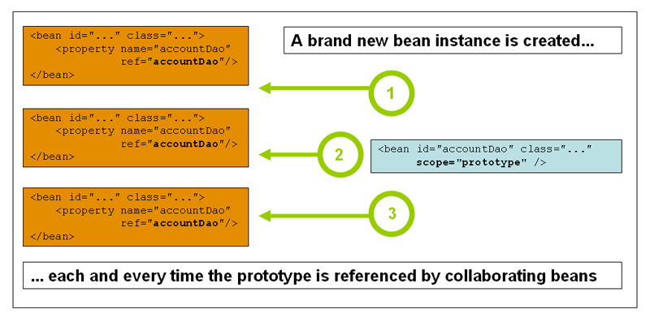

[[beans]]
= IoC容器(The IoC container)

[[beans-introduction]]
== Spring IoC容器和beans的介绍(Introduction to the Spring IoC container and beans)

This chapter covers the Spring Framework implementation of the Inversion of Control
(IoC) footnote:[See pass:specialcharacters,macros[<<background-ioc>>] ] principle. IoC
is also known as __dependency injection__ (DI). It is a process whereby objects define
their dependencies, that is, the other objects they work with, only through constructor
arguments, arguments to a factory method, or properties that are set on the object
instance after it is constructed or returned from a factory method. The container then
__injects__ those dependencies when it creates the bean. This process is fundamentally
the inverse, hence the name __Inversion of Control__ (IoC), of the bean itself
controlling the instantiation or location of its dependencies by using direct
construction of classes, or a mechanism such as the __Service Locator__ pattern.

这一章包含了Spring框架的控制反转(IoC)原理的实现footnote:[See pass:specialcharacters,macros[<<background-ioc>>]]原理。IoC也被称为__依赖注入__(DI)。它是一个处理过程，凭借对象定义依赖关系，也就是和它们一起工作的其它对象，只能通过构造函数参数，传递参数给工厂方法，在构造完成或工厂方法返回对象实例之后再设置对象实例的属性。当创建bean时容器再将这些依赖对象__注入进去__。这个过程从根本上颠倒了bean本身通过直接构建类或通过一种机制例如__服务定位器__模式来控制依赖对象的实例化或定位，因此命名为__控制翻转__（IoC）。

The `org.springframework.beans` and `org.springframework.context` packages are the basis
for Spring Framework's IoC container. The
{api-spring-framework}/beans/factory/BeanFactory.html[`BeanFactory`]
interface provides an advanced configuration mechanism capable of managing any type of
object.
{api-spring-framework}/context/ApplicationContext.html[`ApplicationContext`]
is a sub-interface of `BeanFactory`. It adds easier integration with Spring's AOP
features; message resource handling (for use in internationalization), event
publication; and application-layer specific contexts such as the `WebApplicationContext`
for use in web applications.

`org.springframework.beans` 和 `org.springframework.context` 包是Spring框架控制反转容器的基础。 {api-spring-framework}/beans/factory/BeanFactory.html[`BeanFactory`] 接口提供了一种能管理任何类型对象的高级配置机制。 {api-spring-framework}/context/ApplicationContext.html[`ApplicationContext`] 是 `BeanFactory` 的一个子接口。它增加了更容易集成Spring AOP的功能；消息资源处理（用在国际化中），事件发布；应用层特定上下文例如 `WebApplicationContext` 在web应用中的使用。

In short, the `BeanFactory` provides the configuration framework and basic
functionality, and the `ApplicationContext` adds more enterprise-specific functionality.
The `ApplicationContext` is a complete superset of the `BeanFactory`, and is used
exclusively in this chapter in descriptions of Spring's IoC container. For more
information on using the `BeanFactory` instead of the `ApplicationContext,` refer to
<<beans-beanfactory>>.

总之，`BeanFactory` 提供了配置框架和基本功能，`ApplicationContext` 增加了更多企业专用的功能。`ApplicationContext` 是 `BeanFactory` 的一个全面超集，在这章仅仅是用来描述Spring的IoC容器。关于用 `BeanFactory` 代替 `ApplicationContext` 的更多信息请参考<<beans-beanfactory>>。

In Spring, the objects that form the backbone of your application and that are managed
by the Spring IoC __container__ are called __beans__. A bean is an object that is
instantiated, assembled, and otherwise managed by a Spring IoC container. Otherwise, a
bean is simply one of many objects in your application. Beans, and the __dependencies__
among them, are reflected in the __configuration metadata__ used by a container.

在Spring中，被Spring IoC__容器__管理的那些形成你应用主干的对象被称为__beans__。bean是实例化、组装、以及其它的都被Spring IoC容器管理的对象。另外，bean仅仅是你应用中许多对象中的一个。Beans和它们之间的__依赖关系__，通过容器使用的__配置元数据__可以反映出来。

[[beans-basics]]
== 容器概述(Container overview)

The interface `org.springframework.context.ApplicationContext` represents the Spring IoC
container and is responsible for instantiating, configuring, and assembling the
aforementioned beans. The container gets its instructions on what objects to
instantiate, configure, and assemble by reading configuration metadata. The
configuration metadata is represented in XML, Java annotations, or Java code. It allows
you to express the objects that compose your application and the rich interdependencies
between such objects.

`org.springframework.context.ApplicationContext` 接口代表了Spring IoC容器并且负责实例化、配置和组装前面提到的beans。容器通过读取配置元数据得到说明什么对象要实例化、配置和组装。配置元数据可以用XML、Java注解或Java代码表示。它允许你表示构成应用的对象和对象间丰富的依赖关系。

Several implementations of the `ApplicationContext` interface are supplied
out-of-the-box with Spring. In standalone applications it is common to create an
instance of
{api-spring-framework}/context/support/ClassPathXmlApplicationContext.html[`ClassPathXmlApplicationContext`]
or {api-spring-framework}/context/support/FileSystemXmlApplicationContext.html[`FileSystemXmlApplicationContext`].
 While XML has been the traditional format for defining configuration metadata you can
instruct the container to use Java annotations or code as the metadata format by
providing a small amount of XML configuration to declaratively enable support for these
additional metadata formats.

Spring提供了一些可以直接使用的 `ApplicationContext` 接口实现。在单独的应用中通常是创建一个 {api-spring-framework}/context/support/ClassPathXmlApplicationContext.html[`ClassPathXmlApplicationContext`]实例或 {api-spring-framework}/context/support/FileSystemXmlApplicationContext.html[`FileSystemXmlApplicationContext`]实例。虽然XML是定义配置元数据的传统格式，但你可以指示容器支持使用Java注解或代码作为元数据的格式并通过提供少量的XML配置声明使容器支持这些额外的元数据格式。

In most application scenarios, explicit user code is not required to instantiate one or
more instances of a Spring IoC container. For example, in a web application scenario, a
simple eight (or so) lines of boilerplate web descriptor XML in the `web.xml` file
of the application will typically suffice (see <<context-create>>). If you are using the
https://spring.io/tools/sts[Spring Tool Suite] Eclipse-powered development
environment this boilerplate configuration can be easily created with few mouse clicks or
keystrokes.

在大多数应用场景中，不会要求用户用显式的代码来实例化一个或多个Spring IoC容器的。例如，在web应用场景中，在应用的 `web.xml` 文件中写一个简单的八行左右的样板web描述符XML就足够了（参考<<context-create>>）。如果你正在使用Eclipse支持的 https://spring.io/tools/sts[Spring工具套件]开发环境，可以很容易的通过点几下鼠标或键盘来创建样板配置。

The following diagram is a high-level view of how Spring works. Your application classes
are combined with configuration metadata so that after the `ApplicationContext` is
created and initialized, you have a fully configured and executable system or
application.

下面的图是从一个高层次的视野来看Spring是如何工作的。你的应用类与配置元数据结合起来为的是在ApplicationContext创建和初始化之后，你有一个完整配置并可执行的系统或应用。

.Spring IoC容器(The Spring IoC container)
image::images/container-magic.png[width=250]

[[beans-factory-metadata]]
=== 配置元数据(Configuration metadata)

As the preceding diagram shows, the Spring IoC container consumes a form of
__configuration metadata__; this configuration metadata represents how you as an
application developer tell the Spring container to instantiate, configure, and assemble
the objects in your application.

如上图所示，Spring IoC容器使用了一种__配置元数据__的方式；配置元数据显示了你如何作为一个应用开发者告诉Spring容器去实例化、配置并组装应用中的对象。

Configuration metadata is traditionally supplied in a simple and intuitive XML format,
which is what most of this chapter uses to convey key concepts and features of the
Spring IoC container.

传统上用简单直观的XML形式来提供配置元数据，这一章大部分使用这种方式来表达Spring IoC容器的核心概念及功能。

[NOTE]
====
XML-based metadata is __not__ the only allowed form of configuration metadata. The
Spring IoC container itself is __totally__ decoupled from the format in which this
configuration metadata is actually written. These days many developers choose
<<beans-java,Java-based configuration>> for their Spring applications.

基于XML的元数据__不__是配置元数据的唯一许可形式。Spring IoC容器本身与配置元数据的实际书写形式是__完全__解耦的。目前许多开发者在他们的Spring应用中选用<<beans-java,基于Java的配置>>。
====

For information about using other forms of metadata with the Spring container, see:

关于Spring容器中使用其它元数据形式的信息，请看：

* <<beans-annotation-config,Annotation-based configuration>>: Spring 2.5 introduced
  support for annotation-based configuration metadata.
* <<beans-java,Java-based configuration>>: Starting with Spring 3.0, many features
  provided by the Spring JavaConfig project became part of the core Spring Framework.
  Thus you can define beans external to your application classes by using Java rather
  than XML files. To use these new features, see the `@Configuration`, `@Bean`, `@Import`
  and `@DependsOn` annotations.

* <<beans-annotation-config,基于注解的配置>>：Spring 2.5引入对了基于注解的配置元数据的支持。
* <<beans-java,基于Java的配置>>：从Spring 3.0开始，Spring JavaConfig工程提供的许多功能成为Spring框架核心中的一部分。因此你可以通过Java而不是XML文件在你的应用程序的类之外来定义beans。为了使用这些新功能，请看 `@Configuration`,`@Bean`,`@Import` 和 `@DependsOn` 注解。

Spring configuration consists of at least one and typically more than one bean
definition that the container must manage. XML-based configuration metadata shows these
beans configured as `<bean/>` elements inside a top-level `<beans/>` element. Java
configuration typically uses `@Bean` annotated methods within a `@Configuration` class.

Spring配置由至少一个且通常不止一个容器必须管理的bean定义组成。基于XML的配置元数据中，这些beans作为 `<bean/>` 元素被配置在顶层 `<beans/>` 元素中。Java配置通常在 `@Configuration` 类中使用 `@Bean` 注解的方法。

These bean definitions correspond to the actual objects that make up your application.
Typically you define service layer objects, data access objects (DAOs), presentation
objects such as Struts `Action` instances, infrastructure objects such as Hibernate
`SessionFactories`, JMS `Queues`, and so forth. Typically one does not configure
fine-grained domain objects in the container, because it is usually the responsibility
of DAOs and business logic to create and load domain objects. However, you can use
Spring's integration with AspectJ to configure objects that have been created outside
the control of an IoC container. See <<aop-atconfigurable,Using AspectJ to
dependency-inject domain objects with Spring>>.

这些bean定义与组成你应用的实际对象相对应。通常你会定义服务层对象，数据访问层对象（DAOs），描述对象例如Struts的 `Action` 实例，底层对象例如Hibernate的 `SessionFactories`，JMS的 `Queues` 等等。容器中细粒度的domain objects通常是不配置的，因为一般是由DAOs和业务逻辑负责创建和加载domain objects。然而你可以使用Spring集成的AspectJ去配置已经在IoC容器控制之外创建好的对象。请看<<aop-atconfigurable,使用Spring的AspectJ来依赖注入domain objects>>。

The following example shows the basic structure of XML-based configuration metadata:

下面的例子展示了基于XML配置元数据的基本结构：

[source,xml,indent=0]
[subs="verbatim,quotes"]
----
	<?xml version="1.0" encoding="UTF-8"?>
	<beans xmlns="http://www.springframework.org/schema/beans"
		xmlns:xsi="http://www.w3.org/2001/XMLSchema-instance"
		xsi:schemaLocation="http://www.springframework.org/schema/beans
			http://www.springframework.org/schema/beans/spring-beans.xsd">

		<bean id="..." class="...">
			<!-- collaborators and configuration for this bean go here -->
		</bean>

		<bean id="..." class="...">
			<!-- collaborators and configuration for this bean go here -->
		</bean>

		<!-- more bean definitions go here -->

	</beans>
----

The `id` attribute is a string that you use to identify the individual bean definition.
The `class` attribute defines the type of the bean and uses the fully qualified
classname. The value of the id attribute refers to collaborating objects. The XML for
referring to collaborating objects is not shown in this example; see
<<beans-dependencies,Dependencies>> for more information.

`id` 属性是一个你用来识别私有bean定义的字符串。`class` 属性定义了bean的类型并且使用了完整限定类名称(即完整类路径名)。`id` 属性的值指的是协作对象。这个例子中没有展示引用协作对象的XML，更多信息请查看<<beans-dependencies,依赖>>。

[[beans-factory-instantiation]]
=== 实例化一个容器(Instantiating a container)

Instantiating a Spring IoC container is straightforward. The location path or paths
supplied to an `ApplicationContext` constructor are actually resource strings that allow
the container to load configuration metadata from a variety of external resources such
as the local file system, from the Java `CLASSPATH`, and so on.

实例化一个Spring IoC容器是简单的。一个或多个提供给一个 `ApplicationContext` 构造函数的定位路径实际上是资源字符串，可以让容器从各种例如本地文件系统，Java的 `CLASSPATH` 等外部资源中加载配置元数据。

[source,java,indent=0]
[subs="verbatim,quotes"]
----
	ApplicationContext context =
		new ClassPathXmlApplicationContext(new String[] {"services.xml", "daos.xml"});
----

[NOTE]
====
After you learn about Spring's IoC container, you may want to know more about Spring's
`Resource` abstraction, as described in <<resources>>, which provides a convenient
mechanism for reading an InputStream from locations defined in a URI syntax. In
particular, `Resource` paths are used to construct applications contexts as described in
<<resources-app-ctx>>.

在你学习Spring IoC容器之后，你可能想知道更多关于Spring的 `Resource` 抽象化的信息，就像在<<resources>>中描绘的那样，Resource抽象提供了一种方便的机制从URI语法定义的位置中读取输入流。尤其是 `Resource` 路径通常被用来构建应用程序上下文，正如<<resources-app-ctx>>描述的那样。
====

The following example shows the service layer objects `(services.xml)` configuration file:

下面的例子是服务层对象`（services.xml）` 的配置文件：

[source,xml,indent=0]
[subs="verbatim,quotes"]
----
	<?xml version="1.0" encoding="UTF-8"?>
	<beans xmlns="http://www.springframework.org/schema/beans"
		xmlns:xsi="http://www.w3.org/2001/XMLSchema-instance"
		xsi:schemaLocation="http://www.springframework.org/schema/beans
			http://www.springframework.org/schema/beans/spring-beans.xsd">

		<!-- services -->

		<bean id="petStore" class="org.springframework.samples.jpetstore.services.PetStoreServiceImpl">
			<property name="accountDao" ref="accountDao"/>
			<property name="itemDao" ref="itemDao"/>
			<!-- additional collaborators and configuration for this bean go here -->
		</bean>

		<!-- more bean definitions for services go here -->

	</beans>
----

The following example shows the data access objects `daos.xml` file:

下面的例子是数据访问对象 `daos.xml` 的文件：

[source,xml,indent=0]
[subs="verbatim,quotes"]
----
	<?xml version="1.0" encoding="UTF-8"?>
	<beans xmlns="http://www.springframework.org/schema/beans"
		xmlns:xsi="http://www.w3.org/2001/XMLSchema-instance"
		xsi:schemaLocation="http://www.springframework.org/schema/beans
			http://www.springframework.org/schema/beans/spring-beans.xsd">

		<bean id="accountDao"
			class="org.springframework.samples.jpetstore.dao.jpa.JpaAccountDao">
			<!-- additional collaborators and configuration for this bean go here -->
		</bean>

		<bean id="itemDao" class="org.springframework.samples.jpetstore.dao.jpa.JpaItemDao">
			<!-- additional collaborators and configuration for this bean go here -->
		</bean>

		<!-- more bean definitions for data access objects go here -->

	</beans>
----

In the preceding example, the service layer consists of the class `PetStoreServiceImpl`,
and two data access objects of the type `JpaAccountDao` and `JpaItemDao` (based
on the JPA Object/Relational mapping standard). The `property name` element refers to the
name of the JavaBean property, and the `ref` element refers to the name of another bean
definition. This linkage between `id` and `ref` elements expresses the dependency between
collaborating objects. For details of configuring an object's dependencies, see
<<beans-dependencies,Dependencies>>.

在之前的例子中，服务层由类 `PetStoreServiceImpl` 和两个类型为 `JpaAccountDao` 和 `JpaItemDao` 的数据访问对象（基于JPA对象/关系映射标准）组成。`property name` 元素指的是JavaBean属性的名称，`ref` 元素指的是另一个bean定义的名称。 `id` 和 `ref` 之间的连接表明了协作对象之间的依赖关系。配置对象依赖的更详细信息请看<<beans-dependencies,依赖>>。

[[beans-factory-xml-import]]
==== 组成基于XML的配置元数据(Composing XML-based configuration metadata)

It can be useful to have bean definitions span multiple XML files. Often each individual
XML configuration file represents a logical layer or module in your architecture.

bean定义跨越多个XML文件是非常有用的。通常每一个独立的XML配置文件表示你架构中的一个逻辑层或模块。

You can use the application context constructor to load bean definitions from all these
XML fragments. This constructor takes multiple `Resource` locations, as was shown in the
previous section. Alternatively, use one or more occurrences of the `<import/>` element
to load bean definitions from another file or files. For example:

你可以使用应用上下文构造函数从所有XML片段中加载bean定义。如上小节所示，构造函数可以接收多个 `Resource` 位置。也可以使用一个或同时使用多个 `<import/>` 元素从另一个或另一些文件中加载bean定义。两者只能二选其一，例如：

[source,xml,indent=0]
[subs="verbatim,quotes"]
----
	<beans>
		<import resource="services.xml"/>
		<import resource="resources/messageSource.xml"/>
		<import resource="/resources/themeSource.xml"/>

		<bean id="bean1" class="..."/>
		<bean id="bean2" class="..."/>
	</beans>
----

In the preceding example, external bean definitions are loaded from three files:
`services.xml`, `messageSource.xml`, and `themeSource.xml`. All location paths are
relative to the definition file doing the importing, so `services.xml` must be in the
same directory or classpath location as the file doing the importing, while
`messageSource.xml` and `themeSource.xml` must be in a `resources` location below the
location of the importing file. As you can see, a leading slash is ignored, but given
that these paths are relative, it is better form not to use the slash at all. The
contents of the files being imported, including the top level `<beans/>` element, must
be valid XML bean definitions according to the Spring Schema.

在上面的例子中，外部bean定义从 `services.xml`、`messageSource.xml` 和 `themeSource.xml` 三个文件中加载。所有位置路径都是相对于进行导入的定义文件的，因此 `services.xml` 必须跟进行导入的文件在同一个目录下或同一个classpath位置下，`messageSource.xml` 和 `themeSource.xml` 必须在进行导入的文件的位置下的一个 `resources` 位置中。如你所见，忽略了最前面的反斜杠，但考虑到给定的这些路径是相对的，最好是一点都不使用反斜杠。包括顶层的<beans/>元素在内，被导入的文件内容必须是依据Spring Schema有效的XML bean定义。

[NOTE]
====
It is possible, but not recommended, to reference files in parent directories using a
relative "../" path. Doing so creates a dependency on a file that is outside the current
application. In particular, this reference is not recommended for "classpath:" URLs (for
example, "classpath:../services.xml"), where the runtime resolution process chooses the
"nearest" classpath root and then looks into its parent directory. Classpath
configuration changes may lead to the choice of a different, incorrect directory.

在父目录的引用文件使用”../“相对路径是可以的，但不推荐这样做。这样做会产生一个当前应用之外的文件依赖。尤其不推荐在”classpath:”URLs中这样引用文件（例如”classpath:../services.xml”），运行时解析处理会选择”最近的”classpath根目录，然后去寻找它的父目录。Classpath配置的更改可能会导致进入一个不同且不正确的目录。

You can always use fully qualified resource locations instead of relative paths: for
example, "file:C:/config/services.xml" or "classpath:/config/services.xml". However, be
aware that you are coupling your application's configuration to specific absolute
locations. It is generally preferable to keep an indirection for such absolute
locations, for example, through "${...}" placeholders that are resolved against JVM
system properties at runtime.

你可以总是使用完全限定资源位置（绝对路径）代替相对路径：例如，”file:C:/config/services.xml”或”classpath:/config/services.xml”。但是要注意你正在将你的应用配置与特定的绝对路径耦合。通常更可取的方式是间接的访问绝对路径，例如，通过”${…​}”占位符在运行时解析JVM系统属性。
====

The import directive is a feature provided by the beans namespace itself. Further
configuration features beyond plain bean definitions are available in a selection
of XML namespaces provided by Spring, e.g. the "context" and the "util" namespace.

import指令是beans命名空间自己提供的功能。超出普通bean定义的更多的配置功能在Spring提供的可选的XML命名空间中可用。例如“context”和“util”命名空间。

[[groovy-bean-definition-dsl]]
==== Groovy Bean定义DSL(The Groovy Bean Definition DSL)

As a further example for externalized configuration metadata, bean definitions can also
be expressed in Spring's Groovy Bean Definition DSL, as known from the Grails framework.
Typically, such configuration will live in a ".groovy" file with a structure as follows:

作为一个更进一步的具体的配置元数据的例子，bean定义也可以用Spring的Groovy Bean定义DSL来表示，就像Grails框架那样。通常来说，这样的配置将会以下面的结构存在于一个“.groovy”文件中。

[source,java,indent=0]
[subs="verbatim,quotes"]
----
    beans {
        dataSource(BasicDataSource) {
            driverClassName = "org.hsqldb.jdbcDriver"
            url = "jdbc:hsqldb:mem:grailsDB"
            username = "sa"
            password = ""
            settings = [mynew:"setting"]
        }
        sessionFactory(SessionFactory) {
            dataSource = dataSource
        }
        myService(MyService) {
            nestedBean = { AnotherBean bean ->
                dataSource = dataSource
            }
        }
    }
----

This configuration style is largely equivalent to XML bean definitions and even
supports Spring's XML configuration namespaces. It also allows for importing XML
bean definition files through an "importBeans" directive.

这种配置文件风格大半都和XML bean定义相当，甚至支持Spring的XML配置的命名空间。它也允许通过一个“importBeans”指令引入XML bean定义文件。

[[beans-factory-client]]
=== 使用容器(Using the container)

The `ApplicationContext` is the interface for an advanced factory capable of maintaining
a registry of different beans and their dependencies. Using the method `T getBean(String
name, Class<T> requiredType)` you can retrieve instances of your beans.

`ApplicationContext` 是一个更高级的工厂接口，它能维护不同beans及其依赖的注册表。使用方法 `T getBean(String name, Class<T> requiredType)` 你可以取回你的beans实例。

The `ApplicationContext` enables you to read bean definitions and access them as follows:

`ApplicationContext` 能让你用下面的方式读取bean定义及访问它们：

[source,java,indent=0]
[subs="verbatim,quotes"]
----
	// create and configure beans
	ApplicationContext context = new ClassPathXmlApplicationContext("services.xml", "daos.xml");

	// retrieve configured instance
	PetStoreService service = context.getBean("petStore", PetStoreService.class);

	// use configured instance
	List<String> userList = service.getUsernameList();
----

With Groovy configuration, bootstrapping looks very similar, just a different context
implementation class which is Groovy-aware (but also understands XML bean definitions):

以Groovy的配置方式，引导程序看起来是很相似的，只是有一个不同的上下文实现类是Groovy-aware的（但是也理解XML bean定义）：

[source,java,indent=0]
[subs="verbatim,quotes"]
----
	ApplicationContext context = new GenericGroovyApplicationContext("services.groovy", "daos.groovy");
----

The most flexible variant is `GenericApplicationContext` in combination with reader
delegates, e.g. with `XmlBeanDefinitionReader` for XML files:

最灵活的变体是 `GenericApplicationContext` 和读取类代表的结合，例如：和XML文件的 `XmlBeanDefinitionReader` 结合：

[source,java,indent=0]
[subs="verbatim,quotes"]
----
	GenericApplicationContext context = new GenericApplicationContext();
	new XmlBeanDefinitionReader(ctx).loadBeanDefinitions("services.xml", "daos.xml");
    context.refresh();
----

Or with `GroovyBeanDefinitionReader` for Groovy files:

或者和Groovy文件的 `GroovyBeanDefinitionReader` 结合:

[source,java,indent=0]
[subs="verbatim,quotes"]
----
	GenericApplicationContext context = new GenericApplicationContext();
	new GroovyBeanDefinitionReader(ctx).loadBeanDefinitions("services.groovy", "daos.groovy");
    context.refresh();
----

Such reader delegates can be mixed and matched on the same `ApplicationContext`,
reading bean definitions from diverse configuration sources, if desired.

如果需要的话，这样的读取类代表可以被混合并和同一个 `ApplicationContext` 匹配使用，以从不同的配置来源中读取读取bean定义。

You can then use `getBean` to retrieve instances of your beans. The `ApplicationContext`
interface has a few other methods for retrieving beans, but ideally your application
code should never use them. Indeed, your application code should have no calls to the
`getBean()` method at all, and thus no dependency on Spring APIs at all. For example,
Spring's integration with web frameworks provides dependency injection for various web
framework components such as controllers and JSF-managed beans, allowing you to declare
a dependency on a specific bean through metadata (e.g. an autowiring annotation).

你可以用 `getBean` 取回你的beans实例。`ApplicationContext` 接口有一些其它的方法来取回beans，但理想的应用代码应该绝不使用它们。事实上，你的应用代码应该完全不调用 `getBean()` 方法，因此完全不依赖Spring APIs。例如，Spring和web框架的集成提供了各种web框架组件的依赖注入，例如控制器和JSF管理的beans，允许你通过元数据声明一个特定bean的依赖（例如：一个自动装配注解）。

[[beans-definition]]
== Bean概述(Bean overview)
A Spring IoC container manages one or more __beans__. These beans are created with the
configuration metadata that you supply to the container, for example, in the form of XML
`<bean/>` definitions.

Spring IoC容器管理一个或多个__beans__。这些beans由你提供给容器的配置元数据生成，例如，XML形式的 `<bean/>` 定义。

Within the container itself, these bean definitions are represented as `BeanDefinition`
objects, which contain (among other information) the following metadata:

在容器本身内部，这些bean定义被表示成 `BeanDefinition` 对象，含有（被其他信息环绕）以下元数据：

* __A package-qualified class name:__ typically the actual implementation class of the
  bean being defined.
* Bean behavioral configuration elements, which state how the bean should behave in the
  container (scope, lifecycle callbacks, and so forth).
* References to other beans that are needed for the bean to do its work; these
  references are also called __collaborators__ or __dependencies__.
* Other configuration settings to set in the newly created object, for example, the
  number of connections to use in a bean that manages a connection pool, or the size
  limit of the pool.

* __包限定的类名__：通常是被定义的bean的实现类。
* bean行为配置元素，规定了bean在容器中的行为（作用范围、生命周期回调函数等等）。
* bean工作需要的引用的其它bean，这些引用也被称为__协作者__或__依赖__。
* 其它的配置在新创建的对象中设置，例如，bean中使用的连接数量控制着一个连接池，或连接池的大小限制。

This metadata translates to a set of properties that make up each bean definition.

这些元数据转化为一系列的属性，这些属性构成了每个bean的定义。

[[beans-factory-bean-definition-tbl]]
.bean定义(The bean definition)
|===
| 属性(Property)| 解释章节(Explained in...)

| class
| <<beans-factory-class>>

| name
| <<beans-beanname>>

| scope
| <<beans-factory-scopes>>

| constructor arguments
| <<beans-factory-collaborators>>

| properties
| <<beans-factory-collaborators>>

| autowiring mode
| <<beans-factory-autowire>>

| lazy-initialization mode
| <<beans-factory-lazy-init>>

| initialization method
| <<beans-factory-lifecycle-initializingbean>>

| destruction method
| <<beans-factory-lifecycle-disposablebean>>
|===

In addition to bean definitions that contain information on how to create a specific
bean, the `ApplicationContext` implementations also permit the registration of existing
objects that are created outside the container, by users. This is done by accessing the
ApplicationContext's BeanFactory via the method `getBeanFactory()` which returns the
BeanFactory implementation `DefaultListableBeanFactory`. `DefaultListableBeanFactory`
supports this registration through the methods `registerSingleton(..)` and
`registerBeanDefinition(..)`. However, typical applications work solely with beans
defined through metadata bean definitions.

除了bean定义中包含怎么创建一个指定的bean的信息之外，`ApplicationContext` 实现也允许用户注册容器之外创建的现有对象。这是通过ApplicationContext的 `getBeanFactory()` 方法访问BeanFactory的完成的，这个方法会返回BeanFactory的实现类 `DefaultListableBeanFactory`。`DefaultListableBeanFactory` 支持通过 `registerSingleton(..)` 和  `registerBeanDefinition(..)` 方法来注册。然而，通常应用仅和通过元数据bean定义定义的beans一起工作。

[NOTE]
====
Bean metadata and manually supplied singleton instances need to be registered as early
as possible, in order for the container to properly reason about them during autowiring
and other introspection steps. While overriding of existing metadata and existing
singleton instances is supported to some degree, the registration of new beans at
runtime (concurrently with live access to factory) is not officially supported and may
lead to concurrent access exceptions and/or inconsistent state in the bean container.

bean元数据和人工提供的单例需要尽可能早的进行注册，为了使容器在自动注入及其它的内省步骤时能恰当的推断它们。虽然在一定程度上是支持覆盖现有的元数据和单例的，但运行时新beans的注册（并发实时访问工厂）是不被正式支持的，可能会引起并发访问异常和/或在容器中的状态不一致。
====

[[beans-beanname]]
=== 命名beans(Naming beans)

Every bean has one or more identifiers. These identifiers must be unique within the
container that hosts the bean. A bean usually has only one identifier, but if it
requires more than one, the extra ones can be considered aliases.

每个bean都有一个或多个标识符。这些托管bean的标识符在管理这些bean的容器中必须是唯一的。一个bean通常只有一个标识符，但如果一个bean需要不止一个标识符，其它的标识符会被当成别名。

In XML-based configuration metadata, you use the `id` and/or `name` attributes
to specify the bean identifier(s). The `id` attribute allows you to specify
exactly one id. Conventionally these names are alphanumeric ('myBean',
'fooService', etc.), but may contain special characters as well. If you want to
introduce other aliases to the bean, you can also specify them in the `name`
attribute, separated by a comma (`,`), semicolon (`;`), or white space. As a
historical note, in versions prior to Spring 3.1, the `id` attribute was
defined as an `xsd:ID` type, which constrained possible characters. As of 3.1,
it is defined as an `xsd:string` type. Note that bean `id` uniqueness is still
enforced by the container, though no longer by XML parsers.

在基于XML的配置元数据中，你可以使用 `id` 和/或 `name` 属性指定bean标识符。`id` 属性允许你指定一个确定的id。按照惯例这些名字是字母数字的(‘myBean’, ‘fooService’等等)，但也可能包含特殊字符。如果你想引入bean其它的别名，你也可以在name属性中指定它们，用逗号 (`,`)，分号(`;`)，或空格分开。作为一个历史注解，在Spring 3.1版本之前，`id` 属性被定义为一种 `xsd:ID` 类型，可以通过可能的字符来约束（XML控制id唯一性）。从Spring 3.1开始，它被定义为 `xsd:string` 类型。注意bean `id` 的唯一性仍然是容器强制的，虽然不再通过XML解析器来控制（容器控制id唯一性）。

You are not required to supply a name or id for a bean. If no name or id is supplied
explicitly, the container generates a unique name for that bean. However, if you want to
refer to that bean by name, through the use of the `ref` element or
<<beans-servicelocator,Service Locator>> style lookup, you must provide a name.
Motivations for not supplying a name are related to using <<beans-inner-beans,inner
beans>> and <<beans-factory-autowire,autowiring collaborators>>.

bean的id和name不是必须提供的。如果没有明确指定name或id，容器会为bean产生一个唯一的名字。然而，如果你想通过name引用bean，通过使用 `ref` 元素或<<beans-servicelocator,服务定位器>>模式查找，你必须提供一个名字。不提供name的动机是与<<beans-inner-beans,内部beans>>的使用和<<beans-factory-autowire,协作bean的自动装配>>有关的。

.Bean命名规范(Bean Naming Conventions)
****
The convention is to use the standard Java convention for instance field names when
naming beans. That is, bean names start with a lowercase letter, and are camel-cased
from then on. Examples of such names would be (without quotes) `'accountManager'`,
`'accountService'`, `'userDao'`, `'loginController'`, and so forth.

当命名bean时，采用的规范是标准Java实例字段命名规范。bean名称以小写字母开头，采用驼峰式的命名规则。这种命名方式的例子（不带引号）有 `’accountManager’`，`‘accountService’`，`‘userDao’`，`‘loginController’` 等等。

Naming beans consistently makes your configuration easier to read and understand, and if
you are using Spring AOP it helps a lot when applying advice to a set of beans related
by name.

一致的命名beans可以使人更容易读懂和理解你的配置，如果你正在使用Spring AOP，当你应用通知到一组名称相关的beans上的时候使用一致性来命名是非常有帮助的。
****

[NOTE]
====
With component scanning in the classpath, Spring generates bean names for unnamed
components, following the rules above: essentially, taking the simple class name
and turning its initial character to lower-case. However, in the (unusual) special
case when there is more than one character and both the first and second characters
are upper case, the original casing gets preserved. These are the same rules as
defined by `java.beans.Introspector.decapitalize` (which Spring is using here).

在classpath中进行组件扫描，Spring会根据上面的规则为未命名组件产生bean名称：本质上来说，是采用简单的类名并将其首字母改成小写。然而在特殊情况下（不平常的），当类名有不止一个字母且第一二个字母都是大写的情况下，会保留最初始的状态。与 `java.beans.Introspector.decapitalize` 定义中的规则是相同的（Spring在这里也采用这个规则）。
====

[[beans-beanname-alias]]
==== 在bean定义之外为一个bean起别名(Aliasing a bean outside the bean definition)

In a bean definition itself, you can supply more than one name for the bean, by using a
combination of up to one name specified by the `id` attribute, and any number of other
names in the `name` attribute. These names can be equivalent aliases to the same bean,
and are useful for some situations, such as allowing each component in an application to
refer to a common dependency by using a bean name that is specific to that component
itself.

在定义bean时，通过与 `id` 属性指定的名称相结合，你可以为bean提供不止一个名字，在 `name` 属性中定义任何数量的其它名字。这些名字是同一个bean的等价别名，在一些情况下是非常有用的，例如允许应用中的每个组件通过bean名称引用一个共有的依赖，这个依赖为每个组件本身指定了一个名称。

Specifying all aliases where the bean is actually defined is not always adequate,
however. It is sometimes desirable to introduce an alias for a bean that is defined
elsewhere. This is commonly the case in large systems where configuration is split
amongst each subsystem, each subsystem having its own set of object definitions. In
XML-based configuration metadata, you can use the `<alias/>` element to accomplish this.

然而在bean实际定义的地方指定所有别名并不总是适当的。有时会要求引入一个在别的地方定义的bean的别名。这通常是在大的系统中而配置被分割在每个子系统中，每个子系统有它自己的对象定义集合。在基于XML配置元数据中，你可以使用 `<alias/>` 来完成别名的定义。

[source,xml,indent=0]
[subs="verbatim,quotes"]
----
	<alias name="fromName" alias="toName"/>
----

In this case, a bean in the same container which is named `fromName`, may also,
after the use of this alias definition, be referred to as `toName`.

在这种情况下，在同一个容器中的bean被命名为 `fromName`，在别名定义使用之后，也可能被作为 `toName` 引用。

For example, the configuration metadata for subsystem A may refer to a DataSource via
the name `subsystemA-dataSource`. The configuration metadata for subsystem B may refer to
a DataSource via the name `subsystemB-dataSource`. When composing the main application
that uses both these subsystems the main application refers to the DataSource via the
name `myApp-dataSource`. To have all three names refer to the same object you add to the
MyApp configuration metadata the following aliases definitions:

例如，子系统A的配置元数据可能通过名称 `subsystemA-dataSource` 引用数据源。子系统B的配置元数据可能通过名称 `subsystemB-dataSource` 引用数据源。当构成主应用的时，主应用使用这些子系统并通过名称 `myApp-dataSource` 引用数据源。为了使这三个名称引用同一个对象，你可以将如下的别名定义添加到MyApp配置元数据中：

[source,xml,indent=0]
[subs="verbatim,quotes"]
----
	<alias name="subsystemA-dataSource" alias="subsystemB-dataSource"/>
	<alias name="subsystemA-dataSource" alias="myApp-dataSource" />
----

Now each component and the main application can refer to the dataSource through a name
that is unique and guaranteed not to clash with any other definition (effectively
creating a namespace), yet they refer to the same bean.

现在主应用和每个组件都能通过名称引用数据源，这个名称是唯一的且能保证不与任何其它的定义相冲突（有效的创建了一个命名空间），但它们引用了同一个bean。

.Java配置(Java-configuration)
****
If you are using Java-configuration, the `@Bean` annotation can be used to provide aliases
see <<beans-java-bean-annotation>> for details.

如果你正在使用Java配置，`@Bean` 注解可以用来提供别名，更多细节请看<<beans-java-bean-annotation>>。
****

[[beans-factory-class]]
=== 实例化beans(Instantiating beans)

A bean definition essentially is a recipe for creating one or more objects. The
container looks at the recipe for a named bean when asked, and uses the configuration
metadata encapsulated by that bean definition to create (or acquire) an actual object.

一个bean定义本质上来说是创建一个或多个对象的方法。当问及一个命名bean时，容器会查看这个方法并使用bean定义中封装的配置元数据创建（或取得）一个实际的对象。

If you use XML-based configuration metadata, you specify the type (or class) of object
that is to be instantiated in the `class` attribute of the `<bean/>` element. This
`class` attribute, which internally is a `Class` property on a `BeanDefinition`
instance, is usually mandatory. (For exceptions, see
<<beans-factory-class-instance-factory-method>> and <<beans-child-bean-definitions>>.)
You use the `Class` property in one of two ways:

如果你使用基于XML的配置元数据，你可以指定对象的类型（或类），它将在 `<bean/>` 元素中的 `class` 属性中进行实例化。这个 `class` 属性，在 `BeanDefinition` 实例的内部是 `Class` 性质的，通常是必需的。（例外的情况，请看<<beans-factory-class-instance-factory-method>>和<<beans-child-bean-definitions>>。）你可以通过以下两种方式中的一种使用 `Class` 属性：

* Typically, to specify the bean class to be constructed in the case where the container
  itself directly creates the bean by calling its constructor reflectively, somewhat
  equivalent to Java code using the `new` operator.
* To specify the actual class containing the `static` factory method that will be
  invoked to create the object, in the less common case where the container invokes a
  `static` __factory__ method on a class to create the bean. The object type returned
  from the invocation of the `static` factory method may be the same class or another
  class entirely.

* 通常情况下，指定要构造的bean类，容器本身通过反射调用bean的构造方法直接创建bean，某种程度上这与Java代码中使用 `new` 操作符是等价的。
* 在不常见的情况下，指定包含 `静态` 工厂方法的实际类，调用静态工厂方法创建对象，容器在类上调用 `静态` __工厂__方法创建bean。`静态` 工厂方法调用返回的对象类型可能是同一个类，也可能完全是另一个类。

****
.内部类命名(Inner class names)
If you want to configure a bean definition for a `static` nested class, you have to use
the __binary__ name of the nested class.

如果你想为 `静态` 嵌套类配置bean定义，你必须使用嵌套类的__二进制__名字。

For example, if you have a class called `Foo` in the `com.example` package, and this
`Foo` class has a `static` nested class called `Bar`, the value of the `'class'`
attribute on a bean definition would be...

例如，如果你在 `com.example` 包中有个类叫 `Foo`，`Foo` 类中有一个静态嵌套类叫 `Bar`，`'class'` 属性在bean定义中的值会是……

`com.example.Foo$Bar`

Notice the use of the `$` character in the name to separate the nested class name from
the outer class name.

注意名字中 `$` 符号的使用是为了将外部类名与嵌套类名分隔开。
****

[[beans-factory-class-ctor]]
==== 使用构造函数实例化(Instantiation with a constructor)

When you create a bean by the constructor approach, all normal classes are usable by and
compatible with Spring. That is, the class being developed does not need to implement
any specific interfaces or to be coded in a specific fashion. Simply specifying the bean
class should suffice. However, depending on what type of IoC you use for that specific
bean, you may need a default (empty) constructor.

当你使用构造方法创建bean时，所有的正常类都可以被Spring使用和兼容。也就是说，正在进行开发的类不需要实现任何特定的接口或以特定的方式进行编码。简单的指定bean类就足够了。然而，根据你为指定的bean所使用的IoC类型，你可能需要一个默认的（空的）构造函数。

The Spring IoC container can manage virtually __any__ class you want it to manage; it is
not limited to managing true JavaBeans. Most Spring users prefer actual JavaBeans with
only a default (no-argument) constructor and appropriate setters and getters modeled
after the properties in the container. You can also have more exotic non-bean-style
classes in your container. If, for example, you need to use a legacy connection pool
that absolutely does not adhere to the JavaBean specification, Spring can manage it as
well.

事实上，Spring的IoC容器可以管理__任何__你想让它管理的类；它不受限于管理真实的JavaBeans。大多数Spring用户更喜欢实际的JavaBeans，在容器中它仅有一个默认（无参）的构造函数，并且属性之后有合适的setters，getters模型。在容器中你也可以有更多外来的非bean类型的类。例如，如果你需要使用遗留的连接池，这绝对不符合JavaBean规范，但Spring也可以管理它。

With XML-based configuration metadata you can specify your bean class as follows:

基于XML的配置元数据你可以用如下方式指定你的bean的类：

[source,xml,indent=0]
[subs="verbatim,quotes"]
----
	<bean id="exampleBean" class="examples.ExampleBean"/>

	<bean name="anotherExample" class="examples.ExampleBeanTwo"/>
----

For details about the mechanism for supplying arguments to the constructor (if required)
and setting object instance properties after the object is constructed, see
<<beans-factory-collaborators,Injecting Dependencies>>.

更多关于为构造函数提供参数（如果有必要的话）的机制和构造对象之后设置对象实例属性的细节，请看<<beans-factory-collaborators,依赖注入>>。

[[beans-factory-class-static-factory-method]]
==== 使用静态工厂方法实例化(Instantiation with a static factory method)

When defining a bean that you create with a static factory method, you use the `class`
attribute to specify the class containing the `static` factory method and an attribute
named `factory-method` to specify the name of the factory method itself. You should be
able to call this method (with optional arguments as described later) and return a live
object, which subsequently is treated as if it had been created through a constructor.
One use for such a bean definition is to call `static` factories in legacy code.

当定义一个用静态工厂方法创建的bean时，你可以使用 `class` 属性指定包含 `静态` 工厂方法的类，用 `factory-method` 属性指定工厂方法本身的名字。你应该能调用这个方法（用后面描述的可选参数）并且返回一个实时对象，随后对这个对象进行处理，就好像这个对象是通过构造函数创建的一样。这种bean定义的一个用法是在遗留代码（旧代码）中调用 `静态` 工厂方法。

The following bean definition specifies that the bean will be created by calling a
factory-method. The definition does not specify the type (class) of the returned object,
only the class containing the factory method. In this example, the `createInstance()`
method must be a __static__ method.

下面的bean定义指定了一个通过调用工厂方法创建的bean。定义没有指定返回对象的类型（类），只有包含工厂方法的类。在这个例子中，`createInstance()` 方法必须是一个__静态__方法。

[source,xml,indent=0]
[subs="verbatim,quotes"]
----
	<bean id="clientService"
		class="examples.ClientService"
		factory-method="createInstance"/>
----

[source,java,indent=0]
[subs="verbatim,quotes"]
----
	public class ClientService {
		private static ClientService clientService = new ClientService();
		private ClientService() {}

		public static ClientService createInstance() {
			return clientService;
		}
	}
----

For details about the mechanism for supplying (optional) arguments to the factory method
and setting object instance properties after the object is returned from the factory,
see <<beans-factory-properties-detailed,Dependencies and configuration in detail>>.

更多关于为工厂方法提供（可选）参数的机制和从工厂方法返回对象后设置对象实例属性的信息，请看<<beans-factory-properties-detailed,依赖和详细配置>>。

[[beans-factory-class-instance-factory-method]]
==== 使用实例工厂方法实例化(Instantiation using an instance factory method)

Similar to instantiation through a <<beans-factory-class-static-factory-method,static
factory method>>, instantiation with an instance factory method invokes a non-static
method of an existing bean from the container to create a new bean. To use this
mechanism, leave the `class` attribute empty, and in the `factory-bean` attribute,
specify the name of a bean in the current (or parent/ancestor) container that contains
the instance method that is to be invoked to create the object. Set the name of the
factory method itself with the `factory-method` attribute.

与通过<<beans-factory-class-static-factory-method,静态工厂方法>>进行实例化类似，通过实例化工厂方法进行实例化，要从容器中调用现有bean的非静态方法创建一个新的bean。使用这种机制，要让 `class` 属性为空，在 `factory-bean` 属性中，在包含实例化方法的当前容器（或父/祖先）中指定bean的名字，通过调用实例化方法来创建对象。通过 `factory-method` 属性设置工厂方法本身的名字。

[source,xml,indent=0]
[subs="verbatim,quotes"]
----
	<!-- the factory bean, which contains a method called createInstance() -->
	<bean id="serviceLocator" class="examples.DefaultServiceLocator">
		<!-- inject any dependencies required by this locator bean -->
	</bean>

	<!-- the bean to be created via the factory bean -->
	<bean id="clientService"
		factory-bean="serviceLocator"
		factory-method="createClientServiceInstance"/>
----

[source,java,indent=0]
[subs="verbatim,quotes"]
----
	public class DefaultServiceLocator {

		private static ClientService clientService = new ClientServiceImpl();
		private DefaultServiceLocator() {}

		public ClientService createClientServiceInstance() {
			return clientService;
		}
	}
----

One factory class can also hold more than one factory method as shown here:

一个工厂类可以拥有多个工厂方法，如下所示：

[source,xml,indent=0]
[subs="verbatim,quotes"]
----
	<bean id="serviceLocator" class="examples.DefaultServiceLocator">
		<!-- inject any dependencies required by this locator bean -->
	</bean>

	<bean id="clientService"
		factory-bean="serviceLocator"
		factory-method="createClientServiceInstance"/>

	<bean id="accountService"
		factory-bean="serviceLocator"
		factory-method="createAccountServiceInstance"/>
----

[source,java,indent=0]
[subs="verbatim,quotes"]
----
	public class DefaultServiceLocator {

		private static ClientService clientService = new ClientServiceImpl();
		private static AccountService accountService = new AccountServiceImpl();

		private DefaultServiceLocator() {}

		public ClientService createClientServiceInstance() {
			return clientService;
		}

		public AccountService createAccountServiceInstance() {
			return accountService;
		}

	}
----

This approach shows that the factory bean itself can be managed and configured through
dependency injection (DI). See <<beans-factory-properties-detailed,Dependencies and
configuration in detail>>.

这个方法展示了工厂bean本身可以通过依赖注入（DI）来管理和配置。更多细节请看<<beans-factory-properties-detailed,详细的依赖和配置>>。

[NOTE]
====
In Spring documentation,__ factory bean__ refers to a bean that is configured in the
Spring container that will create objects through an
<<beans-factory-class-instance-factory-method,instance>> or
<<beans-factory-class-static-factory-method,static>> factory method. By contrast,
`FactoryBean` (notice the capitalization) refers to a Spring-specific
<<beans-factory-extension-factorybean, `FactoryBean` >>.

在Spring文档中，__工厂bean__引用了配置在Spring容器中的bean，Spring容器将通过一个<<beans-factory-class-instance-factory-method,实例>>或<<beans-factory-class-static-factory-method,静态>>工厂方法来创建对象。相比之下，`FactoryBean`（注意大写）引用了Spring特定的<<beans-factory-extension-factorybean, `FactoryBean` >>。
====

[[beans-dependencies]]
== 依赖(Dependencies)
A typical enterprise application does not consist of a single object (or bean in the
Spring parlance). Even the simplest application has a few objects that work together to
present what the end-user sees as a coherent application. This next section explains how
you go from defining a number of bean definitions that stand alone to a fully realized
application where objects collaborate to achieve a goal.

标准企业应用不会由一个对象（或Spring用语中的bean）组成。即使是最简单的应用也是由一些对象共同工作，呈现给终端用户用户看到的是一个连贯的应用。接下来的一节阐述了如何从定义许多独立的bean定义到完全实现的应用，它是一个通过对象协作来实现目标的过程。

[[beans-factory-collaborators]]
=== 依赖注入(Dependency Injection)

__Dependency injection__ (DI) is a process whereby objects define their dependencies,
that is, the other objects they work with, only through constructor arguments, arguments
to a factory method, or properties that are set on the object instance after it is
constructed or returned from a factory method. The container then __injects__ those
dependencies when it creates the bean. This process is fundamentally the inverse, hence
the name __Inversion of Control__ (IoC), of the bean itself controlling the instantiation
or location of its dependencies on its own by using direct construction of classes, or
the __Service Locator__ pattern.

__依赖注入__（DI）是一个处理过程，凭借对象之间依赖关系，也就是和它们一起工作的其它对象，只能通过构造函数参数，传递参数给工厂方法，在构造完成或工厂方法返回对象实例之后再设置对象实例的属性。当创建bean时容器再将这些依赖对象__注入__进去。这个过程从根本上颠倒了bean本身通过直接构建类或通过一种机制例如__服务定位器__模式来控制依赖对象的实例化或定位，因此命名为__控制反转__（IoC）。

Code is cleaner with the DI principle and decoupling is more effective when objects are
provided with their dependencies. The object does not look up its dependencies, and does
not know the location or class of the dependencies. As such, your classes become easier
to test, in particular when the dependencies are on interfaces or abstract base classes,
which allow for stub or mock implementations to be used in unit tests.

使用依赖注入原则会使代码更简洁，当对象有依赖关系提供时解耦更有效。对象不会查找它的依赖，不知道依赖的位置和依赖关系的类别。同样的，你的类也变的更容易测试，尤其是依赖于接口或抽象基类的时候，这种情况下会允许stub或mock实现在单元测试中被使用。（注：Stub和Mock都是软件测试中使用的东西，如有疑问请自行google或百度）。

DI exists in two major variants, <<beans-constructor-injection,Constructor-based
dependency injection>> and <<beans-setter-injection,Setter-based dependency injection>>.

依赖有两个主要变种，<<beans-constructor-injection,基于构造函数的依赖注入>>和<<beans-setter-injection,基于Setter的依赖注入>>.。

[[beans-constructor-injection]]
==== 基于构造函数的依赖注入(Constructor-based dependency injection)

__Constructor-based__ DI is accomplished by the container invoking a constructor with a
number of arguments, each representing a dependency. Calling a `static` factory method
with specific arguments to construct the bean is nearly equivalent, and this discussion
treats arguments to a constructor and to a `static` factory method similarly. The
following example shows a class that can only be dependency-injected with constructor
injection. Notice that there is nothing __special__ about this class, it is a POJO that
has no dependencies on container specific interfaces, base classes or annotations.

__基于构造函数的__依赖注入通过容器调用有参数的构造函数来实现，每个参数表示一个依赖。调用指定参数的 `静态` 工厂方法来构造bean是近似等价的，这里的讨论将给构造函数和 `静态` 工厂方法传参看成是类似的。接下来的例子展示了一个类仅能通过构建函数注入进行依赖注入。注意这个类没什么__特别__的，它是一个POJO，不依赖于容器特定的接口，基类或注解。

[source,java,indent=0]
[subs="verbatim,quotes"]
----
	public class SimpleMovieLister {

		// the SimpleMovieLister has a dependency on a MovieFinder
		private MovieFinder movieFinder;

		// a constructor so that the Spring container can inject a MovieFinder
		public SimpleMovieLister(MovieFinder movieFinder) {
			this.movieFinder = movieFinder;
		}

		// business logic that actually uses the injected MovieFinder is omitted...

	}
----

[[beans-factory-ctor-arguments-resolution]]
===== 构造函数参数解析(Constructor argument resolution)

Constructor argument resolution matching occurs using the argument's type. If no
potential ambiguity exists in the constructor arguments of a bean definition, then the
order in which the constructor arguments are defined in a bean definition is the order
in which those arguments are supplied to the appropriate constructor when the bean is
being instantiated. Consider the following class:

构造函数参数解析使用参数类型进行匹配。如果bean定义的构造函数参数中不存在潜在的歧义，bean定义中定义构造函数参数的顺序为bean实例化时提供给恰当构造函数的参数顺序。细想下面的类：

[source,java,indent=0]
[subs="verbatim,quotes"]
----
	package x.y;

	public class Foo {

		public Foo(Bar bar, Baz baz) {
			// ...
		}

	}
----

No potential ambiguity exists, assuming that `Bar` and `Baz` classes are not related by
inheritance. Thus the following configuration works fine, and you do not need to specify
the constructor argument indexes and/or types explicitly in the `<constructor-arg/>`
element.

不存在潜在的歧义，假设Bar类和Baz类之间不存在继承关系。因此下面的配置会工作良好，你不必在 `<constructor-arg/>` 元素中显式的指定构造函数参数索引的和/或类型。

[source,xml,indent=0]
[subs="verbatim,quotes"]
----
	<beans>
		<bean id="foo" class="x.y.Foo">
			<constructor-arg ref="bar"/>
			<constructor-arg ref="baz"/>
		</bean>

		<bean id="bar" class="x.y.Bar"/>

		<bean id="baz" class="x.y.Baz"/>
	</beans>
----

When another bean is referenced, the type is known, and matching can occur (as was the
case with the preceding example). When a simple type is used, such as
`<value>true</value>`, Spring cannot determine the type of the value, and so cannot match
by type without help. Consider the following class:

当引用另一个bean时，类型已知，匹配正确（像上面的例子一样）。当使用简单类型时，例如 `<value>true</value>`，Spring不能决定值的类型，因此没有帮助不能按类型匹配。考虑下面的例子：

[source,java,indent=0]
[subs="verbatim,quotes"]
----
	package examples;

	public class ExampleBean {

		// Number of years to calculate the Ultimate Answer
		private int years;

		// The Answer to Life, the Universe, and Everything
		private String ultimateAnswer;

		public ExampleBean(int years, String ultimateAnswer) {
			this.years = years;
			this.ultimateAnswer = ultimateAnswer;
		}

	}
----

.[[beans-factory-ctor-arguments-type]]构造函数参数类型匹配(Constructor argument type matching)
--
In the preceding scenario, the container __can__ use type matching with simple types if
you explicitly specify the type of the constructor argument using the `type` attribute.
For example:

在上面的场景中，如果你用 `type` 属性显式的指定了构造参数的类型，对于简单类型容器__可以__使用类型匹配。例如：

[source,xml,indent=0]
[subs="verbatim,quotes"]
----
	<bean id="exampleBean" class="examples.ExampleBean">
		<constructor-arg type="int" value="7500000"/>
		<constructor-arg type="java.lang.String" value="42"/>
	</bean>
----
--

.[[beans-factory-ctor-arguments-index]]构造函数参数索引(Constructor argument index)
--
Use the `index` attribute to specify explicitly the index of constructor arguments. For
example:

使用 `index` 属性来显式的指定构造函数参数的索引，例如：

[source,xml,indent=0]
[subs="verbatim,quotes"]
----
	<bean id="exampleBean" class="examples.ExampleBean">
		<constructor-arg index="0" value="7500000"/>
		<constructor-arg index="1" value="42"/>
	</bean>
----

In addition to resolving the ambiguity of multiple simple values, specifying an index
resolves ambiguity where a constructor has two arguments of the same type. Note that the
__index is 0 based__.

除了要解析多个简单值的歧义性之外，当构造函数有两个相同类型的的参数时，指定索引可以解决歧义问题。注意__索引__是从0开始的。
--

.[[beans-factory-ctor-arguments-name]]构造函数参数名(Constructor argument name)
--
You can also use the constructor parameter name for value disambiguation:

你也可以使用构造函数参数名字解决值的歧义问题:

[source,xml,indent=0]
[subs="verbatim,quotes"]
----
	<bean id="exampleBean" class="examples.ExampleBean">
		<constructor-arg name="years" value="7500000"/>
		<constructor-arg name="ultimateAnswer" value="42"/>
	</bean>
----

Keep in mind that to make this work out of the box your code must be compiled with the
debug flag enabled so that Spring can look up the parameter name from the constructor.
If you can't compile your code with debug flag (or don't want to) you can use
http://download.oracle.com/javase/6/docs/api/java/beans/ConstructorProperties.html[@ConstructorProperties]
JDK annotation to explicitly name your constructor arguments. The sample class would
then have to look as follows:

记住，要使这个起作用你的代码必须使用调试模式进行编译，这样Spring可以从构造函数中查找参数名称。如果你不能用调试模式进行编译你的代码（或不想），你可以使用JDK注解 http://download.oracle.com/javase/6/docs/api/java/beans/ConstructorProperties.html[@ConstructorProperties]显式的命名你的构造函数参数。样板类如下所示：

[source,java,indent=0]
[subs="verbatim,quotes"]
----
	package examples;

	public class ExampleBean {

		// Fields omitted

		@ConstructorProperties({"years", "ultimateAnswer"})
		public ExampleBean(int years, String ultimateAnswer) {
			this.years = years;
			this.ultimateAnswer = ultimateAnswer;
		}

	}
----
--

[[beans-setter-injection]]
==== 基于Setter的依赖注入(Setter-based dependency injection)

__Setter-based__ DI is accomplished by the container calling setter methods on your
beans after invoking a no-argument constructor or no-argument `static` factory method to
instantiate your bean.

__基于Setter的__依赖注入在容器调用无参构造函数或无参 `静态` 工厂方法实例化你的bean之后，通过调用bean的setter方法来实现依赖注入。

The following example shows a class that can only be dependency-injected using pure
setter injection. This class is conventional Java. It is a POJO that has no dependencies
on container specific interfaces, base classes or annotations.

下面的例子显示了一个类只能通过纯粹的setter注入进行依赖注入。这个类是常见的Java类。它是一个不依赖于容器中特定接口、基类或注解的POJO。

[source,java,indent=0]
[subs="verbatim,quotes"]
----
	public class SimpleMovieLister {

		// the SimpleMovieLister has a dependency on the MovieFinder
		private MovieFinder movieFinder;

		// a setter method so that the Spring container can inject a MovieFinder
		public void setMovieFinder(MovieFinder movieFinder) {
			this.movieFinder = movieFinder;
		}

		// business logic that actually uses the injected MovieFinder is omitted...

	}
----

The `ApplicationContext` supports constructor-based and setter-based DI for the beans it
manages. It also supports setter-based DI after some dependencies have already been
injected through the constructor approach. You configure the dependencies in the form of
a `BeanDefinition`, which you use in conjunction with `PropertyEditor` instances to
convert properties from one format to another. However, most Spring users do not work
with these classes directly (i.e., programmatically) but rather with XML `bean`
definitions, annotated components (i.e., classes annotated with `@Component`,
`@Controller`, etc.), or `@Bean` methods in Java-based `@Configuration` classes. These
sources are then converted internally into instances of `BeanDefinition` and used to
load an entire Spring IoC container instance.

`ApplicationContext` 支持基于构造函数和基于setter对它管理的bean进行依赖注入。它也支持一些依赖通过构造函数方法注入之后，使用基于setter的依赖注入。使用 `BeanDefinition` 形式配置依赖项，结合 `PropertyEditor` 实例可以将属性从一种形式转成另一种形式。然而大多数Spring用户直接使用这些类（即以编程形式），而使用XML定义 `bean`，注解组件（即类中使用  `@Component`，`@Controller` 注解等等），或在基于Java的 `@Configuration` 类使用 `@Bean` 方法。然后这些资源就在内部被转换为 `BeanDefinition` 实例并被用来加载整个的Spring IoC容器实例。

.使用基于构造函数的依赖注入还是基于setter的依赖注入？(Constructor-based or setter-based DI?)
****
Since you can mix constructor-based and setter-based DI, it is a good rule of thumb to
use constructors for _mandatory dependencies_ and setter methods or configuration methods
for _optional dependencies_. Note that use of the <<beans-required-annotation,@Required>>
annotation on a setter method can be used to make the property a required dependency.

你可以混合使用基于构造函数的依赖注入和基于setter的依赖注入，_强制依赖_ 使用构造函数注入，_可选依赖_ 使用setter方法或配置方法注入是一个很好的经验法则。注意在setter方法上使用<<beans-required-annotation,@Required>>注解可以使这个属性成为一个必须的依赖。

The Spring team generally advocates constructor injection as it enables one to implement
application components as _immutable objects_ and to ensure that required dependencies
are not `null`. Furthermore constructor-injected components are always returned to client
(calling) code in a fully initialized state. As a side note, a large number of constructor
arguments is a _bad code smell_, implying that the class likely has too many
responsibilities and should be refactored to better address proper separation of concerns.

当实现的应用组件是 _不可变对象_ 时，Spring团队通常主张构造函数注入，这样可以确保所需的依赖 `非空`。此外，基于构造函数注入的组件总是以完全初始化状态返回客户（调用）代码。作为附注，含有许多构造函数参数的代码 _给人的感觉很差_，这意味着类可能有太多职责，应该进行重构以便更好的处理适当的关注点分离。

Setter injection should primarily only be used for optional dependencies that can be
assigned reasonable default values within the class. Otherwise, not-null checks must be
performed everywhere the code uses the dependency. One benefit of setter injection is that
setter methods make objects of that class amenable to reconfiguration or re-injection
later. Management through <<jmx,JMX MBeans>> is therefore a compelling use case for setter
injection.

setter注入应该主要用来可选依赖上，在类内可以给可选依赖指定合理的默认值。此外，在每处使用依赖的代码都要进行非空检查。setter注入的一个好处就是setter方法使类的对象在后面可以进行再配置或再注入。<<jmx,JMX MBeans>>的管理是setter注入一个非常好的案例。

Use the DI style that makes the most sense for a particular class. Sometimes, when dealing
with third-party classes for which you do not have the source, the choice is made for you.
For example, if a third-party class does not expose any setter methods, then constructor
injection may be the only available form of DI.

使用依赖注入的方式对于特定的类是最有意义的。有时候，当处理没有源码的第三方类时，使用哪种方式取决于你。例如，如果第三方库没有提供任何setter方法，构造函数注入可能是依赖注入唯一可行的方式。
****

[[beans-dependency-resolution]]
==== 依赖解析过程(Dependency resolution process)

The container performs bean dependency resolution as follows:

容器按下面的过程处理bean依赖解析：

* The `ApplicationContext` is created and initialized with configuration metadata that
  describes all the beans. Configuration metadata can be specified via XML, Java code, or
  annotations.
* For each bean, its dependencies are expressed in the form of properties, constructor
  arguments, or arguments to the static-factory method if you are using that instead of
  a normal constructor. These dependencies are provided to the bean, __when the bean is
  actually created__.
* Each property or constructor argument is an actual definition of the value to set, or
  a reference to another bean in the container.
* Each property or constructor argument which is a value is converted from its specified
  format to the actual type of that property or constructor argument. By default Spring
  can convert a value supplied in string format to all built-in types, such as `int`,
  `long`, `String`, `boolean`, etc.

* 创建 `ApplicationContext` 并使用描述所有bean的配置元数据初始化 `ApplicationContext`，配置元数据可以通过XML，Java代码或注解指定。
* 对于每一个bean，它的依赖通过属性、构造函数参数、或静态工厂方法参数的形式表示（如果你使用它替代标准的构造函数）。__当bean在实际创建时__，这些依赖会提供给bean。
* 每个属性或构造函数参数或者是要根据实际定义设置的值，或者是容器中另一个bean的引用。
* 每个属性或构造函数参数都是一个从指定形式转成属性或构造函数参数的实际类型的值。默认情况下Spring可以转换任何以Spring格式提供的值到所有的内置类型，例如 `int`，`long`，`String`，`boolean` 等。

The Spring container validates the configuration of each bean as the container is created.
However, the bean properties themselves are not set until the bean __is actually created__.
Beans that are singleton-scoped and set to be pre-instantiated (the default) are created
when the container is created. Scopes are defined in <<beans-factory-scopes>>. Otherwise,
the bean is created only when it is requested. Creation of a bean potentially causes a
graph of beans to be created, as the bean's dependencies and its dependencies'
dependencies (and so on) are created and assigned. Note that resolution mismatches among
those dependencies may show up late, i.e. on first creation of the affected bean.

当容器创建后Spring容器会验证每个bean的配置。然而，bean属性本身只有bean__实际被创建时__才会进行设置。作用域是单例的bean和被设置为pre-instantiated（默认）的bean当容器创建时会进行创建（默认情况）。作用域是在<<beans-factory-scopes>>中定义的。否则，只有需要的时候才会创建bean。bean的创建可能会引起beans图的创建，当bean的依赖和它的依赖的依赖（等等）创建和赋值的时候。注意这些依赖中解析不匹配可能会在后面出现，即，受影响的bean第一次创建时。

.循环依赖(Circular dependencies)
****
If you use predominantly constructor injection, it is possible to create an unresolvable
circular dependency scenario.

如果你主要使用构造函数注入，有可能会出现一个不能解决的循环依赖状况。

For example: Class A requires an instance of class B through constructor injection, and
class B requires an instance of class A through constructor injection. If you configure
beans for classes A and B to be injected into each other, the Spring IoC container
detects this circular reference at runtime, and throws a
`BeanCurrentlyInCreationException`.

例如，类A需要通过构造函数注入得到一个类B的实例，而类B需要通过构造函数注入获得一个类A的实例。如果你为类A和类B配置了互相注入的bean，Spring IoC容器在运行时检测到循环引用，会抛出 `BeanCurrentlyInCreationException`。

One possible solution is to edit the source code of some classes to be configured by
setters rather than constructors. Alternatively, avoid constructor injection and use
setter injection only. In other words, although it is not recommended, you can configure
circular dependencies with setter injection.

一个可能的解决方案是编译某个类的源代码使其配置为通过setter注入而不是构造函数注入。供替代的选择是，避免构造函数注入仅用setter注入。换句话说，尽管是不被推荐的，但你可以通过setter注入配置循环依赖。

Unlike the __typical__ case (with no circular dependencies), a circular dependency
between bean A and bean B forces one of the beans to be injected into the other prior to
being fully initialized itself (a classic chicken/egg scenario).

不像__典型的__情况（没有循环依赖），在它自己被完全初始化之前bean A和bean B之间的循环依赖强制其中的一个bean被注入另一个bean中（典型的的鸡/蛋场景）。
****

You can generally trust Spring to do the right thing. It detects configuration problems,
such as references to non-existent beans and circular dependencies, at container
load-time. Spring sets properties and resolves dependencies as late as possible, when
the bean is actually created. This means that a Spring container which has loaded
correctly can later generate an exception when you request an object if there is a
problem creating that object or one of its dependencies. For example, the bean throws an
exception as a result of a missing or invalid property. This potentially delayed
visibility of some configuration issues is why `ApplicationContext` implementations by
default pre-instantiate singleton beans. At the cost of some upfront time and memory to
create these beans before they are actually needed, you discover configuration issues
when the `ApplicationContext` is created, not later. You can still override this default
behavior so that singleton beans will lazy-initialize, rather than be pre-instantiated.

通常情况下你可以信任Spring去做正确的事情。在容器加载时它检测配置问题，例如引用不存在的beans和循环依赖。当bean实际创建时，Spring设置属性和解析依赖尽可能的晚。这意味着Spring容器正确加载但后面可能会产生异常，当你请求一个对象时，创建对象或它的某个依赖时出现问题，这时容器就会抛出异常。例如，由于缺失或存在无效属性，bean会抛出异常。在真正需要这些beans之前创建它们，会花费一些前期时间和内存，这种可能推迟一些配置问题可见性的问题也就是为什么 `ApplicationContext` 的实现默认预实例化单例bean的原因。尽管在这些bean实际被需要之前创建它们会花费一些前期的时间和内存，但当 `ApplicationContext` 创建时你就会发现配置问题，而不是在创建之后。你仍可以重写这个默认行为以使单例bean延迟初始化而不是预先实例化。

If no circular dependencies exist, when one or more collaborating beans are being
injected into a dependent bean, each collaborating bean is __totally__ configured prior
to being injected into the dependent bean. This means that if bean A has a dependency on
bean B, the Spring IoC container completely configures bean B prior to invoking the
setter method on bean A. In other words, the bean is instantiated (if not a
pre-instantiated singleton), its dependencies are set, and the relevant lifecycle
methods (such as a <<beans-factory-lifecycle-initializingbean,configured init method>>
or the <<beans-factory-lifecycle-initializingbean,InitializingBean callback method>>)
are invoked.

如果没有循环依赖存在，当一个或更多协作beans注入到一个需要依赖的bean中，在注入需要依赖的bean之前，每个协作bean都是被__完全__配置的。这意味着如果bean A有个依赖为bean B，Spring IoC容器在调用bean A的setter方法之前会完整的配置bean B。换句话说，bean被实例化（如果不是预先实例化的单例），设置依赖和调用相关的生命周期方法（例如<<beans-factory-lifecycle-initializingbean,配置初始化方法>>或<<beans-factory-lifecycle-initializingbean,初始化bean回调方法>>）。

[[beans-some-examples]]
==== 依赖注入的例子(Examples of dependency injection)

The following example uses XML-based configuration metadata for setter-based DI. A small
part of a Spring XML configuration file specifies some bean definitions:

下面的例子使用基于XML的配置元数据进行基于setter的依赖注入。Spring XML配置文件中的一小部分指定了一些bean的定义：

[source,xml,indent=0]
[subs="verbatim,quotes"]
----
	<bean id="exampleBean" class="examples.ExampleBean">
		<!-- setter injection using the nested ref element -->
		<property name="beanOne">
			<ref bean="anotherExampleBean"/>
		</property>

		<!-- setter injection using the neater ref attribute -->
		<property name="beanTwo" ref="yetAnotherBean"/>
		<property name="integerProperty" value="1"/>
	</bean>

	<bean id="anotherExampleBean" class="examples.AnotherBean"/>
	<bean id="yetAnotherBean" class="examples.YetAnotherBean"/>
----

[source,java,indent=0]
[subs="verbatim,quotes"]
----
	public class ExampleBean {

		private AnotherBean beanOne;
		private YetAnotherBean beanTwo;
		private int i;

		public void setBeanOne(AnotherBean beanOne) {
			this.beanOne = beanOne;
		}

		public void setBeanTwo(YetAnotherBean beanTwo) {
			this.beanTwo = beanTwo;
		}

		public void setIntegerProperty(int i) {
			this.i = i;
		}

	}
----

In the preceding example, setters are declared to match against the properties specified
in the XML file. The following example uses constructor-based DI:

在上面的例子中，setter声明匹配XML文件中指定的属性。下面的例子使用了基于构造函数的依赖注入：

[source,xml,indent=0]
[subs="verbatim,quotes"]
----
	<bean id="exampleBean" class="examples.ExampleBean">
		<!-- constructor injection using the nested ref element -->
		<constructor-arg>
			<ref bean="anotherExampleBean"/>
		</constructor-arg>

		<!-- constructor injection using the neater ref attribute -->
		<constructor-arg ref="yetAnotherBean"/>

		<constructor-arg type="int" value="1"/>
	</bean>

	<bean id="anotherExampleBean" class="examples.AnotherBean"/>
	<bean id="yetAnotherBean" class="examples.YetAnotherBean"/>
----

[source,java,indent=0]
[subs="verbatim,quotes"]
----
	public class ExampleBean {

		private AnotherBean beanOne;
		private YetAnotherBean beanTwo;
		private int i;

		public ExampleBean(
			AnotherBean anotherBean, YetAnotherBean yetAnotherBean, int i) {
			this.beanOne = anotherBean;
			this.beanTwo = yetAnotherBean;
			this.i = i;
		}

	}
----

The constructor arguments specified in the bean definition will be used as arguments to
the constructor of the `ExampleBean`.

bean定义中指定的构造函数参数将作为 `ExampleBean` 的构造函数参数使用。

Now consider a variant of this example, where instead of using a constructor, Spring is
told to call a `static` factory method to return an instance of the object:

现在考虑这个例子的一个变种，不使用构造函数，而是Spring调用 `静态` 工厂方法返回对象的一个实例：

[source,xml,indent=0]
[subs="verbatim,quotes"]
----
	<bean id="exampleBean" class="examples.ExampleBean" factory-method="createInstance">
		<constructor-arg ref="anotherExampleBean"/>
		<constructor-arg ref="yetAnotherBean"/>
		<constructor-arg value="1"/>
	</bean>

	<bean id="anotherExampleBean" class="examples.AnotherBean"/>
	<bean id="yetAnotherBean" class="examples.YetAnotherBean"/>
----

[source,java,indent=0]
[subs="verbatim,quotes"]
----
	public class ExampleBean {

		// a private constructor
		private ExampleBean(...) {
			...
		}

		// a static factory method; the arguments to this method can be
		// considered the dependencies of the bean that is returned,
		// regardless of how those arguments are actually used.
		public static ExampleBean createInstance (
			AnotherBean anotherBean, YetAnotherBean yetAnotherBean, int i) {

			ExampleBean eb = new ExampleBean (...);
			// some other operations...
			return eb;
		}

	}
----

Arguments to the `static` factory method are supplied via `<constructor-arg/>` elements,
exactly the same as if a constructor had actually been used. The type of the class being
returned by the factory method does not have to be of the same type as the class that
contains the `static` factory method, although in this example it is. An instance
(non-static) factory method would be used in an essentially identical fashion (aside
from the use of the `factory-bean` attribute instead of the `class` attribute), so
details will not be discussed here.

`静态` 工厂方法的参数通过 `<constructor-arg/>` 元素提供，与构造函数实际上使用的完全一样。虽然这个例子中工厂方法返回的类的类型与包含 `静态` 工厂方法的类的类型一样，但它们可以不一样。工厂方法的实例（非静态）会被以一种本质上完全一样的形式使用（除了使用 `factory-bean` 属性代替 `class` 属性之外），因此这儿不讨论这些细节。

[[beans-factory-properties-detailed]]
=== 依赖和配置的细节(Dependencies and configuration in detail)

As mentioned in the previous section, you can define bean properties and constructor
arguments as references to other managed beans (collaborators), or as values defined
inline. Spring's XML-based configuration metadata supports sub-element types within its
`<property/>` and `<constructor-arg/>` elements for this purpose.

 正如上一节提到的那样，你可以定义bean的属性和构造函数参数作为其它被管理bean（协作者）的引用，或者作为行内定义值。为了实现这个功能，Spring的基于XML的配置元数据在它的 `<property/>` 和 `<constructor-arg/>` 中支持子元素类型。

[[beans-value-element]]
==== 直接使用值（基本类型，字符串等等）(Straight values (primitives, Strings, and so on))

The `value` attribute of the `<property/>` element specifies a property or constructor
argument as a human-readable string representation. Spring's
<<core-convert-ConversionService-API, conversion service>> is used to convert these
values from a `String` to the actual type of the property or argument.

`<property/>` 元素的 `value` 属性指定了一个属性或构造函数参数作为可读的字符串表示。使用Spring的<<core-convert-ConversionService-API,转换服务>>将这些值从 `String` 转成属性或参数的真实类型。

[source,xml,indent=0]
[subs="verbatim,quotes"]
----
	<bean id="myDataSource" class="org.apache.commons.dbcp.BasicDataSource" destroy-method="close">
		<!-- results in a setDriverClassName(String) call -->
		<property name="driverClassName" value="com.mysql.jdbc.Driver"/>
		<property name="url" value="jdbc:mysql://localhost:3306/mydb"/>
		<property name="username" value="root"/>
		<property name="password" value="masterkaoli"/>
	</bean>
----

The following example uses the <<beans-p-namespace,p-namespace>> for even more succinct
XML configuration.

下面的例子为了更简洁的XML配置使用了<<beans-p-namespace,p命名空间>>。

[source,xml,indent=0]
[subs="verbatim,quotes"]
----
	<beans xmlns="http://www.springframework.org/schema/beans"
		xmlns:xsi="http://www.w3.org/2001/XMLSchema-instance"
		xmlns:p="http://www.springframework.org/schema/p"
		xsi:schemaLocation="http://www.springframework.org/schema/beans
		http://www.springframework.org/schema/beans/spring-beans.xsd">

		<bean id="myDataSource" class="org.apache.commons.dbcp.BasicDataSource"
			destroy-method="close"
			p:driverClassName="com.mysql.jdbc.Driver"
			p:url="jdbc:mysql://localhost:3306/mydb"
			p:username="root"
			p:password="masterkaoli"/>

	</beans>
----

The preceding XML is more succinct; however, typos are discovered at runtime rather than
design time, unless you use an IDE such as http://www.jetbrains.com/idea/[IntelliJ
IDEA] or the https://spring.io/tools/sts[Spring Tool Suite] (STS)
that support automatic property completion when you create bean definitions. Such IDE
assistance is highly recommended.

上面的XML是更简洁的；然而，错别字是在运行时发现而不是在设计时，除非你使用IDE例如 http://www.jetbrains.com/idea/[IntelliJ IDEA]或 https://spring.io/tools/sts[Spring工具套装](STS)，当你创建bean定义时它们支持自动的属性补全。IDE辅助是强烈推荐的。

You can also configure a `java.util.Properties` instance as:

你也可以配置 `java.util.Properties` 实例：

[source,xml,indent=0]
[subs="verbatim,quotes"]
----
	<bean id="mappings"
		class="org.springframework.beans.factory.config.PropertyPlaceholderConfigurer">

		<!-- typed as a java.util.Properties -->
		<property name="properties">
			<value>
				jdbc.driver.className=com.mysql.jdbc.Driver
				jdbc.url=jdbc:mysql://localhost:3306/mydb
			</value>
		</property>
	</bean>
----

The Spring container converts the text inside the `<value/>` element into a
`java.util.Properties` instance by using the JavaBeans `PropertyEditor` mechanism. This
is a nice shortcut, and is one of a few places where the Spring team do favor the use of
the nested `<value/>` element over the `value` attribute style.

Spring容器通过JavaBeans的 `PropertyEditor` 机制将 `<value/>` 元素内部的文本转成 `java.util.Properties` 实例。这是一个很好的捷径，使用嵌入的 `<value/>` 元素而不是使用 `value` 属性的方式，是Spring团队支持的几个地方之一。

[[beans-idref-element]]
===== idref元素(The idref element)

The `idref` element is simply an error-proof way to pass the __id__ (string value - not
a reference) of another bean in the container to a `<constructor-arg/>` or `<property/>`
element.

在容器中传递另一个bean的__id__（字符串值，不是引用）到 `<constructor-arg/>` 或 `<property/>` 元素时，`idref` 元素是一种简单的的误差检验方式。

[source,xml,indent=0]
[subs="verbatim,quotes"]
----
	<bean id="theTargetBean" class="..."/>

	<bean id="theClientBean" class="...">
		<property name="targetName">
			<idref bean="theTargetBean"/>
		</property>
	</bean>
----

The above bean definition snippet is __exactly__ equivalent (at runtime) to the
following snippet:

上面的bean定义片段与下面的片段是__完全__等价的（运行时）：

[source,xml,indent=0]
[subs="verbatim,quotes"]
----
	<bean id="theTargetBean" class="..." />

	<bean id="client" class="...">
		<property name="targetName" value="theTargetBean"/>
	</bean>
----

The first form is preferable to the second, because using the `idref` tag allows the
container to validate __at deployment time__ that the referenced, named bean actually
exists. In the second variation, no validation is performed on the value that is passed
to the `targetName` property of the `client` bean. Typos are only discovered (with most
likely fatal results) when the `client` bean is actually instantiated. If the `client`
bean is a <<beans-factory-scopes,prototype>> bean, this typo and the resulting exception
may only be discovered long after the container is deployed.

第一种形式优于第二种形式，因为 `idref` 标签允许容器__在部署时__验证引用的bean，命名的bean实际存在。在第二种形式中，当值传给 `client` bean的 `targetName` 属性时没有进行验证。拼写错误只有在 `client` bean实际实例化时才会发现（最可能有严重后果）。如果 `client` bean是<<beans-factory-scopes,原型>>bean，拼写错误和产生的异常可能只有在容器部署很长时间之后才会发现。

[NOTE]
====
The `local` attribute on the `idref` element is no longer supported in the 4.0 beans xsd
since it does not provide value over a regular `bean` reference anymore. Simply change
your existing `idref local` references to `idref bean` when upgrading to the 4.0 schema.

`idref` 元素的 `local` 属性在4.0 beans xsd中不再支持，因为它不再为合格的 `bean` 引用提供值。简单将你现有的 `idref local` 引用改成 `idref bean` 当更新到4.0 schema时。
====

A common place (at least in versions earlier than Spring 2.0) where the `<idref/>` element
brings value is in the configuration of <<aop-pfb-1,AOP interceptors>> in a
`ProxyFactoryBean` bean definition. Using `<idref/>` elements when you specify the
interceptor names prevents you from misspelling an interceptor id.

`<idref/>` 元素带来值的通常位置（至少在Spring 2.0之前）是在 `ProxyFactoryBean` bean定义中的<<aop-pfb-1,AOP拦截器>>配置中。当你指定拦截器名字时使用 `<idref/>` 元素来防止拼错拦截器id。

[[beans-ref-element]]
==== 其它bean的引用（协作bean）(References to other beans (collaborators))

The `ref` element is the final element inside a `<constructor-arg/>` or `<property/>`
definition element. Here you set the value of the specified property of a bean to be a
reference to another bean (a collaborator) managed by the container. The referenced bean
is a dependency of the bean whose property will be set, and it is initialized on demand
as needed before the property is set. (If the collaborator is a singleton bean, it may
be initialized already by the container.) All references are ultimately a reference to
another object. Scoping and validation depend on whether you specify the id/name of the
other object through the `bean`, `local,` or `parent` attributes.

`ref` 元素是 `<constructor-arg/>` 或 `<property/>` 定义元素内部的最终的元素。在这个元素中设置bean的指定属性的值，值为容器管理的另一个bean（协作bean）的引用。引用的bean是设置属性bean的依赖，在属性设置之前引用bean需要进行初始化。（如果协作bean是一个单例模式的bean，它可能已经被容器初始化了。）所有引用bean最终都是另一个对象的引用。作用域和验证是根据你是否通过 `bean`，`local`，或 `parent` 属性指定了另一个对象的id/name来决定的。

Specifying the target bean through the `bean` attribute of the `<ref/>` tag is the most
general form, and allows creation of a reference to any bean in the same container or
parent container, regardless of whether it is in the same XML file. The value of the
`bean` attribute may be the same as the `id` attribute of the target bean, or as one of
the values in the `name` attribute of the target bean.

通过 `<ref/>` 标签的 `bean` 属性指定目标bean是最常用的形式，允许创建同容器或父容器中任何bean的引用，不管它是否是在同一个XML文件中。`bean` 属性的值可能与目标bean的 `id` 属性值相同，或与目标bean的 `name` 属性值中的一个相同（一个bean的name可能有多个，前文已经解释过）。

[source,xml,indent=0]
[subs="verbatim,quotes"]
----
	<ref bean="someBean"/>
----

Specifying the target bean through the `parent` attribute creates a reference to a bean
that is in a parent container of the current container. The value of the `parent`
attribute may be the same as either the `id` attribute of the target bean, or one of the
values in the `name` attribute of the target bean, and the target bean must be in a
parent container of the current one. You use this bean reference variant mainly when you
have a hierarchy of containers and you want to wrap an existing bean in a parent
container with a proxy that will have the same name as the parent bean.

通过 `parent` 属性指定目标bean会引用当前容器的父容器中的bean。`parent` 属性的值可能与目标bean的 `id` 属性值或其中一个`name`属性值相同，目标bean必须在当前容器的父容器中。你主要在当你有一个容器分层而且你想用一个和父容器中bean名字相同的代理包装一个已经在父容器中存在的bean时使用这个bean引用的变体（也就是parent引用）（这个过程类似于继承，即子容器中的bean继承了父容器bean的属性）。

[source,xml,indent=0]
[subs="verbatim,quotes"]
----
	<!-- in the parent context -->
	<bean id="accountService" class="com.foo.SimpleAccountService">
		<!-- insert dependencies as required as here -->
	</bean>
----

[source,xml,indent=0]
[subs="verbatim,quotes"]
----
	<!-- in the child (descendant) context -->
	<bean id="accountService" <!-- bean name is the same as the parent bean -->
		class="org.springframework.aop.framework.ProxyFactoryBean">
		<property name="target">
			<ref parent="accountService"/> <!-- notice how we refer to the parent bean -->
		</property>
		<!-- insert other configuration and dependencies as required here -->
	</bean>
----

[NOTE]
====
The `local` attribute on the `ref` element is no longer supported in the 4.0 beans xsd
since it does not provide value over a regular `bean` reference anymore. Simply change
your existing `ref local` references to `ref bean` when upgrading to the 4.0 schema.

`idref` 元素的 `local` 属性在4.0 beans xsd中不再支持，因为它不再为合格的bean引用提供值。简单将你现有的 `ref local` 引用改成 `ref bean` 当更新到4.0 schema时。
====

[[beans-inner-beans]]
==== 内部bean(Inner beans)

A `<bean/>` element inside the `<property/>` or `<constructor-arg/>` elements defines a
so-called __inner bean__.

`<property/>` 或 `<constructor-arg/>` 元素内的 `<bean/>` 元素中定义了一个所谓的__内部bean__。

[source,xml,indent=0]
[subs="verbatim,quotes"]
----
	<bean id="outer" class="...">
		<!-- instead of using a reference to a target bean, simply define the target bean inline -->
		<property name="target">
			<bean class="com.example.Person"> <!-- this is the inner bean -->
				<property name="name" value="Fiona Apple"/>
				<property name="age" value="25"/>
			</bean>
		</property>
	</bean>
----

An inner bean definition does not require a defined id or name; if specified, the container
does not use such a value as an identifier. The container also ignores the `scope` flag on
creation: Inner beans are __always__ anonymous and they are __always__ created with the outer
bean. It is __not__ possible to inject inner beans into collaborating beans other than into
the enclosing bean or to access them independently.

内部bean定义不要求定义id或name；如果指定了，容器不用用这个值作为标识符。容器创建时也忽略 `scope` 标记：内部bean__总是__匿名的且它们__总是__和外部bean一起创建。除了注入到封闭bean中或独立的访问它们，__不__可能将内部bean注入到协作bean中。

As a corner case, it is possible to receive destruction callbacks from a custom scope, e.g.
for a request-scoped inner bean contained within a singleton bean: The creation of the inner
bean instance will be tied to its containing bean, but destruction callbacks allow it to
participate in the request scope's lifecycle. This is not a common scenario; inner beans
typically simply share their containing bean's scope.

作为一种角落的（很少出现的）情况，从自定义的域中有可能会收到销毁回调函数，例如，对于请求域内的内部bean包含单例bean：内部bean实例的创建会绑定到它的包含bean，但销毁回调函数允许它进入到请求域的生命周期中。这不是一个常见的场景；内部bean通常简单的共享它们的包含bean的作用域。

[[beans-collection-elements]]
==== 集合(Collections)

In the `<list/>`, `<set/>`, `<map/>`, and `<props/>` elements, you set the properties
and arguments of the Java `Collection` types `List`, `Set`, `Map`, and `Properties`,
respectively.

在 `<list/>`，`<set/>`，`<map/>` 和 `<props/>` 元素中，你要分别设置Java `Collection` 类型 `List`，`Set`，`Map` 和 `Properties` 的属性和参数。

[source,xml,indent=0]
[subs="verbatim,quotes"]
----
	<bean id="moreComplexObject" class="example.ComplexObject">
		<!-- results in a setAdminEmails(java.util.Properties) call -->
		<property name="adminEmails">
			<props>
				<prop key="administrator">administrator@example.org</prop>
				<prop key="support">support@example.org</prop>
				<prop key="development">development@example.org</prop>
			</props>
		</property>
		<!-- results in a setSomeList(java.util.List) call -->
		<property name="someList">
			<list>
				<value>a list element followed by a reference</value>
				<ref bean="myDataSource" />
			</list>
		</property>
		<!-- results in a setSomeMap(java.util.Map) call -->
		<property name="someMap">
			<map>
				<entry key="an entry" value="just some string"/>
				<entry key ="a ref" value-ref="myDataSource"/>
			</map>
		</property>
		<!-- results in a setSomeSet(java.util.Set) call -->
		<property name="someSet">
			<set>
				<value>just some string</value>
				<ref bean="myDataSource" />
			</set>
		</property>
	</bean>
----

__The value of a map key or value, or a set value, can also again be any of the
following elements:__

__map的key或value，或者是set的value的值也可以是下面元素中的任何一个：__

[source,xml,indent=0]
[subs="verbatim,quotes"]
----
	bean | ref | idref | list | set | map | props | value | null
----

[[beans-collection-elements-merging]]
===== 集合合并(Collection merging)

The Spring container also supports the __merging__ of collections. An application
developer can define a parent-style `<list/>`, `<map/>`, `<set/>` or `<props/>` element,
and have child-style `<list/>`, `<map/>`, `<set/>` or `<props/>` elements inherit and
override values from the parent collection. That is, the child collection's values are
the result of merging the elements of the parent and child collections, with the child's
collection elements overriding values specified in the parent collection.

Spring容器也支持集合的__合并__。应用开发者可以定义父类型 `<list/>`，`<map/>`，`<set/>` 或 `<props/>` 元素，可以有继承和覆盖父集合的子类型元素 `<list/>`，`<map/>`，`<set/>` 或 `<props/>`。也就是说，子集合的值是父集合和子集合中元素合并的结果，子集合元素覆盖了父集合元素的值。

__This section on merging discusses the parent-child bean mechanism. Readers unfamiliar
with parent and child bean definitions may wish to read the
<<beans-child-bean-definitions,relevant section>> before continuing.__

__关于合并的这节讨论了父子bean机制。对父子bean定义不熟悉的读者在继续之前可能想去读<<beans-child-bean-definitions,有关的章节>>__。

The following example demonstrates collection merging:

下面的例子示范了集合合并：

[source,xml,indent=0]
[subs="verbatim,quotes"]
----
	<beans>
		<bean id="parent" abstract="true" class="example.ComplexObject">
			<property name="adminEmails">
				<props>
					<prop key="administrator">administrator@example.com</prop>
					<prop key="support">support@example.com</prop>
				</props>
			</property>
		</bean>
		<bean id="child" parent="parent">
			<property name="adminEmails">
				<!-- the merge is specified on the child collection definition -->
				<props merge="true">
					<prop key="sales">sales@example.com</prop>
					<prop key="support">support@example.co.uk</prop>
				</props>
			</property>
		</bean>
	<beans>
----

Notice the use of the `merge=true` attribute on the `<props/>` element of the
`adminEmails` property of the `child` bean definition. When the `child` bean is resolved
and instantiated by the container, the resulting instance has an `adminEmails`
`Properties` collection that contains the result of the merging of the child's
`adminEmails` collection with the parent's `adminEmails` collection.

注意 `child` bean定义中的 `adminEmails` 属性下的 `<props/>` 元素使用了 `merge=true` 属性。当容器解析并实例化 `child` bean时，结果的实例含有 `adminEmails` `Properties` 集合，集合中的值包含子 `adminEmails` 集合和父 `adminEmails` 集合合并的结果。

[literal]
[subs="verbatim,quotes"]
----
administrator=administrator@example.com
sales=sales@example.com
support=support@example.co.uk
----

The child `Properties` collection's value set inherits all property elements from the
parent `<props/>`, and the child's value for the `support` value overrides the value in
the parent collection.

子 `Properties` 集合的值的集合继承了父 `<props/>` 中的所有属性元素，子集合中的 `support` 值覆盖了父集合中的值。

This merging behavior applies similarly to the `<list/>`, `<map/>`, and `<set/>`
collection types. In the specific case of the `<list/>` element, the semantics
associated with the `List` collection type, that is, the notion of an `ordered`
collection of values, is maintained; the parent's values precede all of the child list's
values. In the case of the `Map`, `Set`, and `Properties` collection types, no ordering
exists. Hence no ordering semantics are in effect for the collection types that underlie
the associated `Map`, `Set`, and `Properties` implementation types that the container
uses internally.

`<list/>` ， `<map/>` 和 `<set/>` 集合类型中的合并与上面类似。在特定的 `<list/>` 元素情况下，关于List集合类型的语义，也就是说，`有序` 集合值的概念仍然是保留的；父list中的值领先于所有子list中的值。在 `Map`，`Set` 和 `Properties` 集合类型，不存在顺序。因此，无序语义在容器内部使用的相关集合类型 `Map`，`Set` 和 `Properties` 的实现基础下是有效的。

[[beans-collection-merge-limitations]]
===== 集合合并的限制(Limitations of collection merging)

You cannot merge different collection types (such as a `Map` and a `List`), and if you
do attempt to do so an appropriate `Exception` is thrown. The `merge` attribute must be
specified on the lower, inherited, child definition; specifying the `merge` attribute on
a parent collection definition is redundant and will not result in the desired merging.

你不能合并不同的集合类型（例如 `Map` 和 `List`），如果你试图合并不同的集合类型会有适当的抛出 `Exception`。`merge` 属性必须在更低的、继承的子定义中指定；在父集合定义中指定 `merge` 属性是多余的并且不会产生要求的合并

[[beans-collection-elements-strongly-typed]]
===== 强类型集合(Strongly-typed collection)

With the introduction of generic types in Java 5, you can use strongly typed collections.
That is, it is possible to declare a `Collection` type such that it can only contain
`String` elements (for example). If you are using Spring to dependency-inject a
strongly-typed `Collection` into a bean, you can take advantage of Spring's
type-conversion support such that the elements of your strongly-typed `Collection`
instances are converted to the appropriate type prior to being added to the `Collection`.

随着Java 5中泛型的引入，你可以使用强类型集合。也就是说，声明一个 `Collection` 类型但它只能包含 `String` 元素（例子）是可能的。如果你使用Spring将一个强类型的 `Collection` 注入到bean中，你可以利用Spring的类型转换支持，例如在将元素添加到 `Collection` 之前，将你的强类型 `Collection` 实例中的元素转成恰当的类型

[source,java,indent=0]
[subs="verbatim,quotes"]
----
	public class Foo {

		private Map<String, Float> accounts;

		public void setAccounts(Map<String, Float> accounts) {
			this.accounts = accounts;
		}
	}
----

[source,xml,indent=0]
[subs="verbatim,quotes"]
----
	<beans>
		<bean id="foo" class="x.y.Foo">
			<property name="accounts">
				<map>
					<entry key="one" value="9.99"/>
					<entry key="two" value="2.75"/>
					<entry key="six" value="3.99"/>
				</map>
			</property>
		</bean>
	</beans>
----

When the `accounts` property of the `foo` bean is prepared for injection, the generics
information about the element type of the strongly-typed `Map<String, Float>` is
available by reflection. Thus Spring's type conversion infrastructure recognizes the
various value elements as being of type `Float`, and the string values `9.99, 2.75`, and
`3.99` are converted into an actual `Float` type.

当准备注入 `foo` bean的 `accounts` 属性时，强类型 `Map<String, Float>` 中元素类型的泛型信息可以通过反射得到。因此Spring的类型转换结构能识别各种值元素的类型为 `Float`，字符串 `9.99,2.75` 和 `3.99` 会被转换成实际的 `Float` 类型。

[[beans-null-element]]
==== Null和空字符串(Null and empty string values)

Spring treats empty arguments for properties and the like as empty `Strings`. The
following XML-based configuration metadata snippet sets the email property to the empty
`String` value ("").

Spring把属性的空参数都处理为空 `Strings`。下面基于XML的配置元数据片段将email属性设为空 `String` 值(“”)

[source,xml,indent=0]
[subs="verbatim,quotes"]
----
	<bean class="ExampleBean">
		<property name="email" value=""/>
	</bean>
----

The preceding example is equivalent to the following Java code:

上面的例子与下面的Java代码是等价的：

[source,java,indent=0]
[subs="verbatim,quotes"]
----
        exampleBean.setEmail("")
----

The `<null/>` element handles `null` values. For example:

`<null/>` 元素处理 `null` 值。例如：

[source,xml,indent=0]
[subs="verbatim,quotes"]
----
	<bean class="ExampleBean">
		<property name="email">
			<null/>
		</property>
	</bean>
----

The above configuration is equivalent to the following Java code:

上面的配置与下面的Java代码等价。

[source,java,indent=0]
[subs="verbatim,quotes"]
----
	exampleBean.setEmail(null)
----

[[beans-p-namespace]]
==== XML 使用p命名空间的缩写(XML shortcut with the p-namespace)

The p-namespace enables you to use the `bean` element's attributes, instead of nested
`<property/>` elements, to describe your property values and/or collaborating beans.

p命名空间可以让你不需要嵌入 `<property/>` 元素便能使用 `bean` 元素的属性来描述你的属性值和/或协作beans。

Spring supports extensible configuration formats <<xsd-configuration,with namespaces>>, which are
based on an XML Schema definition. The `beans` configuration format discussed in this
chapter is defined in an XML Schema document. However, the p-namespace is not defined in
an XSD file and exists only in the core of Spring.

Spring支持<<xsd-configuration,含有命名空间的>>扩展配置形式，命名空间是基于XML Schema定义的。本章讨论的 `beans` 配置形式是在XML Schema文档中定义的。但是p命名空间不能在XSD文件中定义并且只在Spring core中存在。

The following example shows two XML snippets that resolve to the same result: The first
uses standard XML format and the second uses the p-namespace.

下面的例子显示了两个XML片段，解析结果是相同的：第一个是标准的XML形式，第二个使用了p命名空间。

[source,xml,indent=0]
[subs="verbatim,quotes"]
----
	<beans xmlns="http://www.springframework.org/schema/beans"
		xmlns:xsi="http://www.w3.org/2001/XMLSchema-instance"
		xmlns:p="http://www.springframework.org/schema/p"
		xsi:schemaLocation="http://www.springframework.org/schema/beans
			http://www.springframework.org/schema/beans/spring-beans.xsd">

		<bean name="classic" class="com.example.ExampleBean">
			<property name="email" value="foo@bar.com"/>
		</bean>

		<bean name="p-namespace" class="com.example.ExampleBean"
			p:email="foo@bar.com"/>
	</beans>
----

The example shows an attribute in the p-namespace called email in the bean definition.
This tells Spring to include a property declaration. As previously mentioned, the
p-namespace does not have a schema definition, so you can set the name of the attribute
to the property name.

这个例子显示了bean定义中p命名空间中有个一个叫email的属性。这会通知Spring包含属性声明。如前面所述，p命名空间没有schema定义，因此你可以将特性值（attribute）设到属性值（property）上。

This next example includes two more bean definitions that both have a reference to
another bean:

下面的例子包括两个bean定义，且它们都引用了另一个bean：

[source,xml,indent=0]
[subs="verbatim,quotes"]
----
	<beans xmlns="http://www.springframework.org/schema/beans"
		xmlns:xsi="http://www.w3.org/2001/XMLSchema-instance"
		xmlns:p="http://www.springframework.org/schema/p"
		xsi:schemaLocation="http://www.springframework.org/schema/beans
			http://www.springframework.org/schema/beans/spring-beans.xsd">

		<bean name="john-classic" class="com.example.Person">
			<property name="name" value="John Doe"/>
			<property name="spouse" ref="jane"/>
		</bean>

		<bean name="john-modern"
			class="com.example.Person"
			p:name="John Doe"
			p:spouse-ref="jane"/>

		<bean name="jane" class="com.example.Person">
			<property name="name" value="Jane Doe"/>
		</bean>
	</beans>
----

As you can see, this example includes not only a property value using the p-namespace,
but also uses a special format to declare property references. Whereas the first bean
definition uses `<property name="spouse" ref="jane"/>` to create a reference from bean
`john` to bean `jane`, the second bean definition uses `p:spouse-ref="jane"` as an
attribute to do the exact same thing. In this case `spouse` is the property name,
whereas the `-ref` part indicates that this is not a straight value but rather a
reference to another bean.

正如你所看到的，这个例子不仅包括使用了p命名空间的属性值，而且使用了一种特定的形式来声明属性引用。然而第一个bean定义使用 `<property name="spouse" ref="jane"/>` 创建了一个从bean `john` 到bean `jane` 的引用，第二个bean定义使用 `p:spouse-ref="jane"` 作为一个特性做了完全一样的事情。在 `spouse` 是属性名的情况下，`-ref` 部分表示这不是一个直接的值而是另一个bean的引用。

[NOTE]
====
The p-namespace is not as flexible as the standard XML format. For example, the format
for declaring property references clashes with properties that end in `Ref`, whereas the
standard XML format does not. We recommend that you choose your approach carefully and
communicate this to your team members, to avoid producing XML documents that use all
three approaches at the same time.

p命名空间不如标准的XML格式灵活，例如，声明的属性引用的格式会与以 `Ref` 结尾的属性相冲突，而标准XML格式则不会。我们建议你仔细的选择你的方法并就此事与你的团队成员交流，避免生成的XML文档同时使用了三种方式。
====

[[beans-c-namespace]]
==== XML 使用c命名空间的缩写(XML shortcut with the c-namespace)

Similar to the <<beans-p-namespace>>, the __c-namespace__, newly introduced in Spring
3.1, allows usage of inlined attributes for configuring the constructor arguments rather
then nested `constructor-arg` elements.

与<<beans-p-namespace>>类似，在Spring 3.1新引入的__c命名空间__允许使用内联属性配置构造函数参数而不用嵌入 `constructor-arg` 元素。

Let's review the examples from <<beans-constructor-injection>> with the `c:` namespace:

让我们重新回顾一下<<beans-constructor-injection>>中的例子并使用 `c:` 命名空间：

[source,xml,indent=0]
[subs="verbatim,quotes"]
----
	<beans xmlns="http://www.springframework.org/schema/beans"
		xmlns:xsi="http://www.w3.org/2001/XMLSchema-instance"
		xmlns:c="http://www.springframework.org/schema/c"
		xsi:schemaLocation="http://www.springframework.org/schema/beans
			http://www.springframework.org/schema/beans/spring-beans.xsd">

		<bean id="bar" class="x.y.Bar"/>
		<bean id="baz" class="x.y.Baz"/>

		<!-- traditional declaration -->
		<bean id="foo" class="x.y.Foo">
			<constructor-arg ref="bar"/>
			<constructor-arg ref="baz"/>
			<constructor-arg value="foo@bar.com"/>
		</bean>

		<!-- c-namespace declaration -->
		<bean id="foo" class="x.y.Foo" c:bar-ref="bar" c:baz-ref="baz" c:email="foo@bar.com"/>

	</beans>
----

The `c:` namespace uses the same conventions as the `p:` one (trailing `-ref` for bean
references) for setting the constructor arguments by their names. And just as well, it
needs to be declared even though it is not defined in an XSD schema (but it exists
inside the Spring core).

`c:` 命名空间遵循与 `p:` 命名空间相同的约定（在bean引用时带着 `-ref`）在通过名字设置构造函数参数时。同样的，它也需要进行声明，虽然它没有在XSD schema中定义（但在Spring core中存在）。

For the rare cases where the constructor argument names are not available (usually if
the bytecode was compiled without debugging information), one can use fallback to the
argument indexes:

对于很少出现的不能找到构造函数参数名字的情况（通常如果字节码是编译好的且没有调试信息），可以应急使用参数索引：

[source,xml,indent=0]
[subs="verbatim,quotes"]
----
	<!-- c-namespace index declaration -->
	<bean id="foo" class="x.y.Foo" c:_0-ref="bar" c:_1-ref="baz"/>
----

[NOTE]
====
Due to the XML grammar, the index notation requires the presence of the leading `_` as
XML attribute names cannot start with a number (even though some IDE allow it).

由于XML语法，索引符号需要前面加上 `_`，因为XML属性名字不能以数字开头（即使一些IDE允许）。
====

In practice, the constructor resolution
<<beans-factory-ctor-arguments-resolution,mechanism>> is quite efficient in matching
arguments so unless one really needs to, we recommend using the name notation
through-out your configuration.

在实践中，构造函数解析<<beans-factory-ctor-arguments-resolution,机制>>能有效匹配参数，因此除非真的需要，否则我们推荐在配置中始终使用名字符号。

[[beans-compound-property-names]]
==== 混合属性名字(Compound property names)

You can use compound or nested property names when you set bean properties, as long as
all components of the path except the final property name are not `null`. Consider the
following bean definition.

当你设置bean属性时，你可以使用混合的或嵌套的属性名字，只要路径中除了最后的属性名之外所有组件都是非 `null`。考虑下面的bean定义。

[source,xml,indent=0]
[subs="verbatim,quotes"]
----
	<bean id="foo" class="foo.Bar">
		<property name="fred.bob.sammy" value="123" />
	</bean>
----

The `foo` bean has a `fred` property, which has a `bob` property, which has a `sammy`
property, and that final `sammy` property is being set to the value `123`. In order for
this to work, the `fred` property of `foo`, and the `bob` property of `fred` must not be
`null` after the bean is constructed, or a `NullPointerException` is thrown.

`foo` bean有一个 `fred` 属性，fred有一个 `bob` 属性，bob有一个 `sammy` 属性，最后的 `sammy` 属性设置值为123。为了这样的设置能够工作，`foo` 的 `fred` 属性，`fred` 的 `bob` 属性在bean创建后必须是非 `null` 否则就会抛出 `NullPointerException`。

[[beans-factory-dependson]]
=== 使用depends-on(Using depends-on)

If a bean is a dependency of another that usually means that one bean is set as a
property of another. Typically you accomplish this with the <<beans-ref-element, `<ref/>`
element>> in XML-based configuration metadata. However, sometimes dependencies between
beans are less direct; for example, a static initializer in a class needs to be
triggered, such as database driver registration. The `depends-on` attribute can
explicitly force one or more beans to be initialized before the bean using this element
is initialized. The following example uses the `depends-on` attribute to express a
dependency on a single bean:

如果一个bean是另一个bean的一个依赖，这通常意味着一个bean作为另一个bean的一个属性去设置。在基于XML的配置元数据中通常使用<<beans-ref-element,`<ref/>` 元素>>实现。然而有时beans之间的依赖关系是间接的；例如，类中的静态初始化程序需要触发，例如数据库驱动注册。`depends-on` 特性能显示的强制一个bean或多个beans在使用这个元素的bean初始化之前进行初始化。下面的例子使用 `depends-on` 特性表示一个单一bean的一个依赖：

[source,xml,indent=0]
[subs="verbatim,quotes"]
----
	<bean id="beanOne" class="ExampleBean" depends-on="manager"/>
	<bean id="manager" class="ManagerBean" />
----

To express a dependency on multiple beans, supply a list of bean names as the value of
the `depends-on` attribute, with commas, whitespace and semicolons, used as valid
delimiters:

为了表示多个bean上的依赖关系，提供一个bean名字列表作为 `depends-on` 特性的值，用逗号，空格或分号作为有效分隔符：

[source,xml,indent=0]
[subs="verbatim,quotes"]
----
	<bean id="beanOne" class="ExampleBean" depends-on="manager,accountDao">
		<property name="manager" ref="manager" />
	</bean>

	<bean id="manager" class="ManagerBean" />
	<bean id="accountDao" class="x.y.jdbc.JdbcAccountDao" />
----

[NOTE]
====
The `depends-on` attribute in the bean definition can specify both an initialization
time dependency and, in the case of <<beans-factory-scopes-singleton,singleton>> beans
only, a corresponding destroy time dependency. Dependent beans that define a
`depends-on` relationship with a given bean are destroyed first, prior to the given bean
itself being destroyed. Thus `depends-on` can also control shutdown order.

`depends-on` 特性在bean定义中可以指定初始化时的依赖和仅在<<beans-factory-scopes-singleton,单例>>bean情况下对应的销毁时依赖。。依赖beans与给定bean之间定义了一个 `depends-on` 关系，依赖beans在给定bean本身被销毁之前首先被销毁。因此 `depends-on` 也可以控制销毁顺序。
====

[[beans-factory-lazy-init]]
===  延迟初始化beans(Lazy-initialized beans)

By default, `ApplicationContext` implementations eagerly create and configure all
<<beans-factory-scopes-singleton,singleton>> beans as part of the initialization
process. Generally, this pre-instantiation is desirable, because errors in the
configuration or surrounding environment are discovered immediately, as opposed to hours
or even days later. When this behavior is __not__ desirable, you can prevent
pre-instantiation of a singleton bean by marking the bean definition as
lazy-initialized. A lazy-initialized bean tells the IoC container to create a bean
instance when it is first requested, rather than at startup.

默认情况下，作为初始化过程的一部分，`ApplicationContext` 实现时渴望创建并配置所有的<<beans-factory-scopes-singleton,单例>>bean。通常情况下，预实例化是可取的，因为配置中或周围环境中的错误可以立即发现，与几小时或几天后发现截然相反。当预实例化是__不__可取的时候，你可通过标记bean定义为延迟初始化来阻止单例bean的预实例化。延迟初始化的bean会通知IoC容器当第一次请求bean时创建一个bean实例，而不是在启动时创建。

In XML, this behavior is controlled by the `lazy-init` attribute on the `<bean/>`
element; for example:

在XML中，延迟初始化通过 `<bean/>` 元素中的 `lazy-init` 特性来控制；例如：

[source,xml,indent=0]
[subs="verbatim,quotes"]
----
	<bean id="lazy" class="com.foo.ExpensiveToCreateBean" lazy-init="true"/>
	<bean name="not.lazy" class="com.foo.AnotherBean"/>
----

When the preceding configuration is consumed by an `ApplicationContext`, the bean named
`lazy` is not eagerly pre-instantiated when the `ApplicationContext` is starting up,
whereas the `not.lazy` bean is eagerly pre-instantiated.

当 `ApplicationContext` 读取到上面的配置，`ApplicationContext` 启动时名字为 `lazy` 的bean不会进行预实例化，而名字为 `not.lazy` 的bean会进行预实例化。

However, when a lazy-initialized bean is a dependency of a singleton bean that is
__not__ lazy-initialized, the `ApplicationContext` creates the lazy-initialized bean at
startup, because it must satisfy the singleton's dependencies. The lazy-initialized bean
is injected into a singleton bean elsewhere that is not lazy-initialized.

然而，当延迟初始化的bean是一个__非__延迟初始化的单例bean的依赖时，`ApplicationContext` 会在启动时创建延迟初始化的bean，因为它必须提供单例bean的依赖。延迟初始化的bean会注入到单例bean中和其它非延迟初始化的地方。

You can also control lazy-initialization at the container level by using the
`default-lazy-init` attribute on the `<beans/>` element; for example:

你也可以在容器级别通过 `<beans/>` 元素中的 `default-lazy-init` 特性控制延迟初始化；例如：

[source,xml,indent=0]
[subs="verbatim,quotes"]
----
	<beans default-lazy-init="true">
		<!-- no beans will be pre-instantiated... -->
	</beans>
----

[[beans-factory-autowire]]
===  自动注入协作bean(Autowiring collaborators)

The Spring container can __autowire__ relationships between collaborating beans. You can
allow Spring to resolve collaborators (other beans) automatically for your bean by
inspecting the contents of the `ApplicationContext`. Autowiring has the following
advantages:

Spring容器能__自动装配__协作beans之间的关联关系。你可以允许Spring通过检查 `ApplicationContext` 中的内容自动的为你的bean解析协作者（其它bean）。自动装配有以下优势：

* Autowiring can significantly reduce the need to specify properties or constructor
  arguments. (Other mechanisms such as a bean template
  <<beans-child-bean-definitions,discussed elsewhere in this chapter>> are also valuable
  in this regard.)
* Autowiring can update a configuration as your objects evolve. For example, if you need
  to add a dependency to a class, that dependency can be satisfied automatically without
  you needing to modify the configuration. Thus autowiring can be especially useful
  during development, without negating the option of switching to explicit wiring when
  the code base becomes more stable.

* 自动装配能有效减少指定属性或构造函数参数的需要。（其它的机制例如<<beans-child-bean-definitions,在本章其它地方讨论的>>bean模板在这一点上也是非常有价值的。）
* 当对象变化时自动装配能更新配置。例如，如果你需要增加一个类的依赖项，依赖项可以被自动满足的而不需要你去修改配置。因此自动装配在开发时尤其有用，当代码基础变的更稳定时可以改为显式装配。

When using XML-based configuration metadata footnote:[See
pass:specialcharacters,macros[<<beans-factory-collaborators>>]], you specify autowire
mode for a bean definition with the `autowire` attribute of the `<bean/>` element. The
autowiring functionality has four modes. You specify autowiring __per__ bean and thus
can choose which ones to autowire.

当使用基于XML的配置元数据时footnote:[See pass:specialcharacters,macros[<<beans-factory-collaborators>>]]，通过使用 `<bean/>` 元素的 `autowire` 特性你可以指定一个bean定义的自动装配模式。自动注入功能有四种模式。你可以指定__每个__bean的自动装配，因此你可以选择对哪个bean使用自动装配。

[[beans-factory-autowiring-modes-tbl]]
.自动装配模式(Autowiring modes)
|===
| 模式(Mode)| 解析(Explanation)

| no
| (Default) No autowiring. Bean references must be defined via a `ref` element. Changing
  the default setting is not recommended for larger deployments, because specifying
  collaborators explicitly gives greater control and clarity. To some extent, it
  documents the structure of a system.

  （默认）无自动装配。引用bean必须通过 `ref` 元素定义。对于更大的部署，不推荐更改默认设置，因为显式指定协作者更清晰并且更易控制。在某种程度上来说，它记录了系统的结构。

| byName
| Autowiring by property name. Spring looks for a bean with the same name as the
  property that needs to be autowired. For example, if a bean definition is set to
  autowire by name, and it contains a __master__ property (that is, it has a
  __setMaster(..)__ method), Spring looks for a bean definition named `master`, and uses
  it to set the property.

 通过属性名称自动装配。Spring寻找与需要自动装配的属性同名的bean。例如，如果一个bean定义设置为通过名称自动装配，它有一个__master__属性（也就是说，它有一个__setMaster(..)__方法），Spring寻找名字为 `master` 的bean定义，使用它设置属性值。

| byType
| Allows a property to be autowired if exactly one bean of the property type exists in
  the container. If more than one exists, a fatal exception is thrown, which indicates
  that you may not use __byType__ autowiring for that bean. If there are no matching
  beans, nothing happens; the property is not set.

 如果容器中只含有给定属性类型的一个bean，那么可以允许按类型自动装配属性。如果此类型的bean不止一个，则会抛出致命的异常，这意味着你可能不能使用__byType__来自动注入那个bean。如果没有匹配的bean，则什么也不做；属性没有被设置。

| constructor
| Analogous to __byType__, but applies to constructor arguments. If there is not exactly
  one bean of the constructor argument type in the container, a fatal error is raised.

 与__byType__类似，但是应用到构造函数参数上的。如果容器中不是有且只有一个bean是构造函数参数的类型，将会抛出一个致命的错误。
|===

With __byType__ or __constructor__ autowiring mode, you can wire arrays and
typed-collections. In such cases __all__ autowire candidates within the container that
match the expected type are provided to satisfy the dependency. You can autowire
strongly-typed Maps if the expected key type is `String`. An autowired Maps values will
consist of all bean instances that match the expected type, and the Maps keys will
contain the corresponding bean names.

通过__byType__或__构造函数__自动装配模式，你可以配置数组和有类型的集合。在这种情况下容器内__所有__能匹配期望类型的自动装配候选对象将被提供合适的依赖项。如果期望的key类型是 `String` 类型，你可以自动装配强类型的Maps。自动装配的Maps的值将由所有匹配期望类型的bean实例组成，Maps的键将包含对应的bean名称。

You can combine autowire behavior with dependency checking, which is performed after
autowiring completes.

你可以将依赖检查与自动装配相结合，它将在自动装配完成之后执行。

[[beans-autowired-exceptions]]
==== 自动装配的限制与缺点(Limitations and disadvantages of autowiring)

Autowiring works best when it is used consistently across a project. If autowiring is
not used in general, it might be confusing to developers to use it to wire only one or
two bean definitions.

当自动装配在整个工程中一致的使用时其效果最好。如果通常情况下不使用自动装配，仅在一两个bean定义中使用自动装配开发人员可能感到非常困惑。

Consider the limitations and disadvantages of autowiring:

考虑一下自动装配的限制与缺点：

* Explicit dependencies in `property` and `constructor-arg` settings always override
  autowiring. You cannot autowire so-called __simple__ properties such as primitives,
  `Strings`, and `Classes` (and arrays of such simple properties). This limitation is
  by-design.
* `property` 和 `constructor-arg` 中显式依赖的设置总是会覆盖自动装配。你不能自动装配所谓的__简单__属性例如基本类型，`Strings` 和 `Classes`（和简单类型的数组）。这是设计上的限制。
* Autowiring is less exact than explicit wiring. Although, as noted in the above table,
  Spring is careful to avoid guessing in case of ambiguity that might have unexpected
  results, the relationships between your Spring-managed objects are no longer
  documented explicitly.
* 与显式配置相比，自动装配是更不确定的。尽管如上表所述，Spring小心的避免猜测以防歧义性引起无法预料的后果，但Spring管理的对象之间的关系不再被显式的记录。
* Wiring information may not be available to tools that may generate documentation from
  a Spring container.
* Spring容器中能产生文档的工具可能得不到配置信息。
* Multiple bean definitions within the container may match the type specified by the
  setter method or constructor argument to be autowired. For arrays, collections, or
  Maps, this is not necessarily a problem. However for dependencies that expect a single
  value, this ambiguity is not arbitrarily resolved. If no unique bean definition is
  available, an exception is thrown.
* setter方法或构造函数参数指定的类型进行自动装配时可能匹配到容器中多个bean的定义。对于数组，集合或Maps而言，这是一个不必要的问题。然而对于只期望一个值的依赖而言，这个歧义性不能武断的解决。如果不能获得唯一的bean定义，会抛出异常。

In the latter scenario, you have several options:

后面的方案中，你有一些选择：

* Abandon autowiring in favor of explicit wiring.
* Avoid autowiring for a bean definition by setting its `autowire-candidate` attributes
  to `false` as described in the next section.
* Designate a single bean definition as the __primary__ candidate by setting the
  `primary` attribute of its `<bean/>` element to `true`.
* Implement the more fine-grained control available
  with annotation-based configuration, as described in <<beans-annotation-config>>.

* 放弃自动装配支持显式配置。
* 像下一节描述的一样通过设置bean定义的 `autowire-candidate` 特性为 `false` 来避免自动装配。
* 通过设置它的 `<bean/>` 元素的 `primary` 特性为 `true` 来指定一个bean定义作为__主要的__候选bean。
* 通过基于注解的配置实现更多细颗粒的控制，就像在<<beans-annotation-config>>中描述的那样。

[[beans-factory-autowire-candidate]]
==== 排除bean在自动装配之外(Excluding a bean from autowiring)

On a per-bean basis, you can exclude a bean from autowiring. In Spring's XML format, set
the `autowire-candidate` attribute of the `<bean/>` element to `false`; the container
makes that specific bean definition unavailable to the autowiring infrastructure
(including annotation style configurations such as <<beans-autowired-annotation,
`@Autowired`>>).

在单个bean的基础上，你可以排除一个bean在自动装配之外。在Spring的XML形式中，设置 `<bean/>` 元素的 `autowire-candidate` 特性为 `false`；容器会使自动装配基础框架不能得到指定bean定义（包括注解类型的配置，例如<<beans-autowired-annotation,`@Autowired`>>）。

[NOTE]
====
The `autowire-candidate` attribute is designed to only affect type-based autowiring.
It does not affect explicit references by name, which will get resolved even if the
specified bean is not marked as an autowire candidate. As a consequence, autowiring
by name will nevertheless inject a bean if the name matches.

`autowire-candidate` 特性被设计用来只影响基于类型的自动装配，他不影响通过名称的显式引用，就算指定的bean没有被标注为autowire候选bean这些显式引用也会被解析。因此，如果名称匹配，通过名称的自动装配仍然会被注入一个bean。
====

You can also limit autowire candidates based on pattern-matching against bean names. The
top-level `<beans/>` element accepts one or more patterns within its
`default-autowire-candidates` attribute. For example, to limit autowire candidate status
to any bean whose name ends with __Repository,__ provide a value of *Repository. To
provide multiple patterns, define them in a comma-separated list. An explicit value of
`true` or `false` for a bean definitions `autowire-candidate` attribute always takes
precedence, and for such beans, the pattern matching rules do not apply.

你也可以根据bean名称的匹配模式限制自动装配的候选目标。顶层的 `<beans/>` 元素可以接收 `default-autowire-candidates` 特性中的一个或多个模式。例如，为了限制自动装配候选目标匹配任何名字以__Repository__结尾的bean，可以提供一个*Repository值。为了提供多种模式，可以定义一个以逗号为分隔符的列表。bean定义中 `autowire-candidate` 特性显示的值 `true` 或 `false` 最是优先起作用的，对于这些bean而言，模式匹配规则不起作用。

These techniques are useful for beans that you never want to be injected into other
beans by autowiring. It does not mean that an excluded bean cannot itself be configured
using autowiring. Rather, the bean itself is not a candidate for autowiring other beans.

这些技术对于那些你从不想通过自动装配方式注入到其它bean中的beans而言是很有用的。这不意味着一个被排除的bean它本身不能通过自动装配进行配置。更确切的说，这个bean本身不是一个其它bean进行自动装配的候选者。

[[beans-factory-method-injection]]
=== 方法注入(Method injection)

In most application scenarios, most beans in the container are
<<beans-factory-scopes-singleton,singletons>>. When a singleton bean needs to
collaborate with another singleton bean, or a non-singleton bean needs to collaborate
with another non-singleton bean, you typically handle the dependency by defining one
bean as a property of the other. A problem arises when the bean lifecycles are
different. Suppose singleton bean A needs to use non-singleton (prototype) bean B,
perhaps on each method invocation on A. The container only creates the singleton bean A
once, and thus only gets one opportunity to set the properties. The container cannot
provide bean A with a new instance of bean B every time one is needed.

在大多数应用场景中，容器中的大多数bean是<<beans-factory-scopes-singleton,单例>>的。当一个单例bean需要与另一个单例bean协作时，或一个非单例bean需要与另一个非单例bean协作时，你通常通过定义一个bean作为另一个bean的一个属性来处理这个依赖关系。当bean的生命周期不同时问题就出现了。假设一个单例bean A需要使用非单例（标准）bean B时，也许A中的每一个方法调用都要使用bean B。容器仅创建单例bean A一次，因此仅有一次设置属性的机会。容器不能在每次bean A需要bean B时提供一个bean B的新的实例。

A solution is to forego some inversion of control. You can <<beans-factory-aware,make
bean A aware of the container>> by implementing the `ApplicationContextAware` interface,
and by <<beans-factory-client,making a getBean("B") call to the container>> ask for (a
typically new) bean B instance every time bean A needs it. The following is an example
of this approach:

一个解决方案是放弃一些控制反转。你可以通过实现 `ApplicationContextAware` 接口<<beans-factory-aware,使bean A感知到容器>>，每次bean A需要的时候就<<beans-factory-client,通过getBean("B")调用向容器>>请求（通常是新的）一个bean B的实例。下面是这种方法的一个例子

[source,java,indent=0]
[subs="verbatim,quotes"]
----
	// a class that uses a stateful Command-style class to perform some processing
	package fiona.apple;

	// Spring-API imports
	import org.springframework.beans.BeansException;
	import org.springframework.context.ApplicationContext;
	import org.springframework.context.ApplicationContextAware;

	public class CommandManager implements ApplicationContextAware {

		private ApplicationContext applicationContext;

		public Object process(Map commandState) {
			// grab a new instance of the appropriate Command
			Command command = createCommand();
			// set the state on the (hopefully brand new) Command instance
			command.setState(commandState);
			return command.execute();
		}

		protected Command createCommand() {
			// notice the Spring API dependency!
			return this.applicationContext.getBean("command", Command.class);
		}

		public void setApplicationContext(
				ApplicationContext applicationContext) throws BeansException {
			this.applicationContext = applicationContext;
		}
	}
----

The preceding is not desirable, because the business code is aware of and coupled to the
Spring Framework. Method Injection, a somewhat advanced feature of the Spring IoC
container, allows this use case to be handled in a clean fashion.

前面所讲的是不可取的，因为业务代码能感知并耦合了Spring框架。方法注入，Spring IoC容器的一个有点高级的特性，允许使用一种干净的方式来处理这个案例。

****
You can read more about the motivation for Method Injection in
https://spring.io/blog/2004/08/06/method-injection/[this blog entry].

你可以在 https://spring.io/blog/2004/08/06/method-injection/[这个博客记录]中了解更多关于方法注入的动机。
****

[[beans-factory-lookup-method-injection]]
==== 查找方法注入(Lookup method injection)

Lookup method injection is the ability of the container to override methods on
__container managed beans__, to return the lookup result for another named bean in the
container. The lookup typically involves a prototype bean as in the scenario described
in the preceding section. The Spring Framework implements this method injection by using
bytecode generation from the CGLIB library to generate dynamically a subclass that
overrides the method.

查找方法注入是容器的一种覆盖__其管理的beans__中的方法的能力，可以返回容器中另一个命名bean查找结果。查找通常会涉及到一个标准bean，如前一小节中讲的那样。Spring框架实现了这种方法注入，它是通过使用CGLIB库生成的字节码来动态的产生一个覆盖这个方法的子类。

[NOTE]
====
* For this dynamic subclassing to work, the class that the Spring bean container will
  subclass cannot be `final`, and the method to be overridden cannot be `final` either.
* Unit-testing a class that has an `abstract` method requires you to subclass the class
  yourself and to supply a stub implementation of the `abstract` method.
* Concrete methods are also necessary for component scanning which requires concrete
  classes to pick up.
* A further key limitation is that lookup methods won't work with factory methods and
  in particular not with `@Bean` methods in configuration classes, since the container
  is not in charge of creating the instance in that case and therefore cannot create
  a runtime-generated subclass on the fly.

* 为了使动态子类化起作用，Spring bean容器要进行子类化的类不能是 `final` 类，要进行重写的方法也不是 `final` 方法。
* 单元测试一个含有抽象方法的类需要你自己对这个类进行子类化，并且提供这个 `抽象` 方法的stub实现。
* 实体方法对于要求获得实体类的组件扫描也是必需的。
* 一个更关键的限制是查找方法不能与工厂方法一起工作，尤其是在配置类中不能与 `@Bean` 方法同时起作用，由于那种情况下容器不能控制实例的创建，因此不能在百忙之中创建一个运行时产生的子类。
====

Looking at the `CommandManager` class in the previous code snippet, you see that the
Spring container will dynamically override the implementation of the `createCommand()`
method. Your `CommandManager` class will not have any Spring dependencies, as can be
seen in the reworked example:

看一下前面代码片中的 `CommandManager` 类，你可以看到Spring容器将会动态的覆盖 `createCommand()` 方法的实现。你的`CommandManager` 类不会有任何Spring依赖，重写的例子如下：

[source,java,indent=0]
[subs="verbatim,quotes"]
----
	package fiona.apple;

	// no more Spring imports!

	public abstract class CommandManager {

		public Object process(Object commandState) {
			// grab a new instance of the appropriate Command interface
			Command command = createCommand();
			// set the state on the (hopefully brand new) Command instance
			command.setState(commandState);
			return command.execute();
		}

		// okay... but where is the implementation of this method?
		protected abstract Command createCommand();
	}
----

In the client class containing the method to be injected (the `CommandManager` in this
case), the method to be injected requires a signature of the following form:

客户类中包含要注入的方法（在这个例子中是 `CommandManager`），要注入的方法需要下面形式的一个签名：

[source,xml,indent=0]
[subs="verbatim,quotes"]
----
	<public|protected> [abstract] <return-type> theMethodName(no-arguments);
----

If the method is `abstract`, the dynamically-generated subclass implements the method.
Otherwise, the dynamically-generated subclass overrides the concrete method defined in
the original class. For example:

如果这个方法是 `抽象` 的，动态产生的子类会实现这个方法。另外，动态产生的子类会覆盖原来的类中定义的实体方法。例如：

[source,xml,indent=0]
[subs="verbatim,quotes"]
----
	<!-- a stateful bean deployed as a prototype (non-singleton) -->
	<bean id="myCommand" class="fiona.apple.AsyncCommand" scope="prototype">
		<!-- inject dependencies here as required -->
	</bean>

	<!-- commandProcessor uses statefulCommandHelper -->
	<bean id="commandManager" class="fiona.apple.CommandManager">
		<lookup-method name="createCommand" bean="myCommand"/>
	</bean>
----

The bean identified as __commandManager__ calls its own method `createCommand()`
whenever it needs a new instance of the __myCommand__ bean. You must be careful to deploy
the `myCommand` bean as a prototype, if that is actually what is needed. If it is
 as a <<beans-factory-scopes-singleton,singleton>>, the same instance of the `myCommand`
bean is returned each time.

无论什么时候识别为__commandManager__的bean需要一个__myCommand__bean的新实例，它都会调用它自己的 `createCommand()` 方法。如果真的需要的话，你必须小心的部署 `myCommand` bean为一个原型。如果它被部署为一个<<beans-factory-scopes-singleton,单例>>，每次都会返回同一个 `myCommand` 实例。

Alternatively, within the annotation-based component model, you may declare a lookup
method through the `@Lookup` annotation:

供替代的选择是：在基于注解的组件模型中，你可以使用 `@Lookup` 注解声明查找方法。

[source,java,indent=0]
[subs="verbatim,quotes"]
----
	public abstract class CommandManager {

		public Object process(Object commandState) {
			Command command = createCommand();
			command.setState(commandState);
			return command.execute();
		}

		@Lookup("myCommand")
		protected abstract Command createCommand();
	}
----

Or, more idiomatically, you may rely on the target bean getting resolved against the
declared return type of the lookup method:

或者更习惯的用法是，你可以依靠对查找方法返回类型的声明对目标bean进行解析：

[source,java,indent=0]
[subs="verbatim,quotes"]
----
	public abstract class CommandManager {

		public Object process(Object commandState) {
			MyCommand command = createCommand();
			command.setState(commandState);
			return command.execute();
		}

		@Lookup
		protected abstract MyCommand createCommand();
	}
----

Note that you will typically declare such annotated lookup methods with a concrete
stub implementation, in order for them to be compatible with Spring's component
scanning rules where abstract classes get ignored by default. This limitation does not
apply in case of explicitly registered or explicitly imported bean classes.

注意，你通常会使用实体stub实现来声明这种带注解的查找方法，以使它们与Spring的组件扫描规则兼容，默认情况下会忽略抽象类。 此限制不适用于显式注册或显式导入的bean类的情况。

[TIP]
====
Another way of accessing differently scoped target beans is an `ObjectFactory`/
`Provider` injection point. Check out <<beans-factory-scopes-other-injection>>.

另一种访问不同作用域的目标bean的方法是 `ObjectFactory`/ `Provider` 注入点。查看<<beans-factory-scopes-other-injection>>。

The interested reader may also find the `ServiceLocatorFactoryBean` (in the
`org.springframework.beans.factory.config` package) to be of use.

感兴趣的读者也可以找到 `ServiceLocatorFactoryBean`（在 `org.springframework.beans.factory.config` 包中）来用一用。
====

[[beans-factory-arbitrary-method-replacement]]
==== 任意的方法替换(Arbitrary method replacement)

A less useful form of method injection than lookup method injection is the ability to
replace arbitrary methods in a managed bean with another method implementation. Users
may safely skip the rest of this section until the functionality is actually needed.

一种比查找方法注入更少使用的方法注入的形式是用另一种方法实现替换受管理的bean中任意方法的能力。用户可以安全跳过本节剩下的部分，直到这个方法真正需要的时候再看。

With XML-based configuration metadata, you can use the `replaced-method` element to
replace an existing method implementation with another, for a deployed bean. Consider
the following class, with a method computeValue, which we want to override:

在基于XML的配置元数据中，对于一个已部署的bean，你可以通过 `replaced-method` 元素用另一个方法实现替换现有的方法实现。考虑下面的类，有一个我们想覆盖的computeValue方法：

[source,java,indent=0]
[subs="verbatim,quotes"]
----
	public class MyValueCalculator {

		public String computeValue(String input) {
			// some real code...
		}

		// some other methods...

	}
----

A class implementing the `org.springframework.beans.factory.support.MethodReplacer`
interface provides the new method definition.

实现了 `org.springframework.beans.factory.support.MethodReplacer` 接口的类提供了一种新的方法定义。

[source,java,indent=0]
[subs="verbatim,quotes"]
----
	/**
	 * meant to be used to override the existing computeValue(String)
	 * implementation in MyValueCalculator
	 */
	public class ReplacementComputeValue implements MethodReplacer {

		public Object reimplement(Object o, Method m, Object[] args) throws Throwable {
			// get the input value, work with it, and return a computed result
			String input = (String) args[0];
			...
			return ...;
		}
	}
----

The bean definition to deploy the original class and specify the method override would
look like this:

部署最初的类的bean定义和指定的重写方法如下：

[source,xml,indent=0]
[subs="verbatim,quotes"]
----
	<bean id="myValueCalculator" class="x.y.z.MyValueCalculator">
		<!-- arbitrary method replacement -->
		<replaced-method name="computeValue" replacer="replacementComputeValue">
			<arg-type>String</arg-type>
		</replaced-method>
	</bean>

	<bean id="replacementComputeValue" class="a.b.c.ReplacementComputeValue"/>
----

You can use one or more contained `<arg-type/>` elements within the `<replaced-method/>`
element to indicate the method signature of the method being overridden. The signature
for the arguments is necessary only if the method is overloaded and multiple variants
exist within the class. For convenience, the type string for an argument may be a
substring of the fully qualified type name. For example, the following all match
`java.lang.String`:

你可以在 `<replaced-method/>` 元素中使用一个或多个包含 `<arg-type/>` 元素来指出要覆盖的方法的方法签名。只有类中进行了方法重载且有多个重载变种的时候，参数的签名才是必需的。为了简便，字符串类型的参数可能是全拼类型名称的一个子串。例如，下面的所有写法都能匹配 `java.lang.String`：

[source,java,indent=0]
[subs="verbatim,quotes"]
----
	java.lang.String
	String
	Str
----

Because the number of arguments is often enough to distinguish between each possible
choice, this shortcut can save a lot of typing, by allowing you to type only the
shortest string that will match an argument type.

因为参数数目经常是足够区分每个可能的选择的，通过允许打出最短的匹配参数类型的字符串，这个缩写可以让你少打许多字。

[[beans-factory-scopes]]
==  Bean的作用域(Bean scopes)
When you create a bean definition, you create a __recipe__ for creating actual instances
of the class defined by that bean definition. The idea that a bean definition is a
recipe is important, because it means that, as with a class, you can create many object
instances from a single recipe.

当你创建bean定义时，你创建了一个__配方__用于创建bean定义中定义的类的实例。bean定义是配方的想法是很重要的，因为这意味着对于一个类，你可以根据一个配方创建许多对象实例。

You can control not only the various dependencies and configuration values that are to
be plugged into an object that is created from a particular bean definition, but also
the __scope__ of the objects created from a particular bean definition. This approach is
powerful and flexible in that you can __choose__ the scope of the objects you create
through configuration instead of having to bake in the scope of an object at the Java
class level. Beans can be defined to be deployed in one of a number of scopes: out of
the box, the Spring Framework supports six scopes, five of which are available only if
you use a web-aware `ApplicationContext`.

你不仅能管理要插入对象中的的各种依赖和配置值，而且能管理对象的__作用域__，对象是从特定的bean定义中创建的。这种方法是强大且灵活的，你可以通过配置文件__选择__你创建的对象的作用域，从而代替Java类级别对象的内置作用域。beans将被定义部署成多种作用域中的一种：开箱即用，Spring框架支持六种作用域，如果你使用web感知的 `ApplicationContext`，你只可以使用其中的五种作用域。

The following scopes are supported out of the box. You can also create
<<beans-factory-scopes-custom,a custom scope.>>

下面的作用域支持开箱即用。你也可以创建<<beans-factory-scopes-custom,一个定制的作用域。>>

[[beans-factory-scopes-tbl]]
.bean作用域(Bean scopes)
|===
| 作用域(Scope)| 描述(Description)

| <<beans-factory-scopes-singleton,singleton>>
| (Default) Scopes a single bean definition to a single object instance per Spring IoC
  container.

  （默认）单个bean定义在每个Spring IoC容器只能创建一个对象实例。

| <<beans-factory-scopes-prototype,prototype>>
| Scopes a single bean definition to any number of object instances.

  单个bean定义可以创建任何数量的对象实例。

| <<beans-factory-scopes-request,request>>
| Scopes a single bean definition to the lifecycle of a single HTTP request; that is,
  each HTTP request has its own instance of a bean created off the back of a single bean
  definition. Only valid in the context of a web-aware Spring `ApplicationContext`.

  单个bean定义的作用域为单个HTTP请求的生命周期；也就是说，每个HTTP请求有它自己的根据bean定义创建的实例。只在web感知的Spring `ApplicationContext` 的上下文中有效。

| <<beans-factory-scopes-session,session>>
| Scopes a single bean definition to the lifecycle of an HTTP `Session`. Only valid in
  the context of a web-aware Spring `ApplicationContext`.

  单个bean定义的作用域为HTTP `Session` 的生命周期。只在web感知的Spring `ApplicationContext` 的上下文中有效。

| <<beans-factory-scopes-application,application>>
| Scopes a single bean definition to the lifecycle of a `ServletContext`. Only valid in
  the context of a web-aware Spring `ApplicationContext`.

  单个bean定义的作用域为 `ServletContext` 的生命周期。只在web感知的Spring `ApplicationContext` 的上下文中有效。

| <<websocket-stomp-websocket-scope,websocket>>
| Scopes a single bean definition to the lifecycle of a `WebSocket`. Only valid in
  the context of a web-aware Spring `ApplicationContext`.

  单个bean定义的作用域为 `WebSocket` 的生命周期。只在web感知的Spring `ApplicationContext` 的上下文中有效。
|===

[NOTE]
====
As of Spring 3.0, a __thread scope__ is available, but is not registered by default. For
more information, see the documentation for
{api-spring-framework}/context/support/SimpleThreadScope.html[`SimpleThreadScope`].
For instructions on how to register this or any other custom scope, see
<<beans-factory-scopes-custom-using>>.

从Spring 3.0起，引入了__thread scope__作用域，但默认情况下是不注册的。更多的信息请看 {api-spring-framework}/context/support/SimpleThreadScope.html[`SimpleThreadScope`] 文档。关于怎么注册thread scope作用域或任何其它的定制作用域的说明，请看<<beans-factory-scopes-custom-using>>。
====

[[beans-factory-scopes-singleton]]
=== 单例作用域(The singleton scope)

Only one __shared__ instance of a singleton bean is managed, and all requests for beans
with an id or ids matching that bean definition result in that one specific bean
instance being returned by the Spring container.

单例bean只管理一个__共享__实例，所有带着id或ids而且匹配了这个bean定义的对beans的请求，Spring容器会返回一个特定的bean实例。

To put it another way, when you define a bean definition and it is scoped as a
singleton, the Spring IoC container creates __exactly one__ instance of the object
defined by that bean definition. This single instance is stored in a cache of such
singleton beans, and __all subsequent requests and references__ for that named bean
return the cached object.

换言之，当你定义一个bean定义时，它的作用域为单例，Spring IoC容器会根据bean定义创建__一个确定的__对象实例。这个单独的实例存储在单例beans的缓存中，对这个命名bean的__接下来的所有请求和引用__都会返回那个缓存的对象。

image::images/singleton.png[width=400]

Spring's concept of a singleton bean differs from the Singleton pattern as defined in
the Gang of Four (GoF) patterns book. The GoF Singleton hard-codes the scope of an
object such that one __and only one__ instance of a particular class is created __per
ClassLoader__. The scope of the Spring singleton is best described as __per container
and per bean__. This means that if you define one bean for a particular class in a
single Spring container, then the Spring container creates one __and only one__ instance
of the class defined by that bean definition. __The singleton scope is the default scope
in Spring__. To define a bean as a singleton in XML, you would write, for example:

Spring中的单例bean概念不同于Gang of Four (GoF)的设计模式书中定义的单例模式。GoF的单例是对对象的作用域进行硬编码，为的是__每个类加载器__创建一个__且只有一个__特定类的实例。Spring单例作用域最好的描述是__每个容器一个bean__。这意味着如果你在单个的Spring容器中为一个特定的类定义了一个bean，这个Spring容器会根据bean定义创建一个__且只有一个__类的实例。__在Spring中单例作用域是默认的作用域__。为了在XML定义一个单例bean，你可以像下面一样写，例如：

[source,xml,indent=0]
[subs="verbatim,quotes"]
----
	<bean id="accountService" class="com.foo.DefaultAccountService"/>

	<!-- the following is equivalent, though redundant (singleton scope is the default) -->
	<bean id="accountService" class="com.foo.DefaultAccountService" scope="singleton"/>
----

[[beans-factory-scopes-prototype]]
===  原型作用域(The prototype scope)

The non-singleton, prototype scope of bean deployment results in the __creation of a new
bean instance__ every time a request for that specific bean is made. That is, the bean
is injected into another bean or you request it through a `getBean()` method call on the
container. As a rule, use the prototype scope for all stateful beans and the singleton
scope for stateless beans.

非单例模式，bean部署采用原型作用域时，每次产生一个特定bean的请求时都会__创建一个新的bean实例__。也就是说，这个bean会注入到另一个bean中或你可以在容器中通过调用 `getBean()` 方法来请求它。通常，对于所有有状态的beans使用原型作用域，对于无状态的beans使用单例作用域。

The following diagram illustrates the Spring prototype scope. __A data access object
(DAO) is not typically configured as a prototype, because a typical DAO does not hold
any conversational state; it was just easier for this author to reuse the core of the
singleton diagram.__

下面的图阐述了Spring原型作用域。__数据访问对象（DAO）通常是不会配置为原型的，因为一个典型的DAO不会保持任何会话状态；只是对于作者来说很容易重用单例图的核心。__

The following example defines a bean as a prototype in XML:

下面的例子在XML中定义一个原型bean：

[source,xml,indent=0]
[subs="verbatim,quotes"]
----
	<bean id="accountService" class="com.foo.DefaultAccountService" scope="prototype"/>
----

In contrast to the other scopes, Spring does not manage the complete lifecycle of a
prototype bean: the container instantiates, configures, and otherwise assembles a
prototype object, and hands it to the client, with no further record of that prototype
instance. Thus, although__ initialization__ lifecycle callback methods are called on all
objects regardless of scope, in the case of prototypes, configured __destruction__
lifecycle callbacks are __not__ called. The client code must clean up prototype-scoped
objects and release expensive resources that the prototype bean(s) are holding. To get
the Spring container to release resources held by prototype-scoped beans, try using a
custom <<beans-factory-extension-bpp,bean post-processor>>, which holds a reference to
beans that need to be cleaned up.

与其它作用域相比，Spring不管理原型bean的完整生命周期：容器实例化、配置，另外组装原型对象，并把它传递给客户端，之后不再记录原型实例。因此，虽然不管什么作用域__初始化__生命周期回调函数都会在所有对象上调用，但是在原型作用域的情况下，不会调用配置的__销毁__生命周期回调函数。客户端代码必须清理原型作用域的对象并释放原型bean拥有的昂贵资源。为了使Spring容器释放原型bean拥有的资源，尝试使用定制的<<beans-factory-extension-bpp,bean后处理程序>>，它拥有需要清理的bean的引用。

In some respects, the Spring container's role in regard to a prototype-scoped bean is a
replacement for the Java `new` operator. All lifecycle management past that point must
be handled by the client. (For details on the lifecycle of a bean in the Spring
container, see <<beans-factory-lifecycle>>.)

在有些方面，关于原型作用域，Spring容器的角色像是Java中 `new` 操作符的替代品。所有生命周期的管理必须由客户端处理。（Spring容器中更多关于bean生命周期的细节，请看<<beans-factory-lifecycle>>）。

[[beans-factory-scopes-sing-prot-interaction]]
=== 含有原型bean依赖的单例bean(Singleton beans with prototype-bean dependencies)

When you use singleton-scoped beans with dependencies on prototype beans, be aware that
__dependencies are resolved at instantiation time__. Thus if you dependency-inject a
prototype-scoped bean into a singleton-scoped bean, a new prototype bean is instantiated
and then dependency-injected into the singleton bean. The prototype instance is the sole
instance that is ever supplied to the singleton-scoped bean.

当你使用含有原型bean依赖的单例作用域bean时，要意识到__依赖解析是在实例化时__。因此如果你使用依赖注入将原型作用域的bean注入到单例作用域的bean中时，将会实例化一个新的原型bean并依赖注入到单例bean中。原型bean实例曾经是唯一提供给单例作用域的bean的实例。

However, suppose you want the singleton-scoped bean to acquire a new instance of the
prototype-scoped bean repeatedly at runtime. You cannot dependency-inject a
prototype-scoped bean into your singleton bean, because that injection occurs only
__once__, when the Spring container is instantiating the singleton bean and resolving
and injecting its dependencies. If you need a new instance of a prototype bean at
runtime more than once, see <<beans-factory-method-injection>>

然而，假设你想在运行时让单例作用域的bean重复的获得原型作用域bean的新实例。你不能依赖注入原型作用域的bean到你的单例bean中，因为当Spring容器实例化单例bean，解析并注入它的依赖时，注入只发生__一次__。如果你在运行时不止一次需要原型bean的新实例，请看<<beans-factory-method-injection>>。

[[beans-factory-scopes-other]]
=== Request、session、application和 WebSocket作用域(Request, session, application, and WebSocket scopes)

The `request`, `session`, `application`, and `websocket` scopes are __only__ available
if you use a web-aware Spring `ApplicationContext` implementation (such as
`XmlWebApplicationContext`). If you use these scopes with regular Spring IoC containers
such as the `ClassPathXmlApplicationContext`, an `IllegalStateException` will be thrown
complaining about an unknown bean scope.

如果你使用web感知的Spring `ApplicationContext` 实现（例如 `XmlWebApplicationContext`）， `request`，`session`，`application` 和 `websocket` 作用域是__仅有的__可用的作用域。如果你通过普通的Spring IoC容器例如 `ClassPathXmlApplicationContext` 来使用这些作用域，会抛出 `IllegalStateException` 异常，投诉使用了一个未知的bean作用域。

[[beans-factory-scopes-other-web-configuration]]
==== web配置初始化(Initial web configuration)

To support the scoping of beans at the `request`, `session`, `application`, and
`websocket` levels (web-scoped beans), some minor initial configuration is
required before you define your beans. (This initial setup is __not__ required
for the standard scopes, `singleton` and `prototype`.)

为了支持 `request`，`session`，`application` 和 `websocket` 标准的bean作用域（web作用域的bean），在你定义你的bean之前需要进行一些较小的初始化配置。（对于标准作用域 `singleton` 和 `prototype`，初始化步骤是__不__需要的。）

How you accomplish this initial setup depends on your particular Servlet environment.

你如何完成这些初始化配置要根据具体的Servlet环境。

If you access scoped beans within Spring Web MVC, in effect, within a request that is
processed by the Spring `DispatcherServlet`, then no special setup is necessary:
`DispatcherServlet` already exposes all relevant state.

如果你在Spring Web MVC中访问作用域bean，实际上，在Spring `DispatcherServlet` 处理的请求中，则不需要特殊的设置：`DispatcherServlet` 已经暴露了所有相关的状态。

If you use a Servlet 2.5 web container, with requests processed outside of Spring's
`DispatcherServlet` (for example, when using JSF or Struts), you need to register the
`org.springframework.web.context.request.RequestContextListener` `ServletRequestListener`.
For Servlet 3.0+, this can be done programmatically via the `WebApplicationInitializer`
interface. Alternatively, or for older containers, add the following declaration to
your web application's `web.xml` file:

如果你使用Servlet 2.5的web容器，在Spring的 `DispatcherServlet` 之外处理请求（例如使用JSF或Struts时），你需要注册 `org.springframework.web.context.request.RequestContextListener` `ServletRequestListener`。对于Servlet 3.0+，能通过 `WebApplicationInitializer` 接口以编程方式处理。供替代的选择，或对于更早的容器，可以在你的web应用程序的 `web.xml` 文件中添加下面的声明：

[source,xml,indent=0]
[subs="verbatim,quotes"]
----
	<web-app>
		...
		<listener>
			<listener-class>
				org.springframework.web.context.request.RequestContextListener
			</listener-class>
		</listener>
		...
	</web-app>
----

Alternatively, if there are issues with your listener setup, consider using Spring's
`RequestContextFilter`. The filter mapping depends on the surrounding web
application configuration, so you have to change it as appropriate.

供替代的选择，如果你的监听器设置有问题，你可以考虑Spring的 `RequestContextFilter` 。过滤器映射依赖于周围的web应用程序的配置，因此你必须适当的更改它。

[source,xml,indent=0]
[subs="verbatim,quotes"]
----
	<web-app>
		...
		<filter>
			<filter-name>requestContextFilter</filter-name>
			<filter-class>org.springframework.web.filter.RequestContextFilter</filter-class>
		</filter>
		<filter-mapping>
			<filter-name>requestContextFilter</filter-name>
			<url-pattern>/*</url-pattern>
		</filter-mapping>
		...
	</web-app>
----

`DispatcherServlet`, `RequestContextListener`, and `RequestContextFilter` all do exactly
the same thing, namely bind the HTTP request object to the `Thread` that is servicing
that request. This makes beans that are request- and session-scoped available further
down the call chain.

`DispatcherServlet`，`RequestContextListener` 和 `RequestContextFilter` 都是在做同样的事，也就是说将HTTP请求对象绑定到服务请求的 `Thread` 上。这使得request作用域和session作用域的beans在更深一层的调用链中是可用的。

[[beans-factory-scopes-request]]
==== Request作用域(Request scope)

Consider the following XML configuration for a bean definition:

考虑下面的bean定义的XML配置：

[source,xml,indent=0]
[subs="verbatim,quotes"]
----
	<bean id="loginAction" class="com.foo.LoginAction" scope="request"/>
----

The Spring container creates a new instance of the `LoginAction` bean by using the
`loginAction` bean definition for each and every HTTP request. That is, the
`loginAction` bean is scoped at the HTTP request level. You can change the internal
state of the instance that is created as much as you want, because other instances
created from the same `loginAction` bean definition will not see these changes in state;
they are particular to an individual request. When the request completes processing, the
bean that is scoped to the request is discarded.

对于每一个HTTP请求，Spring容器通过使用 `loginAction` 的bean定义创建一个新的 `LoginAction` bean实例。也就是说，`loginAction` bean的作用域是在HTTP请求级别的。你可以任意改变创建的实例的内部状态，因为其它的从相同的 `loginAction` bean定义创建的实例不会看到这些状态的改变；它们对于每个单独的请求都是独有的。当请求处理完成时，请求作用域的bean被丢弃。

When using annotation-driven components or Java Config, the `@RequestScope` annotation
can be used to assign a component to the `request` scope.

当使用注解驱动的组件或Java配置时，`@RequestScope` 注解能用来指定一个组件的作用域为 `request`。

[source,java,indent=0]
[subs="verbatim,quotes"]
----
	**@RequestScope**
	@Component
	public class LoginAction {
		// ...
	}
----

[[beans-factory-scopes-session]]
==== Session作用域(Session scope)

Consider the following XML configuration for a bean definition:

考虑下面的bean定义的XML配置：

[source,xml,indent=0]
[subs="verbatim,quotes"]
----
	<bean id="userPreferences" class="com.foo.UserPreferences" scope="session"/>
----

The Spring container creates a new instance of the `UserPreferences` bean by using the
`userPreferences` bean definition for the lifetime of a single HTTP `Session`. In other
words, the `userPreferences` bean is effectively scoped at the HTTP `Session` level. As
with `request-scoped` beans, you can change the internal state of the instance that is
created as much as you want, knowing that other HTTP `Session` instances that are also
using instances created from the same `userPreferences` bean definition do not see these
changes in state, because they are particular to an individual HTTP `Session`. When the
HTTP `Session` is eventually discarded, the bean that is scoped to that particular HTTP
`Session` is also discarded.

对于单个HTTP `Session` 的生命周期，Spring容器通过 `userPreferences` bean定义创建一个 `UserPreferences` bean实例。换句话说，`userPreferences` bean的有效作用域是HTTP `Session` 级别的。正如 `request作用域` 的beans一样，你可以任意改变你想改变的创建的bean实例的内部状态，知道其它的使用根据 `userPreferences` bean定义创建的bean实例的HTTP `Session` 实例也不会看到这些内部状态的改变，因为它们对于每个单独的HTTP `Session` 都是独有的。当HTTP `Session` 被最终销毁时，HTTP `Session` 作用域的bean也被销毁。

When using annotation-driven components or Java Config, the `@SessionScope` annotation
can be used to assign a component to the `session` scope.

 当使用注解驱动的组件或Java配置时，`@SessionScope` 注解能用来指定一个组件的作用域为 `session`。

[source,java,indent=0]
[subs="verbatim,quotes"]
----
	**@SessionScope**
	@Component
	public class UserPreferences {
		// ...
	}
----

[[beans-factory-scopes-application]]
==== Application作用域(Application scope)

Consider the following XML configuration for a bean definition:

考虑下面的bean定义的XML配置：

[source,xml,indent=0]
[subs="verbatim,quotes"]
----
	<bean id="appPreferences" class="com.foo.AppPreferences" scope="application"/>
----

The Spring container creates a new instance of the `AppPreferences` bean by using the
`appPreferences` bean definition once for the entire web application. That is, the
`appPreferences` bean is scoped at the `ServletContext` level, stored as a regular
`ServletContext` attribute. This is somewhat similar to a Spring singleton bean but
differs in two important ways: It is a singleton per `ServletContext`, not per Spring
'ApplicationContext' (for which there may be several in any given web application),
and it is actually exposed and therefore visible as a `ServletContext` attribute.

对于整个web应用而言，Spring容器根据 `appPreferences` bean定义只创建一次 `AppPreferences` bean的新实例。也就是说，`appPreferences` bean的作用域是 `ServletContext` 级别的，作为一个普通的 `ServletContext` 特性来存储。这有点类似于Spring的单例bean，但在两个很重要的方面是不同的：它对于每个 `ServletContext` 是单例的，而不是每个Spring `ApplicationContext`（在任何给定的web应用中可能有几个ApplicationContext），它是真正显露的，因此作为一个 `ServletContext` 特性是可见的。

When using annotation-driven components or Java Config, the `@ApplicationScope`
annotation can be used to assign a component to the `application` scope.

当使用注解驱动的组件或Java配置时，`@ApplicationScope` 注解能用来指定一个组件的作用域为 `application`。

[source,java,indent=0]
[subs="verbatim,quotes"]
----
	**@ApplicationScope**
	@Component
	public class AppPreferences {
		// ...
	}
----

[[beans-factory-scopes-other-injection]]
==== 具有作用域的bean作为依赖项(Scoped beans as dependencies)

The Spring IoC container manages not only the instantiation of your objects (beans),
but also the wiring up of collaborators (or dependencies). If you want to inject (for
example) an HTTP request scoped bean into another bean of a longer-lived scope, you may
choose to inject an AOP proxy in place of the scoped bean. That is, you need to inject
a proxy object that exposes the same public interface as the scoped object but that can
also retrieve the real target object from the relevant scope (such as an HTTP request)
and delegate method calls onto the real object.

Spring IoC容器不仅管理你的对象（beans）的实例化，而且管理协作者（或依赖）的绑定。例如，如果你想将一个具有HTTP请求作用域的bean注入到另一个具有更长生命周期作用域的bean中，你可能选择注入一个AOP代理来代替具有作用域的bean。也就是说，你需要注入一个代理对象，这个对象能显露与具有作用域的对象相同的公共接口，但也能从相关的作用域中（例如HTTP请求作用域）得到真正的目标对象，能通过委派方法调用到真正的对象。

[NOTE]
====
You may also use `<aop:scoped-proxy/>` between beans that are scoped as `singleton`,
with the reference then going through an intermediate proxy that is serializable
and therefore able to re-obtain the target singleton bean on deserialization.

你也可以在作用域为 `singleton` 的beans之间使用 `<aop:scoped-proxy/>`，将通过序列化的中间代理进行引用，因此能通过反序列化重新获得目标的单例bean。

When declaring `<aop:scoped-proxy/>` against a bean of scope `prototype`, every method
call on the shared proxy will lead to the creation of a new target instance which the
call is then being forwarded to.

当将作用域为 `prototype` 的bean声明为 `<aop:scoped-proxy/>` 时，每个在共享代理上的方法调用会引起一个新目标实例的创建，调用就会转发到这个新实例上。

Also, scoped proxies are not the only way to access beans from shorter scopes in a
lifecycle-safe fashion. You may also simply declare your injection point (i.e. the
constructor/setter argument or autowired field) as `ObjectFactory<MyTargetBean>`,
allowing for a `getObject()` call to retrieve the current instance on demand every
time it is needed - without holding on to the instance or storing it separately.

通过生命周期安全的方式从更短的作用域中访问beans，作用域代理也不是唯一的方式。你也可以简单的声明你的注入点（即，构造函数/setter参数或自动装配领域）为 `ObjectFactory<MyTargetBean>`，允许每次需要的时候通过 `getObject()` 调用来取得需要的当前实例——没有分别控制实例或储存它。

As an extended variant, you may declare `ObjectProvider<MyTargetBean>` which delivers
several additional access variants, including `getIfAvailable` and `getIfUnique`.

作为一个扩展变量，你可以声明`ObjectProvider<MyTargetBean>`，它产生了几个额外的访问变量，包括 `getIfAvailable` 和 `getIfUnique`。

The JSR-330 variant of this is called `Provider`, used with a `Provider<MyTargetBean>`
declaration and a corresponding `get()` call for every retrieval attempt.
See <<beans-standard-annotations,here>> for more details on JSR-330 overall.

这个JSR-300变量被称作 `Provider`，对于每一次取回尝试使用 `Provider<MyTargetBean>` 声明和对应的 `get()` 调用。关于JSR-330整体的更多细节请看<<beans-standard-annotations,这儿>>。
====

The configuration in the following example is only one line, but it is important to
understand the "why" as well as the "how" behind it.

下面例子中的配置只有一行，但理解它背后的”为什么”和”怎么做”是重要的。

[source,xml,indent=0]
[subs="verbatim,quotes"]
----
	<?xml version="1.0" encoding="UTF-8"?>
	<beans xmlns="http://www.springframework.org/schema/beans"
		xmlns:xsi="http://www.w3.org/2001/XMLSchema-instance"
		xmlns:aop="http://www.springframework.org/schema/aop"
		xsi:schemaLocation="http://www.springframework.org/schema/beans
			http://www.springframework.org/schema/beans/spring-beans.xsd
			http://www.springframework.org/schema/aop
			http://www.springframework.org/schema/aop/spring-aop.xsd">

		<!-- an HTTP Session-scoped bean exposed as a proxy -->
		<bean id="userPreferences" class="com.foo.UserPreferences" scope="session">
			<!-- instructs the container to proxy the surrounding bean -->
			<aop:scoped-proxy/>
		</bean>

		<!-- a singleton-scoped bean injected with a proxy to the above bean -->
		<bean id="userService" class="com.foo.SimpleUserService">
			<!-- a reference to the proxied userPreferences bean -->
			<property name="userPreferences" ref="userPreferences"/>
		</bean>
	</beans>
----

To create such a proxy, you insert a child `<aop:scoped-proxy/>` element into a scoped
bean definition (see <<beans-factory-scopes-other-injection-proxies>> and
<<xsd-configuration>>). Why do definitions of beans scoped at the `request`, `session`
and custom-scope levels require the `<aop:scoped-proxy/>` element? Let's examine the
following singleton bean definition and contrast it with what you need to define for
the aforementioned scopes (note that the following `userPreferences` bean definition
as it stands is __incomplete__).

为了创建这样一个代理，你插入一个子元素 `<aop:scoped-proxy/>` 到具有作用域的bean定义中（参见<<beans-factory-scopes-other-injection-proxies>>和<<xsd-configuration>>）。为什么bean定义的作用域为 `request`，`session` 和定制作用域级别需要 `<aop:scoped-proxy/>` 元素？让我们检查下面的单例bean定义，并将它与你需要定义的前面提到的作用域需要定义的东西进行比较（注意下面的 `userPreferences` bean定义按目前情况是__不完全的__）。

[source,xml,indent=0]
[subs="verbatim,quotes"]
----
	<bean id="userPreferences" class="com.foo.UserPreferences" scope="session"/>

	<bean id="userManager" class="com.foo.UserManager">
		<property name="userPreferences" ref="userPreferences"/>
	</bean>
----

In the preceding example, the singleton bean `userManager` is injected with a reference
to the HTTP `Session`-scoped bean `userPreferences`. The salient point here is that the
`userManager` bean is a singleton: it will be instantiated __exactly once__ per
container, and its dependencies (in this case only one, the `userPreferences` bean) are
also injected only once. This means that the `userManager` bean will only operate on the
exact same `userPreferences` object, that is, the one that it was originally injected
with.

在上面的例子中，单例bean `userManager` 通过引用被注入到具有HTTP `Session` 作用域的bean `userPreferences` 中。这里的突出点是 `userManager` bean是单例：每个容器它__将确定的被实例化一次__，它的依赖（在这个例子中只有一个，`userPreferences` bean）也只注入一次。这意味着 `userManager` bean只能对确定的同一个 `userPreferences` 对象进行操作，也就是最初注入的那个对象。

This is __not__ the behavior you want when injecting a shorter-lived scoped bean into a
longer-lived scoped bean, for example injecting an HTTP `Session`-scoped collaborating
bean as a dependency into singleton bean. Rather, you need a single `userManager`
object, and for the lifetime of an HTTP `Session`, you need a `userPreferences` object
that is specific to said HTTP `Session`. Thus the container creates an object that
exposes the exact same public interface as the `UserPreferences` class (ideally an
object that __is a__ `UserPreferences` instance) which can fetch the real
`UserPreferences` object from the scoping mechanism (HTTP request, `Session`, etc.). The
container injects this proxy object into the `userManager` bean, which is unaware that
this `UserPreferences` reference is a proxy. In this example, when a `UserManager`
instance invokes a method on the dependency-injected `UserPreferences` object, it
actually is invoking a method on the proxy. The proxy then fetches the real
`UserPreferences` object from (in this case) the HTTP `Session`, and delegates the
method invocation onto the retrieved real `UserPreferences` object.

当将一个短期作用域的bean注入到一个长期作用域的bean中时，这__不__是你想要的行为，例如将一个具有HTTP `Session` 作用域的协作bean作为一个依赖注入到一个单例bean中。当然，你需要一个单一的 `userManager` 对象，对于HTTP `Session` 的生命周期，对于指定的HTTP `Session` 而论，你需要一个 `userPreferences` 对象。因此容器创建了一个与 `UserPreferences` 类暴露完全相同的公共接口的对象（理想情况下__是一个__ `UserPreferences` 实例），这个对象能从作用域机制中（HTTP request，`Session` 等）取得真正的 `UserPreferences` 对象。容器将这个代理对象注入到 `userManager` bean中，userManager bean不会意识到 `UserPreferences` 引用是一个代理。在这个例子中，当 `UserManager` 实例调用依赖注入的 `UserPreferences` 对象的方法时，它实际上调用的是代理中的一个方法。代理能从HTTP `Session` 中（在这个例子中）取得真正的 `UserPreferences` 对象，将方法调用委托到取得的真正的 `UserPreferences` 对象上。

Thus you need the following, correct and complete, configuration when injecting
`request-` and `session-scoped` beans into collaborating objects:

因此当注入具有 `request-` 或 `session作用域` 的bean到协作对象中时，你需要下面的，正确的，完整的配置：

[source,xml,indent=0]
[subs="verbatim,quotes"]
----
	<bean id="userPreferences" class="com.foo.UserPreferences" scope="session">
		<aop:scoped-proxy/>
	</bean>

	<bean id="userManager" class="com.foo.UserManager">
		<property name="userPreferences" ref="userPreferences"/>
	</bean>
----

[[beans-factory-scopes-other-injection-proxies]]
===== 选择创建的代理类型(Choosing the type of proxy to create)

By default, when the Spring container creates a proxy for a bean that is marked up with
the `<aop:scoped-proxy/>` element, __a CGLIB-based class proxy is created__.

当Spring容器为具有 `<aop:scoped-proxy/>` 元素标记的bean创建代理时，默认情况下，__创建一个基于CGLIB的类代理__。

[NOTE]
====
CGLIB proxies only intercept public method calls! Do not call non-public methods
on such a proxy; they will not be delegated to the actual scoped target object.

CGLIB代理只拦截公有方法调用。在这个代理上不要调用非公有方法；它们不能委托给实际作用域目标对象。
====

Alternatively, you can configure the Spring container to create standard JDK
interface-based proxies for such scoped beans, by specifying `false` for the value of
the `proxy-target-class` attribute of the `<aop:scoped-proxy/>` element. Using JDK
interface-based proxies means that you do not need additional libraries in your
application classpath to effect such proxying. However, it also means that the class of
the scoped bean must implement at least one interface, and __that all__ collaborators
into which the scoped bean is injected must reference the bean through one of its
interfaces.

作为一种供替代的选择，对于这种具有作用域的bean你可以配置Spring容器创建标准JDK基于接口的代理，通过指定 `<aop:scoped-proxy/>` 元素的 `proxy-target-class` 特性的值为 `false`。使用JDK基于接口的代理意味着在你应用程序类路径中你不需要额外的库来实现这种代理的使用。然而，它也意味着具有作用域的bean的类必须实现至少一个接口，并且注入这个bean的__所有__协作者必须通过它接口中的一个来引用它。

[source,xml,indent=0]
[subs="verbatim,quotes"]
----
	<!-- DefaultUserPreferences implements the UserPreferences interface -->
	<bean id="userPreferences" class="com.foo.DefaultUserPreferences" scope="session">
		<aop:scoped-proxy proxy-target-class="false"/>
	</bean>

	<bean id="userManager" class="com.foo.UserManager">
		<property name="userPreferences" ref="userPreferences"/>
	</bean>
----

For more detailed information about choosing class-based or interface-based proxying,
see <<aop-proxying>>.

关于选择基于类或基于接口代理的更多细节信息，请看<<aop-proxying>>。

[[beans-factory-scopes-custom]]
=== 定制作用域(Custom scopes)

The bean scoping mechanism is extensible; You can define your own
scopes, or even redefine existing scopes, although the latter is considered bad practice
and you __cannot__ override the built-in `singleton` and `prototype` scopes.

bean作用域机制是可扩展的；你可以定义你自己的作用域，甚至重新定义现有的作用域，虽然后者被认为是一种不好的实践，而且你__不能__覆盖内置的 `singleton` 作用域和 `prototype` 作用域。

[[beans-factory-scopes-custom-creating]]
==== 创建一个定制作用域(Creating a custom scope)

To integrate your custom scope(s) into the Spring container, you need to implement the
`org.springframework.beans.factory.config.Scope` interface, which is described in this
section. For an idea of how to implement your own scopes, see the `Scope`
implementations that are supplied with the Spring Framework itself and the
{api-spring-framework}/beans/factory/config/Scope.html[`Scope` javadocs],
which explains the methods you need to implement in more detail.

为了将你的定制作用域集成到Spring容器中，你需要实现 `org.springframework.beans.factory.config.Scope` 接口，这一节将描述这个接口。对于怎样实现你自己作用域的想法，请看Spring框架本身提供的 `Scope` 实现和 {api-spring-framework}/beans/factory/config/Scope.html[`Scope` javadocs]，它们解释了你需要实现的方法的更多细节。

The `Scope` interface has four methods to get objects from the scope, remove them from
the scope, and allow them to be destroyed.

`Scope` 接口有四个方法，从作用域中取得对象，从作用域中移除对象，并且允许它们被销毁。

The following method returns the object from the underlying scope. The session scope
implementation, for example, returns the session-scoped bean (and if it does not exist,
the method returns a new instance of the bean, after having bound it to the session for
future reference).

下面的方法从潜在的作用域返回对象。session作用域实现，例如，返回具有session作用域的bean（如果它不存在，在绑定到session中准备将来引用之后，这个方法返回一个bean的新实例）。

[source,java,indent=0]
[subs="verbatim,quotes"]
----
	Object get(String name, ObjectFactory objectFactory)
----

The following method removes the object from the underlying scope. The session scope
implementation for example, removes the session-scoped bean from the underlying session.
The object should be returned, but you can return null if the object with the specified
name is not found.

下面的方法从潜在作用域中移除对象。以session作用域实现为例，从潜在的session中移除session作用域的bean。对象应该被返回，但如果没有找到指定名字的对象可以返回空。

[source,java,indent=0]
[subs="verbatim,quotes"]
----
	Object remove(String name)
----

The following method registers the callbacks the scope should execute when it is
destroyed or when the specified object in the scope is destroyed. Refer to the javadocs
or a Spring scope implementation for more information on destruction callbacks.

下面的方法是注册当作用域销毁时或当作用域中的指定对象销毁时，作用域应该执行的回调函数。销毁回调函数的更多信息请看javadocs或Spring作用域实现。

[source,java,indent=0]
[subs="verbatim,quotes"]
----
	void registerDestructionCallback(String name, Runnable destructionCallback)
----

The following method obtains the conversation identifier for the underlying scope. This
identifier is different for each scope. For a session scoped implementation, this
identifier can be the session identifier.

下面的方法是获得潜在作用域的会话标识符。每个作用域的标识符都是不同的。对于session作用域实现，标识符可以是session标识符。

[source,java,indent=0]
[subs="verbatim,quotes"]
----
	String getConversationId()
----

[[beans-factory-scopes-custom-using]]
==== 使用定制作用域(Using a custom scope)

After you write and test one or more custom `Scope` implementations, you need to make
the Spring container aware of your new scope(s). The following method is the central
method to register a new `Scope` with the Spring container:

在你编写和测试一个或多个定制 `Scope` 实现之后，你需要让Spring容器感知到你的新作用域。下面是在Spring容器中注册一个新 `Scope` 的主要方法：

[source,java,indent=0]
[subs="verbatim,quotes"]
----
	void registerScope(String scopeName, Scope scope);
----

This method is declared on the `ConfigurableBeanFactory` interface, which is available
on most of the concrete `ApplicationContext` implementations that ship with Spring via
the BeanFactory property.

这个方法是在 `ConfigurableBeanFactory` 接口中声明的，在Spring中大多数具体的 `ApplicationContext` 实现中都是可用的，可以通过BeanFactory属性得到。

The first argument to the `registerScope(..)` method is the unique name associated with
a scope; examples of such names in the Spring container itself are `singleton` and
`prototype`. The second argument to the `registerScope(..)` method is an actual instance
of the custom `Scope` implementation that you wish to register and use.

`registerScope(..)` 方法中的第一个参数是关于作用域的唯一名字；Spring容器本身中的这种名字的例子是 `singleton` 和 `prototype`。`registerScope(..)` 方法中的第二个参数是你想注册和使用的定制 `Scope` 实现的真正实例。

Suppose that you write your custom `Scope` implementation, and then register it as below.

假设你编写了你的定制 `Scope` 实现并按如下注册。

[NOTE]
====
The example below uses `SimpleThreadScope` which is included with Spring, but not
registered by default. The instructions would be the same for your own custom `Scope`
implementations.

下面的例子使用Spring包含的 `SimpleThreadScope`，但默认是不注册的。这个用法说明与你自己的定制 `Scope` 实现是一样的。
====

[source,java,indent=0]
[subs="verbatim,quotes"]
----
	Scope threadScope = new SimpleThreadScope();
	beanFactory.registerScope("thread", threadScope);
----

You then create bean definitions that adhere to the scoping rules of your custom `Scope`:

然后创建依附于你自己定制的 `Scope` 的作用域规则的bean定义：

[source,xml,indent=0]
[subs="verbatim,quotes"]
----
	<bean id="..." class="..." scope="thread">
----

With a custom `Scope` implementation, you are not limited to programmatic registration
of the scope. You can also do the `Scope` registration declaratively, using the
`CustomScopeConfigurer` class:

在定制 `Scope` 实现后，你不会受限于作用域的程序注册。你也可以声明式的进行 `Scope` 注册，使用 `CustomScopeConfigurer` 类：

[source,xml,indent=0]
[subs="verbatim,quotes"]
----
	<?xml version="1.0" encoding="UTF-8"?>
	<beans xmlns="http://www.springframework.org/schema/beans"
		xmlns:xsi="http://www.w3.org/2001/XMLSchema-instance"
		xmlns:aop="http://www.springframework.org/schema/aop"
		xsi:schemaLocation="http://www.springframework.org/schema/beans
			http://www.springframework.org/schema/beans/spring-beans.xsd
			http://www.springframework.org/schema/aop
			http://www.springframework.org/schema/aop/spring-aop.xsd">

		<bean class="org.springframework.beans.factory.config.CustomScopeConfigurer">
			<property name="scopes">
				<map>
					<entry key="thread">
						<bean class="org.springframework.context.support.SimpleThreadScope"/>
					</entry>
				</map>
			</property>
		</bean>

		<bean id="bar" class="x.y.Bar" scope="thread">
			<property name="name" value="Rick"/>
			<aop:scoped-proxy/>
		</bean>

		<bean id="foo" class="x.y.Foo">
			<property name="bar" ref="bar"/>
		</bean>

	</beans>
----

[NOTE]
====
When you place `<aop:scoped-proxy/>` in a `FactoryBean` implementation, it is the factory
bean itself that is scoped, not the object returned from `getObject()`.

当你在 `FactoryBean` 实现中放入 `<aop:scoped-proxy/>` 时，它是工厂bean本身具有作用域，不是从 `getObject()` 中返回的对象。
====

[[beans-factory-nature]]
==  定制bean特性(Customizing the nature of a bean)

[[beans-factory-lifecycle]]
=== 生命周期回调(Lifecycle callbacks)

To interact with the container's management of the bean lifecycle, you can implement the
Spring `InitializingBean` and `DisposableBean` interfaces. The container calls
`afterPropertiesSet()` for the former and `destroy()` for the latter to allow the bean
to perform certain actions upon initialization and destruction of your beans.

为了与容器中bean生命周期的管理进行交互，你可以实现Spring的 `InitializingBean` 和 `DisposableBean` 接口。当初始化beans时容器会调用InitializingBean中的 `afterPropertiesSet()` 方法，当销毁beans时容器会调用DisposableBean中的 `destroy()` 方法，在这两个方法中bean可以执行特定的行为。

[TIP]
====
The JSR-250 `@PostConstruct` and `@PreDestroy` annotations are generally considered best
practice for receiving lifecycle callbacks in a modern Spring application. Using these
annotations means that your beans are not coupled to Spring specific interfaces. For
details see <<beans-postconstruct-and-predestroy-annotations>>.

在现代Spring应用中，通常认为JSR-250的 `@PostConstruct` 和 `@PreDestroy` 注解是最佳实践接收生命周期回调函数的方法。使用这些注解意味着你的bean没有耦合Spring特定的接口。更多细节请看<<beans-postconstruct-and-predestroy-annotations>>。

If you don't want to use the JSR-250 annotations but you are still looking to remove
coupling consider the use of init-method and destroy-method object definition metadata.

如果你不想使用JSR-250注解，但你仍要注意解耦，可以考虑使用对象定义元数据中的初始化方法和销毁方法。
====

Internally, the Spring Framework uses `BeanPostProcessor` implementations to process any
callback interfaces it can find and call the appropriate methods. If you need custom
features or other lifecycle behavior Spring does not offer out-of-the-box, you can
implement a `BeanPostProcessor` yourself. For more information, see
<<beans-factory-extension>>.

在Spring内部，Spring框架使用 `BeanPostProcessor` 实现来处理任何它能发现的回调接口并调用合适的方法。如果你需要定制Spring不能提供的开箱即用的功能或其它生命周期行为，你可以自己实现 `BeanPostProcessor`。更多信息请看<<beans-factory-extension>>。

In addition to the initialization and destruction callbacks, Spring-managed objects may
also implement the `Lifecycle` interface so that those objects can participate in the
startup and shutdown process as driven by the container's own lifecycle.

除了初始化回调函数和销毁回调函数之外，Spring管理的对象也可以实现 `Lifecycle` 接口，这些对象可以参与容器自身生命周期驱动的启动和关闭过程。

The lifecycle callback interfaces are described in this section.

本节描述了生命周期回调接口。

[[beans-factory-lifecycle-initializingbean]]
==== 初始化回调函数(Initialization callbacks)

The `org.springframework.beans.factory.InitializingBean` interface allows a bean to
perform initialization work after all necessary properties on the bean have been set by
the container. The `InitializingBean` interface specifies a single method:

`org.springframework.beans.factory.InitializingBean` 接口在容器设置了bean所有的必须属性之后，允许bean执行初始化工作。`InitializingBean` 接口指定了一个方法：

[source,java,indent=0]
[subs="verbatim,quotes"]
----
	void afterPropertiesSet() throws Exception;
----

It is recommended that you do not use the `InitializingBean` interface because it
unnecessarily couples the code to Spring. Alternatively, use
the <<beans-postconstruct-and-predestroy-annotations, `@PostConstruct`>> annotation or
specify a POJO initialization method. In the case of XML-based configuration metadata,
you use the `init-method` attribute to specify the name of the method that has a void
no-argument signature. With Java config, you use the `initMethod` attribute of `@Bean`,
see <<beans-java-lifecycle-callbacks>>. For example, the following:

建议你不使用 `InitializingBean` 接口，因为它对代码与Spring进行了不必要的耦合。作为一种替代方法，你可以使用<<beans-postconstruct-and-predestroy-annotations, `@PostConstruct`>>注解或指定一个POJO的初始化方法。在基于XML配置元数据的情况下，你可以使用 `init-method` 特性来指定方法的名称，方法是没有返回值和参数的（方法有空返回值和无参的签名）。如果使用Java配置，你可以使用 `@Bean` 的 `initMethod` 特性，请看<<beans-java-lifecycle-callbacks>>。例如，下面的代码：

[source,xml,indent=0]
[subs="verbatim,quotes"]
----
	<bean id="exampleInitBean" class="examples.ExampleBean" init-method="init"/>
----

[source,java,indent=0]
[subs="verbatim,quotes"]
----
	public class ExampleBean {

		public void init() {
			// do some initialization work
		}

	}
----

...is exactly the same as...

...完全等价于...

[source,xml,indent=0]
[subs="verbatim,quotes"]
----
	<bean id="exampleInitBean" class="examples.AnotherExampleBean"/>
----

[source,java,indent=0]
[subs="verbatim,quotes"]
----
	public class AnotherExampleBean implements InitializingBean {

		public void afterPropertiesSet() {
			// do some initialization work
		}

	}
----

but does not couple the code to Spring.

但没有将Spring与代码耦合。

[[beans-factory-lifecycle-disposablebean]]
==== 销毁回调函数(Destruction callbacks)

Implementing the `org.springframework.beans.factory.DisposableBean` interface allows a
bean to get a callback when the container containing it is destroyed. The
`DisposableBean` interface specifies a single method:

实现 `org.springframework.beans.factory.DisposableBean` 接口允许容器包含的bean销毁时调用回调函数。`DisposableBean` 接口指定了一个方法：

[source,java,indent=0]
[subs="verbatim,quotes"]
----
	void destroy() throws Exception;
----

It is recommended that you do not use the `DisposableBean` callback interface because it
unnecessarily couples the code to Spring. Alternatively, use
the <<beans-postconstruct-and-predestroy-annotations, `@PreDestroy`>> annotation or
specify a generic method that is supported by bean definitions. With XML-based
configuration metadata, you use the `destroy-method` attribute on the `<bean/>`.
With Java config, you use the `destroyMethod` attribute of `@Bean`, see
<<beans-java-lifecycle-callbacks>>. For example, the following definition:

建议你不使用 `DisposableBean` 回调接口，因为它对代码与Spring进行了不必要的耦合。作为一种替代方法，你可以使用<<beans-postconstruct-and-predestroy-annotations, `@PreDestroy`>>注解或指定一个bean定义支持的通用方法。在基于XML配置元数据的情况下，你可以使用 `<bean/>` 的 `destroy-method` 特性。如果使用Java配置，你可以使用 `@Bean` 的 `destroyMethod` 特性，请看<<beans-java-lifecycle-callbacks>>。例如，下面的定义：

[source,xml,indent=0]
[subs="verbatim,quotes"]
----
	<bean id="exampleInitBean" class="examples.ExampleBean" destroy-method="cleanup"/>
----

[source,java,indent=0]
[subs="verbatim,quotes"]
----
	public class ExampleBean {

		public void cleanup() {
			// do some destruction work (like releasing pooled connections)
		}

	}
----

is exactly the same as:

完全等价于：

[source,xml,indent=0]
[subs="verbatim,quotes"]
----
	<bean id="exampleInitBean" class="examples.AnotherExampleBean"/>
----

[source,java,indent=0]
[subs="verbatim,quotes"]
----
	public class AnotherExampleBean implements DisposableBean {

		public void destroy() {
			// do some destruction work (like releasing pooled connections)
		}

	}
----

but does not couple the code to Spring.

但没有将Spring与代码耦合。

[TIP]
====
The `destroy-method` attribute of a `<bean>` element can be assigned a special
`(inferred)` value which instructs Spring to automatically detect a public `close` or
`shutdown` method on the specific bean class (any class that implements
`java.lang.AutoCloseable` or `java.io.Closeable` would therefore match). This special
`(inferred)` value can also be set on the `default-destroy-method` attribute of a
`<beans>` element to apply this behavior to an entire set of beans (see
<<beans-factory-lifecycle-default-init-destroy-methods>>). Note that this is the
default behavior with Java config.

一个 `<bean>` 元素的 `destroy-method` 特性可以被赋予一个特殊的 `(推断)` 值，该值指示Spring自动检测特定bean类上的一个公共 `close` 或 `shutdown` 方法（任何实现 `java.lang.AutoCloseable` 或 `java.io.Closeable` 的类会因此匹配）。这个特殊的 `（推断）` 值也可以在一个 `<beans>` 元素的 `default-destroy-method` 特性上设置，以将这个行为应用到整个bean集合中（参见<<beans-factory-lifecycle-default-init-destroy-methods>>）。注意，这是Java配置的默认行为。
====

[[beans-factory-lifecycle-default-init-destroy-methods]]
==== 默认初始化和销毁方法（Default initialization and destroy methods）

When you write initialization and destroy method callbacks that do not use the
Spring-specific `InitializingBean` and `DisposableBean` callback interfaces, you
typically write methods with names such as `init()`, `initialize()`, `dispose()`, and so
on. Ideally, the names of such lifecycle callback methods are standardized across a
project so that all developers use the same method names and ensure consistency.

当你编写初始化回调函数和销毁回调函数时，不要使用Spring特定的 `InitializingBean` 和 `DisposableBean` 回调接口，你通常自己编写方法名为 `init()`，`initialize()`， `dispose()` 等等的方法。理想情况下，这种生命周期回调方法的名称在整个工程中是标准化的，以便所有开发人员使用同样的方法名称，保证一致性。

You can configure the Spring container to `look` for named initialization and destroy
callback method names on __every__ bean. This means that you, as an application
developer, can write your application classes and use an initialization callback called
`init()`, without having to configure an `init-method="init"` attribute with each bean
definition. The Spring IoC container calls that method when the bean is created (and in
accordance with the standard lifecycle callback contract described previously). This
feature also enforces a consistent naming convention for initialization and destroy
method callbacks.

你可以配置Spring容器 `查找` __每个__bean的指定的初始化回调方法和销毁回调方法的名字。这意味着你，作为一个应用开发者，你可以编写你的应用程序类并使用名为 `init()` 的初始化回调方法，而不必在每个bean定义中配置一个 `init-method="init"` 的特性。当bean创建时，Spring Ioc容器调用这个方法（与前面描述的标准生命周期回调约定一致）。这个功能也强制了初始化方法回调和析构方法回调命名规范的一致性。

Suppose that your initialization callback methods are named `init()` and destroy
callback methods are named `destroy()`. Your class will resemble the class in the
following example.

假设你的初始化回调方法名为 `init()`，析构回调方法名为 `destroy()`。你的类应该与下面例子中的类类似。

[source,java,indent=0]
[subs="verbatim,quotes"]
----
	public class DefaultBlogService implements BlogService {

		private BlogDao blogDao;

		public void setBlogDao(BlogDao blogDao) {
			this.blogDao = blogDao;
		}

		// this is (unsurprisingly) the initialization callback method
		public void init() {
			if (this.blogDao == null) {
				throw new IllegalStateException("The [blogDao] property must be set.");
			}
		}

	}
----

[source,xml,indent=0]
[subs="verbatim,quotes"]
----
	<beans default-init-method="init">

		<bean id="blogService" class="com.foo.DefaultBlogService">
			<property name="blogDao" ref="blogDao" />
		</bean>

	</beans>
----

The presence of the `default-init-method` attribute on the top-level `<beans/>` element
attribute causes the Spring IoC container to recognize a method called `init` on beans
as the initialization method callback. When a bean is created and assembled, if the bean
class has such a method, it is invoked at the appropriate time.

位于顶层 `<beans/>` 元素中的 `default-init-method` 特性，会让Spring IoC容器将beans中的名为 `init` 的方法识别为初始化回调方法。当一个bean创建和组装时，如果bean类有这样一个方法，它会在恰当的时间被调用。

You configure destroy method callbacks similarly (in XML, that is) by using the
`default-destroy-method` attribute on the top-level `<beans/>` element.

你可以使用顶层的 `<bean/>` 元素上的 `default-destroy-method` 属性来类似地配置销毁方法回调（在XML中）。

Where existing bean classes already have callback methods that are named at variance
with the convention, you can override the default by specifying (in XML, that is) the
method name using the `init-method` and `destroy-method` attributes of the `<bean/>`
itself.

如果现有的bean类已经具有以与约定的方式不同的方式命名的回调方法，则可以使用 `<bean/>` 本身的 `init-method` 和 `destroy-method` 特性指定（在XML中）方法名称来覆盖默认值。

The Spring container guarantees that a configured initialization callback is called
immediately after a bean is supplied with all dependencies. Thus the initialization
callback is called on the raw bean reference, which means that AOP interceptors and so
forth are not yet applied to the bean. A target bean is fully created __first__,
__then__ an AOP proxy (for example) with its interceptor chain is applied. If the target
bean and the proxy are defined separately, your code can even interact with the raw
target bean, bypassing the proxy. Hence, it would be inconsistent to apply the
interceptors to the init method, because doing so would couple the lifecycle of the
target bean with its proxy/interceptors and leave strange semantics when your code
interacts directly to the raw target bean.

在bean被提供了所有依赖之后，Spring容器确保会立刻调用配置的初始化回调方法。因此初始化回调会在原生bean引用上调用，这意味着AOP拦截器等还没有应用到bean中。__首先__要完整的创建目标bean，__然后__才会应用AOP代理（例如）和它的拦截器链。如果分别定义了目标bean和代理，你的代码甚至能绕过代理直接与原生的目标bean进行交互。因此，将拦截器应用到初始化方法上会产生不一致性，因为这样做会使目标bean的生命周期与它的代理/拦截器相耦合，当你的代码与原生目标bean直接进行交互时，语义会变的很奇怪。

[[beans-factory-lifecycle-combined-effects]]
==== 组合生命周期机制(Combining lifecycle mechanisms)

As of Spring 2.5, you have three options for controlling bean lifecycle behavior: the
<<beans-factory-lifecycle-initializingbean, `InitializingBean`>> and
<<beans-factory-lifecycle-disposablebean, `DisposableBean`>> callback interfaces; custom
`init()` and `destroy()` methods; and the
<<beans-postconstruct-and-predestroy-annotations, `@PostConstruct` and `@PreDestroy`
annotations>>. You can combine these mechanisms to control a given bean.

从Spring 2.5开始，在控制bean的生命周期行为时，你有三种选择：<<beans-factory-lifecycle-initializingbean, `InitializingBean`>>和<<beans-factory-lifecycle-disposablebean, `DisposableBean`>>回调接口；定制 `init()` 和 `destroy()` 方法；和<<beans-postconstruct-and-predestroy-annotations,`@PostConstruct` 和 `@PreDestroy` 注解>>。在控制一个给定bean时你可以组合这些机制。

[NOTE]
====
If multiple lifecycle mechanisms are configured for a bean, and each mechanism is
configured with a different method name, then each configured method is executed in the
order listed below. However, if the same method name is configured - for example,
`init()` for an initialization method - for more than one of these lifecycle mechanisms,
that method is executed once, as explained in the preceding section.

如果一个bean配置了多个生命周期机制，每种机制配置了一个不同的方法名，那么每一个配置的方法会按照下面的顺序列表来执行。但是如果配置了相同的名字-例如，`init()` 初始化方法-不止在一个生命周期机制中配置，那么这个方法只能执行一次，像前面章节所说的那样。
====

Multiple lifecycle mechanisms configured for the same bean, with different
initialization methods, are called as follows:

同一个bean配置了多个生命周期机制，并有不同的初始化方法，那么调用顺序如下：

* Methods annotated with `@PostConstruct`
* `afterPropertiesSet()` as defined by the `InitializingBean` callback interface
* A custom configured `init()` method

* 有 `@PostConstruct` 注解的方法
* `InitializingBean` 回调接口定义的 `afterPropertiesSet()` 方法
* 定制配置的 `init()` 方法

Destroy methods are called in the same order:

析构方法按同样的顺序调用：

* Methods annotated with `@PreDestroy`
* `destroy()` as defined by the `DisposableBean` callback interface
* A custom configured `destroy()` method

* 有 `@PreDestroy` 注解的方法
* `DisposableBean` 回调接口定义的 `destroy()` 方法
* 定制配置的 `destroy()` 方法

[[beans-factory-lifecycle-processor]]
==== 启动和关闭回调(Startup and shutdown callbacks)

The `Lifecycle` interface defines the essential methods for any object that has its own
lifecycle requirements (e.g. starts and stops some background process):

 `Lifecycle` 接口定义了任何有它自己的生命周期需求的对象的必要的方法（例如启动和停止一些后台进程）：

[source,java,indent=0]
[subs="verbatim,quotes"]
----
	public interface Lifecycle {

		void start();

		void stop();

		boolean isRunning();

	}
----

Any Spring-managed object may implement that interface. Then, when the
`ApplicationContext` itself receives start and stop signals, e.g. for a stop/restart
scenario at runtime, it will cascade those calls to all `Lifecycle` implementations
defined within that context. It does this by delegating to a `LifecycleProcessor`:

任何Spring管理的对象都可以实现那个接口。然后，当 `ApplicationContext` 本身收到启动启动和关闭信号时，例如运行时关闭/重启场景，它将级联调用所有的那个上下文定义的 `Lifecycle` 实现。它通过委托 `LifecycleProcessor` 来完成这个功能：

[source,java,indent=0]
[subs="verbatim,quotes"]
----
	public interface LifecycleProcessor extends Lifecycle {

		void onRefresh();

		void onClose();

	}
----

Notice that the `LifecycleProcessor` is itself an extension of the `Lifecycle`
interface. It also adds two other methods for reacting to the context being refreshed
and closed.

注意 `LifecycleProcessor` 本身是 `Lifecycle` 接口的一个扩展。它也添加了两个其它的方法来响应上下文的刷新和关闭。

[TIP]
====
Note that the regular `org.springframework.context.Lifecycle` interface is just a plain
contract for explicit start/stop notifications and does NOT imply auto-startup at context
refresh time. Consider implementing `org.springframework.context.SmartLifecycle` instead
for fine-grained control over auto-startup of a specific bean (including startup phases).
Also, please note that stop notifications are not guaranteed to come before destruction:
On regular shutdown, all `Lifecycle` beans will first receive a stop notification before
the general destruction callbacks are being propagated; however, on hot refresh during a
context's lifetime or on aborted refresh attempts, only destroy methods will be called.

注意正常的 `org.springframework.context.Lifecycle` 接口只是一个显式启动/关闭通知的普通协议，并不意味着在上下文刷新时自动启动。考虑实现 `org.springframework.context.SmartLifecycle` 来实现对指定bean自动启动的细粒度控制（包括启动时期）。请注意停止通知不能保证在销毁之前到来：在正式关闭时，所有的 `Lifecycle` beans在通常的析构回调传播之前首先会收到停止通知；但是，在上下文使用期间进行热刷新或尝试取消刷新，只会调用析构方法。
====

The order of startup and shutdown invocations can be important. If a "depends-on"
relationship exists between any two objects, the dependent side will start __after__ its
dependency, and it will stop __before__ its dependency. However, at times the direct
dependencies are unknown. You may only know that objects of a certain type should start
prior to objects of another type. In those cases, the `SmartLifecycle` interface defines
another option, namely the `getPhase()` method as defined on its super-interface,
`Phased`.

启动和关闭的调用顺序是很重要的。如果任何两个对象间存在一个”depends-on”关系，那么依赖他人者将在它的依赖__之后__开始，在它的依赖__之前__停止。然而有时直接的依赖关系是未知的。你可能只知道某个类型的对象应该在另一个类型的对象之前启动。在那种情况下，`SmartLifecycle` 接口定义了另一种选择，也就是说 `getPhase()` 方法定义在它的父接口 `Phased` 中。

[source,java,indent=0]
[subs="verbatim,quotes"]
----
	public interface Phased {

		int getPhase();

	}
----

[source,java,indent=0]
[subs="verbatim,quotes"]
----
	public interface SmartLifecycle extends Lifecycle, Phased {

		boolean isAutoStartup();

		void stop(Runnable callback);

	}
----

When starting, the objects with the lowest phase start first, and when stopping, the
reverse order is followed. Therefore, an object that implements `SmartLifecycle` and
whose `getPhase()` method returns `Integer.MIN_VALUE` would be among the first to start
and the last to stop. At the other end of the spectrum, a phase value of
`Integer.MAX_VALUE` would indicate that the object should be started last and stopped
first (likely because it depends on other processes to be running). When considering the
phase value, it's also important to know that the default phase for any "normal"
`Lifecycle` object that does not implement `SmartLifecycle` would be 0. Therefore, any
negative phase value would indicate that an object should start before those standard
components (and stop after them), and vice versa for any positive phase value.

当开始时，最低阶段的对象先启动，当停止时，最高阶段的对象先停止。因此，实现了 `SmartLifecycle` 接口，`getPhase()` 方法返回值为 `Integer.MIN_VALUE` 的对象将最先启动并最后停止。在另一个极端，阶段值 `Integer.MAX_VALUE` 表明对象应该最后启动，最先停止（可能是因为它依赖其它进程才能运行）。当考虑阶段值时，知道任何没有实现 `SmartLifecycle` 接口的“正常” `Lifecycle` 对象的默认阶段为0也是很重要的。因此，任何负阶段值表示对象应该在那些标准组件之前启动（在它们之后停止），对任何正阶段值反之亦然。

As you can see the stop method defined by `SmartLifecycle` accepts a callback. Any
implementation __must__ invoke that callback's `run()` method after that implementation's
shutdown process is complete. That enables asynchronous shutdown where necessary since
the default implementation of the `LifecycleProcessor` interface,
`DefaultLifecycleProcessor`, will wait up to its timeout value for the group of objects
within each phase to invoke that callback. The default per-phase timeout is 30 seconds.
You can override the default lifecycle processor instance by defining a bean named
"lifecycleProcessor" within the context. If you only want to modify the timeout, then
defining the following would be sufficient:

正如你看到的，在 `SmartLifecycle` 中定义的停止方法接收一个回调函数。任何实现在关闭进程完成之后都__必须__调用回调的 `run()` 方法。当需要时这可以进行异步关闭，因为 `LifecycleProcessor` 接口的默认实现,`DefaultLifecycleProcessor` 会等待每个阶段的对象组直到达到超时值，然后调用回调函数。默认每个阶段的超时值为30秒。你可以在上下文中通过定义名为”lifecycleProcessor”的bean来覆盖默认的生命周期处理器实例。如果你只想修改超时值，如下定义是足够的：

[source,xml,indent=0]
[subs="verbatim,quotes"]
----
	<bean id="lifecycleProcessor" class="org.springframework.context.support.DefaultLifecycleProcessor">
		<!-- timeout value in milliseconds -->
		<property name="timeoutPerShutdownPhase" value="10000"/>
	</bean>
----

As mentioned, the `LifecycleProcessor` interface defines callback methods for the
refreshing and closing of the context as well. The latter will simply drive the shutdown
process as if `stop()` had been called explicitly, but it will happen when the context is
closing. The 'refresh' callback on the other hand enables another feature of
`SmartLifecycle` beans. When the context is refreshed (after all objects have been
instantiated and initialized), that callback will be invoked, and at that point the
default lifecycle processor will check the boolean value returned by each
`SmartLifecycle` object's `isAutoStartup()` method. If "true", then that object will be
started at that point rather than waiting for an explicit invocation of the context's or
its own `start()` method (unlike the context refresh, the context start does not happen
automatically for a standard context implementation). The "phase" value as well as any
"depends-on" relationships will determine the startup order in the same way as described
above.

像上面提到的那样，`LifecycleProcessor` 接口为再刷新和上下文的关闭也定义了回调方法。后者会简单的驱动关闭进程就像显式的调用了 `stop()` 方法一样，但当上下文关闭时它才会发生。另一方面 `refresh` 回调能使 `SmartLifecycle` beans的另一个功能可用。当上下文刷新时（所有对象已经实例化并初始化），回调函数将被调用，那时默认的生命周期处理器将会检查每个 `SmartLifecycle` 对象的 `isAutoStartup()` 方法返回的布尔值。如果为“true”，对象将会在那时启动而不是等待上下文的显式调用或它自己的 `start()` 方法（不像上下文刷新，对于一个标准的上下文实现上下文启动不会自动发生）。“阶段”值以及“依赖”关系将决定启动顺序，与上面描述的一样。

[[beans-factory-shutdown]]
==== 在非web应用中优雅的关闭Spring IoC容器(Shutting down the Spring IoC container gracefully in non-web applications)

[NOTE]
====
This section applies only to non-web applications. Spring's web-based
`ApplicationContext` implementations already have code in place to shut down the Spring
IoC container gracefully when the relevant web application is shut down.

这一节只应用于非web应用。Spring的基于web的 `ApplicationContext` 实现已经在适当的位置有代码来处理当相关的web应用关闭时，优雅的关闭Spring IoC容器的问题。
====

If you are using Spring's IoC container in a non-web application environment; for
example, in a rich client desktop environment; you register a shutdown hook with the
JVM. Doing so ensures a graceful shutdown and calls the relevant destroy methods on your
singleton beans so that all resources are released. Of course, you must still configure
and implement these destroy callbacks correctly.

如果你在非web应用环境使用Spring的IoC容器；例如，在一个富客户端桌面环境中，你在JVM中注册一个关闭钩子。这样做确保了优雅的关闭，为了释放所有资源需要调用单例beans中相关的析构方法。当然，你仍然必须正确的配置和实现这些销毁回调函数。

To register a shutdown hook, you call the `registerShutdownHook()` method that is
declared on the `ConfigurableApplicationContext` interface:

为了注册一个关闭钩子，你可以调用 `ConfigurableApplicationContext` 接口中声明的 `registerShutdownHook()` 方法：

[source,java,indent=0]
[subs="verbatim,quotes"]
----
	import org.springframework.context.ConfigurableApplicationContext;
	import org.springframework.context.support.ClassPathXmlApplicationContext;

	public final class Boot {

		public static void main(final String[] args) throws Exception {

			ConfigurableApplicationContext ctx = new ClassPathXmlApplicationContext(
					new String []{"beans.xml"});

			// add a shutdown hook for the above context...
			ctx.registerShutdownHook();

			// app runs here...

			// main method exits, hook is called prior to the app shutting down...

		}
	}
----

[[beans-factory-aware]]
=== ApplicationContextAware和BeanNameAware(ApplicationContextAware and BeanNameAware)

When an `ApplicationContext` creates an object instance that implements the
`org.springframework.context.ApplicationContextAware` interface, the instance is provided
with a reference to that `ApplicationContext`.

当 `ApplicationContext` 创建一个实现 `org.springframework.context.ApplicationContextAware` 接口的对象实例时，这个实例提供了一个到 `ApplicationContext` 的引用。

[source,java,indent=0]
[subs="verbatim,quotes"]
----
	public interface ApplicationContextAware {

		void setApplicationContext(ApplicationContext applicationContext) throws BeansException;

	}
----

Thus beans can manipulate programmatically the `ApplicationContext` that created them,
through the `ApplicationContext` interface, or by casting the reference to a known
subclass of this interface, such as `ConfigurableApplicationContext`, which exposes
additional functionality. One use would be the programmatic retrieval of other beans.
Sometimes this capability is useful; however, in general you should avoid it, because it
couples the code to Spring and does not follow the Inversion of Control style, where
collaborators are provided to beans as properties. Other methods of the
`ApplicationContext` provide access to file resources, publishing application events, and
accessing a `MessageSource`. These additional features are described in
<<context-introduction>>

因此beans可以以编程方式操纵创建它们的 `ApplicationContext`，通过 `ApplicationContext` 接口，或将引用转换给这个接口的一个已知子类，例如 `ConfigurableApplicationContext`，它暴露了额外的功能。一个方法是编程式检索其他的bean。有时这个能力是很有用的，但是通常你应该避免使用它，因为它耦合了代码和Spring，不遵循控制反转的风格，在控制反转中协作者是作为属性提供给beans的。`ApplicationContext` 的其它方法提供了对文件资源的访问，发布应用事件，访问 `MessageSource`。这些额外的特性将在<<context-introduction>>中描述。

As of Spring 2.5, autowiring is another alternative to obtain reference to the
`ApplicationContext`. The "traditional" `constructor` and `byType` autowiring modes (as
described in <<beans-factory-autowire>>) can provide a dependency of type
`ApplicationContext` for a constructor argument or setter method parameter,
respectively. For more flexibility, including the ability to autowire fields and
multiple parameter methods, use the new annotation-based autowiring features. If you do,
the `ApplicationContext` is autowired into a field, constructor argument, or method
parameter that is expecting the `ApplicationContext` type if the field, constructor, or
method in question carries the `@Autowired` annotation. For more information, see
<<beans-autowired-annotation>>.

从Spring 2.5起，自动装配是另一种供替代的获得 `ApplicationContext` 引用的方法。“传统的”`constructor` 和 `byType` 自动装配模式（如<<beans-factory-autowire>>所述）可以分别为构造函数参数或setter方法参数提供 `ApplicationContext` 类型的依赖。更多的灵活性包括自动装配字段和多参数方法的能力，使用新的基于注解的自动装配特性。如果你这么做而且如果讨论的字段，构造函数或方法带有 `@Autowired` 注解的话，`ApplicationContext` 可以被自动装配到期待 `ApplicationContext` 类型的字段，构造函数参数，或方法参数中。更多信息请看<<beans-autowired-annotation>>。

When an `ApplicationContext` creates a class that implements the
`org.springframework.beans.factory.BeanNameAware` interface, the class is provided with
a reference to the name defined in its associated object definition.

当 `ApplicationContext` 创建一个实现了 `org.springframework.beans.factory.BeanNameAware` 接口的类时，类中有相关的对象定义中定义的名称的引用。

[source,java,indent=0]
[subs="verbatim,quotes"]
----
	public interface BeanNameAware {

		void setBeanName(String name) throws BeansException;

	}
----

The callback is invoked after population of normal bean properties but before an
initialization callback such as `InitializingBean` __afterPropertiesSet__ or a custom
init-method.

在正常的bean属性填入之后，回调方法调用，但在初始化回调方法之前，例如 `InitializingBean` 的__afterPropertiesSet__或一个定制的初始化方法。

[[aware-list]]
=== 其它的Aware接口(Other Aware interfaces)

Besides `ApplicationContextAware` and `BeanNameAware` discussed above, Spring offers a
range of `Aware` interfaces that allow beans to indicate to the container that they
require a certain __infrastructure__ dependency. The most important `Aware` interfaces
are summarized below - as a general rule, the name is a good indication of the
dependency type:

除了上面讨论的 `ApplicationContextAware` 和 `BeanNameAware` 之外，Spring提供了一系列 `Aware` 接口来允许beans向容器表明它们需要一个确定的__基础结构__依赖。最重要的 `Aware` 接口总结如下-通常，名字是依赖类型的一个很好暗示：

[[beans-factory-nature-aware-list]]
.Aware interfaces
|===
| 名称(Name)| 注入的依赖(Injected Dependency)| 解释在...(Explained in...)

| `ApplicationContextAware`
| 声明 `ApplicationContext`(Declaring `ApplicationContext`)
| <<beans-factory-aware>>

| `ApplicationEventPublisherAware`
| 封装的 `ApplicationContext` 的事件发布器(Event publisher of the enclosing `ApplicationContext`)
| <<context-introduction>>

| `BeanClassLoaderAware`
| 用来加载bean类的类加载器。(Class loader used to load the bean classes.)
| <<beans-factory-class>>

| `BeanFactoryAware`
| 声明 `BeanFactory`(Declaring `BeanFactory`)
| <<beans-factory-aware>>

| `BeanNameAware`
| 声明的bean的名字(Name of the declaring bean)
| <<beans-factory-aware>>

| `BootstrapContextAware`
| 容器运行在其中的资源适配器 `BootstrapContext`。 通常只在JCA感知``ApplicationContext``s 中可获得(Resource adapter `BootstrapContext` the container runs in. Typically available only in
  JCA aware ``ApplicationContext``s)
| <<cci>>

| `LoadTimeWeaverAware`
| 加载时为处理类定义定义的__weaver__(Defined __weaver__ for processing class definition at load time)
| <<aop-aj-ltw>>

| `MessageSourceAware`
| 解析消息的配置策略（支持参数化和国际化）(Configured strategy for resolving messages (with support for parametrization and
  internationalization))
| <<context-introduction>>

| `NotificationPublisherAware`
| Spring JMX通知发布器(Spring JMX notification publisher)
| <<jmx-notifications>>

| `ResourceLoaderAware`
| 为低级（底层）访问资源配置的加载器(Configured loader for low-level access to resources)
| <<resources>>

| `ServletConfigAware`
| 容器运行的当前 `ServletConfig`。 仅在web感知的Spring `ApplicationContext` 中有效(Current `ServletConfig` the container runs in. Valid only in a web-aware Spring
  `ApplicationContext`)
| <<mvc>>

| `ServletContextAware`
| 容器运行的当前 `ServletContext`。 仅在web感知的Spring `ApplicationContext` 中有效(Current `ServletContext` the container runs in. Valid only in a web-aware Spring
  `ApplicationContext`)
| <<mvc>>
|===

Note again that usage of these interfaces ties your code to the Spring API and does not
follow the Inversion of Control style. As such, they are recommended for infrastructure
beans that require programmatic access to the container.

再次注意这些接口的用法将你的代码与Spring API进行了捆绑，不符合控制反转的风格。就其本身而论，它们是为那些需要以编程方式访问容器的基础结构beans推荐的。

[[beans-child-bean-definitions]]
== Bean定义继承(Bean definition inheritance)
A bean definition can contain a lot of configuration information, including constructor
arguments, property values, and container-specific information such as initialization
method, static factory method name, and so on. A child bean definition inherits
configuration data from a parent definition. The child definition can override some
values, or add others, as needed. Using parent and child bean definitions can save a lot
of typing. Effectively, this is a form of templating.

Bean定义中可以包含许多配置信息，包括构造函数参数，属性值和容器的特定信息例如初始化方法，静态工厂方法名等等。子bean定义继承父定义的配置数据。子定义可以覆盖一些值，或按需要添加一些其它值。使用父子bean定义可以少打许多字。实际上，这是一种模板形式。

If you work with an `ApplicationContext` interface programmatically, child bean
definitions are represented by the `ChildBeanDefinition` class. Most users do not work
with them on this level, instead configuring bean definitions declaratively in something
like the `ClassPathXmlApplicationContext`. When you use XML-based configuration
metadata, you indicate a child bean definition by using the `parent` attribute,
specifying the parent bean as the value of this attribute.

如果你以编程方式与 `ApplicationContext` 接口合作，那么子bean定义是通过 `ChildBeanDefinition` 类来表示的。大多数用户不在这个层级上与它们合作，而是在一些像 `ClassPathXmlApplicationContext` 中声明式的配置bean定义。当你使用基于XML的配置元数据时，你可以使用 `parent` 特性来指明一个子bean定义。指定父bean作为这个特性的值。

[source,xml,indent=0]
[subs="verbatim,quotes"]
----
	<bean id="inheritedTestBean" abstract="true"
			class="org.springframework.beans.TestBean">
		<property name="name" value="parent"/>
		<property name="age" value="1"/>
	</bean>

	<bean id="inheritsWithDifferentClass"
			class="org.springframework.beans.DerivedTestBean"
			**parent="inheritedTestBean"** init-method="initialize">
		<property name="name" value="override"/>
		<!-- the age property value of 1 will be inherited from parent -->
	</bean>
----

A child bean definition uses the bean class from the parent definition if none is
specified, but can also override it. In the latter case, the child bean class must be
compatible with the parent, that is, it must accept the parent's property values.

如果子bean定义中没有指定要使用的bean类，则使用父定义中的bean类，但也可以覆盖它。在后一种情况下，子bean类必须和父bean一致，也就是说，它必须接收父定义的属性值。

A child bean definition inherits scope, constructor argument values, property values, and
method overrides from the parent, with the option to add new values. Any scope, initialization
method, destroy method, and/or `static` factory method settings that you specify will
override the corresponding parent settings.

子bean定义可以继承作用域，构造函数参数值，属性值，可以重写的父方法，可以选择添加新值。你指定的任何作用域，初始化方法，析构方法，和/或 `静态` 工厂方法设置将会覆盖对应的父设置。

The remaining settings are __always__ taken from the child definition: __depends on__,
__autowire mode__, __dependency check__, __singleton__, __lazy init__.

其余的设置__总是__从子定义中获取：__依赖关系__，__自动装配模式__，__依赖检查__，__单例__，__延迟初始化__。

The preceding example explicitly marks the parent bean definition as abstract by using
the `abstract` attribute. If the parent definition does not specify a class, explicitly
marking the parent bean definition as `abstract` is required, as follows:

前面的例子使用 `abstract` 特性将父bean定义显式的标记为abstract。如果父定义没有指定一个类，需要显式的将父bean定义标记为 `abstract`，如下：

[source,xml,indent=0]
[subs="verbatim,quotes"]
----
	<bean id="inheritedTestBeanWithoutClass" abstract="true">
		<property name="name" value="parent"/>
		<property name="age" value="1"/>
	</bean>

	<bean id="inheritsWithClass" class="org.springframework.beans.DerivedTestBean"
			parent="inheritedTestBeanWithoutClass" init-method="initialize">
		<property name="name" value="override"/>
		<!-- age will inherit the value of 1 from the parent bean definition-->
	</bean>
----

The parent bean cannot be instantiated on its own because it is incomplete, and it is
also explicitly marked as `abstract`. When a definition is `abstract` like this, it is
usable only as a pure template bean definition that serves as a parent definition for
child definitions. Trying to use such an `abstract` parent bean on its own, by referring
to it as a ref property of another bean or doing an explicit `getBean()` call with the
parent bean id, returns an error. Similarly, the container's internal
`preInstantiateSingletons()` method ignores bean definitions that are defined as
abstract.

父bean不能靠自己实例化，因为它不完整，并且它也被显式的标记为 `abstract`。当一个定义是像这样的 `abstract` 时，它只能作为一个纯粹的充当一个子定义的父定义的bean定义模板可用。当试图通过它自己使用这样一个 `abstract` 父bean时，通过另一个bean的ref属性来引用它或通过父bean的id显式的调用 `getBean()` 方法，会返回一个错误。类似的，容器内部的 `preInstantiateSingletons()` 方法会忽略抽象bean定义。

[NOTE]
====
`ApplicationContext` pre-instantiates all singletons by default. Therefore, it is
important (at least for singleton beans) that if you have a (parent) bean definition
which you intend to use only as a template, and this definition specifies a class, you
must make sure to set the __abstract__ attribute to __true__, otherwise the application
context will actually (attempt to) pre-instantiate the `abstract` bean.

默认情况下 `ApplicationContext` 会预实例化所有的单例。因此，下面的事情是很重要的（至少对于单例beans），如果你想有一个（父）bean定义你想要只作为模板来使用，这个定义中指定了一个类，那你必须确保设置__abstract__特性为__true__，否则应用上下文会实际的（试图）预实例化这个 `abstract` bean。
====

[[beans-factory-extension]]
== 容器扩展点(Container Extension Points)
Typically, an application developer does not need to subclass `ApplicationContext`
implementation classes. Instead, the Spring IoC container can be extended by plugging in
implementations of special integration interfaces. The next few sections describe these
integration interfaces.

通常情况下，应用开发者不需要继承 `ApplicationContext` 的实现类。反而是Spring的IoC容器可以通过插入特定集成接口的实现来进行扩展。下面几节将描述这些集成接口。

[[beans-factory-extension-bpp]]
=== 通过BeanPostProcessor定制bean(Customizing beans using a BeanPostProcessor)

The `BeanPostProcessor` interface defines __callback methods__ that you can implement to
provide your own (or override the container's default) instantiation logic,
dependency-resolution logic, and so forth. If you want to implement some custom logic
after the Spring container finishes instantiating, configuring, and initializing a bean,
you can plug in one or more `BeanPostProcessor` implementations.

`BeanPostProcessor` 接口定义了__回调方法__，你可以实现这个方法来提供你自己的（或覆盖容器默认的）实例化逻辑，依赖解析逻辑等等。如果你想在Spring容器完成实例化，配置和初始化bean之后实现一些定制的业务逻辑，你可以插入一个或多个 `BeanPostProcessor` 实现。

You can configure multiple `BeanPostProcessor` instances, and you can control the order
in which these ``BeanPostProcessor``s execute by setting the `order` property. You can
set this property only if the `BeanPostProcessor` implements the `Ordered` interface; if
you write your own `BeanPostProcessor` you should consider implementing the `Ordered`
interface too. For further details, consult the javadocs of the `BeanPostProcessor` and
`Ordered` interfaces. See also the note below on
<<beans-factory-programmatically-registering-beanpostprocessors, programmatic
registration of ``BeanPostProcessor``s>>.

你可以配置多个 `BeanPostProcessor` 实例，通过设置 `order` 属性你可以控制这些 ``BeanPostProcessors`` 的执行顺序。只有 `BeanPostProcessor` 实现了 `Ordered` 接口时你才可以设置这个属性；如果你编写了你自己的 `BeanPostProcessor`，你也应该考虑实现 `Ordered` 接口。更多细节请查阅 `BeanPostProcessor` 和 `Ordered` 接口的javadocs。也可以查看下面的<<beans-factory-programmatically-registering-beanpostprocessors,``BeanPostProcessor``s编程注册>>的注意点。

[NOTE]
====
``BeanPostProcessor``s operate on bean (or object) __instances__; that is to say, the
Spring IoC container instantiates a bean instance and __then__ ``BeanPostProcessor``s do
their work.

``BeanPostProcessor``s操作一个bean（或对象）__实例__；也就是说，Spring Ioc容器实例化一个bean实例，__然后__``BeanPostProcessor``s做它们的工作。

``BeanPostProcessor``s are scoped __per-container__. This is only relevant if you are
using container hierarchies. If you define a `BeanPostProcessor` in one container, it
will __only__ post-process the beans in that container. In other words, beans that are
defined in one container are not post-processed by a `BeanPostProcessor` defined in
another container, even if both containers are part of the same hierarchy.

``BeanPostProcessor``s的作用域是__每个容器__。只有你在使用容器分层的情况下，这才是有意义的。如果你在一个容器中定义了一个 `BeanPostProcessor`，它将__只__后处理容器中的beans。换句话说，某个容器中定义的beans不能被另一个容器中定义的 `BeanPostProcessor` 进行后处理，即使这两个容器是同一层上的一部分。

To change the actual bean definition (i.e., the __blueprint__ that defines the bean),
you instead need to use a `BeanFactoryPostProcessor` as described in
<<beans-factory-extension-factory-postprocessors>>.

为了改变实际的bean定义（即，定义bean的蓝图），你反而需要使用<<beans-factory-extension-factory-postprocessors>>中描述的 `BeanFactoryPostProcessor`。
====

The `org.springframework.beans.factory.config.BeanPostProcessor` interface consists of
exactly two callback methods. When such a class is registered as a post-processor with
the container, for each bean instance that is created by the container, the
post-processor gets a callback from the container both __before__ container
initialization methods (such as InitializingBean's __afterPropertiesSet()__ and any
declared init method) are called as well as __after__ any bean initialization callbacks.
The post-processor can take any action with the bean instance, including ignoring the
callback completely. A bean post-processor typically checks for callback interfaces or
may wrap a bean with a proxy. Some Spring AOP infrastructure classes are implemented as
bean post-processors in order to provide proxy-wrapping logic.

`org.springframework.beans.factory.config.BeanPostProcessor` 接口由恰好两个回调方法组成。当这样一个类在容器中注册为后处理器时，对于容器中创建的每一个bean实例，在容器初始化方法（例如InitializingBean的__afterPropertiesSet()__方法和任何已声明的初始化方法）被调用__之前__和任何bean初始化回调函数__之后__，后处理器会从容器中得到一个回调函数。后处理器可以对bean实例进行任何操作，包括完全忽略回调方法。bean后处理器通常检查回调接口或将bean包裹到代理中。为了提供代理包裹逻辑，一些Spring AOP基础结构类被实现为bean后处理器。

An `ApplicationContext` __automatically detects__ any beans that are defined in the
configuration metadata which implement the `BeanPostProcessor` interface. The
`ApplicationContext` registers these beans as post-processors so that they can be called
later upon bean creation. Bean post-processors can be deployed in the container just
like any other beans.

`ApplicationContext` 会__自动检测__任何配置元数据中定义的实现了 `BeanPostProcessor` 接口的bean。为了能在后面bean创建时调用这些bean，`ApplicationContext` 会将这些bean注册为后处理器。bean后处理器可以像任何其它bean一样在容器进行部署。

Note that when declaring a `BeanPostProcessor` using an `@Bean` factory method on a
configuration class, the return type of the factory method should be the implementation
class itself or at least the `org.springframework.beans.factory.config.BeanPostProcessor`
interface, clearly indicating the post-processor nature of that bean. Otherwise, the
`ApplicationContext` won't be able to autodetect it by type before fully creating it.
Since a `BeanPostProcessor` needs to be instantiated early in order to apply to the
initialization of other beans in the context, this early type detection is critical.

注意当在一个配置类上使用 `@Bean` 工厂方法声明一个 `BeanPostProcessor` 时，工厂方法的返回类型应该是实现类本身或至少是 `org.springframework.beans.factory.config.BeanPostProcessor` 接口，这能清晰的表明那个bean的后处理器特性。此外，在完整的创建它之前，`ApplicationContext` 不能通过类型自动检测它。由于 `BeanPostProcessor` 需要早一点实例化为了应用于在上下文中初始化其它的beans，这个早期的类型检测是非常关键的。

[[beans-factory-programmatically-registering-beanpostprocessors]]
.编程式注册bean后处理器(Programmatically registering BeanPostProcessors)
[NOTE]
====
While the recommended approach for `BeanPostProcessor` registration is through
`ApplicationContext` auto-detection (as described above), it is also possible to
register them __programmatically__ against a `ConfigurableBeanFactory` using the
`addBeanPostProcessor` method. This can be useful when needing to evaluate conditional
logic before registration, or even for copying bean post processors across contexts in a
hierarchy. Note however that ``BeanPostProcessor``s added programmatically __do not
respect the `Ordered` interface__. Here it is the __order of registration__ that
dictates the order of execution. Note also that ``BeanPostProcessor``s registered
programmatically are always processed before those registered through auto-detection,
regardless of any explicit ordering.

虽然推荐的注册 `BeanPostProcessor` 的方法是通过 `ApplicationContext` 自动检测（像前面描述的那样），但也可以通过__以编程方法__通过使用 `ConfigurableBeanFactory` 的 `addBeanPostProcessor` 方法来注册。在注册之前需要评估条件逻辑时，这是非常有用的，或者通过分层中的上下文来复制bean后处理器。注意无论如何以编程方式添加的``BeanPostProcessor``s__不需要遵守 `Ordered` 接口__。这种情况下__注册顺序__指挥着执行顺序。也要注意以编程方式注册``BeanPostProcessor``s总是在那些通过自动检测注册的 ``BeanPostProcessors`` 之前进行处理，不管任何显式的顺序。
====

.Bean后处理器和AOP自动代理(BeanPostProcessors and AOP auto-proxying)
[NOTE]
====
Classes that implement the `BeanPostProcessor` interface are __special__ and are treated
differently by the container. All ``BeanPostProcessor``s __and beans that they reference
directly__ are instantiated on startup, as part of the special startup phase of the
`ApplicationContext`. Next, all ``BeanPostProcessor``s are registered in a sorted fashion
and applied to all further beans in the container. Because AOP auto-proxying is
implemented as a `BeanPostProcessor` itself, neither ``BeanPostProcessor``s nor the beans
they reference directly are eligible for auto-proxying, and thus do not have aspects
woven into them.

实现 `BeanPostProcessor` 接口的类是__特别的__并被容器不同对待。所有的``BeanPostProcessor``s和它们直接引用的beans在启动时进行实例化，它们是 `ApplicationContext` 特定启动阶段的一部分。接下来，所有 ``BeanPostProcessor``s以有序形式进行注册，并适用于容器中所有更进一步的beans。由于AOP自动代理是对 `BeanPostProcessor` 本身实施的，``BeanPostProcessor``s和它们直接引用的beans都没有资格进行自动代理，因此没有切面织入它们。

For any such bean, you should see an informational log message: "__Bean foo is not
eligible for getting processed by all BeanPostProcessor interfaces (for example: not
eligible for auto-proxying)__".

对于这样的bean，你应该看到一个信息日志消息：“__Bean foo没资格被所有的BeanPostProcessor接口进行处理（例如：没资格进行自动代理）__”。

Note that if you have beans wired into your `BeanPostProcessor` using autowiring or
`@Resource` (which may fall back to autowiring), Spring might access unexpected beans
when searching for type-matching dependency candidates, and therefore make them
ineligible for auto-proxying or other kinds of bean post-processing. For example, if you
have a dependency annotated with `@Resource` where the field/setter name does not
directly correspond to the declared name of a bean and no name attribute is used, then
Spring will access other beans for matching them by type.

注意如果有beans使用自动装配或 `@Resource`（可能回到自动装配）绑定到你的 `BeanPostProcessor` 中，当搜索类型匹配的依赖候选者时，Spring可能访问未预料到的beans，因此使它们没有资格进行自动代理或其他类型的bean后处理。例如，如果你有一个带有 `@Resource` 注解的依赖，它的field/setter名称不能直接符合bean声明的名字，也没有使用name特性，Spring将访问其它的bean来通过类型匹配它们。
====

The following examples show how to write, register, and use ``BeanPostProcessor``s in an
`ApplicationContext`.

下面的例子展示了在一个 `ApplicationContext` 中如何编写，注册和使用``BeanPostProcessor``s。

[[beans-factory-extension-bpp-examples-hw]]
==== 例子: Hello World, BeanPostProcessor类型(Example: Hello World, BeanPostProcessor-style)

This first example illustrates basic usage. The example shows a custom
`BeanPostProcessor` implementation that invokes the `toString()` method of each bean as
it is created by the container and prints the resulting string to the system console.

这第一个例子阐述了基本用法。这个例子展示了一个定制 `BeanPostProcessor` 实现，实现会在当容器创建它时调用每一个bean的 `toString()` 方法，并且会将结果字符串输出到系统控制台。

Find below the custom `BeanPostProcessor` implementation class definition:

下面是定制 `BeanPostProcessor` 实现的类定义：

[source,java,indent=0]
[subs="verbatim,quotes"]
----
	package scripting;

	import org.springframework.beans.factory.config.BeanPostProcessor;
	import org.springframework.beans.BeansException;

	public class InstantiationTracingBeanPostProcessor implements BeanPostProcessor {

		// simply return the instantiated bean as-is
		public Object postProcessBeforeInitialization(Object bean,
				String beanName) throws BeansException {
			return bean; // we could potentially return any object reference here...
		}

		public Object postProcessAfterInitialization(Object bean,
				String beanName) throws BeansException {
			System.out.println("Bean '" + beanName + "' created : " + bean.toString());
			return bean;
		}

	}
----

[source,xml,indent=0]
[subs="verbatim,quotes"]
----
	<?xml version="1.0" encoding="UTF-8"?>
	<beans xmlns="http://www.springframework.org/schema/beans"
		xmlns:xsi="http://www.w3.org/2001/XMLSchema-instance"
		xmlns:lang="http://www.springframework.org/schema/lang"
		xsi:schemaLocation="http://www.springframework.org/schema/beans
			http://www.springframework.org/schema/beans/spring-beans.xsd
			http://www.springframework.org/schema/lang
			http://www.springframework.org/schema/lang/spring-lang.xsd">

		<lang:groovy id="messenger"
				script-source="classpath:org/springframework/scripting/groovy/Messenger.groovy">
			<lang:property name="message" value="Fiona Apple Is Just So Dreamy."/>
		</lang:groovy>

		<!--
		when the above bean (messenger) is instantiated, this custom
		BeanPostProcessor implementation will output the fact to the system console
		-->
		<bean class="scripting.InstantiationTracingBeanPostProcessor"/>

	</beans>
----

Notice how the `InstantiationTracingBeanPostProcessor` is simply defined. It does not
even have a name, and because it is a bean it can be dependency-injected just like any
other bean. (The preceding configuration also defines a bean that is backed by a Groovy
script. The Spring dynamic language support is detailed in the chapter entitled
<<dynamic-language>>.)

注意 `InstantiationTracingBeanPostProcessor` 是怎样简单定义的。它甚至没有一个名字，因为它是一个bean，它能像其它bean一样进行依赖注入。（前面的配置也定义了一个bean，它被Groovy脚本支持。Spring动态语言支持在一个叫做<<dynamic-language>>的章节中进行了详细描述。）

The following simple Java application executes the preceding code and configuration:

下面的简单Java应用执行了前面的代码和配置：

[source,java,indent=0]
[subs="verbatim,quotes"]
----
	import org.springframework.context.ApplicationContext;
	import org.springframework.context.support.ClassPathXmlApplicationContext;
	import org.springframework.scripting.Messenger;

	public final class Boot {

		public static void main(final String[] args) throws Exception {
			ApplicationContext ctx = new ClassPathXmlApplicationContext("scripting/beans.xml");
			Messenger messenger = (Messenger) ctx.getBean("messenger");
			System.out.println(messenger);
		}

	}
----

The output of the preceding application resembles the following:

前面的应用输出结果如下

[literal]
[subs="verbatim,quotes"]
----
Bean 'messenger' created : org.springframework.scripting.groovy.GroovyMessenger@272961
org.springframework.scripting.groovy.GroovyMessenger@272961
----

[[beans-factory-extension-bpp-examples-rabpp]]
==== 例子：RequiredAnnotationBeanPostProcessor(Example: The RequiredAnnotationBeanPostProcessor)

Using callback interfaces or annotations in conjunction with a custom
`BeanPostProcessor` implementation is a common means of extending the Spring IoC
container. An example is Spring's `RequiredAnnotationBeanPostProcessor` - a
`BeanPostProcessor` implementation that ships with the Spring distribution which ensures
that JavaBean properties on beans that are marked with an (arbitrary) annotation are
actually (configured to be) dependency-injected with a value.

使用回调函数接口或注解结合定制 `BeanPostProcessor` 实现是扩展Spring IoC容器的常见方法。一个例子是Spring的 `RequiredAnnotationBeanPostProcessor`-一个 `BeanPostProcessor` 实现附带在Spring发行中，它保证了标记有（任意）注解的beans上的JavaBean属性能真正（配置成）通过值进行依赖注入。

[[beans-factory-extension-factory-postprocessors]]
=== 通过BeanFactoryPostProcessor定制配置元数据(Customizing configuration metadata with a BeanFactoryPostProcessor)

The next extension point that we will look at is the
`org.springframework.beans.factory.config.BeanFactoryPostProcessor`. The semantics of
this interface are similar to those of the `BeanPostProcessor`, with one major
difference: `BeanFactoryPostProcessor` operates on the __bean configuration metadata__;
that is, the Spring IoC container allows a `BeanFactoryPostProcessor` to read the
configuration metadata and potentially change it __before__ the container instantiates
any beans other than ``BeanFactoryPostProcessor``s.

接下来我们要看到的扩展点是 `org.springframework.beans.factory.config.BeanFactoryPostProcessor`。这个接口的语义与那些 `BeanPostProcessor` 类似，但有一个主要的不同：`BeanFactoryPostProcessor` 操作__配置元数据__；也就是说，Spring IoC容器允许在容器实例化除了``BeanFactoryPostProcessor``s之外的任何beans__之前__，`BeanFactoryPostProcessor` 读取配置元数据并可能修改它们。

You can configure multiple ``BeanFactoryPostProcessor``s, and you can control the order in
which these ``BeanFactoryPostProcessor``s execute by setting the `order` property.
However, you can only set this property if the `BeanFactoryPostProcessor` implements the
`Ordered` interface. If you write your own `BeanFactoryPostProcessor`, you should
consider implementing the `Ordered` interface too. Consult the javadocs of the
`BeanFactoryPostProcessor` and `Ordered` interfaces for more details.

你可以配置多个``BeanFactoryPostProcessor``s，你可以通过设置 `order` 属性来控制这些``BeanFactoryPostProcessor``s的执行顺序。但是，只有 `BeanFactoryPostProcessor` 实现了 `Ordered` 接口时你才可以设置这个属性。如果你编写了你自己的 `BeanFactoryPostProcessor`，你也应该考虑实现 `Ordered` 接口。关于 `BeanFactoryPostProcessor` 和 `Ordered` 接口的更多细节请查阅javadocs。

[NOTE]
====
If you want to change the actual bean __instances__ (i.e., the objects that are created
from the configuration metadata), then you instead need to use a `BeanPostProcessor`
(described above in <<beans-factory-extension-bpp>>). While it is technically possible
to work with bean instances within a `BeanFactoryPostProcessor` (e.g., using
`BeanFactory.getBean()`), doing so causes premature bean instantiation, violating the
standard container lifecycle. This may cause negative side effects such as bypassing
bean post processing.

如果你想改变真正的bean__实例__（即，从配置元数据中创建的对象），你反而需要使用 `BeanPostProcessor`（在上面的<<beans-factory-extension-bpp>>中有描述）。尽管在 `BeanFactoryPostProcessor` 中和bean实例合作在技术上是可能的（例如使用 `BeanFactory.getBean()`），但这样做会引起过早的bean实例化，违背标准的容器生命周期。这可能会产生负面影响例如绕过bean后处理。

Also, ``BeanFactoryPostProcessor``s are scoped __per-container__. This is only relevant if
you are using container hierarchies. If you define a `BeanFactoryPostProcessor` in one
container, it will __only__ be applied to the bean definitions in that container. Bean
definitions in one container will not be post-processed by ``BeanFactoryPostProcessor``s
in another container, even if both containers are part of the same hierarchy.

``BeanFactoryPostProcessor``s的作用域也是在__每个容器中__。这仅对于容器分层而言有意义。如果在一个容器中你定义了一个 `BeanFactoryPostProcessor`，它将__只__应用于那个容器中的bean定义。一个容器中的bean定义不能被另一个容器中的``BeanFactoryPostProcessor``s进行后处理，即使两个容器是在同一个分层中。
====

A bean factory post-processor is executed automatically when it is declared inside an
`ApplicationContext`, in order to apply changes to the configuration metadata that
define the container. Spring includes a number of predefined bean factory
post-processors, such as `PropertyOverrideConfigurer` and
`PropertyPlaceholderConfigurer`. A custom `BeanFactoryPostProcessor` can also be used,
for example, to register custom property editors.

为了对定义在容器中的配置元数据应用修改，当一个bean工厂后处理器在 `ApplicationContext` 中声明时，它会自动执行。Spring包含许多预先定义的bean工厂后处理器，例如 `PropertyOverrideConfigurer` 和 `PropertyPlaceholderConfigurer`。定制的 `BeanFactoryPostProcessor` 也可以使用，例如，为了注册定制的属性编辑器。

[[null]]

An `ApplicationContext` automatically detects any beans that are deployed into it that
implement the `BeanFactoryPostProcessor` interface. It uses these beans as bean factory
post-processors, at the appropriate time. You can deploy these post-processor beans as
you would any other bean.

`ApplicationContext` 会自动检测任何部署在它之内的实现了 `BeanFactoryPostProcessor` 接口的bean。在合适的时间，它会使用这些beans作为bean工厂后处理器。你可以像任何你使用的其它bean那样部署这些后处理器beans。

[NOTE]
====
As with ``BeanPostProcessor``s , you typically do not want to configure
``BeanFactoryPostProcessor``s for lazy initialization. If no other bean references a
`Bean(Factory)PostProcessor`, that post-processor will not get instantiated at all.
Thus, marking it for lazy initialization will be ignored, and the
`Bean(Factory)PostProcessor` will be instantiated eagerly even if you set the
`default-lazy-init` attribute to `true` on the declaration of your `<beans />` element.

关于 ``BeanPostProcessor``s, 通常情况下你不想配置``BeanFactoryPostProcessor``s为延迟初始化。 如果没有别的bean引用 `Bean(Factory)PostProcessor`，后处理器将根本不会实例化。因此，把它标记成延迟初始化会被忽略，即使你在 `<beans/>` 元素的声明中把 `default-lazy-init` 特性设置为 `true`，`Bean(Factory)PostProcessor` 也会急切的实例化。
====

[[beans-factory-placeholderconfigurer]]
==== 例子：类名替换PropertyPlaceholderConfigurer(Example: the Class name substitution PropertyPlaceholderConfigurer)

You use the `PropertyPlaceholderConfigurer` to externalize property values from a bean
definition in a separate file using the standard Java `Properties` format. Doing so
enables the person deploying an application to customize environment-specific properties
such as database URLs and passwords, without the complexity or risk of modifying the
main XML definition file or files for the container.

你可以使用 `PropertyPlaceholderConfigurer` 读取单独文件中的bean定义来使属性值具体化，这个单独文件使用标准的Java `Properties` 格式。这样做可以使部署应用的人定制特定环境属性例如数据库URLs和密码，没有复杂性或修改主XML定义文件及容器相关文件的风险。

Consider the following XML-based configuration metadata fragment, where a `DataSource`
with placeholder values is defined. The example shows properties configured from an
external `Properties` file. At runtime, a `PropertyPlaceholderConfigurer` is applied to
the metadata that will replace some properties of the DataSource. The values to replace
are specified as __placeholders__ of the form `${property-name}` which follows the Ant /
log4j / JSP EL style.

考虑一下下面的基于XML定义的配置元数据片段，其中定义了一个带有占位符的 `DataSource`。这个例子展示了从外部 `Properties` 文件进行属性配置。在运行时，一个`PropertyPlaceholderConfigurer` 会应用到元数据中，将会替换DataSource中的一些属性。通过 `${property-name}` 形式的占位符指定要替换的值，这遵循了Ant/log4j/JSP EL风格。

[source,xml,indent=0]
[subs="verbatim,quotes"]
----
	<bean class="org.springframework.beans.factory.config.PropertyPlaceholderConfigurer">
		<property name="locations" value="classpath:com/foo/jdbc.properties"/>
	</bean>

	<bean id="dataSource" destroy-method="close"
			class="org.apache.commons.dbcp.BasicDataSource">
		<property name="driverClassName" value="${jdbc.driverClassName}"/>
		<property name="url" value="${jdbc.url}"/>
		<property name="username" value="${jdbc.username}"/>
		<property name="password" value="${jdbc.password}"/>
	</bean>
----

The actual values come from another file in the standard Java `Properties` format:

真正的属性值来自于另一个以标准Java `Properties` 格式编写的文件：

[literal]
[subs="verbatim,quotes"]
----
jdbc.driverClassName=org.hsqldb.jdbcDriver
jdbc.url=jdbc:hsqldb:hsql://production:9002
jdbc.username=sa
jdbc.password=root
----

Therefore, the string `${jdbc.username}` is replaced at runtime with the value 'sa', and
the same applies for other placeholder values that match keys in the properties file.
The `PropertyPlaceholderConfigurer` checks for placeholders in most properties and
attributes of a bean definition. Furthermore, the placeholder prefix and suffix can be
customized.

因此，在运行时字符串 `${jdbc.username}` 被替换为‘sa’，其它的匹配属性文件中的key的占位符的值以同样方式应用。`PropertyPlaceholderConfigurer` 会检查bean定义中大多数属性和特性的占位符。此外，占位符的前缀和后缀都可以定制。

With the `context` namespace introduced in Spring 2.5, it is possible to configure
property placeholders with a dedicated configuration element. One or more locations can
be provided as a comma-separated list in the `location` attribute.

Spring 2.5中引入了 `上下文` 命名空间，可以通过专用配置元素配置属性占位符。在 `location` 特性上可以以逗号分割的列表的形式提供一个或多个位置。

[source,xml,indent=0]
[subs="verbatim,quotes"]
----
	<context:property-placeholder location="classpath:com/foo/jdbc.properties"/>
----

The `PropertyPlaceholderConfigurer` not only looks for properties in the `Properties`
file you specify. By default it also checks against the Java `System` properties if it
cannot find a property in the specified properties files. You can customize this
behavior by setting the `systemPropertiesMode` property of the configurer with one of
the following three supported integer values:

`PropertyPlaceholderConfigurer` 不仅仅查找你指定的 `Properties` 文件中的属性。默认情况下，如果不能在指定属性文件中找到属性，它也对Java `System` 属性进行检查。你可以通过下面三个支持的整数值中的一个设置配置器的 `systemPropertiesMode` 属性，从而定制查找行为。

* __never__ (0): Never check system properties
* __fallback__ (1): Check system properties if not resolvable in the specified
  properties files. This is the default.
* __override__ (2): Check system properties first, before trying the specified
  properties files. This allows system properties to override any other property source.

* __never__ （0）：从不检查system属性
* __fallback__ （1）：如果不能在指定的属性文件中解析属性，检查system属性，这是默认值。
* __override__ （2）：在尝试指定属性文件之前，首先检查system属性，这可以使系统属性覆盖任何其它属性源。

Consult the `PropertyPlaceholderConfigurer` javadocs for more information.

更多信息请查阅 `PropertyPlaceholderConfigurer` javadocs。

[TIP]
====
You can use the `PropertyPlaceholderConfigurer` to substitute class names, which is
sometimes useful when you have to pick a particular implementation class at runtime. For
example:

你可以使用 `PropertyPlaceholderConfigurer` 替换类名，有时候非常有用，例如当运行时你必须选择一个特别的实现类的情况下。例如：

[source,xml,indent=0]
[subs="verbatim,quotes"]
----
	<bean class="org.springframework.beans.factory.config.PropertyPlaceholderConfigurer">
		<property name="locations">
			<value>classpath:com/foo/strategy.properties</value>
		</property>
		<property name="properties">
			<value>custom.strategy.class=com.foo.DefaultStrategy</value>
		</property>
	</bean>

	<bean id="serviceStrategy" class="${custom.strategy.class}"/>
----

If the class cannot be resolved at runtime to a valid class, resolution of the bean
fails when it is about to be created, which is during the `preInstantiateSingletons()`
phase of an `ApplicationContext` for a non-lazy-init bean.

如果这个类不能在运行时解析成一个有效类，对于一个非懒惰初始化的bean，当它要创建时，在`ApplicationContext` 的 `preInstantiateSingletons()` 阶段，bean会解析失败。
====

[[beans-factory-overrideconfigurer]]
==== 例子：PropertyOverrideConfigurer(Example: the PropertyOverrideConfigurer)

The `PropertyOverrideConfigurer`, another bean factory post-processor, resembles the
`PropertyPlaceholderConfigurer`, but unlike the latter, the original definitions can
have default values or no values at all for bean properties. If an overriding
`Properties` file does not have an entry for a certain bean property, the default
context definition is used.

`PropertyOverrideConfigurer`，另一个bean工厂后处理器，类似于 `PropertyPlaceholderConfigurer`，但不像后者，最初的定义可以有默认值或bean属性一点也没有值。如果一个覆写的 `Properties` 文件对于某个确定的bean属性没有任何记录，会使用默认的上下文定义。

Note that the bean definition is __not__ aware of being overridden, so it is not
immediately obvious from the XML definition file that the override configurer is being
used. In case of multiple `PropertyOverrideConfigurer` instances that define different
values for the same bean property, the last one wins, due to the overriding mechanism.

注意bean定义__没有__意识到被覆写了，因此从XML定义文件中它不能立刻很明显的看出在使用覆写的配置器。如果多个 `PropertyOverrideConfigurer` 实例对于同一个bean属性定义不同的值，由于覆写机制，使用最后一个定义的值。

Properties file configuration lines take this format:

属性文件配置行使用这种格式：

[literal]
[subs="verbatim,quotes"]
----
beanName.property=value
----

For example:

例如：

[literal]
[subs="verbatim,quotes"]
----
dataSource.driverClassName=com.mysql.jdbc.Driver
dataSource.url=jdbc:mysql:mydb
----

This example file can be used with a container definition that contains a bean called
__dataSource__, which has __driver__ and __url__ properties.

这个例子文件可以被包含名为__dataSource__ bean的容器定义使用，它有一个__driver__和__url__属性。

Compound property names are also supported, as long as every component of the path
except the final property being overridden is already non-null (presumably initialized
by the constructors). In this example...

混合属性命名也支持，除了最后被覆写的属性，只要路径的每部分都已经是非空（假设已经使用构造函数进行了初始化）。在这个例子中...

[literal]
[subs="verbatim,quotes"]
----
foo.fred.bob.sammy=123
----

... the `sammy` property of the `bob` property of the `fred` property of the `foo` bean
is set to the scalar value `123`.

... `foo` bean中的 `fred` 属性的 `bob` 属性的 `sammy` 属性设为标量值 `123`。

[NOTE]
====
Specified override values are always __literal__ values; they are not translated into
bean references. This convention also applies when the original value in the XML bean
definition specifies a bean reference.

指定的覆写值总是__字面上的__值；它们不能转成bean引用。当XML bean定义中的初始值指定了一个bean引用时，这个规范同样适用。
====

With the `context` namespace introduced in Spring 2.5, it is possible to configure
property overriding with a dedicated configuration element:

Spring 2.5引入了 `上下文` 命名空间，可以用专用配置元素配置属性覆写：

[source,xml,indent=0]
[subs="verbatim,quotes"]
----
	<context:property-override location="classpath:override.properties"/>
----

[[beans-factory-extension-factorybean]]
=== 使用FactoryBean定制实例化逻辑(Customizing instantiation logic with a FactoryBean)

Implement the `org.springframework.beans.factory.FactoryBean` interface for objects that
__are themselves factories__.

为对象实现 `org.springframework.beans.factory.FactoryBean` 接口的是他们自己的工厂。

The `FactoryBean` interface is a point of pluggability into the Spring IoC container's
instantiation logic. If you have complex initialization code that is better expressed in
Java as opposed to a (potentially) verbose amount of XML, you can create your own
`FactoryBean`, write the complex initialization inside that class, and then plug your
custom `FactoryBean` into the container.

`FactoryBean` 接口是Spring IoC的实例化逻辑可插入性的一个点。如果你有复杂的初始化代码，相比于（可能的）冗长的XML代码用Java语言来表达会更好，你可以创建你自己的 `FactoryBean`，在类里面编写复杂的初始化逻辑，并将你定制的 `FactoryBean` 插入到容器中。

The `FactoryBean` interface provides three methods:

`FactoryBean` 接口提供了三个方法：

* `Object getObject()`: returns an instance of the object this factory creates. The
  instance can possibly be shared, depending on whether this factory returns singletons
  or prototypes.
* `boolean isSingleton()`: returns `true` if this `FactoryBean` returns singletons,
  `false` otherwise.
* `Class getObjectType()`: returns the object type returned by the `getObject()` method
  or `null` if the type is not known in advance.

* `Object getObject()`：返回一个工厂创建的对象实例。这个实例可能被共享，取决于工厂是返回一个单例还是原型。
* `boolean isSingleton()`：如果这个 `FactoryBean` 返回单例，返回 `true`，否则返回 `false`。
* `Class getObjectType()`：返回 `getObject()` 方法返回的对象类型，如果类型不能提前知道则返回 `null`。

The `FactoryBean` concept and interface is used in a number of places within the Spring
Framework; more than 50 implementations of the `FactoryBean` interface ship with Spring
itself.

`FactoryBean` 的概念和接口在Spring框架中的许多地方都使用了；Spring本身中有不止50个 `FactoryBean` 接口的实现。

When you need to ask a container for an actual `FactoryBean` instance itself instead of
the bean it produces, preface the bean's id with the ampersand symbol ( `&`) when
calling the `getBean()` method of the `ApplicationContext`. So for a given `FactoryBean`
with an id of `myBean`, invoking `getBean("myBean")` on the container returns the
product of the `FactoryBean`; whereas, invoking `getBean("&myBean")` returns the
`FactoryBean` instance itself.

当你需要向容器请求一个真正的 `FactoryBean` 实例本身而不是它产生的bean时，调用 `ApplicationContext` 的 `getBean()` 方法时，bean的id前面要加上一个 `$` 符号。因此对于一个给定的带有一个值为 `myBean` 的id的 `FactoryBean`，在容器中调用 `getBean("myBean")`，返回 `FactoryBean` 的产品，然而调用 `getBean("&myBean")` 会返回 `FactoryBean` 实例本身。

[[beans-annotation-config]]
==  基于注解的容器配置(Annotation-based container configuration)

.在配置Spring时注解是否比XML更好？(Are annotations better than XML for configuring Spring?)
****
The introduction of annotation-based configurations raised the question of whether this
approach is 'better' than XML. The short answer is __it depends__. The long answer is
that each approach has its pros and cons, and usually it is up to the developer to
decide which strategy suits them better. Due to the way they are defined, annotations
provide a lot of context in their declaration, leading to shorter and more concise
configuration. However, XML excels at wiring up components without touching their source
code or recompiling them. Some developers prefer having the wiring close to the source
while others argue that annotated classes are no longer POJOs and, furthermore, that the
configuration becomes decentralized and harder to control.

基于注解配置的引入引出了一个问题，这种方式是否比基于XML的配置‘更好’。简短的回答是__视情况而定__。长一点的回答是每种方法都有它的优点和缺点，通常是由开发者决定哪一种策略更适合他们。由于注解的定义方式，注解在它们的声明中提供了许多上下文，导致配置更简短更简洁。然而，XML擅长连接组件而不必接触源代码或重新编译它们。一些开发者更喜欢让绑定接近源代码，而另一些人则认为基于注解的类不再是POJOs，此外，配置变的分散，而且更难控制。

No matter the choice, Spring can accommodate both styles and even mix them together.
It's worth pointing out that through its <<beans-java,JavaConfig>> option, Spring allows
annotations to be used in a non-invasive way, without touching the target components
source code and that in terms of tooling, all configuration styles are supported by the
https://spring.io/tools/sts[Spring Tool Suite].

无论选择是什么，Spring都能容纳这两种风格，甚至可以将它们混合在一起。值得指出的是，通过它的<<beans-java,Java配置>>选项，Spring允许注解以一种非入侵的方式使用，不触碰目标组件源码而且关于工具支持，所有的配置风格都被 https://spring.io/tools/sts[Spring工具套件]支持。
****

An alternative to XML setups is provided by annotation-based configuration which rely on
the bytecode metadata for wiring up components instead of angle-bracket declarations.
Instead of using XML to describe a bean wiring, the developer moves the configuration
into the component class itself by using annotations on the relevant class, method, or
field declaration. As mentioned in <<beans-factory-extension-bpp-examples-rabpp>>, using
a `BeanPostProcessor` in conjunction with annotations is a common means of extending the
Spring IoC container. For example, Spring 2.0 introduced the possibility of enforcing
required properties with the <<beans-required-annotation,@Required>> annotation. Spring
2.5 made it possible to follow that same general approach to drive Spring's dependency
injection. Essentially, the `@Autowired` annotation provides the same capabilities as
described in <<beans-factory-autowire>> but with more fine-grained control and wider
applicability. Spring 2.5 also added support for JSR-250 annotations such as
`@PostConstruct`, and `@PreDestroy`. Spring 3.0 added support for JSR-330 (Dependency
Injection for Java) annotations contained in the javax.inject package such as `@Inject`
and `@Named`. Details about those annotations can be found in the
<<beans-standard-annotations,relevant section>>.

基于注解的配置提供了一种XML设置的可替代方式，它依赖于字节码元数据来连接组件，而不是用尖括号声明的方式。代替使用XML来描述bean连接，开发者通过将注解使用在相关的类，方法或字段声明中，将配置移动到了组件类本身。正如在<<beans-factory-extension-bpp-examples-rabpp>>提到的那样，使用 `BeanPostProcessor` 与注解结合是扩展Spring IoC容器的的常见方法。例如，Spring 2.0引入了使用<<beans-required-annotation,@Required>>注解来强制必需的属性的可能性。Spring 2.5使以同样地通用方法来驱动Spring的依赖注入变为可能。本质上来说，`@Autowired` 提供了如<<beans-factory-autowire>>描述的同样的能力，但是有更细粒度的控制和更广的应用性。Spring 2.5也添加对JSR-250注解的支持，例如，`@PostConstruct` 和 `@PreDestroy`。Spring 3.0添加了对JSR-330，包含在javax.inject包内的注解（Java的依赖注入）的支持，例如 `@Inject` 和 `@Named`。关于这些注解的细节可以在<<beans-standard-annotations,相关的小节>>找到。
[NOTE]
====
Annotation injection is performed __before__ XML injection, thus the latter
configuration will override the former for properties wired through both approaches.

注解注入在XML注入__之前__进行，因此对于通过两种方法进行绑定的属性后者的配置会覆盖前者。
====
As always, you can register them as individual bean definitions, but they can also be
implicitly registered by including the following tag in an XML-based Spring
configuration (notice the inclusion of the `context` namespace):

跟平时一样，你可以作为单独的bean定义来注册它们，但也可以通过在一个基于XML的Spring配置（注入包含 `上下文` 命名空间）中包含下面的标签来隐式的注册它们：

[source,xml,indent=0]
[subs="verbatim,quotes"]
----
	<?xml version="1.0" encoding="UTF-8"?>
	<beans xmlns="http://www.springframework.org/schema/beans"
		xmlns:xsi="http://www.w3.org/2001/XMLSchema-instance"
		xmlns:context="http://www.springframework.org/schema/context"
		xsi:schemaLocation="http://www.springframework.org/schema/beans
			http://www.springframework.org/schema/beans/spring-beans.xsd
			http://www.springframework.org/schema/context
			http://www.springframework.org/schema/context/spring-context.xsd">

		<context:annotation-config/>

	</beans>
----

(The implicitly registered post-processors include
{api-spring-framework}/beans/factory/annotation/AutowiredAnnotationBeanPostProcessor.html[`AutowiredAnnotationBeanPostProcessor`],
 {api-spring-framework}/context/annotation/CommonAnnotationBeanPostProcessor.html[`CommonAnnotationBeanPostProcessor`],
 {api-spring-framework}/orm/jpa/support/PersistenceAnnotationBeanPostProcessor.html[`PersistenceAnnotationBeanPostProcessor`],
as well as the aforementioned
{api-spring-framework}/beans/factory/annotation/RequiredAnnotationBeanPostProcessor.html[`RequiredAnnotationBeanPostProcessor`].)

（隐式注册的后处理器包括 {api-spring-framework}/beans/factory/annotation/AutowiredAnnotationBeanPostProcessor.html[`AutowiredAnnotationBeanPostProcessor`]， {api-spring-framework}/context/annotation/CommonAnnotationBeanPostProcessor.html[`CommonAnnotationBeanPostProcessor`]， {api-spring-framework}/orm/jpa/support/PersistenceAnnotationBeanPostProcessor.html[`PersistenceAnnotationBeanPostProcessor`]，和前面提到的 {api-spring-framework}/beans/factory/annotation/RequiredAnnotationBeanPostProcessor.html[`RequiredAnnotationBeanPostProcessor`]。）

[NOTE]
====
`<context:annotation-config/>` only looks for annotations on beans in the same
application context in which it is defined. This means that, if you put
`<context:annotation-config/>` in a `WebApplicationContext` for a `DispatcherServlet`,
it only checks for `@Autowired` beans in your controllers, and not your services. See
<<mvc-servlet>> for more information.

`<context:annotation-config/>` 仅在定义它的同样的应用上下文中寻找beans的注解。这意味着，如果你在一个为 `DispatcherServlet` 服务的 `WebApplicationContext` 中放置了 `<context:annotation-config/>`，它只能在你的控制器中检查 `@Autowired` 注解的beans，而不是在你的服务层中。更多信息请看<<mvc-servlet>>。
====

[[beans-required-annotation]]
=== @Required

The `@Required` annotation applies to bean property setter methods, as in the following
example:

`@Required` 注解应用到bean属性的setter方法上，例子如下：

[source,java,indent=0]
[subs="verbatim,quotes"]
----
	public class SimpleMovieLister {

		private MovieFinder movieFinder;

		@Required
		public void setMovieFinder(MovieFinder movieFinder) {
			this.movieFinder = movieFinder;
		}

		// ...

	}
----

This annotation simply indicates that the affected bean property must be populated at
configuration time, through an explicit property value in a bean definition or through
autowiring. The container throws an exception if the affected bean property has not been
populated; this allows for eager and explicit failure, avoiding ``NullPointerException``s
or the like later on. It is still recommended that you put assertions into the bean
class itself, for example, into an init method. Doing so enforces those required
references and values even when you use the class outside of a container.

这个注解只是指明受影响的bean属性必须在配置时通过显式的bean定义的属性值或自动组装填充。如果受影响的bean属性没有被填充，容器会抛出一个异常，这允许及早明确的失败，避免``NullPointerException``s或后面出现类似的情况。仍然建议你在bean类本身加入断言，例如，加入到初始化方法中。这样做可以强制这些必需的的引用和值，甚至是你在容器外部使用这个类的时候。

[[beans-autowired-annotation]]
=== @Autowired

[NOTE]
====
JSR 330's `@Inject` annotation can be used in place of Spring's `@Autowired` annotation
in the examples below. See <<beans-standard-annotations,here>> for more details.

在下面的例子中JSR 330的 `@Inject` 注解可以用来代替Spring的 `@Autowired` 注解。更多细节请看<<beans-standard-annotations,这里>>。
====

You can apply the `@Autowired` annotation to constructors:

你可以将 `@Autowired` 注解应用到构造函数上。

[source,java,indent=0]
[subs="verbatim,quotes"]
----
	public class MovieRecommender {

		private final CustomerPreferenceDao customerPreferenceDao;

		@Autowired
		public MovieRecommender(CustomerPreferenceDao customerPreferenceDao) {
			this.customerPreferenceDao = customerPreferenceDao;
		}

		// ...

	}
----

[NOTE]
====
As of Spring Framework 4.3, the `@Autowired` constructor is no longer necessary if the
target bean only defines one constructor. If several constructors are available, at
least one must be annotated to teach the container which one it has to use.

从Spring框架4.3起，如果目标bean仅定义了一个构造函数，那么 `@Autowired` 注解的构造函数不再是必要的。如果几个构造函数是可获得的，至少有一个必须要加上注解，以便于告诉容器必须使用哪一个。
====

As expected, you can also apply the `@Autowired` annotation to "traditional" setter
methods:

正如预料的那样，你也可以将 `@Autowired` 注解应用到“传统的”setter方法上：

[source,java,indent=0]
[subs="verbatim,quotes"]
----
	public class SimpleMovieLister {

		private MovieFinder movieFinder;

		@Autowired
		public void setMovieFinder(MovieFinder movieFinder) {
			this.movieFinder = movieFinder;
		}

		// ...

	}
----

You can also apply the annotation to methods with arbitrary names and/or multiple
arguments:

你也可以应用注解到具有任何名字和/或多个参数的方法上：

[source,java,indent=0]
[subs="verbatim,quotes"]
----
	public class MovieRecommender {

		private MovieCatalog movieCatalog;

		private CustomerPreferenceDao customerPreferenceDao;

		@Autowired
		public void prepare(MovieCatalog movieCatalog,
				CustomerPreferenceDao customerPreferenceDao) {
			this.movieCatalog = movieCatalog;
			this.customerPreferenceDao = customerPreferenceDao;
		}

		// ...

	}
----

You can apply `@Autowired` to fields as well and even mix it with constructors:

你也可以应用 `@Autowired` 到字段上，甚至可以与构造函数混合用：

[source,java,indent=0]
[subs="verbatim,quotes"]
----
	public class MovieRecommender {

		private final CustomerPreferenceDao customerPreferenceDao;

		@Autowired
		private MovieCatalog movieCatalog;

		@Autowired
		public MovieRecommender(CustomerPreferenceDao customerPreferenceDao) {
			this.customerPreferenceDao = customerPreferenceDao;
		}

		// ...

	}
----

It is also possible to provide __all__ beans of a particular type from the
`ApplicationContext` by adding the annotation to a field or method that expects an array
of that type:

通过给是数组的字段或方法添加注解，也有可能从 `ApplicationContext` 中提供一组特定类型的__所有__的beans：

[source,java,indent=0]
[subs="verbatim,quotes"]
----
	public class MovieRecommender {

		@Autowired
		private MovieCatalog[] movieCatalogs;

		// ...

	}
----

The same applies for typed collections:

同样也可以应用到有类型的（泛型）集合上：

[source,java,indent=0]
[subs="verbatim,quotes"]
----
	public class MovieRecommender {

		private Set<MovieCatalog> movieCatalogs;

		@Autowired
		public void setMovieCatalogs(Set<MovieCatalog> movieCatalogs) {
			this.movieCatalogs = movieCatalogs;
		}

		// ...

	}
----

[TIP]
====
Your beans can implement the `org.springframework.core.Ordered` interface or either use
the `@Order` or standard `@Priority` annotation if you want items in the array or list
to be sorted into a specific order.

如果你希望数组或列表中的项按指定顺序排序，你的bean可以实现 `org.springframework.core.Ordered` 接口，或使用 `@Order` 或标准 `@Priority` 注解。
====

Even typed Maps can be autowired as long as the expected key type is `String`. The Map
values will contain all beans of the expected type, and the keys will contain the
corresponding bean names:

只要期望的key类型是 `String`，那么类型化（泛型）的Maps就可以自动组装。Map的值将包含所有期望类型的beans，key将包含对应的bean名字：

[source,java,indent=0]
[subs="verbatim,quotes"]
----
	public class MovieRecommender {

		private Map<String, MovieCatalog> movieCatalogs;

		@Autowired
		public void setMovieCatalogs(Map<String, MovieCatalog> movieCatalogs) {
			this.movieCatalogs = movieCatalogs;
		}

		// ...

	}
----

By default, the autowiring fails whenever __zero__ candidate beans are available; the
default behavior is to treat annotated methods, constructors, and fields as
indicating __required__ dependencies. This behavior can be changed as demonstrated below.

默认情况下，当__没有__候选beans可获得时，自动组装会失败；默认的行为是将注解的方法，构造函数和字段看作指明了__必需的__依赖。这个行为也可以通过下面的示范去改变。

[source,java,indent=0]
[subs="verbatim,quotes"]
----
	public class SimpleMovieLister {

		private MovieFinder movieFinder;

		@Autowired(required=false)
		public void setMovieFinder(MovieFinder movieFinder) {
			this.movieFinder = movieFinder;
		}

		// ...

	}
----

[NOTE]
====
Only __one annotated constructor per-class__ can be marked as __required__, but multiple
non-required constructors can be annotated. In that case, each is considered among the
candidates and Spring uses the __greediest__ constructor whose dependencies can be
satisfied, that is the constructor that has the largest number of arguments.

__每个类只有一个注解的构造函数__可以标记为__必需的__，但可以注解多个非必需的构造函数。在那种情况下，会考虑这些候选者中的每一个，Spring使用__最贪婪的__构造函数，即依赖可以被满足的，具有最大数目的参数的构造函数。

`@Autowired`'s __required__ attribute is recommended over the `@Required` annotation.
The __required__ attribute indicates that the property is not required for autowiring
purposes, the property is ignored if it cannot be autowired. `@Required`, on the other
hand, is stronger in that it enforces the property that was set by any means supported
by the container. If no value is injected, a corresponding exception is raised.

建议使用 `@Autowired` 的__required__特性而不是 `@Required` 注解。__required__特性象征这个属性不是因被自动装配的目的而必需的，如果这个属性不能被自动装配，它会被忽略。另一方面 `@Required` 是更强大的，它被容器支持，强制这个属性无论如何都要被设置。如果没有值注入，会抛出对应的异常。
====

You can also use `@Autowired` for interfaces that are well-known resolvable
dependencies: `BeanFactory`, `ApplicationContext`, `Environment`, `ResourceLoader`,
`ApplicationEventPublisher`, and `MessageSource`. These interfaces and their extended
interfaces, such as `ConfigurableApplicationContext` or `ResourcePatternResolver`, are
automatically resolved, with no special setup necessary.

你也可以对那些众所周知的可解析依赖的接口使用 `@Autowired`：`BeanFactory`，`ApplicationContext`，`Environment`，`ResourceLoader`，`ApplicationEventPublisher` 和 `MessageSource`。这些接口和它们的扩展接口，例如 `ConfigurableApplicationContext` 或 `ResourcePatternResolver`，可以自动解析，不需要特别的设置。

[source,java,indent=0]
[subs="verbatim,quotes"]
----
	public class MovieRecommender {

		@Autowired
		private ApplicationContext context;

		public MovieRecommender() {
		}

		// ...

	}
----

[NOTE]
====
`@Autowired`, `@Inject`, `@Resource`, and `@Value` annotations are handled by Spring
`BeanPostProcessor` implementations which in turn means that you __cannot__ apply these
annotations within your own `BeanPostProcessor` or `BeanFactoryPostProcessor` types (if
any). These types must be 'wired up' explicitly via XML or using a Spring `@Bean` method.

`@Autowired`，`@Inject`，`@Resource` 和 `@Value` 注解是通过Spring `BeanPostProcessor` 实现处理，这反过来意味着你__不能__在你自己的 `BeanPostProcessor` 或 `BeanFactoryPostProcessor` 类型中应用这些注解（如果有的话）。这些类型必须显式的通过XML或使用Spring的 `@Bean` 方法来‘wired up’。
====

[[beans-autowired-annotation-primary]]
=== 用@Primary润色基于注解的自动装配(Fine-tuning annotation-based autowiring with @Primary)

Because autowiring by type may lead to multiple candidates, it is often necessary to have
more control over the selection process. One way to accomplish this is with Spring's
`@Primary` annotation. `@Primary` indicates that a particular bean should be given
preference when multiple beans are candidates to be autowired to a single-valued
dependency. If exactly one 'primary' bean exists among the candidates, it will be the
autowired value.

因为根据类型的自动装配可能会导致多个候选目标，所以在选择过程中进行更多的控制经常是有必要的。一种方式是通过Spring的 `@Primary` 注解来完成这件事。当有个多个候选bean要自动组装到一个单值的依赖时，`@Primary` 指示指定的bean应该具有更高的优先级。如果确实只有一个‘primary’bean位于候选目标中间，它将是那个自动装配的值。

Let's assume we have the following configuration that defines `firstMovieCatalog` as the
_primary_ `MovieCatalog`.

假设我们具有如下配置，将 `firstMovieCatalog` 定义为 _主要的_ `MovieCatalog`。

[source,java,indent=0]
[subs="verbatim,quotes"]
----
	@Configuration
	public class MovieConfiguration {

		@Bean
		**@Primary**
		public MovieCatalog firstMovieCatalog() { ... }

		@Bean
		public MovieCatalog secondMovieCatalog() { ... }

		// ...

	}
----

With such configuration, the following `MovieRecommender` will be autowired with the
`firstMovieCatalog`.

根据这样的配置，下面的 `MovieRecommender` 将用 `firstMovieCatalog` 进行自动装配。

[source,java,indent=0]
[subs="verbatim,quotes"]
----
	public class MovieRecommender {

		@Autowired
		private MovieCatalog movieCatalog;

		// ...

	}
----

The corresponding bean definitions appear as follows.

对应的bean定义如下所示：

[source,xml,indent=0]
[subs="verbatim,quotes"]
----
	<?xml version="1.0" encoding="UTF-8"?>
	<beans xmlns="http://www.springframework.org/schema/beans"
		xmlns:xsi="http://www.w3.org/2001/XMLSchema-instance"
		xmlns:context="http://www.springframework.org/schema/context"
		xsi:schemaLocation="http://www.springframework.org/schema/beans
			http://www.springframework.org/schema/beans/spring-beans.xsd
			http://www.springframework.org/schema/context
			http://www.springframework.org/schema/context/spring-context.xsd">

		<context:annotation-config/>

		<bean class="example.SimpleMovieCatalog" **primary="true"**>
			<!-- inject any dependencies required by this bean -->
		</bean>

		<bean class="example.SimpleMovieCatalog">
			<!-- inject any dependencies required by this bean -->
		</bean>

		<bean id="movieRecommender" class="example.MovieRecommender"/>

	</beans>
----

[[beans-autowired-annotation-qualifiers]]
=== 润色基于注解且带有限定符的自动装配(Fine-tuning annotation-based autowiring with qualifiers)

`@Primary` is an effective way to use autowiring by type with several instances when one
primary candidate can be determined. When more control over the selection process is
required, Spring's `@Qualifier` annotation can be used. You can associate qualifier values
with specific arguments, narrowing the set of type matches so that a specific bean is
chosen for each argument. In the simplest case, this can be a plain descriptive value:

当有多个实例可以确定一个主要的候选对象时，`@Primary` 是一种按类型自动装配的有效方式。当必需在选择过程中进行更多的控制时，可以使用Spring的 `@Qualifier` 注解。为了给每个参数选择一个特定的bean，你可以将限定符的值与特定的参数联系在一起，减少类型匹配集合。在最简单的情况下，这是一个简单的描述性值:

[source,java,indent=0]
[subs="verbatim,quotes"]
----
	public class MovieRecommender {

		@Autowired
		**@Qualifier("main")**
		private MovieCatalog movieCatalog;

		// ...

	}
----

The `@Qualifier` annotation can also be specified on individual constructor arguments or
method parameters:

`@Qualifier` 注解也可以指定单个构造函数参数或方法参数：

[source,java,indent=0]
[subs="verbatim,quotes"]
----
	public class MovieRecommender {

		private MovieCatalog movieCatalog;

		private CustomerPreferenceDao customerPreferenceDao;

		@Autowired
		public void prepare(**@Qualifier("main")**MovieCatalog movieCatalog,
				CustomerPreferenceDao customerPreferenceDao) {
			this.movieCatalog = movieCatalog;
			this.customerPreferenceDao = customerPreferenceDao;
		}

		// ...

	}
----

The corresponding bean definitions appear as follows. The bean with qualifier value
"main" is wired with the constructor argument that is qualified with the same value.

对应的bean定义如下。限定符值为“main”的bean被绑定到限定有相同值的构造函数参数中。

[source,xml,indent=0]
[subs="verbatim,quotes"]
----
	<?xml version="1.0" encoding="UTF-8"?>
	<beans xmlns="http://www.springframework.org/schema/beans"
		xmlns:xsi="http://www.w3.org/2001/XMLSchema-instance"
		xmlns:context="http://www.springframework.org/schema/context"
		xsi:schemaLocation="http://www.springframework.org/schema/beans
			http://www.springframework.org/schema/beans/spring-beans.xsd
			http://www.springframework.org/schema/context
			http://www.springframework.org/schema/context/spring-context.xsd">

		<context:annotation-config/>

		<bean class="example.SimpleMovieCatalog">
			**<qualifier value="main"/>**

			<!-- inject any dependencies required by this bean -->
		</bean>

		<bean class="example.SimpleMovieCatalog">
			**<qualifier value="action"/>**

			<!-- inject any dependencies required by this bean -->
		</bean>

		<bean id="movieRecommender" class="example.MovieRecommender"/>

	</beans>
----

For a fallback match, the bean name is considered a default qualifier value. Thus you
can define the bean with an id "main" instead of the nested qualifier element, leading
to the same matching result. However, although you can use this convention to refer to
specific beans by name, `@Autowired` is fundamentally about type-driven injection with
optional semantic qualifiers. This means that qualifier values, even with the bean name
fallback, always have narrowing semantics within the set of type matches; they do not
semantically express a reference to a unique bean id. Good qualifier values are "main"
or "EMEA" or "persistent", expressing characteristics of a specific component that are
independent from the bean `id`, which may be auto-generated in case of an anonymous bean
definition like the one in the preceding example.

对于回退匹配，bean名字被认为是默认的限定符值。因此你可以定义一个id为“main”的bean来代替嵌套的限定符元素，会有同样的匹配结果。然而，尽管你可以使用这个约定根据名字引用特定的beans，但是 `@Autowired` 从根本上来讲是使用可选的语义限定符来进行类型驱动注入的。这意味着限定符的值，即使回退到bean名称，总是缩小语义类型匹配的集合；它们没有从语义上将一个引用表达为一个唯一的bean id。好的限定符值是“main”或“EMEA”或“persistent”，表达一个特定组件的特征，这个表达是独立于bean `id` 的，像前面例子中的这样的一个匿名bean定义都可能会自动生成id（但它不会自动生成限定符值）。

Qualifiers also apply to typed collections, as discussed above, for example, to
`Set<MovieCatalog>`. In this case, all matching beans according to the declared
qualifiers are injected as a collection. This implies that qualifiers do not have to be
unique; they rather simply constitute filtering criteria. For example, you can define
multiple `MovieCatalog` beans with the same qualifier value "action", all of which would
be injected into a `Set<MovieCatalog>` annotated with `@Qualifier("action")`.

正如前面讨论的那样，限定符也可以应用到有类型的（泛型）集合上，例如，`Set<MovieCatalog>`。在这个例子中，根据声明的限定符匹配的所有beans作为一个集合进行注入。这意味着限定符不必是唯一的；它们更倾向于简单的构成过滤标准。例如，你可以定义多个具有同样限定符值“action”的 `MovieCatalog` beans，所有的这些都将注入到带有注解 `@Qualifier("action")` 的 `Set<MovieCatalog>` 中。

[TIP]
====
If you intend to express annotation-driven injection by name, do not primarily use
`@Autowired`, even if is technically capable of referring to a bean name through
`@Qualifier` values. Instead, use the JSR-250 `@Resource` annotation, which is
semantically defined to identify a specific target component by its unique name, with
the declared type being irrelevant for the matching process. `@Autowired` has rather
different semantics: After selecting candidate beans by type, the specified String
qualifier value will be considered within those type-selected candidates only, e.g.
matching an "account" qualifier against beans marked with the same qualifier label.

如果你想通过名字表示注解驱动的注入，不要主要使用 `@Autowired`，虽然在技术上能通过 `@Qualifier` 值引用一个bean名字。作为替代，使用JSR-250 `@Resource` 注解，它在语义上被定义为通过组件唯一的名字来识别特定的目标组件，声明的类型与匹配过程无关。`@Autowired` 有不同的语义：通过类型选择候选beans之后，特定的String限定符值会只在类型选定的候选目标中考虑，例如，在那些标记为具有相同限定符标签的beans中匹配一个“account”限定符。

For beans that are themselves defined as a collection/map or array type, `@Resource`
is a fine solution, referring to the specific collection or array bean by unique name.
That said, as of 4.3, collection/map and array types can be matched through Spring's
`@Autowired` type matching algorithm as well, as long as the element type information
is preserved in `@Bean` return type signatures or collection inheritance hierarchies.
In this case, qualifier values can be used to select among same-typed collections,
as outlined in the previous paragraph.

对于那些本身定义为集合/map或数组类型中的beans来说，`@Resource` 是一个很好的解决方案，适用于通过唯一名字区分的特定的集合或数组bean。也就是说，自Spring 4.3起，集合/map和数组类型中也可以通过Spring的 `@Autowired` 类型匹配算法进行匹配，只要元素类型信息在 `@Bean` 返回类型签名中或或集合继承结构保留。在这种情况下，限定符值可以用来在相同类型的集合中选择，正如在前一段中概括的那样。

As of 4.3, `@Autowired` also considers self references for injection, i.e. references
back to the bean that is currently injected. Note that self injection is a fallback;
regular dependencies on other components always have precedence. In that sense, self
references do not participate in regular candidate selection and are therefore in
particular never primary; on the contrary, they always end up as lowest precedence.
In practice, use self references as a last resort only, e.g. for calling other methods
on the same instance through the bean's transactional proxy: Consider factoring out
the affected methods to a separate delegate bean in such a scenario. Alternatively,
use `@Resource` which may obtain a proxy back to the current bean by its unique name.

自Spring 4.3起，`@Autowired` 也考虑自引用注入，即，引用返回当前注入的bean。注意自注入是备用；正常情况下对其它组件的依赖关系总是优先的。在这个意义上，自引用不参与普通的候选目标选择，因此尤其是从不是主要的；恰恰相反，它们最终总是最低的优先级。在实践中，自引用只是作为最后的手段，例如，通过bean的事务代理调用同一实例的其它方法：在这种情况下考虑分解出受影响的方法到一个单独的代理bean中。供替代的选择是，使用 `@Resource` 通过它的唯一名字可能得到一个回到当前bean的代理。

`@Autowired` applies to fields, constructors, and multi-argument methods, allowing for
narrowing through qualifier annotations at the parameter level. By contrast, `@Resource`
is supported only for fields and bean property setter methods with a single argument.
As a consequence, stick with qualifiers if your injection target is a constructor or a
multi-argument method.

`Autowired` 可以应用到字段，构造函数和多参数方法上，允许通过限定符注解在参数层面上缩减。相比之下， `@Resource` 仅支持字段和bean属性的带有单个参数的setter方法。因此，如果你的注入目标是一个构造函数或一个多参数的方法，坚持使用限定符。
====

You can create your own custom qualifier annotations. Simply define an annotation and
provide the `@Qualifier` annotation within your definition:

你可以创建自己的定制限定符注解。简单定义一个注解，在你自己的定义中提供 `@Qualifier` 注解：

[source,java,indent=0]
[subs="verbatim,quotes"]
----
	@Target({ElementType.FIELD, ElementType.PARAMETER})
	@Retention(RetentionPolicy.RUNTIME)
	**@Qualifier**
	public @interface Genre {

		String value();
	}
----

Then you can provide the custom qualifier on autowired fields and parameters:

然后你可以在自动装配的字段和参数上提供定制的限定符：

[source,java,indent=0]
[subs="verbatim,quotes"]
----
	public class MovieRecommender {

		@Autowired
		**@Genre("Action")**
		private MovieCatalog actionCatalog;
		private MovieCatalog comedyCatalog;

		@Autowired
		public void setComedyCatalog(**@Genre("Comedy")** MovieCatalog comedyCatalog) {
			this.comedyCatalog = comedyCatalog;
		}

		// ...

	}
----

Next, provide the information for the candidate bean definitions. You can add
`<qualifier/>` tags as sub-elements of the `<bean/>` tag and then specify the `type` and
`value` to match your custom qualifier annotations. The type is matched against the
fully-qualified class name of the annotation. Or, as a convenience if no risk of
conflicting names exists, you can use the short class name. Both approaches are
demonstrated in the following example.

接下来，提供候选bean定义的信息。你可以添加 `<qualifier/>` 标签作为 `<bean/>` 标签的子元素，然后指定匹配你的定制限定符注解的 `类型` 和 `值`。类型用来匹配注解的全限定类名称（即完整类路径）。或者，如果不存在名称冲突的风险，为了方便，你可以使用简短地类名称。下面的例子示范了这两种方法。

[source,xml,indent=0]
[subs="verbatim,quotes"]
----
	<?xml version="1.0" encoding="UTF-8"?>
	<beans xmlns="http://www.springframework.org/schema/beans"
		xmlns:xsi="http://www.w3.org/2001/XMLSchema-instance"
		xmlns:context="http://www.springframework.org/schema/context"
		xsi:schemaLocation="http://www.springframework.org/schema/beans
			http://www.springframework.org/schema/beans/spring-beans.xsd
			http://www.springframework.org/schema/context
			http://www.springframework.org/schema/context/spring-context.xsd">

		<context:annotation-config/>

		<bean class="example.SimpleMovieCatalog">
			**<qualifier type="Genre" value="Action"/>**
			<!-- inject any dependencies required by this bean -->
		</bean>

		<bean class="example.SimpleMovieCatalog">
			**<qualifier type="example.Genre" value="Comedy"/>**
			<!-- inject any dependencies required by this bean -->
		</bean>

		<bean id="movieRecommender" class="example.MovieRecommender"/>

	</beans>
----

In <<beans-classpath-scanning>>, you will see an annotation-based alternative to
providing the qualifier metadata in XML. Specifically, see <<beans-scanning-qualifiers>>.

在<<beans-classpath-scanning>>中，你将看到一个基于注解的替代方法，在XML中提供限定符元数据。明确的说，看<<beans-scanning-qualifiers>>。

In some cases, it may be sufficient to use an annotation without a value. This may be
useful when the annotation serves a more generic purpose and can be applied across
several different types of dependencies. For example, you may provide an __offline__
catalog that would be searched when no Internet connection is available. First define
the simple annotation:

在某些情况下，使用没有值的注解就是足够的。当注解为了更通用的目的服务时，这可以是非常有用的，可以应用到跨几个不同类型的依赖上。例如，当因特网连接不可用时，你可以提供一个可以搜索的离线目录。首先定义一个简单的注解：

[source,java,indent=0]
[subs="verbatim,quotes"]
----
	@Target({ElementType.FIELD, ElementType.PARAMETER})
	@Retention(RetentionPolicy.RUNTIME)
	@Qualifier
	public @interface Offline {

	}
----

Then add the annotation to the field or property to be autowired:

然后将注解添加到要自动装配的字段或属性上：

[source,java,indent=0]
[subs="verbatim,quotes"]
----
	public class MovieRecommender {

		@Autowired
		**@Offline**
		private MovieCatalog offlineCatalog;

		// ...

	}
----

Now the bean definition only needs a qualifier `type`:

现在bean定义只需要一个限定符 `type`：

[source,xml,indent=0]
[subs="verbatim,quotes"]
----
	<bean class="example.SimpleMovieCatalog">
		**<qualifier type="Offline"/>**
		<!-- inject any dependencies required by this bean -->
	</bean>
----

You can also define custom qualifier annotations that accept named attributes in
addition to or instead of the simple `value` attribute. If multiple attribute values are
then specified on a field or parameter to be autowired, a bean definition must match
__all__ such attribute values to be considered an autowire candidate. As an example,
consider the following annotation definition:

你也可以定义接收命名特性之外的定制限定符注解或代替简单的 `value` 特性。如果要自动装配的字段或参数指定了多个属性值，bean定义必须匹配__所有的__属性值才会被认为是一个可自动装配的候选目标。作为一个例子，考虑下面的注解定义：

[source,java,indent=0]
[subs="verbatim,quotes"]
----
	@Target({ElementType.FIELD, ElementType.PARAMETER})
	@Retention(RetentionPolicy.RUNTIME)
	@Qualifier
	public @interface MovieQualifier {

		String genre();

		Format format();

	}
----

In this case `Format` is an enum:

这种情况下 `Format` 是枚举类型：

[source,java,indent=0]
[subs="verbatim,quotes"]
----
	public enum Format {
		VHS, DVD, BLURAY
	}
----

The fields to be autowired are annotated with the custom qualifier and include values
for both attributes: `genre` and `format`.

要自动装配的字段使用定制限定符进行注解，并且包含了两个特性值：`genre` 和 `format`。

[source,java,indent=0]
[subs="verbatim,quotes"]
----
	public class MovieRecommender {

		@Autowired
		@MovieQualifier(format=Format.VHS, genre="Action")
		private MovieCatalog actionVhsCatalog;

		@Autowired
		@MovieQualifier(format=Format.VHS, genre="Comedy")
		private MovieCatalog comedyVhsCatalog;

		@Autowired
		@MovieQualifier(format=Format.DVD, genre="Action")
		private MovieCatalog actionDvdCatalog;

		@Autowired
		@MovieQualifier(format=Format.BLURAY, genre="Comedy")
		private MovieCatalog comedyBluRayCatalog;

		// ...

	}
----

Finally, the bean definitions should contain matching qualifier values. This example
also demonstrates that bean __meta__ attributes may be used instead of the
`<qualifier/>` sub-elements. If available, the `<qualifier/>` and its attributes take
precedence, but the autowiring mechanism falls back on the values provided within the
`<meta/>` tags if no such qualifier is present, as in the last two bean definitions in
the following example.

最后，bean定义应该包含匹配的限定符值。这个例子也示范了bean__元__特性可以用来代替 `<qualifier/>` 子元素。如果有效，`<qualifier/>` 和它的特性优先级更高，如果没有这样的限定符出现，自动装配机制会回到将 `<meta/>` 标签内的值，例如下面的例子中的最后两个bean定义。

[source,xml,indent=0]
[subs="verbatim,quotes"]
----
	<?xml version="1.0" encoding="UTF-8"?>
	<beans xmlns="http://www.springframework.org/schema/beans"
		xmlns:xsi="http://www.w3.org/2001/XMLSchema-instance"
		xmlns:context="http://www.springframework.org/schema/context"
		xsi:schemaLocation="http://www.springframework.org/schema/beans
			http://www.springframework.org/schema/beans/spring-beans.xsd
			http://www.springframework.org/schema/context
			http://www.springframework.org/schema/context/spring-context.xsd">

		<context:annotation-config/>

		<bean class="example.SimpleMovieCatalog">
			<qualifier type="MovieQualifier">
				<attribute key="format" value="VHS"/>
				<attribute key="genre" value="Action"/>
			</qualifier>
			<!-- inject any dependencies required by this bean -->
		</bean>

		<bean class="example.SimpleMovieCatalog">
			<qualifier type="MovieQualifier">
				<attribute key="format" value="VHS"/>
				<attribute key="genre" value="Comedy"/>
			</qualifier>
			<!-- inject any dependencies required by this bean -->
		</bean>

		<bean class="example.SimpleMovieCatalog">
			<meta key="format" value="DVD"/>
			<meta key="genre" value="Action"/>
			<!-- inject any dependencies required by this bean -->
		</bean>

		<bean class="example.SimpleMovieCatalog">
			<meta key="format" value="BLURAY"/>
			<meta key="genre" value="Comedy"/>
			<!-- inject any dependencies required by this bean -->
		</bean>

	</beans>
----

[[beans-generics-as-qualifiers]]
=== 使用泛型作为自动装配限定符(Using generics as autowiring qualifiers)

In addition to the `@Qualifier` annotation, it is also possible to use Java generic types
as an implicit form of qualification. For example, suppose you have the following
configuration:

除了 `@Qualifier` 注解外，也可以使用Java的泛型类型作为限定符的一种暗示方式。例如，假设你有如下配置：

[source,java,indent=0]
[subs="verbatim,quotes"]
----
	@Configuration
	public class MyConfiguration {

		@Bean
		public StringStore stringStore() {
			return new StringStore();
		}

		@Bean
		public IntegerStore integerStore() {
			return new IntegerStore();
		}

	}
----

Assuming that beans above implement a generic interface, i.e. `Store<String>` and
`Store<Integer>`, you can `@Autowire` the `Store` interface and the __generic__ will
be used as a qualifier:

假设上面的beans实现了一个泛型接口，即，`Store<String>` 和 `Store<Integer>`，你可以 `@Autowire` `Store` 接口，__泛型__将作为限定符使用：

[source,java,indent=0]
[subs="verbatim,quotes"]
----
	@Autowired
	private Store<String> s1; // <String> qualifier, injects the stringStore bean

	@Autowired
	private Store<Integer> s2; // <Integer> qualifier, injects the integerStore bean
----

Generic qualifiers also apply when autowiring Lists, Maps and Arrays:

当自动装配Lists，Maps和Arrays时，也会应用泛型限定符：

[source,java,indent=0]
[subs="verbatim,quotes"]
----
	// Inject all Store beans as long as they have an <Integer> generic
	// Store<String> beans will not appear in this list
	@Autowired
	private List<Store<Integer>> s;
----

[[beans-custom-autowire-configurer]]
=== CustomAutowireConfigurer

The
{api-spring-framework}/beans/factory/annotation/CustomAutowireConfigurer.html[`CustomAutowireConfigurer`]
is a `BeanFactoryPostProcessor` that enables you to register your own custom qualifier
annotation types even if they are not annotated with Spring's `@Qualifier` annotation.

{api-spring-framework}/beans/factory/annotation/CustomAutowireConfigurer.html[`CustomAutowireConfigurer`] 是一个能使你注册自己的定制限定符注解类型的 `BeanFactoryPostProcessor`，即使它们不使用Spring的 `@Qualifier` 注解进行注解。

[source,xml,indent=0]
[subs="verbatim,quotes"]
----
	<bean id="customAutowireConfigurer"
			class="org.springframework.beans.factory.annotation.CustomAutowireConfigurer">
		<property name="customQualifierTypes">
			<set>
				<value>example.CustomQualifier</value>
			</set>
		</property>
	</bean>
----

The `AutowireCandidateResolver` determines autowire candidates by:

`AutowireCandidateResolver` 通过下面的方式决定自动装配的候选目标：

* the `autowire-candidate` value of each bean definition
* any `default-autowire-candidates` pattern(s) available on the `<beans/>` element
* the presence of `@Qualifier` annotations and any custom annotations registered
with the `CustomAutowireConfigurer`

* 每个bean定义的 `autowire-candidate` 的值
* 在 `<beans/>` 元素中可获得的任何 `default-autowire-candidates` 模式
* 存在 `@Qualifier` 注解和任何在 `CustomAutowireConfigurer` 中注册的定制注解

When multiple beans qualify as autowire candidates, the determination of a "primary" is
the following: if exactly one bean definition among the candidates has a `primary`
attribute set to `true`, it will be selected.

当多个beans有资格做为自动装配的候选目标时，“primary”bean的决定如下：如果在候选目标中只有一个bean定义中有一个 `primary` 特性被设为 `true`，它将被选中。

[[beans-resource-annotation]]
=== @Resource

Spring also supports injection using the JSR-250 `@Resource` annotation on fields or
bean property setter methods. This is a common pattern in Java EE 5 and 6, for example
in JSF 1.2 managed beans or JAX-WS 2.0 endpoints. Spring supports this pattern for
Spring-managed objects as well.

Spring也支持使用JSR-250 `@Resource` 注解对字段或bean属性setter方法进行注入。这是在Java EE 5和6中的一种通用模式，例如在JSF 1.2管理的beans或JAX-WS 2.0的端点。Spring对Spring管理的对象也支持这种模式。

`@Resource` takes a name attribute, and by default Spring interprets that value as the
bean name to be injected. In other words, it follows __by-name__ semantics, as
demonstrated in this example:

`@Resource` 采用名字特性，默认情况下Spring将那个值理解为要注入的bean的名字。换句话说，它遵循__by-name__语义，正如这个例子示范的：

[source,java,indent=0]
[subs="verbatim,quotes"]
----
	public class SimpleMovieLister {

		private MovieFinder movieFinder;

		**@Resource(name="myMovieFinder")**
		public void setMovieFinder(MovieFinder movieFinder) {
			this.movieFinder = movieFinder;
		}

	}
----

If no name is specified explicitly, the default name is derived from the field name or
setter method. In case of a field, it takes the field name; in case of a setter method,
it takes the bean property name. So the following example is going to have the bean with
name "movieFinder" injected into its setter method:

如果没有显式的指定名字，默认名字从字段名或setter方法中取得。假使有字段，它采用字段名称；假使有setter方法，它采用bean的属性名。因此下面的例子将名字为“movieFinder”的bean注入到它的setter方法中：

[source,java,indent=0]
[subs="verbatim,quotes"]
----
	public class SimpleMovieLister {

		private MovieFinder movieFinder;

		**@Resource**
		public void setMovieFinder(MovieFinder movieFinder) {
			this.movieFinder = movieFinder;
		}

	}
----

[NOTE]
====
The name provided with the annotation is resolved as a bean name by the
`ApplicationContext` of which the `CommonAnnotationBeanPostProcessor` is aware. The
names can be resolved through JNDI if you configure Spring's
{api-spring-framework}/jndi/support/SimpleJndiBeanFactory.html[`SimpleJndiBeanFactory`]
explicitly. However, it is recommended that you rely on the default behavior and simply
use Spring's JNDI lookup capabilities to preserve the level of indirection.

注解提供的名字被 `CommonAnnotationBeanPostProcessor` 感知的 `ApplicationContext` 解析为bean名字。如果你显式地配置了Spring的 {api-spring-framework}/jndi/support/SimpleJndiBeanFactory.html[`SimpleJndiBeanFactory`]，名字可以通过JNDI解析。但是建议你依赖默认行为，简单使用Spring的JNDI查找功能避免间接查找（级别）。
====

In the exclusive case of `@Resource` usage with no explicit name specified, and similar
to `@Autowired`, `@Resource` finds a primary type match instead of a specific named bean
and resolves well-known resolvable dependencies: the `BeanFactory`,
`ApplicationContext`, `ResourceLoader`, `ApplicationEventPublisher`, and `MessageSource`
interfaces.

在 `@Resource` 特有的没有显式名字指定的情况下，类似于 `@Autowired`，`@Resource` 会进行主要的类型匹配来代替指定名字的bean并解析众所周知的可解析依赖：`BeanFactory`，`ApplicationContext`，`ResourceLoader`，`ApplicationEventPublisher` 和 `MessageSource` 接口。

Thus in the following example, the `customerPreferenceDao` field first looks for a bean
named customerPreferenceDao, then falls back to a primary type match for the type
`CustomerPreferenceDao`. The "context" field is injected based on the known resolvable
dependency type `ApplicationContext`.

因此在下面的例子中，`customerPreferenceDao` 字段首先查找名字为 `customerPreferenceDao` 的bean，然后回退到主要的类型为 `CustomerPreferenceDao` 的类型匹配。“context”字段会注入基于已知的可解析依赖类型 `ApplicationContext`。

[source,java,indent=0]
[subs="verbatim,quotes"]
----
	public class MovieRecommender {

		@Resource
		private CustomerPreferenceDao customerPreferenceDao;

		@Resource
		private ApplicationContext context;

		public MovieRecommender() {
		}

		// ...

	}
----

[[beans-postconstruct-and-predestroy-annotations]]
=== @PostConstruct and @PreDestroy

The `CommonAnnotationBeanPostProcessor` not only recognizes the `@Resource` annotation
but also the JSR-250 __lifecycle__ annotations. Introduced in Spring 2.5, the support
for these annotations offers yet another alternative to those described in
<<beans-factory-lifecycle-initializingbean,initialization callbacks>> and
<<beans-factory-lifecycle-disposablebean,destruction callbacks>>. Provided that the
`CommonAnnotationBeanPostProcessor` is registered within the Spring
`ApplicationContext`, a method carrying one of these annotations is invoked at the same
point in the lifecycle as the corresponding Spring lifecycle interface method or
explicitly declared callback method. In the example below, the cache will be
pre-populated upon initialization and cleared upon destruction.

`CommonAnnotationBeanPostProcessor` 不仅识别 `@Resource` 注解，而且识别JSR-250__生命周期__注解。在Spring 2.5引入了对这些注解的支持，这些注解提供了在<<beans-factory-lifecycle-initializingbean,初始化回调函数>>和<<beans-factory-lifecycle-disposablebean,销毁回调函数>>中描述的那些注解的另一种可替代方式。假设 `CommonAnnotationBeanPostProcessor` 在Spring的 `ApplicationContext` 中注册，带有这些注解中的一个的方法与对应的Spring生命周期接口方法或显式声明的回调方法在生命周期的同一点被调用。在下面的例子中，缓存会紧接着初始化预填充，并紧接着销毁清除。

[source,java,indent=0]
[subs="verbatim,quotes"]
----
	public class CachingMovieLister {

		@PostConstruct
		public void populateMovieCache() {
			// populates the movie cache upon initialization...
		}

		@PreDestroy
		public void clearMovieCache() {
			// clears the movie cache upon destruction...
		}

	}
----

[NOTE]
====
For details about the effects of combining various lifecycle mechanisms, see
<<beans-factory-lifecycle-combined-effects>>.

关于组合各种生命周期机制的影响的更多细节，请看<<beans-factory-lifecycle-combined-effects>>。
====

[[beans-classpath-scanning]]
== ClassPath扫描和管理组件(Classpath scanning and managed components)
Most examples in this chapter use XML to specify the configuration metadata that produces
each `BeanDefinition` within the Spring container. The previous section
(<<beans-annotation-config>>) demonstrates how to provide a lot of the configuration
metadata through source-level annotations. Even in those examples, however, the "base"
bean definitions are explicitly defined in the XML file, while the annotations only drive
the dependency injection. This section describes an option for implicitly detecting the
__candidate components__ by scanning the classpath. Candidate components are classes that
match against a filter criteria and have a corresponding bean definition registered with
the container. This removes the need to use XML to perform bean registration; instead you
can use annotations (for example `@Component`), AspectJ type expressions, or your own
custom filter criteria to select which classes will have bean definitions registered with
the container.

本章中的大多数示例使用XML来指定在Spring容器中生成每个 `BeanDefinition` 的配置元数据。上一节（<<beans-annotation-config>>）示范了如何通过源代码级别的注解提供大量的配置元数据。然而，即使在这些示例中，无论如何，注解也仅仅用于驱动依赖注入，"base" bean定义依然是显式的的在XML文件中定义。这一节描述通过扫描类路径隐式检测__候选组件__的选项。候选者组件是class类，这些类匹配一个条件过滤器，在容器中有对应的注册的bean定义，成为Spring bean。这消除了使用XML执行bean注册的需要(也就是没有XML什么事儿了)；反而是你可以使用注解（例如 `@Component`），AspectJ类型表达式或你自己的自定义过滤条件来选择哪些类将在容器中注册bean定义。

[NOTE]
====
Starting with Spring 3.0, many features provided by the Spring JavaConfig project are
part of the core Spring Framework. This allows you to define beans using Java rather
than using the traditional XML files. Take a look at the `@Configuration`, `@Bean`,
`@Import`, and `@DependsOn` annotations for examples of how to use these new features.

从Spring 3.0开始，Spring JavaConfig项目提供的许多功能都是Spring框架核心的一部分。 这允许你使用Java而不是使用传统的XML文件来定义bean。 看一看 `@Configuration`，`@Bean`，`@Import`，和 `@DependsOn` 注解，以了解如何使用这些新特性的例子。
====

[[beans-stereotype-annotations]]
=== @Component和更多的构造型注解(@Component and further stereotype annotations)

The `@Repository` annotation is a marker for any class that fulfills the role or
__stereotype__ of a repository (also known as Data Access Object or DAO). Among the uses
of this marker is the automatic translation of exceptions as described in
<<orm-exception-translation>>.

`@Repository` 注解是任何满足资源库的角色或__构造型的__(也称为数据访问对象或DAO)的类的标记。此标记的用途之一是会自动转换异常，如<<orm-exception-translation>>所述。

Spring provides further stereotype annotations: `@Component`, `@Service`, and
`@Controller`. `@Component` is a generic stereotype for any Spring-managed component.
`@Repository`, `@Service`, and `@Controller` are specializations of `@Component` for
more specific use cases, for example, in the persistence, service, and presentation
layers, respectively. Therefore, you can annotate your component classes with
`@Component`, but by annotating them with `@Repository`, `@Service`, or `@Controller`
instead, your classes are more properly suited for processing by tools or associating
with aspects. For example, these stereotype annotations make ideal targets for
pointcuts. It is also possible that `@Repository`, `@Service`, and `@Controller` may
carry additional semantics in future releases of the Spring Framework. Thus, if you are
choosing between using `@Component` or `@Service` for your service layer, `@Service` is
clearly the better choice. Similarly, as stated above, `@Repository` is already
supported as a marker for automatic exception translation in your persistence layer.

Spring提供了更多的构造型注解：`@Component`，`@Service` 和 `@Controller`。`@Component` 是用于任何Spring管理的组件的通用的构造型注解。`@Repository`，`@Service` 和 `@Controller` 是 `@Component` 用于特定用例的专门化组件，例如，分别用于持久化，服务，和表现层。因此，你可以使用 `@Component` 注解你的组件类，但是作为替代通过使用 `@Repository`，`@Service` 或 `@Controller` 来注解它们，你的类更适合通过工具处理或与切面关联。例如，这些构造型注解为切入点制造了理想的目标。在Spring框架的未来版本中，`@Repository`，`@Service`，和 `@Controller` 也可能带有附加的语义。因此，如果你在为你的服务层选择使用 `@Component` 还是 `@Service`，`@Service` 显然是更好的选择。类似的，如上所述，`@Repository` 已经支持在你的持久层做为一个自动异常转换的标记了。

[[beans-meta-annotations]]
=== 元注解(Meta-annotations)

Many of the annotations provided by Spring can be used as __meta-annotations__ in your
own code. A meta-annotation is simply an annotation that can be applied to another
annotation. For example, the `@Service` annotation mentioned above is meta-annotated with
`@Component`:

Spring提供的许多注解可以在你自己的代码中用作__元注解__。 元注解即一种可用于另一个注解的简单的一个注解。 例如，上面提到的 `@Service` 注解是 `@Component` 的元注解：

[source,java,indent=0]
[subs="verbatim,quotes"]
----
	@Target(ElementType.TYPE)
	@Retention(RetentionPolicy.RUNTIME)
	@Documented
	**@Component** // Spring will see this and treat @Service in the same way as @Component
	public @interface Service {

		// ....
	}
----

Meta-annotations can also be combined to create __composed annotations__. For example,
the `@RestController` annotation from Spring MVC is __composed__ of `@Controller` and
`@ResponseBody`.

元注解也可以联合创建__组合注解__。例如，来自Spring MVC的 `@RestController` 注解是由 `@Controller` 和 `@ResponseBody` 组成的。

In addition, composed annotations may optionally redeclare attributes from
meta-annotations to allow user customization. This can be particularly useful when you
want to only expose a subset of the meta-annotation's attributes. For example, Spring's
`@SessionScope` annotation hardcodes the scope name to `session` but still allows
customization of the `proxyMode`.

另外，组合注解也可以重新声明来自元注解的特性以允许用户定制。这在当你只想暴露元注解特性的一个子集的时候特别有用。例如，Spring的 `@SessionScope` 注解将它的作用域名称硬编码为 `session`，但仍允许定制 `proxyMode`。

[source,java,indent=0]
[subs="verbatim,quotes"]
----
	@Target({ElementType.TYPE, ElementType.METHOD})
	@Retention(RetentionPolicy.RUNTIME)
	@Documented
	@Scope(WebApplicationContext.SCOPE_SESSION)
	public @interface SessionScope {

		/**
		 * Alias for {@link Scope#proxyMode}.
		 * 
Defaults to {@link ScopedProxyMode#TARGET_CLASS}.
		 */
		@AliasFor(annotation = Scope.class)
		ScopedProxyMode proxyMode() default ScopedProxyMode.TARGET_CLASS;

	}
----

`@SessionScope` can then be used without declaring the `proxyMode` as follows:

然后 `@SessionScope` 就可以被使用了，不需要声明 `proxyMode`，如下：

[source,java,indent=0]
[subs="verbatim,quotes"]
----
	@Service
	**@SessionScope**
	public class SessionScopedService {
		// ...
	}
----

Or with an overridden value for the `proxyMode` as follows:

或者重写 `proxyMode` 的值，如下：

[source,java,indent=0]
[subs="verbatim,quotes"]
----
	@Service
	**@SessionScope(proxyMode = ScopedProxyMode.INTERFACES)**
	public class SessionScopedUserService implements UserService {
		// ...
	}
----

For further details, consult the <<annotation-programming-model,Spring Annotation Programming Model>>.

更多细节请查阅<<annotation-programming-model,Spring Annotation Programming Model>>。

[[beans-scanning-autodetection]]
=== 自动检测类并注册bean定义(Automatically detecting classes and registering bean definitions)

Spring can automatically detect stereotyped classes and register corresponding
``BeanDefinition``s with the `ApplicationContext`. For example, the following two classes
are eligible for such autodetection:

Spring可以自动检测构造型类并使用 `ApplicationContext` 注册相应的 ``BeanDefinition``s。 例如，以下两个类有资格使用这种自动探测:

[source,java,indent=0]
[subs="verbatim,quotes"]
----
	@Service
	public class SimpleMovieLister {

		private MovieFinder movieFinder;

		@Autowired
		public SimpleMovieLister(MovieFinder movieFinder) {
			this.movieFinder = movieFinder;
		}

	}
----

[source,java,indent=0]
[subs="verbatim,quotes"]
----
	@Repository
	public class JpaMovieFinder implements MovieFinder {
		// implementation elided for clarity
	}
----

To autodetect these classes and register the corresponding beans, you need to add
`@ComponentScan` to your `@Configuration` class, where the `basePackages` attribute
is a common parent package for the two classes. (Alternatively, you can specify a
comma/semicolon/space-separated list that includes the parent package of each class.)

为了自动检测这些类并注册相应的beans，你需要在 `@Configuration` 类中添加 `@ComponentScan`，其中 `basePackages` 特性是两个类的共有的父包。（或者，你可以指定包含每个类的父包的逗号/分号/空格分隔列表。）

[source,java,indent=0]
[subs="verbatim,quotes"]
----
	@Configuration
	@ComponentScan(basePackages = "org.example")
	public class AppConfig  {
    	...
	}
----

[NOTE]
====
for concision, the above may have used the `value` attribute of the
annotation, i.e. `@ComponentScan("org.example")`

为了简洁，上面可能使用注解的 `value` 特性，即 `@ComponentScan("org.example")`
====

The following is an alternative using XML

下面是一个使用XML的替代的方式

[source,xml,indent=0]
[subs="verbatim,quotes"]
----
	<?xml version="1.0" encoding="UTF-8"?>
	<beans xmlns="http://www.springframework.org/schema/beans"
		xmlns:xsi="http://www.w3.org/2001/XMLSchema-instance"
		xmlns:context="http://www.springframework.org/schema/context"
		xsi:schemaLocation="http://www.springframework.org/schema/beans
			http://www.springframework.org/schema/beans/spring-beans.xsd
			http://www.springframework.org/schema/context
			http://www.springframework.org/schema/context/spring-context.xsd">

		<context:component-scan base-package="org.example"/>

	</beans>
----

[TIP]
====
The use of `<context:component-scan>` implicitly enables the functionality of
`<context:annotation-config>`. There is usually no need to include the
`<context:annotation-config>` element when using `<context:component-scan>`.

使用 `<context:component-scan>` 隐式地启用 `<context:annotation-config>` 的功能。当使用`<context:component-scan>`时，通常不需要包含 `<context:annotation-config>` 元素。
====

[NOTE]
====
The scanning of classpath packages requires the presence of corresponding directory
entries in the classpath. When you build JARs with Ant, make sure that you do __not__
activate the files-only switch of the JAR task. Also, classpath directories may not
get exposed based on security policies in some environments, e.g. standalone apps on
JDK 1.7.0_45 and higher (which requires 'Trusted-Library' setup in your manifests; see
http://stackoverflow.com/questions/19394570/java-jre-7u45-breaks-classloader-getresources).

类路径包的扫描要求对应的目录条目出现在类路径中。当使用Ant构建JAR时，确保你__没有__激活JAR任务的仅文件开关。此外在某些环境中基于安全策略，类路径目录也许没有暴露。例如，在JDK 1.7.0_45及更高版本上的的独立应用程序（要求在你的manifests中设置‘信任类库’；见 http://stackoverflow.com/questions/19394570/java-jre-7u45-breaks-classloader-getresources）；
====

Furthermore, the `AutowiredAnnotationBeanPostProcessor` and
`CommonAnnotationBeanPostProcessor` are both included implicitly when you use the
component-scan element. That means that the two components are autodetected __and__
wired together - all without any bean configuration metadata provided in XML.

此外，当你使用component-scan元素时，`AutowiredAnnotationBeanPostProcessor` 和 `CommonAnnotationBeanPostProcessor` 都会隐式包含。那意味着这两个组件也是一起自动探测__和__绑定的 - 所有这些都没有任何XML提供的bean配置元数据。

[NOTE]
====
You can disable the registration of `AutowiredAnnotationBeanPostProcessor` and
`CommonAnnotationBeanPostProcessor` by including the __annotation-config__ attribute
with a value of false.

你可以通过包含__annotation-config__特性值为false禁用 `AutowiredAnnotationBeanPostProcessor` 和 `CommonAnnotationBeanPostProcessor` 的注册。
====

[[beans-scanning-filters]]
=== 使用过滤器自定义扫描(Using filters to customize scanning)

By default, classes annotated with `@Component`, `@Repository`, `@Service`,
`@Controller`, or a custom annotation that itself is annotated with `@Component` are the
only detected candidate components. However, you can modify and extend this behavior
simply by applying custom filters. Add them as __includeFilters__ or __excludeFilters__
parameters of the `@ComponentScan` annotation (or as __include-filter__ or __exclude-filter__
sub-elements of the `component-scan` element). Each filter element requires the `type`
and `expression` attributes. The following table describes the filtering options.

默认情况下，使用 `@Component`，`@Repository`，`@Service`，`@Controller` 注解的类或者它自己被 `@Component` 注解的自定义注解的类才能被检测为候选组件。然而，你可以简单的通过应用自定义过滤器来修改和扩展此行为。将它们添加为 `@ComponentScan` 注解的__includeFilters__或__excludeFilters__参数（或作为 `component-scan` 元素的__include-filter__或__exclude-filter__子元素）。每个过滤器元素需要 `type` 和 `expression` 特性。下表描述了过滤选项。

[[beans-scanning-filters-tbl]]
.过滤器类型(Filter Types)
|===
| 过滤器类型(Filter Type)| 表达式示例(Example Expression)| 描述(Description)

| annotation (default)
| `org.example.SomeAnnotation`
| 出现在目标组件类型级别的注解。(An annotation to be present at the type level in target components.)

| assignable
| `org.example.SomeClass`
| 目标组件确定要（继承/实现的）的类（或接口）。(A class (or interface) that the target components are assignable to (extend/implement).)

| aspectj
| `org.example..*Service+`
| 用于匹配目标组件的AspecJ类型表达式。(An AspectJ type expression to be matched by the target components.)

| regex
| `org\.example\.Default.*`
| 用于匹配目标组件类名的正则表达式。(A regex expression to be matched by the target components class names.)

| custom
| `org.example.MyTypeFilter`
| `org.springframework.core.type .TypeFilter` 接口的自定义实现。(A custom implementation of the `org.springframework.core.type .TypeFilter` interface.)
|===

The following example shows the configuration ignoring all `@Repository` annotations
and using "stub" repositories instead.

以下示例显示了忽略所有 `@Repository` 注解，并使用“stub”的repositories作为替代的配置：

[source,java,indent=0]
[subs="verbatim,quotes"]
----
	@Configuration
    @ComponentScan(basePackages = "org.example",
    		includeFilters = @Filter(type = FilterType.REGEX, pattern = ".*Stub.*Repository"),
    		excludeFilters = @Filter(Repository.class))
    public class AppConfig {
    	...
    }
----

and the equivalent using XML

以及使用XML的等价配置

[source,xml,indent=0]
[subs="verbatim,quotes"]
----
	<beans>
		<context:component-scan base-package="org.example">
			<context:include-filter type="regex"
					expression=".*Stub.*Repository"/>
			<context:exclude-filter type="annotation"
					expression="org.springframework.stereotype.Repository"/>
		</context:component-scan>
	</beans>
----

[NOTE]
====
You can also disable the default filters by setting `useDefaultFilters=false` on the annotation or
providing `use-default-filters="false"` as an attribute of the `<component-scan/>` element. This
will in effect disable automatic detection of classes annotated with `@Component`, `@Repository`,
`@Service`, `@Controller`, or `@Configuration`.

你也可以通过在注解上设置 `useDefaultFilters = false` 或提供 `use-default-filters=“false”` 作为 `<component-scan />` 元素的特性来禁用默认过滤器。 这实际上将不会自动检测带有 `@Component`，`@Repository`，`@Service`，`@Controller`，或 `@Configuration` 注解的类。
====

[[beans-factorybeans-annotations]]
=== 在组件中定义Bean元数据(Defining bean metadata within components)

Spring components can also contribute bean definition metadata to the container. You do
this with the same `@Bean` annotation used to define bean metadata within `@Configuration`
annotated classes. Here is a simple example:

Spring组件也可以向容器提供bean定义元数据。 你也可以在 `@Configuration` 注解的类中使用同样的 `@Bean` 注解定义bean元数据（也就是Spring bean）来达到同样的效果。 这里是一个简单的例子：

[source,java,indent=0]
[subs="verbatim,quotes"]
----
	@Component
	public class FactoryMethodComponent {

		@Bean
		@Qualifier("public")
		public TestBean publicInstance() {
			return new TestBean("publicInstance");
		}

		public void doWork() {
			// Component method implementation omitted
		}

	}
----

This class is a Spring component that has application-specific code contained in its
`doWork()` method. However, it also contributes a bean definition that has a factory
method referring to the method `publicInstance()`. The `@Bean` annotation identifies the
factory method and other bean definition properties, such as a qualifier value through
the `@Qualifier` annotation. Other method level annotations that can be specified are
`@Scope`, `@Lazy`, and custom qualifier annotations.

这个类是一个Spring组件，有专用的代码包含在它的 `doWork()` 方法中。然而，它还提供了一个bean定义，其中有一个工厂方法引用了 `publicInstance()` 方法。`@Bean` 注解识别工厂方法和其他的bean定义的属性，例如通过 `@Qualifier` 注解的限定值。可以被指定的其他的方法级别注解是 `@Scope`，`@Lazy` 以及自定义限定符注解。

[TIP]
====
In addition to its role for component initialization, the `@Lazy` annotation may also be
placed on injection points marked with `@Autowired` or `@Inject`. In this context, it
leads to the injection of a lazy-resolution proxy.

除了它用于组件初始化的角色之外，`@Lazy` 注解也可以被放在标记为 `@Autowired` 或者 `@Inject` 的注入点处使用。在这一方面，它会导致懒解析代理的注入（懒加载）。
====

Autowired fields and methods are supported as previously discussed, with additional
support for autowiring of `@Bean` methods:

自动注入字段和方法也可以像前面讨论的一样被支持，带有额外的对自动注入 `@Bean` 方法的支持：

[source,java,indent=0]
[subs="verbatim,quotes"]
----
	@Component
	public class FactoryMethodComponent {

		private static int i;

		@Bean
		@Qualifier("public")
		public TestBean publicInstance() {
			return new TestBean("publicInstance");
		}

		// use of a custom qualifier and autowiring of method parameters
		@Bean
		protected TestBean protectedInstance(
				@Qualifier("public") TestBean spouse,
				@Value("#{privateInstance.age}") String country) {
			TestBean tb = new TestBean("protectedInstance", 1);
			tb.setSpouse(spouse);
			tb.setCountry(country);
			return tb;
		}

		@Bean
		private TestBean privateInstance() {
			return new TestBean("privateInstance", i++);
		}

		@Bean
		@RequestScope
		public TestBean requestScopedInstance() {
			return new TestBean("requestScopedInstance", 3);
		}

	}
----

The example autowires the `String` method parameter `country` to the value of the `Age`
property on another bean named `privateInstance`. A Spring Expression Language element
defines the value of the property through the notation `#{ <expression> }`. For `@Value`
annotations, an expression resolver is preconfigured to look for bean names when
resolving expression text.

例子中自动注入 `String` 方法参数 `country` 到另一个叫做 `privateInstance` 的bean的 `Age` 属性值中。 Spring表达式语言元素通过符号 `#{<expression>}` 定义属性的值。对于 `@Value` 注解，当解析表达式文本时一个表达式解析器会被预配置以查找bean的名字。

As of Spring Framework 4.3, you may also declare a factory method parameter of type
`InjectionPoint` (or its more specific subclass `DependencyDescriptor`) in order to
access the requesting injection point that triggers the creation of the current bean.
Note that this will only apply to the actual creation of bean instances, not to the
injection of existing instances. As a consequence, this feature makes most sense for
beans of prototype scope. For other scopes, the factory method will only ever see the
injection point which triggered the creation of a new bean instance in the given scope:
for example, the dependency that triggered the creation of a lazy singleton bean.
Use the provided injection point metadata with semantic care in such scenarios.

从Spring框架4.3开始，你也可以声明一个类型为 `InjectionPoint`（或其更具体的子类 `DependencyDescriptor`）的工厂方法参数以访问触发创建当前bean的请求注入点。请注意这仅适用于实际创建bean实例，而不是现有实例的注入。因此，这个特性对原型作用域的beans最有意义。对于其他作用域，工厂方法将一直只能看到触发在给定作用域中创建新bean实例的注入点：例如，触发创建一个延迟单例bean的依赖。在这种情况下，使用提供的具有语义关怀的注入点元数据。

[source,java,indent=0]
[subs="verbatim,quotes"]
----
	@Component
	public class FactoryMethodComponent {

		@Bean @Scope("prototype")
		public TestBean prototypeInstance(InjectionPoint injectionPoint) {
			return new TestBean("prototypeInstance for " + injectionPoint.getMember());
		}
	}
----

The `@Bean` methods in a regular Spring component are processed differently than their
counterparts inside a Spring `@Configuration` class. The difference is that `@Component`
classes are not enhanced with CGLIB to intercept the invocation of methods and fields.
CGLIB proxying is the means by which invoking methods or fields within `@Bean` methods
in `@Configuration` classes creates bean metadata references to collaborating objects;
such methods are __not__ invoked with normal Java semantics but rather go through the
container in order to provide the usual lifecycle management and proxying of Spring
beans even when referring to other beans via programmatic calls to `@Bean` methods.
In contrast, invoking a method or field in an `@Bean` method within a plain `@Component`
class __has__ standard Java semantics, with no special CGLIB processing or other
constraints applying.

在一个普通的Spring组件中处理 `@Bean` 方法和在Spring `@Configuration` 类中处理它们的副本是不同的。区别在于 `@Component` 没有使用CGLIB增强去拦截方法和字段的调用。CGLIB代理是一种在 `@Configuration` 类中的 `@Bean` 方法中调用方法或字段以创建引用到协作者对象上的bean元数据的方法；这样的方法的调用__不是__正常的java语义而是通过容器以便提供通常的生命周期管理和Spring bean的代理，即使在通过编程地方式调用 `@Bean` 方法以引用其它bean的时候。相比之下，调用一个普通的 `@Component` 类中的 `@Bean` 方法中的一个方法或字段__具有__标准Java语义，没有应用特殊的CGLIB处理或其他约束。

[NOTE]
====
You may declare `@Bean` methods as `static`, allowing for them to be called without
creating their containing configuration class as an instance. This makes particular
sense when defining post-processor beans, e.g. of type `BeanFactoryPostProcessor` or
`BeanPostProcessor`, since such beans will get initialized early in the container
lifecycle and should avoid triggering other parts of the configuration at that point.

你可以将 `@Bean` 方法声明为 `static`，允许在不创建将它们包含的配置类作为实例的情况下调用它们。这在定义后置处理器bean时是特别有意义的。比如 `BeanFactoryPostProcessor` 或 `BeanPostProcessor` 类型，因为这类bean会在容器的生命周期早期被初始化，而且在那时应该避免触发配置的其它部分。

Note that calls to static `@Bean` methods will never get intercepted by the container,
not even within `@Configuration` classes (see above). This is due to technical
limitations: CGLIB subclassing can only override non-static methods. As a consequence,
a direct call to another `@Bean` method will have standard Java semantics, resulting
in an independent instance being returned straight from the factory method itself.

注意对静态 `@Bean` 方法的调用将永远不会被容器拦截，即使在 `@Configuration` 类内部（见上文）。这是由于技术限制：CGLIB的子类只能重写非静态方法。因此，对另一个 `@Bean` 方法的直接调用就会有标准的Java语义，导致了从工厂方法本身直接返回一个独立的实例。

The Java language visibility of `@Bean` methods does not have an immediate impact on
the resulting bean definition in Spring's container. You may freely declare your
factory methods as you see fit in non-`@Configuration` classes and also for static
methods anywhere. However, regular `@Bean` methods in `@Configuration` classes need
to be overridable, i.e. they must not be declared as `private` or `final`.

`@Bean` 方法的Java语言的可见性对Spring容器中的bean定义的结果没有直接的影响。你可以很随意的以你认为适合的方式在非 `@Configuration` 类中的任何地方声明你的工厂方法和静态方法。然而，在 `@Configuration` 类中的正规的 `@Bean` 方法都需要可被重写，换言之，它们不能被声明为 `private` 或 `final`。

`@Bean` methods will also be discovered on base classes of a given component or
configuration class, as well as on Java 8 default methods declared in interfaces
implemented by the component or configuration class. This allows for a lot of
flexibility in composing complex configuration arrangements, with even multiple
inheritance being possible through Java 8 default methods as of Spring 4.2.

`@Bean` 方法也会在一个给定组件或配置类的基类中被发现，也会在Java 8中组件或配置类实现的接口的声明的默认方法中发现。这允许组成复杂的配置安排时能具有许多的的灵活性，自Spring 4.2时起甚至可能通过Java 8的默认方法实现多重继承。

Finally, note that a single class may hold multiple `@Bean` methods for the same
bean, as an arrangement of multiple factory methods to use depending on available
dependencies at runtime. This is the same algorithm as for choosing the "greediest"
constructor or factory method in other configuration scenarios: The variant with
the largest number of satisfiable dependencies will be picked at construction time,
analogous to how the container selects between multiple `@Autowired` constructors.

最后，请注意单个类可能为同一个bean容纳多个 `@Bean` 方法，例如在运行时依赖于可用的依赖安排使用多个工厂方法。这和在其他配置方案中选择最“贪婪的”构造函数或工厂方法时是同样的算法：不同的最大数量的可满足的依赖将会在构造时被选中，类似的是容器如何在多个 `@Autowired` 构造方法之间选择。
====

[[beans-scanning-name-generator]]
=== 命名自动检测的组件(Naming autodetected components)

When a component is autodetected as part of the scanning process, its bean name is
generated by the `BeanNameGenerator` strategy known to that scanner. By default, any
Spring stereotype annotation (`@Component`, `@Repository`, `@Service`, and
`@Controller`) that contains a _name_ `value` will thereby provide that name to the
corresponding bean definition.

当一个组件被自动检测为扫描过程中的一部分时，它的bean名称是由扫描器知道的 `BeanNameGenerator` 策略生成的。默认情况下，任何包含 _名称_ `值` 的Spring构造型注解都将借以为相应的bean定义提供该名称。

If such an annotation contains no _name_ `value` or for any other detected component (such
as those discovered by custom filters), the default bean name generator returns the
uncapitalized non-qualified class name. For example, if the following two components
were detected, the names would be `myMovieLister` and `movieFinderImpl`:

如果这样的注解不包含 _name_ `value` 或任何其他检测到的组件（例如那些被自定义过滤器发现的），默认的bean名称生成器返回非大写的非限定类名。例如，如果以下两个组件被检测到，名称将是 `myMovieLister` 和 `movieFinderImpl`：

[source,java,indent=0]
[subs="verbatim,quotes"]
----
	@Service("myMovieLister")
	public class SimpleMovieLister {
		// ...
	}
----

[source,java,indent=0]
[subs="verbatim,quotes"]
----
	@Repository
	public class MovieFinderImpl implements MovieFinder {
		// ...
	}
----

[NOTE]
====
If you do not want to rely on the default bean-naming strategy, you can provide a custom
bean-naming strategy. First, implement the
{api-spring-framework}/beans/factory/support/BeanNameGenerator.html[`BeanNameGenerator`]
interface, and be sure to include a default no-arg constructor. Then, provide the
fully-qualified class name when configuring the scanner:

如果您不想依赖默认的bean命名策略，则可以提供自定义bean命名策略。首先，实现 {api-spring-framework}/beans/factory/support/BeanNameGenerator.html[`BeanNameGenerator`] 接口，并确保包含一个默认的无参构造函数。然后，当配置扫描器时提供完全限定类名（完整类路径）：
====

[source,java,indent=0]
[subs="verbatim,quotes"]
----
	@Configuration
    @ComponentScan(basePackages = "org.example", nameGenerator = MyNameGenerator.class)
    public class AppConfig {
    	...
    }
----

[source,xml,indent=0]
[subs="verbatim,quotes"]
----
	<beans>
		<context:component-scan base-package="org.example"
			name-generator="org.example.MyNameGenerator" />
	</beans>
----

As a general rule, consider specifying the name with the annotation whenever other
components may be making explicit references to it. On the other hand, the
auto-generated names are adequate whenever the container is responsible for wiring.

作为一般规则，请考虑使用注解来指定名称，无论何时其他组件都可能会对其进行显式的引用。另一方面，只要容器负责绑定，自动生成的名称就足够了。

[[beans-scanning-scope-resolver]]
=== 为自动检测的组件提供作用域(Providing a scope for autodetected components)

As with Spring-managed components in general, the default and most common scope for
autodetected components is `singleton`. However, sometimes you need a different scope
which can be specified via the `@Scope` annotation. Simply provide the name of the scope
within the annotation:

在一般情况下与Spring管理的组件一样，自动检测的组件默认和最常见的作用域是 `singleton`。但是，有时你需要一个不同的作用域，它可以通过 `@Scope` 注解指定。只需在注解内提供作用域的名称：

[source,java,indent=0]
[subs="verbatim,quotes"]
----
	@Scope("prototype")
	@Repository
	public class MovieFinderImpl implements MovieFinder {
		// ...
	}
----

For details on web-specific scopes, see <<beans-factory-scopes-other>>.

有关特定于Web的作用域的详细信息，请参阅<<beans-factory-scopes-other>>。

[NOTE]
====
To provide a custom strategy for scope resolution rather than relying on the
annotation-based approach, implement the
{api-spring-framework}/context/annotation/ScopeMetadataResolver.html[`ScopeMetadataResolver`]
interface, and be sure to include a default no-arg constructor. Then, provide the
fully-qualified class name when configuring the scanner:

为作用域解析提供自定义策略，而不是依赖于基于注释的方法，实现 {api-spring-framework}/context/annotation/ScopeMetadataResolver.html[`ScopeMetadataResolver`] 接口，并确保包含一个默认的无参构造函数。然后，当配置扫描器时提供完全限定类名（类路径）：
====

[source,java,indent=0]
[subs="verbatim,quotes"]
----
	@Configuration
	@ComponentScan(basePackages = "org.example", scopeResolver = MyScopeResolver.class)
	public class AppConfig {
    	...
    }
----

[source,xml,indent=0]
[subs="verbatim,quotes"]
----
	<beans>
		<context:component-scan base-package="org.example"
				scope-resolver="org.example.MyScopeResolver" />
	</beans>
----

When using certain non-singleton scopes, it may be necessary to generate proxies for the
scoped objects. The reasoning is described in <<beans-factory-scopes-other-injection>>.
For this purpose, a __scoped-proxy__ attribute is available on the component-scan
element. The three possible values are: no, interfaces, and targetClass. For example,
the following configuration will result in standard JDK dynamic proxies:

当使用某些非单例作用域时，可能需要为此生成代理作用域对象。 原因在<<beans-factory-scopes-other-injection>>中有描述。为此，组件扫描元素上可以使用__scoped-proxy__特性。三个可能的值是：no，interfaces和targetClass。例如，以下配置将产生标准的JDK动态代理：

[source,java,indent=0]
[subs="verbatim,quotes"]
----
	@Configuration
	@ComponentScan(basePackages = "org.example", scopedProxy = ScopedProxyMode.INTERFACES)
	public class AppConfig {
    	...
    }
----

[source,xml,indent=0]
[subs="verbatim,quotes"]
----
	<beans>
		<context:component-scan base-package="org.example"
			scoped-proxy="interfaces" />
	</beans>
----

[[beans-scanning-qualifiers]]
=== 使用注解提供限定符元数据(Providing qualifier metadata with annotations)

The `@Qualifier` annotation is discussed in <<beans-autowired-annotation-qualifiers>>.
The examples in that section demonstrate the use of the `@Qualifier` annotation and
custom qualifier annotations to provide fine-grained control when you resolve autowire
candidates. Because those examples were based on XML bean definitions, the qualifier
metadata was provided on the candidate bean definitions using the `qualifier` or `meta`
sub-elements of the `bean` element in the XML. When relying upon classpath scanning for
autodetection of components, you provide the qualifier metadata with type-level
annotations on the candidate class. The following three examples demonstrate this
technique:

`@Qualifier` 注解在<<beans-autowired-annotation-qualifiers>>中讨论。该部分中的示例说明了 `@Qualifier` 注解和自定义限定符注解的用法，以便在你解析自动装配候选组件时提供细粒度的控制。 因为这些示例是基于XML bean定义的，在候选bean定义上会使用 `qualifier` 或XML中的 `bean` 元素的 `meta` 子元素提供限定符元数据。 当依赖类路径扫描以进行自动检测组件时，您可以在候选类上使用类型级别的注解提供限定符元数据。以下三个例子说明了这一技术：

[source,java,indent=0]
[subs="verbatim,quotes"]
----
	@Component
	**@Qualifier("Action")**
	public class ActionMovieCatalog implements MovieCatalog {
		// ...
	}
----

[source,java,indent=0]
[subs="verbatim,quotes"]
----
	@Component
	**@Genre("Action")**
	public class ActionMovieCatalog implements MovieCatalog {
		// ...
	}
----

[source,java,indent=0]
[subs="verbatim,quotes"]
----
	@Component
	**@Offline**
	public class CachingMovieCatalog implements MovieCatalog {
		// ...
	}
----

[NOTE]
====
As with most annotation-based alternatives, keep in mind that the annotation metadata is
bound to the class definition itself, while the use of XML allows for multiple beans
__of the same type__ to provide variations in their qualifier metadata, because that
metadata is provided per-instance rather than per-class.

与大多数基于注解的替代方案一样，请记住注释元数据是绑定到类的定义本身，而使用XML允许多个__相同的类型的__bean提供其限定符元数据的变体，因为元数据是按每个实例而不是每个类提供的。
====

[[beans-scanning-index]]
=== 生成候选组件的索引(Generating a index of candidate components)
Rather than scanning the classpath to find components, it is also possible to generate an
index at compilation time. When the `ApplicationContext` detects such index it will
automatically use it rather than scanning the classpath. This can reduce the time required
to refresh the `ApplicationContext` as scanning large applications can take a significant
amount of time.

与其扫描类路径来查找组件，也可以生成一个编译时的索引。当 `ApplicationContext` 检测到这样的索引时，它会自动使用它，而不是扫描类路径。这可以减少刷新 `ApplicationContext` 所需的时间，因为扫描大型应用程序可能会占用大量的时间。

To generate the index, simply add an additional dependency to each module that contains
components that are target for component scan directives:

要生成索引，只需向包含以组件扫描为目标指示的组件的每个模块添加一个附加依赖关系即可：

[source,xml,indent=0]
[subs="verbatim,quotes,attributes"]
----
	<dependencies>
		<dependency>
			<groupId>org.springframework</groupId>
			<artifactId>spring-context-indexer</artifactId>
			<version>{spring-version}</version>
			<optional>true</optional>
		</dependency>
	</dependencies>
----

Or, using Gradle:

或者，使用Gradle：

[source,groovy,indent=0]
[subs="verbatim,quotes,attributes"]
----
	dependencies {
		compileOnly("org.springframework:spring-context-indexed:{spring-version}")
	}
----

That process will generate a `META-INF/spring.components` file that is going to be
included in the jar.

该过程将生成将要包含在jar中的 `META-INF/spring.components` 文件。

[TIP]
====
The index is enabled automatically when a `META-INF/spring.components` is found on the
classpath. If an index is partially available for some libraries (or use cases) but
couldn't be built for the whole application, you can fallback to a regular classpath
arrangement (i.e. as no index was present at all) by setting `spring.index.ignore` to
`true`, either as a system property or in a `spring.properties` file at the root of the
classpath.

当在类路径上找到 `META-INF/spring.components` 时，索引将自动启用。如果索引部分可用于某些库（或用例），但是无法为整个应用程序构建，您可以回退到常规的类路径安排通过将 `spring.index.ignore` 设置为 `true`（即根本没有索引），或者是将其作为一个系统属性，或在类路径根目录下的 `spring.properties` 文件中设置。
====

[[beans-standard-annotations]]
== 使用JSR 330标准注释(Using JSR 330 Standard Annotations)
Starting with Spring 3.0, Spring offers support for JSR-330 standard annotations
(Dependency Injection). Those annotations are scanned in the same way as the Spring
annotations. You just need to have the relevant jars in your classpath.

从Spring 3.0开始，Spring提供对JSR-330标准注解的支持（依赖注入）。这些注解以与Spring注解相同的方式进行扫描。你只需要在你的类路径中有相关的jar。

[NOTE]
====
If you are using Maven, the `javax.inject` artifact is available in the standard Maven
repository (
http://repo1.maven.org/maven2/javax/inject/javax.inject/1/[http://repo1.maven.org/maven2/javax/inject/javax.inject/1/]).
You can add the following dependency to your file pom.xml:

如果您使用Maven，那么 `javax.inject` artifact可以在标准的Maven存储库中使用（ http://repo1.maven.org/maven2/javax/inject/javax.inject/1/[http://repo1.maven.org/maven2/javax/inject/javax.inject/1/]）。您可以在pom.xml文件中添加以下依赖关系：

[source,xml,indent=0]
[subs="verbatim,quotes"]
----
	<dependency>
		<groupId>javax.inject</groupId>
		<artifactId>javax.inject</artifactId>
		<version>1</version>
	</dependency>
----
====

[[beans-inject-named]]
=== @Inject和@Named的依赖注入(Dependency Injection with @Inject and @Named)

Instead of `@Autowired`, `@javax.inject.Inject` may be used as follows:

代替 `@Autowired`，`@javax.inject.Inject` 可以使用如下：

[source,java,indent=0]
[subs="verbatim,quotes"]
----
	import javax.inject.Inject;

	public class SimpleMovieLister {

		private MovieFinder movieFinder;

		@Inject
		public void setMovieFinder(MovieFinder movieFinder) {
			this.movieFinder = movieFinder;
		}

		public void listMovies() {
			this.movieFinder.findMovies(...);
			...
		}
	}
----

As with `@Autowired`, it is possible to use `@Inject` at the field level, method level
and constructor-argument level. Furthermore, you may declare your injection point as a
`Provider`, allowing for on-demand access to beans of shorter scopes or lazy access to
other beans through a `Provider.get()` call. As a variant of the example above:

与 `@Autowired` 一样，可以在字段级别，方法级别和构造函数参数级别使用 `@Inject`。此外，您可以将注入点声明为 `Provider`，允许按需访问较短作用域的bean或者通过 `Provider.get()` 调用延迟的访问其他bean。作为上述示例的变体：

[source,java,indent=0]
[subs="verbatim,quotes"]
----
	import javax.inject.Inject;
	import javax.inject.Provider;

	public class SimpleMovieLister {

		private Provider<MovieFinder> movieFinder;

		@Inject
		public void setMovieFinder(Provider<MovieFinder> movieFinder) {
			this.movieFinder = movieFinder;
		}

		public void listMovies() {
			this.movieFinder.get().findMovies(...);
			...
		}
	}
----

If you would like to use a qualified name for the dependency that should be injected,
you should use the `@Named` annotation as follows:

如果要为应注入的依赖项使用限定名称，您应该使用 `@Named` 注解，如下所示：

[source,java,indent=0]
[subs="verbatim,quotes"]
----
	import javax.inject.Inject;
	import javax.inject.Named;

	public class SimpleMovieLister {

		private MovieFinder movieFinder;

		@Inject
		public void setMovieFinder(@Named("main") MovieFinder movieFinder) {
			this.movieFinder = movieFinder;
		}

		// ...
	}
----

[[beans-named]]
=== @Named和@ManagedBean：@Component注解的标准等价物(@Named and @ManagedBean: standard equivalents to the @Component annotation)

Instead of `@Component`, `@javax.inject.Named` or `javax.annotation.ManagedBean` may be
used as follows:

代替 `@Component`，`@javax.inject.Named` 或 `javax.annotation.ManagedBean` 可以以如下的方式使用：

[source,java,indent=0]
[subs="verbatim,quotes"]
----
	import javax.inject.Inject;
	import javax.inject.Named;

	@Named("movieListener") // @ManagedBean("movieListener") could be used as well
	public class SimpleMovieLister {

		private MovieFinder movieFinder;

		@Inject
		public void setMovieFinder(MovieFinder movieFinder) {
			this.movieFinder = movieFinder;
		}

		// ...
	}
----

It is very common to use `@Component` without specifying a name for the component.
`@Named` can be used in a similar fashion:

使用 `@Component` 而不指定组件的名称是非常常见的。`@Named` 可以以类似的方式被使用：

[source,java,indent=0]
[subs="verbatim,quotes"]
----
	import javax.inject.Inject;
	import javax.inject.Named;

	@Named
	public class SimpleMovieLister {

		private MovieFinder movieFinder;

		@Inject
		public void setMovieFinder(MovieFinder movieFinder) {
			this.movieFinder = movieFinder;
		}

		// ...
	}
----

When using `@Named` or `@ManagedBean`, it is possible to use component scanning in the
exact same way as when using Spring annotations:

当使用 `@Named` 或 `@ManagedBean` 时，可以以与使用Spring注释完全相同的方式使用组件扫描：

[source,java,indent=0]
[subs="verbatim,quotes"]
----
	@Configuration
	@ComponentScan(basePackages = "org.example")
	public class AppConfig  {
    	...
	}
----

[NOTE]
====
In contrast to `@Component`, the JSR-330 `@Named` and the JSR-250 `ManagedBean`
annotations are not composable. Please use Spring's stereotype model for building custom
component annotations.

与 `@Component` 相反，JSR-330 `@Named` 和JSR-250 `ManagedBean` 注解不可组合。请使用Spring的构造型模型来构建定制组件注解。
====

[[beans-standard-annotations-limitations]]
=== JSR-330标准注解的限制(Limitations of JSR-330 standard annotations)

When working with standard annotations, it is important to know that some significant
features are not available as shown in the table below:

当使用标准注释时，重要的是要知道一些重要的功能是不可用的，如下表所示：

[[annotations-comparison]]
.Spring组件模型元素vs. JSR-330变体(Spring component model elements vs. JSR-330 variants)
|===
| Spring| javax.inject.*| javax.inject限制/解释(javax.inject restrictions / comments)

| @Autowired
| @Inject
| `@Inject` 没有‘required’特性; 作为代替可以与Java 8的 `Optional` 一起使用。(`@Inject` has no 'required' attribute; can be used with Java 8's `Optional` instead.)

| @Component
| @Named / @ManagedBean
| JSR-330不提供可组合的模型，只是一种识别命名组件的方法。(JSR-330 does not provide a composable model, just a way to identify named components.)

| @Scope("singleton")
| @Singleton
| JSR-330的默认作用域就像Spring的 `prototype` 一样。但是，为了保持它与Spring的一般默认值一致，在Spring容器中声明一个JSR-330 bean默认（作用域）是 `singleton`。为了使用 `singleton` 以外的作用域，你应该使用Spring的 `@Scope` 注解。`javax.inject` 也提供了一个 http://download.oracle.com/javaee/6/api/javax/inject/Scope.html[@Scope]注解。

 The JSR-330 default scope is like Spring's `prototype`. However, in order to keep it
  consistent with Spring's general defaults, a JSR-330 bean declared in the Spring
  container is a `singleton` by default. In order to use a scope other than `singleton`,
  you should use Spring's `@Scope` annotation. `javax.inject` also provides a
  http://download.oracle.com/javaee/6/api/javax/inject/Scope.html[@Scope] annotation.

 然而，这只是用于创建你自己的注解。

 Nevertheless, this one is only intended to be used for creating your own annotations.

| @Qualifier
| @Qualifier / @Named
| `javax.inject.Qualifier` 只是构建自定义限定符的元注解。具体的字符串限定符（如Spring的带有值的 `@Qualifier`）可以通过 `javax.inject.Named` 关联。(`javax.inject.Qualifier` is just a meta-annotation for building custom qualifiers.
  Concrete String qualifiers (like Spring's `@Qualifier` with a value) can be associated
  through `javax.inject.Named`.)

| @Value
| -
| 没有等价物(no equivalent)

| @Required
| -
| 没有等价物(no equivalent)

| @Lazy
| -
| 没有等价物(no equivalent)

| ObjectFactory
| Provider
| `javax.inject.Provider` 是Spring的 `ObjectFactory` 的直接替代方法，只是有较短的 `get()` 方法名称。也可以结合使用 Spring的 `@Autowired` 或者是非注解的构造函数和setter方法。(`javax.inject.Provider` is a direct alternative to Spring's `ObjectFactory`,
  just with a shorter `get()` method name. It can also be used in combination with
  Spring's `@Autowired` or with non-annotated constructors and setter methods.)
|===

[[beans-java]]
== 基于Java的容器配置(Java-based container configuration)

[[beans-java-basic-concepts]]
=== 基本概念：@Bean和@Configuration(Basic concepts: @Bean and @Configuration)

The central artifacts in Spring's new Java-configuration support are
`@Configuration`-annotated classes and `@Bean`-annotated methods.

Spring的新的Java配置支持的中心工件是 `@Configuration` 注解的类和 `@Bean` 注解的方法。

The `@Bean` annotation is used to indicate that a method instantiates, configures and
initializes a new object to be managed by the Spring IoC container. For those familiar
with Spring's `<beans/>` XML configuration the `@Bean` annotation plays the same role as
the `<bean/>` element. You can use `@Bean` annotated methods with any Spring
`@Component`, however, they are most often used with `@Configuration` beans.

`@Bean` 注解用于表示方法实例化，配置和初始化要由Spring IoC容器管理的新对象。对于那些熟悉使用Spring的 `<beans/>` XML配置的人，`@Bean` 注解起着和 `<bean/>` 元素相同的作用。 你可以在任何Spring `@Component` 中使用 `@Bean` 注解的方法，但是它们最常用于 `@Configuration` beans。

Annotating a class with `@Configuration` indicates that its primary purpose is as a
source of bean definitions. Furthermore, `@Configuration` classes allow inter-bean
dependencies to be defined by simply calling other `@Bean` methods in the same class.
The simplest possible `@Configuration` class would read as follows:

用 `@Configuration` 注解一个类，表示它的主要目的是bean定义的来源。此外，`@Configuration` 类允许通过简单地在同一个类中调用其他 `@Bean` 的方法定义跨bean依赖关系。最简单的可能的 `@Configuration` 类将如下所示：

[source,java,indent=0]
[subs="verbatim,quotes"]
----
	@Configuration
	public class AppConfig {

		@Bean
		public MyService myService() {
			return new MyServiceImpl();
		}

	}
----

The `AppConfig` class above would be equivalent to the following Spring `<beans/>` XML:

上面的 `AppConfig` 类将等同于以下Spring `<beans/>` XML：

[source,xml,indent=0]
[subs="verbatim,quotes"]
----
	<beans>
		<bean id="myService" class="com.acme.services.MyServiceImpl"/>
	</beans>
----

.完整的@Configuration vs‘lite’@Beans模式？(Full @Configuration vs 'lite' @Beans mode?)
****
When `@Bean` methods are declared within classes that are __not__ annotated with
`@Configuration` they are referred to as being processed in a 'lite' mode. For example,
bean methods declared in a `@Component` or even in a __plain old class__ will be
considered 'lite'.

当 `@Bean` 方法在__没有__被 `@Configuration` 注解的类中声明时，它们被称为在‘lite’模式下处理。例如，在 `@Component` 中甚至在__普通的旧式类（po类）中__声明的bean方法被认为是‘lite’。

Unlike full `@Configuration`, lite `@Bean` methods cannot easily declare inter-bean
dependencies. Usually one `@Bean` method should not invoke another `@Bean` method when
operating in 'lite' mode.

与完全 `@Configuration` 不同，lite `@Bean` 方法不能轻易地声明跨bean依赖。当以‘lite’模式运行时通常一个 `@Bean` 方法不应该调用另一个 `@Bean` 方法。

Only using `@Bean` methods within `@Configuration` classes is a recommended approach of
ensuring that 'full' mode is always used. This will prevent the same `@Bean` method from
accidentally being invoked multiple times and helps to reduce subtle bugs that can be
hard to track down when operating in 'lite' mode.

在 `@Configuration` 类中只使用 `@Bean` 方法是一种确保始终使用‘全’模式的推荐的方法。这将阻止相同的 `@Bean` 方法偶然被多次调用，有助于减少可能的细微的在‘lite’模式下操作时难以追踪的错误。
****

The `@Bean` and `@Configuration` annotations will be discussed in depth in the sections
below. First, however, we'll cover the various ways of creating a spring container using
Java-based configuration.

`@Bean` 和 `@Configuration` 注解将在下面这些部分进行深入的讨论。首先，我们将介绍使用基于Java的配置创建Spring容器的各种方法。

[[beans-java-instantiating-container]]
=== 使用AnnotationConfigApplicationContext实例化Spring容器(Instantiating the Spring container using AnnotationConfigApplicationContext)

The sections below document Spring's `AnnotationConfigApplicationContext`, new in Spring
3.0. This versatile `ApplicationContext` implementation is capable of accepting not only
`@Configuration` classes as input, but also plain `@Component` classes and classes
annotated with JSR-330 metadata.

下面的部分介绍了Spring的 `AnnotationConfigApplicationContext`，它是在Spring3.0中新加入的。 这个通用的 `ApplicationContext` 实现不仅可以接受 `@Configuration` 类作为输入，也接受简单的 `@Component` 类和用JSR-330元数据注解的类。

When `@Configuration` classes are provided as input, the `@Configuration` class itself
is registered as a bean definition, and all declared `@Bean` methods within the class
are also registered as bean definitions.

当 `@Configuration` 类作为输入提供时，`@Configuration` 类本身被注册为bean定义，并且所有在类中声明的 `@Bean` 方法也被注册为bean定义。

When `@Component` and JSR-330 classes are provided, they are registered as bean
definitions, and it is assumed that DI metadata such as `@Autowired` or `@Inject` are
used within those classes where necessary.

当提供 `@Component` 和JSR-330类时，它们被注册为bean定义，并且假定DI元数据例如 `@Autowired` 或 `@Inject` 会在必要时在这些类中使用。

[[beans-java-instantiating-container-contstructor]]
==== 简单构造(Simple construction)

In much the same way that Spring XML files are used as input when instantiating a
`ClassPathXmlApplicationContext`, `@Configuration` classes may be used as input when
instantiating an `AnnotationConfigApplicationContext`. This allows for completely
XML-free usage of the Spring container:

与使用Spring XML文件作为 `ClassPathXmlApplicationContext` 实例化时的输入方式大致相同，`@Configuration` 类可以用作输入实例化一个 `AnnotationConfigApplicationContext`。这允许完全使用无XML的Spring容器：

[source,java,indent=0]
[subs="verbatim,quotes"]
----
	public static void main(String[] args) {
		ApplicationContext ctx = new AnnotationConfigApplicationContext(AppConfig.class);
		MyService myService = ctx.getBean(MyService.class);
		myService.doStuff();
	}
----

As mentioned above, `AnnotationConfigApplicationContext` is not limited to working only
with `@Configuration` classes. Any `@Component` or JSR-330 annotated class may be supplied
as input to the constructor. For example:

如上所述，`AnnotationConfigApplicationContext` 不仅限于运作于使用 `@Configuration` 类。可以提供任何 `@Component` 或JSR-330注解的类作为构造函数的输入。例如：

[source,java,indent=0]
[subs="verbatim,quotes"]
----
	public static void main(String[] args) {
		ApplicationContext ctx = new AnnotationConfigApplicationContext(MyServiceImpl.class, Dependency1.class, Dependency2.class);
		MyService myService = ctx.getBean(MyService.class);
		myService.doStuff();
	}
----

The above assumes that `MyServiceImpl`, `Dependency1` and `Dependency2` use Spring
dependency injection annotations such as `@Autowired`.

上面假设 `MyServiceImpl`，`Dependency1` 和 `Dependency2` 使用Spring
依赖注入注解，如 `@Autowired`。

[[beans-java-instantiating-container-register]]
==== 使用register(Class<?>...)以编程方式构建容器(Building the container programmatically using register(Class<?>...))

An `AnnotationConfigApplicationContext` may be instantiated using a no-arg constructor
and then configured using the `register()` method. This approach is particularly useful
when programmatically building an `AnnotationConfigApplicationContext`.

可以使用无参数构造函数实例化 `AnnotationConfigApplicationContext` 然后使用 `register()` 方法进行配置。当以编程方式构建一个 `AnnotationConfigApplicationContext` 时这种方法特别有用。

[source,java,indent=0]
[subs="verbatim,quotes"]
----
	public static void main(String[] args) {
		AnnotationConfigApplicationContext ctx = new AnnotationConfigApplicationContext();
		ctx.register(AppConfig.class, OtherConfig.class);
		ctx.register(AdditionalConfig.class);
		ctx.refresh();
		MyService myService = ctx.getBean(MyService.class);
		myService.doStuff();
	}
----

[[beans-java-instantiating-container-scan]]
==== 使用scan(String...)启用组件扫描(Enabling component scanning with scan(String...))

To enable component scanning, just annotate your `@Configuration` class as follows:

要启用组件扫描，只需注解您的 `@Configuration` 类，如下所示：

[source,java,indent=0]
[subs="verbatim,quotes"]
----
	@Configuration
	@ComponentScan(basePackages = "com.acme")
	public class AppConfig  {
    	...
	}
----

[TIP]
====
Experienced Spring users will be familiar with the XML declaration equivalent from
Spring's `context:` namespace

经验丰富的Spring用户会熟悉相应的来自Spring `context：` 命名空间的XML声明

[source,xml,indent=0]
[subs="verbatim,quotes"]
----
	<beans>
		<context:component-scan base-package="com.acme"/>
	</beans>
----
====

In the example above, the `com.acme` package will be scanned, looking for any
`@Component`-annotated classes, and those classes will be registered as Spring bean
definitions within the container. `AnnotationConfigApplicationContext` exposes the
`scan(String...)` method to allow for the same component-scanning functionality:

在上面的例子中，`com.acme` 包将被扫描，寻找任何 `@Component` 注解的类，这些类将被注册为容器内的Spring bean定义。`AnnotationConfigApplicationContext` 暴露了 `scan(String...)` 方法允许同样的组件扫描功能：

[source,java,indent=0]
[subs="verbatim,quotes"]
----
	public static void main(String[] args) {
		AnnotationConfigApplicationContext ctx = new AnnotationConfigApplicationContext();
		ctx.scan("com.acme");
		ctx.refresh();
		MyService myService = ctx.getBean(MyService.class);
	}
----

[NOTE]
====
Remember that `@Configuration` classes are <<beans-meta-annotations,meta-annotated>>
with `@Component`, so they are candidates for component-scanning! In the example above,
assuming that `AppConfig` is declared within the `com.acme` package (or any package
underneath), it will be picked up during the call to `scan()`, and upon `refresh()` all
its `@Bean` methods will be processed and registered as bean definitions within the
container.

记住 `@Configuration` 类是被使用 `@Component`<<beans-meta-annotations,元注释>>的，因此它们是组件扫描的候选者！在上面的例子中，假设 `AppConfig` 是在 `com.acme` 包中（或任何它下面的包）中声明的，在调用 `scan()` 时它会被拾取，此时所有它的 `@Bean` 方法的 `refresh()` 会被处理并在容器中注册为bean定义。
====

[[beans-java-instantiating-container-web]]
==== AnnotationConfigWebApplicationContext对Web应用程序的支持(Support for web applications with AnnotationConfigWebApplicationContext)

A `WebApplicationContext` variant of `AnnotationConfigApplicationContext` is available
with `AnnotationConfigWebApplicationContext`. This implementation may be used when
configuring the Spring `ContextLoaderListener` servlet listener, Spring MVC
`DispatcherServlet`, etc. What follows is a `web.xml` snippet that configures a typical
Spring MVC web application. Note the use of the `contextClass` context-param and
init-param:

`WebApplicationContext` 对 `AnnotationConfigApplicationContext` 的变体 `AnnotationConfigWebApplicationContext` 是可用的。这个实现可以在配置Spring的 `ContextLoaderListener` servlet监听器，Spring MVC的 `DispatcherServlet` 等等时使用。下面是一个配置一个典型的Spring MVC Web应用程序的 `web.xml` 片段。请注意 `contextClass` 的context-param和init-param的使用：

[source,xml,indent=0]
[subs="verbatim,quotes"]
----
	<web-app>
		<!-- Configure ContextLoaderListener to use AnnotationConfigWebApplicationContext
			instead of the default XmlWebApplicationContext -->
		<context-param>
			<param-name>contextClass</param-name>
			<param-value>
				org.springframework.web.context.support.AnnotationConfigWebApplicationContext
			</param-value>
		</context-param>

		<!-- Configuration locations must consist of one or more comma- or space-delimited
			fully-qualified @Configuration classes. Fully-qualified packages may also be
			specified for component-scanning -->
		<context-param>
			<param-name>contextConfigLocation</param-name>
			<param-value>com.acme.AppConfig</param-value>
		</context-param>

		<!-- Bootstrap the root application context as usual using ContextLoaderListener -->
		<listener>
			<listener-class>org.springframework.web.context.ContextLoaderListener</listener-class>
		</listener>

		<!-- Declare a Spring MVC DispatcherServlet as usual -->
		<servlet>
			<servlet-name>dispatcher</servlet-name>
			<servlet-class>org.springframework.web.servlet.DispatcherServlet</servlet-class>
			<!-- Configure DispatcherServlet to use AnnotationConfigWebApplicationContext
				instead of the default XmlWebApplicationContext -->
			<init-param>
				<param-name>contextClass</param-name>
				<param-value>
					org.springframework.web.context.support.AnnotationConfigWebApplicationContext
				</param-value>
			</init-param>
			<!-- Again, config locations must consist of one or more comma- or space-delimited
				and fully-qualified @Configuration classes -->
			<init-param>
				<param-name>contextConfigLocation</param-name>
				<param-value>com.acme.web.MvcConfig</param-value>
			</init-param>
		</servlet>

		<!-- map all requests for /app/* to the dispatcher servlet -->
		<servlet-mapping>
			<servlet-name>dispatcher</servlet-name>
			<url-pattern>/app/*</url-pattern>
		</servlet-mapping>
	</web-app>
----

[[beans-java-bean-annotation]]
=== 使用@Bean注解(Using the @Bean annotation)

`@Bean` is a method-level annotation and a direct analog of the XML `<bean/>` element.
The annotation supports some of the attributes offered by `<bean/>`, such as:
<<beans-factory-lifecycle-initializingbean,init-method>>,
<<beans-factory-lifecycle-disposablebean,destroy-method>>,
<<beans-factory-autowire,autowiring>> and `name`.

`@Bean` 是一个方法级的注解，也是XML `<bean/>` 元素的直接模拟。这个注解支持 `<bean/>` 提供的一些特性，例如：<<beans-factory-lifecycle-initializingbean,init-method>>，<<beans-factory-lifecycle-disposablebean,destroy-method>>，<<beans-factory-autowire,autowiring>>和 `name`。

You can use the `@Bean` annotation in a `@Configuration`-annotated or in a
`@Component`-annotated class.

您可以在一个 `@Configuration` 注解的或 `@Component` 注解的类中使用 `@Bean` 注解。

[[beans-java-declaring-a-bean]]
==== 声明一个bean(Declaring a bean)

To declare a bean, simply annotate a method with the `@Bean` annotation. You use this
method to register a bean definition within an `ApplicationContext` of the type
specified as the method's return value. By default, the bean name will be the same as
the method name. The following is a simple example of a `@Bean` method declaration:

要声明一个bean，只需使用 `@Bean` 注解来注解一个方法。你用这个方法在一个 `ApplicationContext` 中注册一个bean定义，bean定义的类型规定为方法的返回值。默认情况下，bean名称将和方法名称相同。以下是一个 `@Bean` 方法声明的简单示例：

[source,java,indent=0]
[subs="verbatim,quotes"]
----
	@Configuration
	public class AppConfig {

		@Bean
		public TransferService transferService() {
			return new TransferServiceImpl();
		}

	}
----

The preceding configuration is exactly equivalent to the following Spring XML:

上述配置与以下Spring XML完全相同：

[source,xml,indent=0]
[subs="verbatim,quotes"]
----
	<beans>
		<bean id="transferService" class="com.acme.TransferServiceImpl"/>
	</beans>
----

Both declarations make a bean named `transferService` available in the
`ApplicationContext`, bound to an object instance of type `TransferServiceImpl`:

两种声明都使得一个名为 `transferService` 的bean在 `ApplicationContext` 中可用，绑定到一个类型为 `TransferServiceImpl` 的对象实例：

[literal]
[subs="verbatim,quotes"]
----
transferService -> com.acme.TransferServiceImpl
----

[[beans-java-dependencies]]
==== Bean依赖关系(Bean dependencies)

A `@Bean` annotated method can have an arbitrary number of parameters describing the
dependencies required to build that bean. For instance if our `TransferService`
requires an `AccountRepository` we can materialize that dependency via a method
parameter:

一个 `@Bean` 注解的方法可以有任意数量的参数描述构建该bean所需的依赖关系。例如如果我们的 `TransferService` 需要一个 `AccountRepository`，我们可以通过一个方法参数具体化该依赖：

[source,java,indent=0]
[subs="verbatim,quotes"]
----
	@Configuration
	public class AppConfig {

		@Bean
		public TransferService transferService(AccountRepository accountRepository) {
			return new TransferServiceImpl(accountRepository);
		}

	}
----

The resolution mechanism is pretty much identical to constructor-based dependency
injection, see <<beans-constructor-injection,the relevant section>> for more details.

解析机制与基于构造函数的依赖注入差不多相同，请参阅<<beans-constructor-injection,相关章节>>了解更多详情。

[[beans-java-lifecycle-callbacks]]
==== 接收生命周期回调(Receiving lifecycle callbacks)

Any classes defined with the `@Bean` annotation support the regular lifecycle callbacks
and can use the `@PostConstruct` and `@PreDestroy` annotations from JSR-250, see
<<beans-postconstruct-and-predestroy-annotations,JSR-250 annotations>> for further
details.

使用 `@Bean` 注解定义的任何类都支持常规的生命周期回调并且可以使用JSR-250中的 `@PostConstruct` 和 `@PreDestroy` 注解，请参阅<<beans-postconstruct-and-predestroy-annotations,JSR-250注解>>了解进一步细节。

The regular Spring <<beans-factory-nature,lifecycle>> callbacks are fully supported as
well. If a bean implements `InitializingBean`, `DisposableBean`, or `Lifecycle`, their
respective methods are called by the container.

普遍的Spring<<beans-factory-nature,生命周期>>回调也被完全支持。如果一个bean实现 `InitializingBean`，`DisposableBean` 或 `Lifecycle`，它们各自的方法就被容器调用。

The standard set of `*Aware` interfaces such as <<beans-beanfactory,BeanFactoryAware>>,
<<beans-factory-aware,BeanNameAware>>,
<<context-functionality-messagesource,MessageSourceAware>>,
<<beans-factory-aware,ApplicationContextAware>>, and so on are also fully supported.

`*Aware` 接口的标准集合，如<<beans-beanfactory,BeanFactoryAware>>，<<beans-factory-aware,BeanNameAware>>，<<context-functionality-messagesource,MessageSourceAware>>，<<beans-factory-aware,ApplicationContextAware>>，等也完全支持。

The `@Bean` annotation supports specifying arbitrary initialization and destruction
callback methods, much like Spring XML's `init-method` and `destroy-method` attributes
on the `bean` element:

`@Bean` 注解支持指定任意的初始化和销毁回调方法，很像Spring XML `bean` 元素上的 `init-method` 和 `destroy-method` 特性：

[source,java,indent=0]
[subs="verbatim,quotes"]
----
	public class Foo {
		public void init() {
			// initialization logic
		}
	}

	public class Bar {
		public void cleanup() {
			// destruction logic
		}
	}

	@Configuration
	public class AppConfig {

		@Bean(initMethod = "init")
		public Foo foo() {
			return new Foo();
		}

		@Bean(destroyMethod = "cleanup")
		public Bar bar() {
			return new Bar();
		}

	}
----

[NOTE]
====
By default, beans defined using Java config that have a public `close` or `shutdown`
method are automatically enlisted with a destruction callback. If you have a public
`close` or `shutdown` method and you do not wish for it to be called when the container
shuts down, simply add `@Bean(destroyMethod="")` to your bean definition to disable the
default `(inferred)` mode.

默认情况下，使用Java配置定义的bean具有的公共 `close` 或 `shutdown` 方法会自动与销毁回调合作。如果你有公众的 `close` 或 `shutdown` 方法而且你不希望在容器关闭的时候调用它，只需在你的bean定义中添加 `@Bean(destroyMethod="")` 来禁用默认的 `（推测）` 模式。

You may want to do that by default for a resource that you acquire via JNDI as its
lifecycle is managed outside the application. In particular, make sure to always do it
for a `DataSource` as it is known to be problematic on Java EE application servers.

默认情况下，您可能希望通过JNDI获取的资源的生命周期在应用程序之外进行管理。特别是，确保始终为 `DataSource` 执行此操作，众所周知它在Java EE应用程序服务器上有问题。

[source,java,indent=0]
[subs="verbatim,quotes"]
----
	@Bean(destroyMethod="")
	public DataSource dataSource() throws NamingException {
		return (DataSource) jndiTemplate.lookup("MyDS");
	}
----

Also, with `@Bean` methods, you will typically choose to use programmatic JNDI lookups:
either using Spring's `JndiTemplate`/`JndiLocatorDelegate` helpers or straight JNDI
`InitialContext` usage, but not the `JndiObjectFactoryBean` variant which would force
you to declare the return type as the `FactoryBean` type instead of the actual target
type, making it harder to use for cross-reference calls in other `@Bean` methods that
intend to refer to the provided resource here.

另外，使用 `@Bean` 方法，通常会选择使用编程的JNDI查找：使用Spring的 `JndiTemplate`/`JndiLocatorDelegate` 助手或直接的JNDI `InitialContext`的用法，而不是使用 `JndiObjectFactoryBean` 变体，它将强制你将返回类型声明为 `FactoryBean` 类型而不是实际的目标类型，在其他打算在此引用提供的资源的 `@Bean` 方法中更难用于交叉引用调用。
====

Of course, in the case of `Foo` above, it would be equally as valid to call the `init()`
method directly during construction:

当然，在上面的 `Foo` 的情况下，在构建过程中直接调用 `init()` 方法同样有效：

[source,java,indent=0]
[subs="verbatim,quotes"]
----
	@Configuration
	public class AppConfig {
		@Bean
		public Foo foo() {
			Foo foo = new Foo();
			foo.init();
		    return foo;
		}

		// ...

	}
----

[TIP]
====
When you work directly in Java, you can do anything you like with your objects and do
not always need to rely on the container lifecycle!

当您直接在Java中工作时，您可以对对象执行任何您喜欢的操作，并不总是需要依赖容器的生命周期！
====

[[beans-java-specifying-bean-scope]]
==== 指定bean作用域(Specifying bean scope)

[[beans-java-available-scopes]]
===== 使用@Scope注解(Using the @Scope annotation)

You can specify that your beans defined with the `@Bean` annotation should have a
specific scope. You can use any of the standard scopes specified in the
<<beans-factory-scopes,Bean Scopes>> section.

您可以指定使用 `@Bean` 注解定义的bean应该有一个特定作用域。您可以使用<<beans-factory-scopes,Bean Scopes>>部分中指定的任何标准作用域。

The default scope is `singleton`, but you can override this with the `@Scope` annotation:

默认作用域是 `singleton`，但您可以使用 `@Scope` 注解来覆盖它：

[source,java,indent=0]
[subs="verbatim,quotes"]
----
	@Configuration
	public class MyConfiguration {

		@Bean
		**@Scope("prototype")**
		public Encryptor encryptor() {
			// ...
		}

	}
----

[[beans-java-scoped-proxy]]
===== @Scope和作用域代理(@Scope and scoped-proxy)

Spring offers a convenient way of working with scoped dependencies through
<<beans-factory-scopes-other-injection,scoped proxies>>. The easiest way to create such
a proxy when using the XML configuration is the `<aop:scoped-proxy/>` element.
Configuring your beans in Java with a @Scope annotation offers equivalent support with
the proxyMode attribute. The default is no proxy ( `ScopedProxyMode.NO`), but you can
specify `ScopedProxyMode.TARGET_CLASS` or `ScopedProxyMode.INTERFACES`.

Spring提供了一种通过<<beans-factory-scopes-other-injection,作用域代理>>来处理有作用域的依赖关系的便捷方式。使用XML配置时最简单的创建代理方法是 `<aop：scoped-proxy />` 元素。使用@Scope注解在Java中配置bean时可以使用proxyMode特性提供相同的支持。默认是没有代理（`ScopedProxyMode.NO`），但你可以指定 `ScopedProxyMode.TARGET_CLASS` 或 `ScopedProxyMode.INTERFACES`。

If you port the scoped proxy example from the XML reference documentation (see preceding
link) to our `@Bean` using Java, it would look like the following:

如果将作用域代理示例从XML参考文档（请参阅前面的链接）移植到使用Java的 `@Bean` 中，它将如下所示：

[source,java,indent=0]
[subs="verbatim,quotes"]
----
	// an HTTP Session-scoped bean exposed as a proxy
	@Bean
	**@SessionScope**
	public UserPreferences userPreferences() {
		return new UserPreferences();
	}

	@Bean
	public Service userService() {
		UserService service = new SimpleUserService();
		// a reference to the proxied userPreferences bean
		service.setUserPreferences(userPreferences());
		return service;
	}
----

[[beans-java-customizing-bean-naming]]
==== 自定义bean名称(Customizing bean naming)

By default, configuration classes use a `@Bean` method's name as the name of the
resulting bean. This functionality can be overridden, however, with the `name` attribute.

默认情况下，配置类使用 `@Bean` 方法名称作为生成的bean的名称。但是，可以使用 `name` 特性覆盖此功能。

[source,java,indent=0]
[subs="verbatim,quotes"]
----
	@Configuration
	public class AppConfig {

		@Bean(name = "myFoo")
		public Foo foo() {
			return new Foo();
		}

	}
----

[[beans-java-bean-aliasing]]
==== Bean别名(Bean aliasing)

As discussed in <<beans-beanname>>, it is sometimes desirable to give a single bean
multiple names, otherwise known as __bean aliasing__. The `name` attribute of the `@Bean`
annotation accepts a String array for this purpose.

如<<beans-beanname>>中所讨论的，有时需要给出一个单一的bean的多个名称，也称为__bean aliasing__。`@Bean` 注解的 `name` 特性为此目的接受一个String数组。

[source,java,indent=0]
[subs="verbatim,quotes"]
----
	@Configuration
	public class AppConfig {

		@Bean(name = { "dataSource", "subsystemA-dataSource", "subsystemB-dataSource" })
		public DataSource dataSource() {
			// instantiate, configure and return DataSource bean...
		}

	}
----

[[beans-java-bean-description]]
==== Bean描述(Bean description)

Sometimes it is helpful to provide a more detailed textual description of a bean. This can
be particularly useful when beans are exposed (perhaps via JMX) for monitoring purposes.

有时，提供一个bean的一个更详细的文本描述是有用的。当bean为被监视目的而暴露时（可能通过JMX），这可能特别有用。

To add a description to a `@Bean` the
{api-spring-framework}/context/annotation/Description.html[`@Description`]
annotation can be used:

为了将描述添加到 `@Bean` 中可以使用 {api-spring-framework}/context/annotation/Description.html[`@Description`] 注解：

[source,java,indent=0]
[subs="verbatim,quotes"]
----
	@Configuration
	public class AppConfig {

		@Bean
		**@Description("Provides a basic example of a bean")**
		public Foo foo() {
			return new Foo();
		}

	}
----

[[beans-java-configuration-annotation]]
=== 使用@Configuration注解(Using the @Configuration annotation)

`@Configuration` is a class-level annotation indicating that an object is a source of
bean definitions. `@Configuration` classes declare beans via public `@Bean` annotated
methods. Calls to `@Bean` methods on `@Configuration` classes can also be used to define
inter-bean dependencies. See <<beans-java-basic-concepts>> for a general introduction.

`@Configuration` 是一个类级的注解，指示一个对象是一个bean定义的源。`@ Configuration` 类通过公共 `@Bean` 注解的方法声明bean。对 `@Configuration` 类调用 `@Bean` 方法也可以用来定义bean之间的依赖关系。请参阅<<beans-java-basic-concepts>>了解概括介绍。

[[beans-java-injecting-dependencies]]
==== 注入bean之间的依赖关系(Injecting inter-bean dependencies)

When ``@Bean``s have dependencies on one another, expressing that dependency is as simple
as having one bean method call another:

当``@Bean``s相互依赖时，表示依赖关系就像一个Bean方法调用另一个方法一样简单：

[source,java,indent=0]
[subs="verbatim,quotes"]
----
	@Configuration
	public class AppConfig {

		@Bean
		public Foo foo() {
			return new Foo(bar());
		}

		@Bean
		public Bar bar() {
			return new Bar();
		}

	}
----

In the example above, the `foo` bean receives a reference to `bar` via constructor
injection.

在上面的例子中，`foo` bean通过构造函数注入来接收对 `bar` 的引用。

[NOTE]
====
This method of declaring inter-bean dependencies only works when the `@Bean` method is
declared within a `@Configuration` class. You cannot declare inter-bean dependencies
using plain `@Component` classes.

这种声明bean间依赖关系的方法只能在 `@Configuration` 类中已经声明了 `@Bean` 方法时起作用。您不能使用普通的 `@Component` 类声明bean间依赖关系。
====

[[beans-java-method-injection]]
==== 查找方法注入(Lookup method injection)

As noted earlier, <<beans-factory-method-injection,lookup method injection>> is an
advanced feature that you should use rarely. It is useful in cases where a
singleton-scoped bean has a dependency on a prototype-scoped bean. Using Java for this
type of configuration provides a natural means for implementing this pattern.

如前所述，<<beans-factory-method-injection,查找方法注入>>是您应该很少使用的高级功能。在单例作用域的bean对原型作用域的bean具有依赖性的情况下，这是有用的。Java对于这种类型的配置提供了实现此模式的自然的手段。

[source,java,indent=0]
[subs="verbatim,quotes"]
----
	public abstract class CommandManager {
		public Object process(Object commandState) {
			// grab a new instance of the appropriate Command interface
			Command command = createCommand();
			// set the state on the (hopefully brand new) Command instance
			command.setState(commandState);
			return command.execute();
		}

		// okay... but where is the implementation of this method?
		protected abstract Command createCommand();
	}
----

Using Java-configuration support , you can create a subclass of `CommandManager` where
the abstract `createCommand()` method is overridden in such a way that it looks up a new
(prototype) command object:

使用Java配置支持，您可以创建 `CommandManager` 的子类，其中抽象的 `createCommand()` 方法被覆盖，它以这种方式查找一个新的（原型）命令对象：

[source,java,indent=0]
[subs="verbatim,quotes"]
----
	@Bean
	@Scope("prototype")
	public AsyncCommand asyncCommand() {
		AsyncCommand command = new AsyncCommand();
		// inject dependencies here as required
		return command;
	}

	@Bean
	public CommandManager commandManager() {
		// return new anonymous implementation of CommandManager with command() overridden
		// to return a new prototype Command object
		return new CommandManager() {
			protected Command createCommand() {
				return asyncCommand();
			}
		}
	}
----

[[beans-java-further-information-java-config]]
==== 有关基于Java的配置内部如何工作的更多信息(Further information about how Java-based configuration works internally)

The following example shows a `@Bean` annotated method being called twice:

以下示例显示了一个 `@Bean` 注解方法被调用了两次：

[source,java,indent=0]
[subs="verbatim,quotes"]
----
	@Configuration
	public class AppConfig {

		@Bean
		public ClientService clientService1() {
			ClientServiceImpl clientService = new ClientServiceImpl();
			clientService.setClientDao(clientDao());
			return clientService;
		}

		@Bean
		public ClientService clientService2() {
			ClientServiceImpl clientService = new ClientServiceImpl();
			clientService.setClientDao(clientDao());
			return clientService;
		}

		@Bean
		public ClientDao clientDao() {
			return new ClientDaoImpl();
		}

	}
----

`clientDao()` has been called once in `clientService1()` and once in `clientService2()`.
Since this method creates a new instance of `ClientDaoImpl` and returns it, you would
normally expect having 2 instances (one for each service). That definitely would be
problematic: in Spring, instantiated beans have a `singleton` scope by default. This is
where the magic comes in: All `@Configuration` classes are subclassed at startup-time
with `CGLIB`. In the subclass, the child method checks the container first for any
cached (scoped) beans before it calls the parent method and creates a new instance. Note
that as of Spring 3.2, it is no longer necessary to add CGLIB to your classpath because
CGLIB classes have been repackaged under `org.springframework.cglib` and included directly
within the spring-core JAR.

`clientDao()` 在 `clientService1()` 中被调用一次，在 `clientService2()` 中被调用一次。由于此方法创建了一个新的 `ClientDaoImpl` 实例并返回了它，所以你通常会认为有2个实例（每个服务一个）。这肯定是有问题的：在Spring中，实例化的bean默认有一个 `singleton` 作用域。这就是魅力所在：所有 `@Configuration` 类在启动时都会用 `CGLIB` 子类化。在子类中，子方法在调用父方法并创建新实例之前首先在容器中检查任何缓存的（作用域）bean。请注意，从Spring 3.2开始，不再需要将CGLIB添加到类路径中，因为CGLIB类已经在 `org.springframework.cglib` 下被重新打包，并且直接包含在spring-core JAR中。

[NOTE]
====
The behavior could be different according to the scope of your bean. We are talking
about singletons here.

根据您的bean的作用域，它的行为可能会有所不同。我们在这里讨论的是单例。
====

[TIP]
====
There are a few restrictions due to the fact that CGLIB dynamically adds features at
startup-time, in particular that configuration classes must not be final. However, as
of 4.3, any constructors are allowed on configuration classes, including the use of
`@Autowired` or a single non-default constructor declaration for default injection.

由于CGLIB在启动时动态添加功能，所以有一些限制，特别是配置类不能是final的。但是，从4.3开始，配置类中允许使用任何构造函数，包括为默认注入而使用 `@Autowired` 或单个非默认构造函数声明。

If you prefer to avoid any CGLIB-imposed limitations, consider declaring your `@Bean`
methods on non-`@Configuration` classes, e.g. on plain `@Component` classes instead.
Cross-method calls between `@Bean` methods won't get intercepted then, so you'll have
to exclusively rely on dependency injection at the constructor or method level there.

如果您希望避免任何CGLIB强加的限制，请考虑在非 `@Configuration` 类上声明 `@Bean` 方法。例如在普通的 `@Component` 类上。那样的话 `@Bean` 方法之间的交叉方法调用将不会被拦截，所以你必须特定地依赖于在构造函数或方法级别的依赖注入。
====

[[beans-java-composing-configuration-classes]]
=== 构建基于Java的配置(Composing Java-based configurations)

[[beans-java-using-import]]
==== 使用@Import注解(Using the @Import annotation)

Much as the `<import/>` element is used within Spring XML files to aid in modularizing
configurations, the `@Import` annotation allows for loading `@Bean` definitions from
another configuration class:

就像Spring XML文件中使用 `<import/>` 元素以帮助模块化配置一样，`@Import` 注解允许从另一个配置类加载 `@Bean` 定义：

[source,java,indent=0]
[subs="verbatim,quotes"]
----
	@Configuration
	public class ConfigA {

	 	@Bean
		public A a() {
			return new A();
		}

	}

	@Configuration
	@Import(ConfigA.class)
	public class ConfigB {

		@Bean
		public B b() {
			return new B();
		}

	}
----

Now, rather than needing to specify both `ConfigA.class` and `ConfigB.class` when
instantiating the context, only `ConfigB` needs to be supplied explicitly:

现在，在实例化上下文时不需要指定 `ConfigA.class` 和 `ConfigB.class`，只需要明确提供 `ConfigB`：

[source,java,indent=0]
[subs="verbatim,quotes"]
----
	public static void main(String[] args) {
		ApplicationContext ctx = new AnnotationConfigApplicationContext(ConfigB.class);

		// now both beans A and B will be available...
		A a = ctx.getBean(A.class);
		B b = ctx.getBean(B.class);
	}
----

This approach simplifies container instantiation, as only one class needs to be dealt
with, rather than requiring the developer to remember a potentially large number of
`@Configuration` classes during construction.

这种方法简化了容器实例化，因为只需要处理一个类，而不是要求开发人员在构建期间记住大量可能有的 `@Configuration` 类。

[TIP]
====
As of Spring Framework 4.2, `@Import` also supports references to regular component
classes, analogous to the `AnnotationConfigApplicationContext.register` method.
This is particularly useful if you'd like to avoid component scanning, using a few
configuration classes as entry points for explicitly defining all your components.

从Spring Framework 4.2开始，`@Import` 还支持对常规组件类的引用，类似于 `AnnotationConfigApplicationContext.register` 方法。如果您希望避免组件扫描，使用几个配置类作为明确定义所有组件的入口点，这一点尤其有用。
====

[[beans-java-injecting-imported-beans]]
===== 注入导入的@Bean定义的依赖关系(Injecting dependencies on imported @Bean definitions)

The example above works, but is simplistic. In most practical scenarios, beans will have
dependencies on one another across configuration classes. When using XML, this is not an
issue, per se, because there is no compiler involved, and one can simply declare
`ref="someBean"` and trust that Spring will work it out during container initialization.
Of course, when using `@Configuration` classes, the Java compiler places constraints on
the configuration model, in that references to other beans must be valid Java syntax.

上面的例子可以工作，但是太过于简单。在大多数实际情况下，bean将在配置类之间相互依赖。当使用XML时，这本身并不是一个问题，因为没有编译器卷入，可以简单地声明 `ref="someBean"`，并相信Spring将在容器初始化期间执行它。当然，当使用 `@Configuration` 类时，Java编译器会对配置模型设置约束，因为对其他bean的引用必须是有效的Java语法。

Fortunately, solving this problem is simple. As <<beans-java-dependencies,we already discussed>>,
`@Bean` method can have an arbitrary number of parameters describing the bean
dependencies. Let's consider a more real-world scenario with several `@Configuration`
classes, each depending on beans declared in the others:

幸运的是，解决这个问题很简单。正如<<beans-java-dependencies,我们已经讨论的那样>>，`@Bean` 方法可以有任意数量的参数描述bean依赖。让我们考虑一个更偏向于现实世界的有好几个 `@Configuration` 类的场景，每个都依赖于其他声明的bean：

[source,java,indent=0]
[subs="verbatim,quotes"]
----
	@Configuration
	public class ServiceConfig {

		@Bean
		public TransferService transferService(AccountRepository accountRepository) {
			return new TransferServiceImpl(accountRepository);
		}

	}

	@Configuration
	public class RepositoryConfig {

		@Bean
		public AccountRepository accountRepository(DataSource dataSource) {
			return new JdbcAccountRepository(dataSource);
		}

	}

	@Configuration
	@Import({ServiceConfig.class, RepositoryConfig.class})
	public class SystemTestConfig {

		@Bean
		public DataSource dataSource() {
			// return new DataSource
		}

	}

	public static void main(String[] args) {
		ApplicationContext ctx = new AnnotationConfigApplicationContext(SystemTestConfig.class);
		// everything wires up across configuration classes...
		TransferService transferService = ctx.getBean(TransferService.class);
		transferService.transfer(100.00, "A123", "C456");
	}
----

There is another way to achieve the same result. Remember that `@Configuration` classes are
ultimately just another bean in the container: This means that they can take advantage of
`@Autowired` and `@Value` injection etc just like any other bean!

还有另一种方法来实现相同的结果。请记住，`@Configuration` 类根本上只是容器中的另一个bean：这意味着它们可以像任何其他bean一样利用 `@Autowired` 和 `@Value` 注入等等！

[WARNING]
====
Make sure that the dependencies you inject that way are of the simplest kind only. `@Configuration`
classes are processed quite early during the initialization of the context and forcing a dependency
to be injected this way may lead to unexpected early initialization. Whenever possible, resort to
parameter-based injection as in the example above.

确保你注入的依赖关系是最简单的。`@Configuration` 类在上下文的初始化过程中处理的相当早，并且在这种方式下强制注入依赖关系可能会导致意外的早期初始化。只要有可能，就像上面的例子一样，使用基于参数的注入。

Also, be particularly careful with `BeanPostProcessor` and `BeanFactoryPostProcessor` definitions
via `@Bean`. Those should usually be declared as `static @Bean` methods, not triggering the
instantiation of their containing configuration class. Otherwise, `@Autowired` and `@Value` won't
work on the configuration class itself since it is being created as a bean instance too early.

另外，特别注意通过 `@Bean` 定义的 `BeanPostProcessor` 和 `BeanFactoryPostProcessor`。这些应该通常被声明为 `static @Bean` 方法，而不是触发包含它们的配置类的实例化。否则，`@Autowired` 和 `@Value` 将不会在配置类本身上工作，因为它过早的被创建为一个bean实例。
====

[source,java,indent=0]
[subs="verbatim,quotes"]
----
	@Configuration
	public class ServiceConfig {

		@Autowired
		private AccountRepository accountRepository;

		@Bean
		public TransferService transferService() {
			return new TransferServiceImpl(accountRepository);
		}

	}

	@Configuration
	public class RepositoryConfig {

		private final DataSource dataSource;

		@Autowired
		public RepositoryConfig(DataSource dataSource) {
			this.dataSource = dataSource;
		}

		@Bean
		public AccountRepository accountRepository() {
			return new JdbcAccountRepository(dataSource);
		}

	}

	@Configuration
	@Import({ServiceConfig.class, RepositoryConfig.class})
	public class SystemTestConfig {

		@Bean
		public DataSource dataSource() {
			// return new DataSource
		}

	}

	public static void main(String[] args) {
		ApplicationContext ctx = new AnnotationConfigApplicationContext(SystemTestConfig.class);
		// everything wires up across configuration classes...
		TransferService transferService = ctx.getBean(TransferService.class);
		transferService.transfer(100.00, "A123", "C456");
	}
----

[TIP]
====
Constructor injection in `@Configuration` classes is only supported as of Spring
Framework 4.3. Note also that there is no need to specify `@Autowired` if the target
bean defines only one constructor; in the example above, `@Autowired` is not necessary
on the `RepositoryConfig` constructor.

只有自Spring框架4.3起才支持 `@Configuration` 类中的构造方法注入。还要注意，如果目标bean只定义了一个构造函数，则不需要指定 `@Autowired`；在上面的例子中，在 `RepositoryConfig` 构造函数中的 `@Autowired` 是不必要的。
====

.[[beans-java-injecting-imported-beans-fq]]完全符合易于操作标准的引入的bean(Fully-qualifying imported beans for ease of navigation)
--
In the scenario above, using `@Autowired` works well and provides the desired
modularity, but determining exactly where the autowired bean definitions are declared is
still somewhat ambiguous. For example, as a developer looking at `ServiceConfig`, how do
you know exactly where the `@Autowired AccountRepository` bean is declared? It's not
explicit in the code, and this may be just fine. Remember that the
https://spring.io/tools/sts[Spring Tool Suite] provides tooling that
can render graphs showing how everything is wired up - that may be all you need. Also,
your Java IDE can easily find all declarations and uses of the `AccountRepository` type,
and will quickly show you the location of `@Bean` methods that return that type.

在上述情况下，使用 `@Autowired` 可以很好地提供所需的模块化功能，但确切地确定自动注入的bean定义的被声明的位置仍然有些模糊。例如，作为一名开发人员要查看 `ServiceConfig`，您如何确切的知道 `@Autowired AccountRepository` bean在哪里被声明？ 在代码中并不明确，这可能很好。请记住， https://spring.io/tools/sts[Spring Tool Suite] 提供了可以渲染图形的工具，显示了所有内容如何连接-这可能是所有您需要的。此外，您的Java IDE可以轻松找到所有的 `AccountRepository` 类型的声明和使用，并将快速显示返回该类型的 `@Bean` 方法的位置。

In cases where this ambiguity is not acceptable and you wish to have direct navigation
from within your IDE from one `@Configuration` class to another, consider autowiring the
configuration classes themselves:

在这种歧义不可接受而且您希望从IDE中的一个 `@Configuration` 类直接导航到另一个的情况下，请考虑自动注入配置类：

[source,java,indent=0]
[subs="verbatim,quotes"]
----
	@Configuration
	public class ServiceConfig {

		@Autowired
		private RepositoryConfig repositoryConfig;

		@Bean
		public TransferService transferService() {
			// navigate 'through' the config class to the @Bean method!
			return new TransferServiceImpl(repositoryConfig.accountRepository());
		}

	}
----

In the situation above, it is completely explicit where `AccountRepository` is defined.
However, `ServiceConfig` is now tightly coupled to `RepositoryConfig`; that's the
tradeoff. This tight coupling can be somewhat mitigated by using interface-based or
abstract class-based `@Configuration` classes. Consider the following:

在上述情况下，完全明确了 `AccountRepository` 的定义位置。但是，`ServiceConfig` 现在紧紧耦合到 `RepositoryConfig`；这是折衷的办法。通过使用基于接口或抽象类的 `@Configuration` 类，可以稍微减轻这种紧耦合。考虑下面的代码：

[source,java,indent=0]
[subs="verbatim,quotes"]
----
	@Configuration
	public class ServiceConfig {

		@Autowired
		private RepositoryConfig repositoryConfig;

		@Bean
		public TransferService transferService() {
			return new TransferServiceImpl(repositoryConfig.accountRepository());
		}
	}

	@Configuration
	public interface RepositoryConfig {

		@Bean
		AccountRepository accountRepository();

	}

	@Configuration
	public class DefaultRepositoryConfig implements RepositoryConfig {

		@Bean
		public AccountRepository accountRepository() {
			return new JdbcAccountRepository(...);
		}

	}

	@Configuration
	@Import({ServiceConfig.class, DefaultRepositoryConfig.class}) // import the concrete config!
	public class SystemTestConfig {

		@Bean
		public DataSource dataSource() {
			// return DataSource
		}

	}

	public static void main(String[] args) {
		ApplicationContext ctx = new AnnotationConfigApplicationContext(SystemTestConfig.class);
		TransferService transferService = ctx.getBean(TransferService.class);
		transferService.transfer(100.00, "A123", "C456");
	}
----

Now `ServiceConfig` is loosely coupled with respect to the concrete
`DefaultRepositoryConfig`, and built-in IDE tooling is still useful: it will be easy for
the developer to get a type hierarchy of `RepositoryConfig` implementations. In this
way, navigating `@Configuration` classes and their dependencies becomes no different
than the usual process of navigating interface-based code.

现在，`ServiceConfig` 与具体的 `DefaultRepositoryConfig` 松散耦合，并且内置的IDE工具仍然有用：开发人员可以轻松获取 `RepositoryConfig` 实现的类型层次结构。以这种方式，导航 `@Configuration` 类及其依赖关系与导航基于接口的代码的过程没有什么不同。
--

[[beans-java-conditional]]
==== 有条件地包括@Configuration类或@Bean方法(Conditionally include @Configuration classes or @Bean methods)

It is often useful to conditionally enable or disable a complete `@Configuration` class,
or even individual `@Bean` methods, based on some arbitrary system state. One common
example of this is to use the `@Profile` annotation to activate beans only when a specific
profile has been enabled in the Spring `Environment` (see <<beans-definition-profiles>>
for details).

基于某些任意系统状态，有条件地启用或禁用完整的 `@Configuration` 类，甚至是单独的 `@Bean` 方法是非常有用的。一个常见的例子是使用 `@Profile` 注释来仅在Spring `环境` 中启用特定配置文件时激活bean（有关详细信息，请参阅<<beans-definition-profiles>>）。

The `@Profile` annotation is actually implemented using a much more flexible annotation
called {api-spring-framework}/context/annotation/Conditional.html[`@Conditional`].
The `@Conditional` annotation indicates specific
`org.springframework.context.annotation.Condition` implementations that should be
consulted before a `@Bean` is registered.

`@Profile` 注解实际上是使用更为灵活的注解 {api-spring-framework}/context/annotation/Conditional.html[`@Conditional`] 来实现的。`@Conditional` 注解表示在 `@Bean` 注册之前应该参考的具体的 `org.springframework.context.annotation.Condition` 实现。

Implementations of the `Condition` interface simply provide a `matches(...)`
method that returns `true` or `false`. For example, here is the actual
`Condition` implementation used for `@Profile`:

`Condition` 接口的实现只是提供一个 `matches(...)` 方法，返回 `true` 或 `false`。例如，这里是 `@Profile` 的实际 `Condition` 实现：

[source,java,indent=0]
[subs="verbatim,quotes"]
----
	@Override
	public boolean matches(ConditionContext context, AnnotatedTypeMetadata metadata) {
		if (context.getEnvironment() != null) {
			// Read the @Profile annotation attributes
			MultiValueMap<String, Object> attrs = metadata.getAllAnnotationAttributes(Profile.class.getName());
			if (attrs != null) {
				for (Object value : attrs.get("value")) {
					if (context.getEnvironment().acceptsProfiles(((String[]) value))) {
						return true;
					}
				}
				return false;
			}
		}
		return true;
	}
----

See the {api-spring-framework}/context/annotation/Conditional.html[
`@Conditional` javadocs] for more detail.

有关更多详细信息，请参阅 {api-spring-framework}/context/annotation/Conditional.html[`@Conditional` javadocs]。

[[beans-java-combining]]
==== 结合Java和XML配置(Combining Java and XML configuration)

Spring's `@Configuration` class support does not aim to be a 100% complete replacement
for Spring XML. Some facilities such as Spring XML namespaces remain an ideal way to
configure the container. In cases where XML is convenient or necessary, you have a
choice: either instantiate the container in an "XML-centric" way using, for example,
`ClassPathXmlApplicationContext`, or in a "Java-centric" fashion using
`AnnotationConfigApplicationContext` and the `@ImportResource` annotation to import XML
as needed.

Spring的 `@Configuration` 类支持并不旨在成为Spring XML的100％完全替代品。一些工具，如Spring XML命名空间仍然是配置容器的理想方式。在XML方便或必要的情况下，您可以选择：“以XML为中心” 的方式，例如，使用 `ClassPathXmlApplicationContext` 来实例化容器，或“以Java为中心”方式，例如，使用 `AnnotationConfigApplicationContext` 并使用 `@ImportResource` 注解根据需要导入XML来实例化容器。

[[beans-java-combining-xml-centric]]
===== 以XML为中心使用@Configuration类(XML-centric use of @Configuration classes)

It may be preferable to bootstrap the Spring container from XML and include
`@Configuration` classes in an ad-hoc fashion. For example, in a large existing codebase
that uses Spring XML, it will be easier to create `@Configuration` classes on an
as-needed basis and include them from the existing XML files. Below you'll find the
options for using `@Configuration` classes in this kind of "XML-centric" situation.

最好从XML引导Spring容器，并以ad-hoc方式包含 `@Configuration` 类。例如，在使用Spring XML的大型现有代码库中，根据需求创建 `@Configuration` 类并将其包含在现有的XML文件中将更容易。下面你可以找到在这种 “以XML为中心” 的情况下使用 `@Configuration` 类的选项。

.[[beans-java-combining-xml-centric-declare-as-bean]]将@Configuration类声明为普通的Spring `<bean/>` 元素(Declaring @Configuration classes as plain Spring `<bean/>` elements)
--
Remember that `@Configuration` classes are ultimately just bean definitions in the
container. In this example, we create a `@Configuration` class named `AppConfig` and
include it within `system-test-config.xml` as a `<bean/>` definition. Because
`<context:annotation-config/>` is switched on, the container will recognize the
`@Configuration` annotation and process the `@Bean` methods declared in `AppConfig`
properly.

记住 `@Configuration` 类根本上只是容器中的bean定义。在这个例子中，我们创建一个名为 `AppConfig` 的 `@Configuration` 类，并将它包含在 `system-test-config.xml` 作为 `<bean/>` 定义。因为 `<context：annotation-config/>` 被打开，容器将会识别 `@Configuration` 注解，并正确处理在AppConfig中声明的 `@Bean` 方法。

[source,java,indent=0]
[subs="verbatim,quotes"]
----
	@Configuration
	public class AppConfig {

		@Autowired
		private DataSource dataSource;

		@Bean
		public AccountRepository accountRepository() {
			return new JdbcAccountRepository(dataSource);
		}

		@Bean
		public TransferService transferService() {
			return new TransferService(accountRepository());
		}

	}
----

*system-test-config.xml*:

[source,xml,indent=0]
[subs="verbatim,quotes"]
----
	<beans>
		<!-- enable processing of annotations such as @Autowired and @Configuration -->
		<context:annotation-config/>
		<context:property-placeholder location="classpath:/com/acme/jdbc.properties"/>

		<bean class="com.acme.AppConfig"/>

		<bean class="org.springframework.jdbc.datasource.DriverManagerDataSource">
			<property name="url" value="${jdbc.url}"/>
			<property name="username" value="${jdbc.username}"/>
			<property name="password" value="${jdbc.password}"/>
		</bean>
	</beans>
----

*jdbc.properties*:

[literal]
[subs="verbatim,quotes"]
----
jdbc.url=jdbc:hsqldb:hsql://localhost/xdb
jdbc.username=sa
jdbc.password=
----

[source,java,indent=0]
[subs="verbatim,quotes"]
----
	public static void main(String[] args) {
		ApplicationContext ctx = new ClassPathXmlApplicationContext("classpath:/com/acme/system-test-config.xml");
		TransferService transferService = ctx.getBean(TransferService.class);
		// ...
	}
----

[NOTE]
====
In `system-test-config.xml` above, the `AppConfig` `<bean/>` does not declare an `id`
element. While it would be acceptable to do so, it is unnecessary given that no other
bean will ever refer to it, and it is unlikely that it will be explicitly fetched from
the container by name. Likewise with the `DataSource` bean - it is only ever autowired
by type, so an explicit bean `id` is not strictly required.

在上面的 `system-test-config.xml` 中，`AppConfig` `<bean/>` 没有声明一个 `id` 元素。虽然这样做（声明一个id元素）是可以接受的，但是没有其他bean引用它，因此这样做是不必要的，并且它不太可能以名称从容器显式提取。与 `DataSource` bean类似，它只能通过类型自动注入，因此不需要严格的显式bean `id`。
====
--

.[[beans-java-combining-xml-centric-component-scan]] 使用<context:component-scan/>来获取 `@Configuration` 类(Using <context:component-scan/> to pick up `@Configuration` classes)
--
Because `@Configuration` is meta-annotated with `@Component`, `@Configuration`-annotated
classes are automatically candidates for component scanning. Using the same scenario as
above, we can redefine `system-test-config.xml` to take advantage of component-scanning.
Note that in this case, we don't need to explicitly declare
`<context:annotation-config/>`, because `<context:component-scan/>` enables the same
functionality.

因为 `@Configuration` 是用 `@Component` 进行元注解的，所以 `@Configuration` 注解的类是组件扫描的自动候选类。使用与上述相同的场景，我们可以重新定义 `system-test-config.xml` 以利用组件扫描。请注意，在这种情况下，我们不需要明确声明 `<context:annotation-config/>`，因为 `<context:component-scan/>` 启用相同的功能。

*system-test-config.xml*:

[source,xml,indent=0]
[subs="verbatim,quotes"]
----
	<beans>
		<!-- picks up and registers AppConfig as a bean definition -->
		<context:component-scan base-package="com.acme"/>
		<context:property-placeholder location="classpath:/com/acme/jdbc.properties"/>

		<bean class="org.springframework.jdbc.datasource.DriverManagerDataSource">
			<property name="url" value="${jdbc.url}"/>
			<property name="username" value="${jdbc.username}"/>
			<property name="password" value="${jdbc.password}"/>
		</bean>
	</beans>
----
--

[[beans-java-combining-java-centric]]
===== 以@Configuration类为中心使用XML和@ImportResource(@Configuration class-centric use of XML with @ImportResource)

In applications where `@Configuration` classes are the primary mechanism for configuring
the container, it will still likely be necessary to use at least some XML. In these
scenarios, simply use `@ImportResource` and define only as much XML as is needed. Doing
so achieves a "Java-centric" approach to configuring the container and keeps XML to a
bare minimum.

在 `@Configuration` 类是用于配置容器的主要机制的应用程序中，至少使用一些XML仍然可能是必要的。在这些情况下，只需使用 `@ImportResource`，并只根据需要定义XML。这样做实现了“以Java为中心”的方式来配置容器，并将XML的使用保持在最低限度。

[source,java,indent=0]
[subs="verbatim,quotes"]
----
	@Configuration
	@ImportResource("classpath:/com/acme/properties-config.xml")
	public class AppConfig {

		@Value("${jdbc.url}")
		private String url;

		@Value("${jdbc.username}")
		private String username;

		@Value("${jdbc.password}")
		private String password;

		@Bean
		public DataSource dataSource() {
			return new DriverManagerDataSource(url, username, password);
		}

	}
----

[source,xml,indent=0]
[subs="verbatim,quotes"]
----
	properties-config.xml
	<beans>
		<context:property-placeholder location="classpath:/com/acme/jdbc.properties"/>
	</beans>
----

[literal]
[subs="verbatim,quotes"]
----
jdbc.properties
jdbc.url=jdbc:hsqldb:hsql://localhost/xdb
jdbc.username=sa
jdbc.password=
----

[source,java,indent=0]
[subs="verbatim,quotes"]
----
	public static void main(String[] args) {
		ApplicationContext ctx = new AnnotationConfigApplicationContext(AppConfig.class);
		TransferService transferService = ctx.getBean(TransferService.class);
		// ...
	}
----

[[beans-environment]]
== 环境抽象的概念(Environment abstraction)

The {api-spring-framework}/core/env/Environment.html[`Environment`]
is an abstraction integrated in the container that models two key
aspects of the application environment: <<beans-definition-profiles,_profiles_>>
and <<beans-property-source-abstraction,_properties_>>.

{api-spring-framework}/core/env/Environment.html[`Environment`] 是集成在容器中的一个抽象，用于模拟应用程序环境的两个关键方面：<<beans-definition-profiles,_profiles_>>和<<beans-property-source-abstraction,_properties_>>。

A _profile_ is a named, logical group of bean definitions to be registered with the
container only if the given profile is active. Beans may be assigned to a profile
whether defined in XML or via annotations. The role of the `Environment` object with
relation to profiles is in determining which profiles (if any) are currently active,
and which profiles (if any) should be active by default.

只有在给定的配置文件处于活动状态时，_profile_ 才是要向容器注册的一个已被命名的逻辑组的bean定义。不管是以XML定义还是通过注解配置，Bean都可以被分配到一个配置文件中。`Environment` 对象与配置文件关系的作用在于确定哪些配置文件（如果有）当前处于活动状态，哪些配置文件（如果有的话）默认情况下应该处于活动状态。

Properties play an important role in almost all applications, and may originate from
a variety of sources: properties files, JVM system properties, system environment
variables, JNDI, servlet context parameters, ad-hoc Properties objects, Maps, and so
on. The role of the `Environment` object with relation to properties is to provide the
user with a convenient service interface for configuring property sources and resolving
properties from them.

属性在几乎所有应用程序中都起着重要的作用，可能源自各种来源：属性文件，JVM系统属性，系统环境变量，JNDI，servlet上下文参数，ad-hoc属性对象，Maps等。`Environment` 对象与属性关系的作用是为用户提供方便的服务接口，用于配置属性源并从中解析属性。

[[beans-definition-profiles]]
=== Bean定义配置文件(Bean definition profiles)

Bean definition profiles is a mechanism in the core container that allows for
registration of different beans in different environments. The word _environment_
can mean different things to different users and this feature can help with many
use cases, including:

Bean定义配置文件是核心容器中允许在不同环境中注册不同bean的机制。这个词 _environment_ 对不同的用户意味着不同的东西，这个功能对于许多用例都有帮助，包括：

* working against an in-memory datasource in development vs looking up that same
datasource from JNDI when in QA or production
* registering monitoring infrastructure only when deploying an application into a
performance environment
* registering customized implementations of beans for customer A vs. customer
B deployments

* 在开发中处理内存中的数据源与在QA或生产中从JNDI查找相同的数据源
* 仅在将应用程序部署到性能环境（生产环境）中时才注册监控基础架构
* 注册客户A与客户B部署的bean的自定义实现

Let's consider the first use case in a practical application that requires a
`DataSource`. In a test environment, the configuration may look like this:

让我们在需要 `DataSource` 的实际应用中考虑第一个用例。在测试环境中，配置可能如下所示：

[source,java,indent=0]
[subs="verbatim,quotes"]
----
	@Bean
	public DataSource dataSource() {
		return new EmbeddedDatabaseBuilder()
			.setType(EmbeddedDatabaseType.HSQL)
			.addScript("my-schema.sql")
			.addScript("my-test-data.sql")
			.build();
	}
----

Let's now consider how this application will be deployed into a QA or production
environment, assuming that the datasource for the application will be registered
with the production application server's JNDI directory. Our `dataSource` bean
now looks like this:

我们现在考虑如何将该应用程序部署到QA或生产环境中，假设应用程序的数据源将在生产应用程序服务器的JNDI目录中注册。我们的 `dataSource` bean现在看起来像这样：

[source,java,indent=0]
[subs="verbatim,quotes"]
----
	@Bean(destroyMethod="")
	public DataSource dataSource() throws Exception {
		Context ctx = new InitialContext();
		return (DataSource) ctx.lookup("java:comp/env/jdbc/datasource");
	}
----

The problem is how to switch between using these two variations based on the
current environment. Over time, Spring users have devised a number of ways to
get this done, usually relying on a combination of system environment variables
and XML `<import/>` statements containing `${placeholder}` tokens that resolve
to the correct configuration file path depending on the value of an environment
variable. Bean definition profiles is a core container feature that provides a
solution to this problem.

问题是如何根据当前环境在这两种变体之间进行切换。随着时间的推移，Spring用户已经设计出了许多方法来完成此工作，通常依赖于系统环境变量和包含 `${placeholder}` 令牌的XML `<import/>` 语句的组合，依赖于一个环境变量的值，解析为正确的配置文件路径。Bean定义配置文件是提供此问题的解决方案的一个核心容器的功能。

If we generalize the example use case above of environment-specific bean
definitions, we end up with the need to register certain bean definitions in
certain contexts, while not in others. You could say that you want to register a
certain profile of bean definitions in situation A, and a different profile in
situation B. Let's first see how we can update our configuration to reflect
this need.

如果我们将上述特定环境中的bean定义的用例的范例概括一下，我们最终需要在某些上下文中注册某些bean定义，而不在其他的上下文中。你可以说你想在情境A中注册一些bean定义的一个配置文件，并且在情境B中注册一个不同的配置文件。我们先看看我们如何更新我们的配置以体现这个需要。

[[beans-definition-profiles-java]]
==== @Profile

The {api-spring-framework}/context/annotation/Profile.html[`@Profile`]
annotation allows you to indicate that a component is eligible for registration
when one or more specified profiles are active. Using our example above, we
can rewrite the `dataSource` configuration as follows:

{api-spring-framework}/context/annotation/Profile.html[`@Profile`] 注解允许您指示当一个或多个指定的配置文件处于活动状态时，某一个组件有资格注册。使用我们上面的例子，我们可以重写 `dataSource` 配置如下：

[source,java,indent=0]
[subs="verbatim,quotes"]
----
	@Configuration
	**@Profile("dev")**
	public class StandaloneDataConfig {

		@Bean
		public DataSource dataSource() {
			return new EmbeddedDatabaseBuilder()
				.setType(EmbeddedDatabaseType.HSQL)
				.addScript("classpath:com/bank/config/sql/schema.sql")
				.addScript("classpath:com/bank/config/sql/test-data.sql")
				.build();
		}
	}
----

[source,java,indent=0]
[subs="verbatim,quotes"]
----
	@Configuration
	**@Profile("production")**
	public class JndiDataConfig {

		@Bean(destroyMethod="")
		public DataSource dataSource() throws Exception {
			Context ctx = new InitialContext();
			return (DataSource) ctx.lookup("java:comp/env/jdbc/datasource");
		}
	}
----

[NOTE]
====
As mentioned before, with `@Bean` methods, you will typically choose to use programmatic
JNDI lookups: either using Spring's `JndiTemplate`/`JndiLocatorDelegate` helpers or the
straight JNDI `InitialContext` usage shown above, but not the `JndiObjectFactoryBean`
variant which would force you to declare the return type as the `FactoryBean` type.

如前所述，使用 `@Bean` 方法，通常会选择使用编程的JNDI查找：使用Spring的 `JndiTemplate`/`JndiLocatorDelegate` 帮助器或上面显示的直接JNDI `InitialContext` 的用法，而不是使用 `JndiObjectFactoryBean` 变体，它将强制您将返回类型声明为 `FactoryBean` 类型。
====

`@Profile` can be used as a <<beans-meta-annotations,meta-annotation>> for the purpose
of creating a custom _composed annotation_. The following example defines a custom
`@Production` annotation that can be used as a drop-in replacement for
`@Profile("production")`:

`@Profile` 可以用作<<beans-meta-annotations,元注解>>以创建自定义 _composed注解_。以下示例定义了一个自定义的 `@Production` 注解，可以将其用作 `@Profile("production")` 的简单的替代品：

[source,java,indent=0]
[subs="verbatim,quotes"]
----
	@Target(ElementType.TYPE)
	@Retention(RetentionPolicy.RUNTIME)
	**@Profile("production")**
	public @interface Production {
	}
----

`@Profile` can also be declared at the method level to include only one particular bean
of a configuration class:

`@Profile` 也可以在方法级别声明，以仅包括配置类的一个特定bean：

[source,java,indent=0]
[subs="verbatim,quotes"]
----
	@Configuration
	public class AppConfig {

		@Bean
		**@Profile("dev")**
		public DataSource devDataSource() {
			return new EmbeddedDatabaseBuilder()
				.setType(EmbeddedDatabaseType.HSQL)
				.addScript("classpath:com/bank/config/sql/schema.sql")
				.addScript("classpath:com/bank/config/sql/test-data.sql")
				.build();
		}

		@Bean
		**@Profile("production")**
		public DataSource productionDataSource() throws Exception {
			Context ctx = new InitialContext();
			return (DataSource) ctx.lookup("java:comp/env/jdbc/datasource");
		}
	}
----

[TIP]
====
If a `@Configuration` class is marked with `@Profile`, all of the `@Bean` methods and
`@Import` annotations associated with that class will be bypassed unless one or more of
the specified profiles are active. If a `@Component` or `@Configuration` class is marked
with `@Profile({"p1", "p2"})`, that class will not be registered/processed unless
profiles 'p1' and/or 'p2' have been activated. If a given profile is prefixed with the
NOT operator (`!`), the annotated element will be registered if the profile is **not**
active. For example, given `@Profile({"p1", "!p2"})`, registration will occur if profile
'p1' is active or if profile 'p2' is not active.

如果 `@Configuration` 类被标记为 `@Profile`，则除非一个或多个指定的配置文件是处于激活状态的，否则将绕过与该类相关联的所有 `@Bean` 方法和 `@Import` 注解。如果 `@Component` 或 `@Configuration` 类被标记为 `@Profile({"p1", "p2"})`，那么该类不会被注册/处理，除非配置文件‘p1’和/或‘p2’已被激活。如果给定的配置文件带有NOT运算符（`！`）的前缀，则如果配置文件**没有**激活，则注解的元素将被注册。例如，给定 `@Profile({"p1", "!p2"})`，如果配置文件‘p1’处于激活状态或配置文件‘p2’不处于激活状态，则会发生注册。
====

[[beans-definition-profiles-xml]]
=== XML bean定义配置文件(XML bean definition profiles)

The XML counterpart is the `profile` attribute of the `<beans>` element. Our sample
configuration above can be rewritten in two XML files as follows:

XML对应的是 `<beans>` 元素的 `profile` 特性。我们上面的示例配置可以重写为两个XML文件，如下所示：

[source,xml,indent=0]
[subs="verbatim,quotes"]
----
	<beans profile="dev"
		xmlns="http://www.springframework.org/schema/beans"
		xmlns:xsi="http://www.w3.org/2001/XMLSchema-instance"
		xmlns:jdbc="http://www.springframework.org/schema/jdbc"
		xsi:schemaLocation="...">

		<jdbc:embedded-database id="dataSource">
			<jdbc:script location="classpath:com/bank/config/sql/schema.sql"/>
			<jdbc:script location="classpath:com/bank/config/sql/test-data.sql"/>
		</jdbc:embedded-database>
	</beans>
----

[source,xml,indent=0]
[subs="verbatim,quotes"]
----
	<beans profile="production"
		xmlns="http://www.springframework.org/schema/beans"
		xmlns:xsi="http://www.w3.org/2001/XMLSchema-instance"
		xmlns:jee="http://www.springframework.org/schema/jee"
		xsi:schemaLocation="...">

		<jee:jndi-lookup id="dataSource" jndi-name="java:comp/env/jdbc/datasource"/>
	</beans>
----

It is also possible to avoid that split and nest `<beans/>` elements within the same file:

也可以避免在同一个文件中分割和嵌套 `<beans/>` 元素：

[source,xml,indent=0]
[subs="verbatim,quotes"]
----
	<beans xmlns="http://www.springframework.org/schema/beans"
		xmlns:xsi="http://www.w3.org/2001/XMLSchema-instance"
		xmlns:jdbc="http://www.springframework.org/schema/jdbc"
		xmlns:jee="http://www.springframework.org/schema/jee"
		xsi:schemaLocation="...">

		<!-- other bean definitions -->

		<beans profile="dev">
			<jdbc:embedded-database id="dataSource">
				<jdbc:script location="classpath:com/bank/config/sql/schema.sql"/>
				<jdbc:script location="classpath:com/bank/config/sql/test-data.sql"/>
			</jdbc:embedded-database>
		</beans>

		<beans profile="production">
			<jee:jndi-lookup id="dataSource" jndi-name="java:comp/env/jdbc/datasource"/>
		</beans>
	</beans>
----

The `spring-bean.xsd` has been constrained to allow such elements only as the
last ones in the file. This should help provide flexibility without incurring
clutter in the XML files.

`spring-bean.xsd` 被限制为只允许这些元素与文件中的最后一个元素一样。这应该有助于提供灵活性，而不会在XML文件中产生混乱。

[[beans-definition-profiles-enable]]
==== 激活配置文件(Activating a profile)

Now that we have updated our configuration, we still need to instruct Spring which
profile is active. If we started our sample application right now, we would see
a `NoSuchBeanDefinitionException` thrown, because the container could not find
the Spring bean named `dataSource`.

现在我们已经更新了我们的配置，我们仍然需要指示Spring哪个配置文件是活动的。如果我们现在开始我们的示例应用程序，我们会看到一个 `NoSuchBeanDefinitionException` 抛出，因为容器找不到名为 `dataSource` 的Spring bean。

Activating a profile can be done in several ways, but the most straightforward is to do
it programmatically against the `Environment` API which is available via an
`ApplicationContext`:

激活配置文件可以通过几种方式完成，但最简单的方法是可以通过 `ApplicationContext` 通过编程方式对 `Environment` API进行操作：

[source,java,indent=0]
[subs="verbatim,quotes"]
----
	AnnotationConfigApplicationContext ctx = new AnnotationConfigApplicationContext();
	ctx.getEnvironment().setActiveProfiles("dev");
	ctx.register(SomeConfig.class, StandaloneDataConfig.class, JndiDataConfig.class);
	ctx.refresh();
----

In addition, profiles may also be activated declaratively through the
`spring.profiles.active` property which may be specified through system environment
variables, JVM system properties, servlet context parameters in `web.xml`, or even as an
entry in JNDI (see <<beans-property-source-abstraction>>). In integration tests, active
profiles can be declared via the `@ActiveProfiles` annotation in the `spring-test` module
(see <<testcontext-ctx-management-env-profiles>>).

此外，配置文件也可以通过 `spring.profiles.active` 属性声明式地激活，这些属性可以通过系统环境变量，JVM系统属性，`web.xml` 中的servlet上下文参数，甚至作为JNDI中的条目被指定（请参阅<<beans-property-source-abstraction>>）。在集成测试中，可以通过 `spring-test` 模块中的 `@ActiveProfiles` 注解以声明的方式激活配置文件（参见<<testcontext-ctx-management-env-profiles>>）。

Note that profiles are not an "either-or" proposition; it is possible to activate multiple
profiles at once. Programmatically, simply provide multiple profile names to the
`setActiveProfiles()` method, which accepts `String...` varargs:

请注意，配置文件不是"either-or"命题；可以一次激活多个配置文件。通过编程方式，只需向 `setActiveProfiles()` 方法提供多个配置文件名称，即可以接受 `String...` 可变参数：

[source,java,indent=0]
[subs="verbatim,quotes"]
----
	ctx.getEnvironment().setActiveProfiles("profile1", "profile2");
----

Declaratively, `spring.profiles.active` may accept a comma-separated list of profile names:

在声明式中，`spring.profiles.active` 可以接受以逗号分隔的配置文件名列表：

[source,java,indent=0]
[subs="verbatim,quotes"]
----
	-Dspring.profiles.active="profile1,profile2"
----

[[beans-definition-profiles-default]]
==== 默认配置文件(Default profile)

The _default_ profile represents the profile that is enabled by default. Consider the
following:

_默认_ 配置文件表示默认情况下启用的配置文件。考虑以下代码：

[source,java,indent=0]
[subs="verbatim,quotes"]
----
	@Configuration
	**@Profile("default")**
	public class DefaultDataConfig {

		@Bean
		public DataSource dataSource() {
			return new EmbeddedDatabaseBuilder()
				.setType(EmbeddedDatabaseType.HSQL)
				.addScript("classpath:com/bank/config/sql/schema.sql")
				.build();
		}
	}
----

If no profile is active, the `dataSource` above will be created; this can be
seen as a way to provide a _default_ definition for one or more beans. If any
profile is enabled, the _default_ profile will not apply.

如果没有配置文件被激活，将会创建上面的 `dataSource`；这可以被看作是为一个或多个bean提供 _默认_ 定义的一种方式。如果启用了任何配置文件，则 _默认_ 配置文件将不启用。

The name of the default profile can be changed using `setDefaultProfiles()` on
the `Environment` or declaratively using the `spring.profiles.default` property.

可以使用 `Environment` 上的 `setDefaultProfiles()` 或声明性地使用 `spring.profiles.default` 属性更改默认配置文件的名称。

[[beans-property-source-abstraction]]
=== PropertySource抽象的概念(PropertySource abstraction)

Spring's `Environment` abstraction provides search operations over a configurable
hierarchy of property sources. To explain fully, consider the following:

Spring的 `环境` 抽象的概念提供了对属性源的可配置层次结构的搜索操作。为了充分解释，请考虑以下代码：

[source,java,indent=0]
[subs="verbatim,quotes"]
----
ApplicationContext ctx = new GenericApplicationContext();
Environment env = ctx.getEnvironment();
boolean containsFoo = env.containsProperty("foo");
System.out.println("Does my environment contain the 'foo' property? " + containsFoo);
----

In the snippet above, we see a high-level way of asking Spring whether the `foo` property is
defined for the current environment. To answer this question, the `Environment` object performs
a search over a set of {api-spring-framework}/core/env/PropertySource.html[`PropertySource`]
objects. A `PropertySource` is a simple abstraction over any source of key-value pairs, and
Spring's {api-spring-framework}/core/env/StandardEnvironment.html[`StandardEnvironment`]
is configured with two PropertySource objects -- one representing the set of JVM system properties
(_a la_ `System.getProperties()`) and one representing the set of system environment variables
(_a la_ `System.getenv()`).

在上面的代码段中，我们看到一个高层的方法来询问Spring是否为当前环境定义了 `foo` 属性。为了回答这个问题，`Environment` 对象对一组 {api-spring-framework}/core/env/PropertySource.html[`PropertySource`] 对象执行了搜索。一个 `PropertySource` 是对任何键值对资源的简单抽象，Spring的 {api-spring-framework}/core/env/StandardEnvironment.html[`StandardEnvironment`] 配置有两个PropertySource对象 -- 一个表示JVM系统属性集合（_a la_ `System.getProperties()`），一个表示系统环境变量集合（_a la_ `System.getenv()`）。

[NOTE]
====
These default property sources are present for `StandardEnvironment`, for use in standalone
applications. {api-spring-framework}/web/context/support/StandardServletEnvironment.html[`StandardServletEnvironment`]
is populated with additional default property sources including servlet config and servlet
context parameters. It can optionally enable a {api-spring-framework}/jndi/JndiPropertySource.html[`JndiPropertySource`].
See the javadocs for details.

这些默认属性来源于 `StandardEnvironment`，用于独立应用程序。 {api-spring-framework}/web/context/support/StandardServletEnvironment.html[`StandardServletEnvironment`] 填充有其他默认属性源，包括servlet配置和servlet上下文参数。它可以选择启用一个 {api-spring-framework}/jndi/JndiPropertySource.html[`JndiPropertySource`]。有关详细信息，请参阅javadoc。
====

Concretely, when using the `StandardEnvironment`, the call to `env.containsProperty("foo")`
will return true if a `foo` system property or `foo` environment variable is present at
runtime.

具体来说，当使用 `StandardEnvironment` 时，如果在运行时存在一个 `foo` 系统属性或 `foo` 环境变量，`env.containsProperty("foo")` 的调用将返回true。

[TIP]
====
The search performed is hierarchical. By default, system properties have precedence over
environment variables, so if the `foo` property happens to be set in both places during
a call to `env.getProperty("foo")`, the system property value will 'win' and be returned
preferentially over the environment variable. Note that property values will not get merged
but rather completely overridden by a preceding entry.

执行的搜索是分级的。默认情况下，系统属性优先于环境变量，因此如果在调用`env.getProperty("foo")`时，两个地方都设置了 `foo` 属性，那么系统属性值将‘获胜’并且优先于环境变量返回。请注意，属性值将不会被合并，而是完全被前面的条目覆盖。

For a common `StandardServletEnvironment`, the full hierarchy looks as follows, with the
highest-precedence entries at the top:

对于普通的 `StandardServletEnvironment`，完整的层次结构如下，顶端的是最高优先级条目：

* ServletConfig parameters (if applicable, e.g. in case of a `DispatcherServlet` context)
* ServletContext parameters (web.xml context-param entries)
* JNDI environment variables ("java:comp/env/" entries)
* JVM system properties ("-D" command-line arguments)
* JVM system environment (operating system environment variables)

* ServletConfig参数（如果适用，例如在 `DispatcherServlet` 上下文的情况下）
* ServletContext参数（web.xml的context-param条目）
* JNDI环境变量（“java:comp/env/”条目）
* JVM系统属性（“-D”命令行参数）
* JVM系统环境（操作系统环境变量）
====

Most importantly, the entire mechanism is configurable. Perhaps you have a custom source
of properties that you'd like to integrate into this search. No problem -- simply implement
and instantiate your own `PropertySource` and add it to the set of `PropertySources` for the
current `Environment`:

最重要的是，整个机制是可配置的。也许您有一个自定义的属性来源，您希望将其集成到此搜索中。没问题 -- 只需实现和实例化您自己的 `PropertySource`，并将其添加到当前 `Environment` 的 `PropertySources` 集合中：

[source,java,indent=0]
[subs="verbatim,quotes"]
----
ConfigurableApplicationContext ctx = new GenericApplicationContext();
MutablePropertySources sources = ctx.getEnvironment().getPropertySources();
sources.addFirst(new MyPropertySource());
----

In the code above, `MyPropertySource` has been added with highest precedence in the
search. If it contains a  `foo` property, it will be detected and returned ahead of
any `foo` property in any other `PropertySource`. The
{api-spring-framework}/core/env/MutablePropertySources.html[`MutablePropertySources`]
API exposes a number of methods that allow for precise manipulation of the set of
property sources.

在上面的代码中，`MyPropertySource` 在搜索中被添加到最高优先级。如果它包含一个  `foo` 属性，那么它会在任何其他 `PropertySource` 中的任何 `foo` 属性之前被检测并返回。 {api-spring-framework}/core/env/MutablePropertySources.html[`MutablePropertySources`] API公开了许多允许精确操纵属性源集合的方法。

=== @PropertySource

The {api-spring-framework}/context/annotation/PropertySource.html[`@PropertySource`]
annotation provides a convenient and declarative mechanism for adding a `PropertySource`
to Spring's `Environment`.

{api-spring-framework}/context/annotation/PropertySource.html[`@PropertySource`] 注解提供了一种方便的声明式的机制，用于将 `PropertySource` 添加到Spring的 `Environment` 中。

Given a file "app.properties" containing the key/value pair `testbean.name=myTestBean`,
the following `@Configuration` class uses `@PropertySource` in such a way that
a call to `testBean.getName()` will return "myTestBean".

给定一个包含键/值对 `testbean.name=myTestBean` 的文件“app.properties”，下面的 `@Configuration` 类以将会返回“myTestBean”的对 `testBean.getName()` 的调用的方式使用 `@PropertySource`。

[source,java,indent=0]
[subs="verbatim,quotes"]
----
   @Configuration
   **@PropertySource("classpath:/com/myco/app.properties")**
   public class AppConfig {
	   @Autowired
	   Environment env;

	   @Bean
	   public TestBean testBean() {
		   TestBean testBean = new TestBean();
		   testBean.setName(env.getProperty("testbean.name"));
		   return testBean;
	   }
   }
----

Any `${...}` placeholders present in a `@PropertySource` resource location will
be resolved against the set of property sources already registered against the
environment. For example:

位于 `@PropertySource` 资源位置上的任何 `${...}` 占位符将针对已针对环境注册的属性资源集合解析。例如：

[source,java,indent=0]
[subs="verbatim,quotes"]
----
   @Configuration
   @PropertySource("classpath:/com/${my.placeholder:default/path}/app.properties")
   public class AppConfig {
	   @Autowired
	   Environment env;

	   @Bean
	   public TestBean testBean() {
		   TestBean testBean = new TestBean();
		   testBean.setName(env.getProperty("testbean.name"));
		   return testBean;
	   }
   }
----

Assuming that "my.placeholder" is present in one of the property sources already
registered, e.g. system properties or environment variables, the placeholder will
be resolved to the corresponding value. If not, then "default/path" will be used
as a default. If no default is specified and a property cannot be resolved, an
`IllegalArgumentException` will be thrown.

假设"my.placeholder"存在于已经注册的一个属性资源中，例如 系统属性或环境变量，占位符将被解析为相应的值。如果没有，那么将使用"default/path"作为默认值。如果未指定默认值，并且无法解析属性，则将抛出 `IllegalArgumentException`。

=== 语句中的占位符解析(Placeholder resolution in statements)

Historically, the value of placeholders in elements could be resolved only against
JVM system properties or environment variables. No longer is this the case. Because
the Environment abstraction is integrated throughout the container, it's easy to
route resolution of placeholders through it. This means that you may configure the
resolution process in any way you like: change the precedence of searching through
system properties and environment variables, or remove them entirely; add your
own property sources to the mix as appropriate.

历史上，元素中占位符的值仅可以针对JVM系统属性或环境变量来解析。（现在）不再是这种情况。由于环境抽象集成在整个容器中，因此可以很容易地通过它来分配占位符的解析。这意味着您可以以任何您喜欢的方式配置解析流程：更改通过系统属性和环境变量搜索的优先级，或者完全删除它们；根据需要将您自己的属性来源添加到混合环境中。

Concretely, the following statement works regardless of where the `customer`
property is defined, as long as it is available in the `Environment`:

具体来说，无论 `customer` 属性是在哪里定义的，只要在 `Environment` 中可以使用 `customer` 属性，就可以使用以下语句：

[source,xml,indent=0]
[subs="verbatim,quotes"]
----
	<beans>
		<import resource="com/bank/service/${customer}-config.xml"/>
	</beans>
----

[[context-load-time-weaver]]
== 注册一个LoadTimeWeaver(Registering a LoadTimeWeaver)

The `LoadTimeWeaver` is used by Spring to dynamically transform classes as they are
loaded into the Java virtual machine (JVM).

当将类加载到Java虚拟机（JVM）中时 `LoadTimeWeaver` 被Spring用于动态的转换类。

To enable load-time weaving add the `@EnableLoadTimeWeaving` to one of your
`@Configuration` classes:

要启用加载时织入，将 `@EnableLoadTimeWeaving` 添加到您的一个 `@Configuration` 类中：

[source,java,indent=0]
[subs="verbatim,quotes"]
----
	@Configuration
	@EnableLoadTimeWeaving
	public class AppConfig {

	}
----

Alternatively for XML configuration use the `context:load-time-weaver` element:

或者，对于XML配置，使用 `context:load-time-weaver` 元素：

[source,xml,indent=0]
[subs="verbatim,quotes"]
----
	<beans>
		<context:load-time-weaver/>
	</beans>
----

Once configured for the `ApplicationContext`. Any bean within that `ApplicationContext`
may implement `LoadTimeWeaverAware`, thereby receiving a reference to the load-time
weaver instance. This is particularly useful in combination with <<orm-jpa,Spring's JPA
support>> where load-time weaving may be necessary for JPA class transformation. Consult
the `LocalContainerEntityManagerFactoryBean` javadocs for more detail. For more on
AspectJ load-time weaving, see <<aop-aj-ltw>>.

一旦 `ApplicationContext` 配置完成。`ApplicationContext` 中的任何bean都可以实现 `LoadTimeWeaverAware`，从而接收对加载时织入器实例的引用。这在与<<orm-jpa,Spring的JPA支持>>联合使用时特别有用，JPA类转换可能需要加载时织入。有关更多的详细信息，请参阅 `LocalContainerEntityManagerFactoryBean` javadocs。有关AspectJ加载时织入的更多信息，请参见<<aop-aj-ltw>>。

[[context-introduction]]
== ApplicationContext的附加功能(Additional Capabilities of the ApplicationContext)

As was discussed in the chapter introduction, the `org.springframework.beans.factory`
package provides basic functionality for managing and manipulating beans, including in a
programmatic way. The `org.springframework.context` package adds the
{api-spring-framework}/context/ApplicationContext.html[`ApplicationContext`]
interface, which extends the `BeanFactory` interface, in addition to extending other
interfaces to provide additional functionality in a more __application
framework-oriented style__. Many people use the `ApplicationContext` in a completely
declarative fashion, not even creating it programmatically, but instead relying on
support classes such as `ContextLoader` to automatically instantiate an
`ApplicationContext` as part of the normal startup process of a Java EE web application.

正如本章所介绍的那样，`org.springframework.beans.factory` 包提供了管理和操纵bean的基本功能，包括以编程的方式。`org.springframework.context` 包添加了 {api-spring-framework}/context/ApplicationContext.html[`ApplicationContext`] 接口，除了以一种更加__面向应用框架的风格__继承其他接口以提供额外的功能以外，它还继承了 `BeanFactory` 接口。许多人以完全声明的方式使用 `ApplicationContext`，甚至没有以编程方式创建它，而是依靠支持类，例如 `ContextLoader` 来自动实例化一个 `ApplicationContext`，作为Java EE Web应用程序正常启动过程的一部分。

To enhance `BeanFactory` functionality in a more framework-oriented style the context
package also provides the following functionality:

为了在更加面向框架的风格中增强 `BeanFactory` 功能，上下文包还提供了以下功能：

* __Access to messages in i18n-style__, through the `MessageSource` interface.
* __Access to resources__, such as URLs and files, through the `ResourceLoader` interface.
* __Event publication__ to namely beans implementing the `ApplicationListener` interface,
  through the use of the `ApplicationEventPublisher` interface.
* __Loading of multiple (hierarchical) contexts__, allowing each to be focused on one
  particular layer, such as the web layer of an application, through the
  `HierarchicalBeanFactory` interface.

* 通过 `MessageSource` 接口，__以i18n样式访问消息__。
* 通过 `ResourceLoader` 接口__访问资源__，如URL和文件。
* 通过使用 `ApplicationEventPublisher` 接口，__将事件发布到__实现 `ApplicationListener` 接口的bean上。
* 通过 `HierarchicalBeanFactory` 接口，__加载多个（分层）上下文__，允许每个对象集中在一个特定的层，如应用程序的Web层。

[[context-functionality-messagesource]]
=== 使用MessageSource进行国际化(Internationalization using MessageSource)

The `ApplicationContext` interface extends an interface called `MessageSource`, and
therefore provides internationalization (i18n) functionality. Spring also provides the
interface `HierarchicalMessageSource`, which can resolve messages hierarchically.
Together these interfaces provide the foundation upon which Spring effects message
resolution. The methods defined on these interfaces include:

`ApplicationContext` 接口继承了一个名为 `MessageSource` 的接口，因此提供国际化（i18n）功能。 Spring还提供了 `HierarchicalMessageSource` 接口，可以分层解析消息。这些接口一起为Spring有效的消息解析提供了基础。这些接口定义的方法包括：

* `String getMessage(String code, Object[] args, String default, Locale loc)`: The basic
  method used to retrieve a message from the `MessageSource`. When no message is found
  for the specified locale, the default message is used. Any arguments passed in become
  replacement values, using the `MessageFormat` functionality provided by the standard
  library.
* `String getMessage(String code, Object[] args, Locale loc)`: Essentially the same as
  the previous method, but with one difference: no default message can be specified; if
  the message cannot be found, a `NoSuchMessageException` is thrown.
* `String getMessage(MessageSourceResolvable resolvable, Locale locale)`: All properties
  used in the preceding methods are also wrapped in a class named
  `MessageSourceResolvable`, which you can use with this method.

* `String getMessage(String code, Object[] args, String default, Locale loc)`:用于从 `MessageSource` 中检索消息的基本方法。当没有找到指定语言环境的消息时，将使用默认消息。传递的任何参数都成为替换值，使用标准库提供的 `MessageFormat` 功能。
* `String getMessage(String code, Object[] args, Locale loc)`:与以前的方法基本相同，但有一个区别：不能指定默认消息；如果无法找到该消息，则抛出 `NoSuchMessageException`。
* `String getMessage(MessageSourceResolvable resolvable, Locale locale)`:上述方法中使用的所有属性也都包含在名为 `MessageSourceResolvable` 的类中，您可以在此方法使用（这些属性）。

When an `ApplicationContext` is loaded, it automatically searches for a `MessageSource`
bean defined in the context. The bean must have the name `messageSource`. If such a bean
is found, all calls to the preceding methods are delegated to the message source. If no
message source is found, the `ApplicationContext` attempts to find a parent containing a
bean with the same name. If it does, it uses that bean as the `MessageSource`. If the
`ApplicationContext` cannot find any source for messages, an empty
`DelegatingMessageSource` is instantiated in order to be able to accept calls to the
methods defined above.

当加载 `ApplicationContext` 时，它会自动搜索在上下文中定义的 `MessageSource` bean。bean必须具有名称 `messageSource`。如果找到这样的bean，则将所有上述方法的调用都委派给message source。如果没有找到message source，`ApplicationContext` 将尝试找到一个含有同名的bean的父上下文。如果找到了，它将使用该bean作为 `MessageSource`。如果 `ApplicationContext` 找不到任何消息源，则会将一个空的 `DelegatingMessageSource` 实例化，以便能够接受对上述方法的调用。

Spring provides two `MessageSource` implementations, `ResourceBundleMessageSource` and
`StaticMessageSource`. Both implement `HierarchicalMessageSource` in order to do nested
messaging. The `StaticMessageSource` is rarely used but provides programmatic ways to
add messages to the source. The `ResourceBundleMessageSource` is shown in the following
example:

Spring提供了两个 `MessageSource` 实现，`ResourceBundleMessageSource` 和 `StaticMessageSource`。两个都实现了 `HierarchicalMessageSource`，以便进行嵌套消息传递。`StaticMessageSource` 很少被使用，但提供了编程方式来向源添加消息。`ResourceBundleMessageSource` 在以下示例中演示：

[source,xml,indent=0]
[subs="verbatim,quotes"]
----
	<beans>
		<bean id="messageSource"
				class="org.springframework.context.support.ResourceBundleMessageSource">
			<property name="basenames">
				<list>
					<value>format</value>
					<value>exceptions</value>
					<value>windows</value>
				</list>
			</property>
		</bean>
	</beans>
----

In the example it is assumed you have three resource bundles defined in your classpath
called `format`, `exceptions` and `windows`. Any request to resolve a message will be
handled in the JDK standard way of resolving messages through ResourceBundles. For the
purposes of the example, assume the contents of two of the above resource bundle files
are...

在这个例子中，假设你的类路径中定义了三个资源包，分别叫做 `format`，`exceptions` 和 `windows`。解析消息的任何请求将以JDK标准方式即通过ResourceBundles解析消息进行处理。为了示例的目的，假设上述两个资源包文件的内容是...

[source,java,indent=0]
[subs="verbatim,quotes"]
----
	# in format.properties
	message=Alligators rock!
----

[source,java,indent=0]
[subs="verbatim,quotes"]
----
	# in exceptions.properties
	argument.required=The {0} argument is required.
----

A program to execute the `MessageSource` functionality is shown in the next example.
Remember that all `ApplicationContext` implementations are also `MessageSource`
implementations and so can be cast to the `MessageSource` interface.

在下一个示例中演示了执行 `MessageSource` 功能的程序。记住，所有的 `ApplicationContext` 实现也是 `MessageSource` 实现，因此可以转换为 `MessageSource` 接口。

[source,java,indent=0]
[subs="verbatim,quotes"]
----
	public static void main(String[] args) {
		MessageSource resources = new ClassPathXmlApplicationContext("beans.xml");
		String message = resources.getMessage("message", null, "Default", null);
		System.out.println(message);
	}
----

The resulting output from the above program will be...

上述程序的结果将是...

[literal]
[subs="verbatim,quotes"]
----
Alligators rock!
----

So to summarize, the `MessageSource` is defined in a file called `beans.xml`, which
exists at the root of your classpath. The `messageSource` bean definition refers to a
number of resource bundles through its `basenames` property. The three files that are
passed in the list to the `basenames` property exist as files at the root of your
classpath and are called `format.properties`, `exceptions.properties`, and
`windows.properties` respectively.

所以总结一下，`MessageSource` 是在一个名为 `beans.xml` 的文件中定义的，它存在于你的类路径的根目录下。`messageSource` bean定义通过它的 `basenames` 属性引用了一些资源包。在列表中传递给 `basenames` 属性的三个文件作为类路径根目录中的文件存在，分别称为 `format.properties`，`exceptions.properties` 和 `windows.properties`。

The next example shows arguments passed to the message lookup; these arguments will be
converted into Strings and inserted into placeholders in the lookup message.

下一个示例显示传递给消息查找的参数；这些参数将被转换为字符串并插入到查找消息中的占位符中。

[source,xml,indent=0]
[subs="verbatim,quotes"]
----
	<beans>

		<!-- this MessageSource is being used in a web application -->
		<bean id="messageSource" class="org.springframework.context.support.ResourceBundleMessageSource">
			<property name="basename" value="exceptions"/>
		</bean>

		<!-- lets inject the above MessageSource into this POJO -->
		<bean id="example" class="com.foo.Example">
			<property name="messages" ref="messageSource"/>
		</bean>

	</beans>
----

[source,java,indent=0]
[subs="verbatim,quotes"]
----
	public class Example {

		private MessageSource messages;

		public void setMessages(MessageSource messages) {
			this.messages = messages;
		}

		public void execute() {
			String message = this.messages.getMessage("argument.required",
				new Object [] {"userDao"}, "Required", null);
			System.out.println(message);
		}

	}
----

The resulting output from the invocation of the `execute()` method will be...

`execute()` 方法调用的结果输出将是...

[literal]
[subs="verbatim,quotes"]
----
The userDao argument is required.
----

With regard to internationalization (i18n), Spring's various `MessageSource`
implementations follow the same locale resolution and fallback rules as the standard JDK
`ResourceBundle`. In short, and continuing with the example `messageSource` defined
previously, if you want to resolve messages against the British (`en-GB`) locale, you
would create files called `format_en_GB.properties`, `exceptions_en_GB.properties`, and
`windows_en_GB.properties` respectively.

关于国际化（i18n），Spring的各种 `MessageSource` 实现遵循与标准JDK `ResourceBundle` 相同的语言环境解决方案和回退规则。简而言之，继续以前面定义的 `messageSource` 示例，如果要针对英国（`en-GB`）语言环境解析消息，您将分别创建名为 `format_en_GB.properties`，`exceptions_en_GB.properties` 和 `windows_en_GB.properties` 的文件。

Typically, locale resolution is managed by the surrounding environment of the
application. In this example, the locale against which (British) messages will be
resolved is specified manually.

通常，语言环境解决方案由应用程序的周边环境进行管理。在此示例中，手动指定针对（英国）的消息将被解析的语言环境。

[literal]
[subs="verbatim,quotes"]
----
# in exceptions_en_GB.properties
argument.required=Ebagum lad, the {0} argument is required, I say, required.
----

[source,java,indent=0]
[subs="verbatim,quotes"]
----
	public static void main(final String[] args) {
		MessageSource resources = new ClassPathXmlApplicationContext("beans.xml");
		String message = resources.getMessage("argument.required",
			new Object [] {"userDao"}, "Required", Locale.UK);
		System.out.println(message);
	}
----

The resulting output from the running of the above program will be...

上述程序的运行结果将是...

[literal]
[subs="verbatim,quotes"]
----
Ebagum lad, the 'userDao' argument is required, I say, required.
----

You can also use the `MessageSourceAware` interface to acquire a reference to any
`MessageSource` that has been defined. Any bean that is defined in an
`ApplicationContext` that implements the `MessageSourceAware` interface is injected with
the application context's `MessageSource` when the bean is created and configured.

您还可以使用 `MessageSourceAware` 接口获取对已定义的任何 `MessageSource` 的引用。在创建和配置bean时，在 `ApplicationContext` 中定义的实现 `MessageSourceAware` 接口的任何bean都会注入应用程序上下文的 `MessageSource`。

[NOTE]
====
__As an alternative to `ResourceBundleMessageSource`, Spring provides a
`ReloadableResourceBundleMessageSource` class. This variant supports the same bundle
file format but is more flexible than the standard JDK based
`ResourceBundleMessageSource` implementation.__ In particular, it allows for reading
files from any Spring resource location (not just from the classpath) and supports hot
reloading of bundle property files (while efficiently caching them in between). Check
out the `ReloadableResourceBundleMessageSource` javadocs for details.

__作为 `ResourceBundleMessageSource` 的替代方法，Spring提供了一个 `ReloadableResourceBundleMessageSource` 类。此变体支持相同的文件包格式，但比基于标准JDK的 `ResourceBundleMessageSource` 实现更为灵活。__特别是，它允许从任何Spring资源位置读取文件（而不仅仅是类路径），并支持属性文件包的热重新加载（同时有效地缓存它们之间）。查看 `ReloadableResourceBundleMessageSource` javadocs了解详细信息。
====

[[context-functionality-events]]
=== 标准的和自定义的事件(Standard and Custom Events)

Event handling in the `ApplicationContext` is provided through the `ApplicationEvent`
class and `ApplicationListener` interface. If a bean that implements the
`ApplicationListener` interface is deployed into the context, every time an
`ApplicationEvent` gets published to the `ApplicationContext`, that bean is notified.
Essentially, this is the standard __Observer__ design pattern.

`ApplicationContext` 中的事件处理通过 `ApplicationEvent` 类和 `ApplicationListener` 接口提供。如果一个实现 `ApplicationListener` 接口的bean被部署到上下文中，每当一个 `ApplicationEvent` 被发布到 `ApplicationContext` 时，就会通知该bean。本质上，这是标准的__观察者__设计模式。

[TIP]
====
As of Spring 4.2, the event infrastructure has been significantly improved and offer
an <<context-functionality-events-annotation,annotation-based model>> as well as the
ability to publish any arbitrary event, that is an object that does not necessarily
extend from `ApplicationEvent`. When such an object is published we wrap it in an
event for you.

从Spring 4.2开始，事件基础架构得到了显着改善，并提供了一个<<context-functionality-events-annotation,基于注解的模型>>，以及发布任意事件的能力，这是一个不需要继承自 `ApplicationEvent` 的对象。当这样的对象被发布时，我们将它包装在一个事件中。
====

Spring provides the following standard events:

Spring提供以下标准事件：

[[beans-ctx-events-tbl]]
.内置事件(Built-in Events)
|===
| 事件(Event)| 说明(Explanation)

| `ContextRefreshedEvent`
| Published when the `ApplicationContext` is initialized or refreshed, for example,
  using the `refresh()` method on the `ConfigurableApplicationContext` interface.
  "Initialized" here means that all beans are loaded, post-processor beans are detected
  and activated, singletons are pre-instantiated, and the `ApplicationContext` object is
  ready for use. As long as the context has not been closed, a refresh can be triggered
  multiple times, provided that the chosen `ApplicationContext` actually supports such
  "hot" refreshes. For example, `XmlWebApplicationContext` supports hot refreshes, but
  `GenericApplicationContext` does not.

  当 `ApplicationContext` 已被初始化或已刷新时，例如在 `ConfigurableApplicationContext` 接口上使用 `refresh()` 方法时发布。这里的“已初始化”表示所有的bean都已被加载，后处理器bean已被检测和激活，单例已被预先实例化，并且 `ApplicationContext` 对象可以使用。只要上下文尚未关闭，就可以多次触发刷新，前提是所选的 `ApplicationContext` 实际上支持这种“热”刷新。例如，`XmlWebApplicationContext` 支持热刷新，但是 `GenericApplicationContext` 没有支持。

| `ContextStartedEvent`
| Published when the `ApplicationContext` is started, using the `start()` method on the
  `ConfigurableApplicationContext` interface. "Started" here means that all `Lifecycle`
  beans receive an explicit start signal. Typically this signal is used to restart beans
  after an explicit stop, but it may also be used to start components that have not been
  configured for autostart , for example, components that have not already started on
  initialization.

  当 `ApplicationContext` 已启动时，在 `ConfigurableApplicationContext` 接口上使用 `start()` 方法发布。这里的“已启动”表示所有 `生命周期` bean都会收到明确的启动信号。通常，此信号用于在显式停止后重新启动bean，但也可用于启动尚未配置为自动启动的组件，例如，初始化时尚未启动的组件。

| `ContextStoppedEvent`
| Published when the `ApplicationContext` is stopped, using the `stop()` method on the
  `ConfigurableApplicationContext` interface. "Stopped" here means that all `Lifecycle`
  beans receive an explicit stop signal. A stopped context may be restarted through a
  `start()` call.

  当 `ApplicationContext` 已停止时，在 `ConfigurableApplicationContext` 接口上使用 `stop()` 方法发布。这里的“已停止”表示所有 `生命周期` bean都会收到明确的停止信号。可以通过 `start()` 调用重新启动一个已停止的上下文。

| `ContextClosedEvent`
| Published when the `ApplicationContext` is closed, using the `close()` method on the
  `ConfigurableApplicationContext` interface. "Closed" here means that all singleton
  beans are destroyed. A closed context reaches its end of life; it cannot be refreshed
  or restarted.

  当 `ApplicationContext` 已关闭时，在 `ConfigurableApplicationContext` 接口上使用 `close()` 方法发布。这里所说的“已关闭”意味着所有的单例bean都已被销毁了。关闭的上下文到达了它生命的终点；它不能刷新或重新启动。

| `RequestHandledEvent`
| A web-specific event telling all beans that an HTTP request has been serviced. This
  event is published __after__ the request is complete. This event is only applicable to
  web applications using Spring's `DispatcherServlet`.

  一个特定于Web的事件告诉所有的bean，一个HTTP请求已被服务。此事件在请求完成__之后__已发布。此事件仅适用于使用Spring的 `DispatcherServlet` 的Web应用程序。
|===

You can also create and publish your own custom events. This example demonstrates a
simple class that extends Spring's `ApplicationEvent` base class:

您还可以创建和发布自己的自定义事件。这个例子演示了一个继承Spring的 `ApplicationEvent` 基类的简单类：

[source,java,indent=0]
[subs="verbatim,quotes"]
----
	public class BlackListEvent extends ApplicationEvent {

		private final String address;
		private final String test;

		public BlackListEvent(Object source, String address, String test) {
			super(source);
			this.address = address;
			this.test = test;
		}

		// accessor and other methods...

	}
----

To publish a custom `ApplicationEvent`, call the `publishEvent()` method on an
`ApplicationEventPublisher`. Typically this is done by creating a class that implements
`ApplicationEventPublisherAware` and registering it as a Spring bean. The following
example demonstrates such a class:

要发布自定义的 `ApplicationEvent`，请在 `ApplicationEventPublisher` 上调用 `publishEvent()` 方法。通常，这是通过创建一个实现 `ApplicationEventPublisherAware` 并将其注册为Spring bean的类完成的。以下示例演示了这样的一个类：

[source,java,indent=0]
[subs="verbatim,quotes"]
----
	public class EmailService implements ApplicationEventPublisherAware {

		private List<String> blackList;
		private ApplicationEventPublisher publisher;

		public void setBlackList(List<String> blackList) {
			this.blackList = blackList;
		}

		public void setApplicationEventPublisher(ApplicationEventPublisher publisher) {
			this.publisher = publisher;
		}

		public void sendEmail(String address, String text) {
			if (blackList.contains(address)) {
				BlackListEvent event = new BlackListEvent(this, address, text);
				publisher.publishEvent(event);
				return;
			}
			// send email...
		}

	}
----

At configuration time, the Spring container will detect that `EmailService` implements
`ApplicationEventPublisherAware` and will automatically call
`setApplicationEventPublisher()`. In reality, the parameter passed in will be the Spring
container itself; you're simply interacting with the application context via its
`ApplicationEventPublisher` interface.

在配置时，Spring容器将检测到 `EmailService` 实现了 `ApplicationEventPublisherAware`，并将自动调用 `setApplicationEventPublisher()`。实际上，传入的参数将是Spring容器本身；您只需通过其 `ApplicationEventPublisher` 接口与应用程序上下文进行交互。

To receive the custom `ApplicationEvent`, create a class that implements
`ApplicationListener` and register it as a Spring bean. The following example
demonstrates such a class:

为了接收定制的 `ApplicationEvent`，创建一个实现 `ApplicationListener` 并将其注册为Spring bean的类。以下示例演示了这样一个类：

[source,java,indent=0]
[subs="verbatim,quotes"]
----
	public class BlackListNotifier implements ApplicationListener<BlackListEvent> {

		private String notificationAddress;

		public void setNotificationAddress(String notificationAddress) {
			this.notificationAddress = notificationAddress;
		}

		public void onApplicationEvent(BlackListEvent event) {
			// notify appropriate parties via notificationAddress...
		}

	}
----

Notice that `ApplicationListener` is generically parameterized with the type of your
custom event, `BlackListEvent`. This means that the `onApplicationEvent()` method can
remain type-safe, avoiding any need for downcasting. You may register as many event
listeners as you wish, but note that by default event listeners receive events
synchronously. This means the `publishEvent()` method blocks until all listeners have
finished processing the event. One advantage of this synchronous and single-threaded
approach is that when a listener receives an event, it operates inside the transaction
context of the publisher if a transaction context is available. If another strategy for
event publication becomes necessary, refer to the JavaDoc for Spring's
`ApplicationEventMulticaster` interface.

请注意，`ApplicationListener` 通常使用您的自定义事件的类型 `BlackListEvent` 进行参数化。这意味着 `onApplicationEvent()` 方法可以保持类型安全，避免了任何向下转型的需要。您可以根据需要注册多个事件侦听器，但请注意，默认情况下，事件侦听器将同步接收事件。这意味着 `publishEvent()` 方法将阻塞，直到所有侦听器完成处理事件。这种同步和单线程方法的一个优点是当监听器接收到事件时，如果事务上下文可用，则它在发布者的事务上下文中操作。如果需要另外的事件发布策略，请参考Spring的JavaDoc的 `ApplicationEventMulticaster` 接口。

The following example shows the bean definitions used to register and configure each of
the classes above:

下面的示例显示了用于注册和配置上述每个类的bean定义：

[source,xml,indent=0]
[subs="verbatim,quotes"]
----
	<bean id="emailService" class="example.EmailService">
		<property name="blackList">
			<list>
				<value>known.spammer@example.org</value>
				<value>known.hacker@example.org</value>
				<value>john.doe@example.org</value>
			</list>
		</property>
	</bean>

	<bean id="blackListNotifier" class="example.BlackListNotifier">
		<property name="notificationAddress" value="blacklist@example.org"/>
	</bean>
----

Putting it all together, when the `sendEmail()` method of the `emailService` bean is
called, if there are any emails that should be blacklisted, a custom event of type
`BlackListEvent` is published. The `blackListNotifier` bean is registered as an
`ApplicationListener` and thus receives the `BlackListEvent`, at which point it can
notify appropriate parties.

把它们放在一起，当 `emailService` bean的 `sendEmail()` 方法被调用时，如果有任何电子邮件应该被列入黑名单，就会发布一个类型为 `BlackListEvent` 的自定义事件。`blackListNotifier` bean被注册为 `ApplicationListener`，因此接收到 `BlackListEvent`，此时它可以通知到适当的当事人。

[NOTE]
====
Spring's eventing mechanism is designed for simple communication between Spring beans
within the same application context. However, for more sophisticated enterprise
integration needs, the separately-maintained
http://projects.spring.io/spring-integration/[Spring Integration] project provides
complete support for building lightweight,
http://www.enterpriseintegrationpatterns.com[pattern-oriented], event-driven
architectures that build upon the well-known Spring programming model.

Spring的事件机制是为了在同一应用程序环境中的Spring Bean之间进行简单的通信而设计的。然而，对于更复杂的企业集成需求，单独维护的 http://projects.spring.io/spring-integration/[Spring Integration]项目为构建基于著名的Spring编程模型的轻量级的 http://www.enterpriseintegrationpatterns.com[面向模式的]事件驱动架构提供了完整的支持。
====

[[context-functionality-events-annotation]]
==== 基于注解的事件侦听器(Annotation-based Event Listeners)

As of Spring 4.2, an event listener can be registered on any public method of a managed
bean via the `EventListener` annotation. The `BlackListNotifier` can be rewritten as
follows:

从Spring 4.2开始，可以通过 `EventListener` 注解在托管bean的任何公共方法上注册事件侦听器。`BlackListNotifier` 可以重写如下：

[source,java,indent=0]
[subs="verbatim,quotes"]
----
	public class BlackListNotifier {

		private String notificationAddress;

		public void setNotificationAddress(String notificationAddress) {
			this.notificationAddress = notificationAddress;
		}

		@EventListener
		public void processBlackListEvent(BlackListEvent event) {
			// notify appropriate parties via notificationAddress...
		}

	}
----

As you can see above, the method signature actually _infer_ which even type it listens to. This
also works for nested generics as long as the actual event resolves the generics parameter you
would filter on.

如上所述，方法签名实际上甚至推断出了它所侦听的类型。这也适用于嵌套泛型，只要实际事件解析您将过滤的泛型参数即可。

If your method should listen to several events or if you want to define it with no
parameter at all, the event type(s) can also be specified on the annotation itself:

如果您的方法应该监听几个事件，或者你想要定义它而不需要任何参数，也可以在注解本身指定事件类型：

[source,java,indent=0]
[subs="verbatim,quotes"]
----
	@EventListener({ContextStartedEvent.class, ContextRefreshedEvent.class})
	public void handleContextStart() {

	}
----

It is also possible to add additional runtime filtering via the `condition` attribute of the
annotation that defines a <<expressions,`SpEL` expression>> that should match to actually invoke
the method for a particular event.

还可以通过在注解的 `condition` 特性上定义<<expressions,`SpEL` 表达式>>添加额外的运行时过滤器，该表达式应该匹配特定事件实际调用的方法。

For instance, our notifier can be rewritten to be only invoked if the `test` attribute of the
event is equal to `foo`:

例如，我们的通知器可以被重写为只有在事件的 `test` 特性等于 `foo` 时被调用：

[source,java,indent=0]
[subs="verbatim,quotes"]
----
	@EventListener(condition = "#blEvent.test == 'foo'")
	public void processBlackListEvent(BlackListEvent blEvent) {
		// notify appropriate parties via notificationAddress...
	}
----

Each `SpEL` expression evaluates again a dedicated context. The next table lists the items made
available to the context so one can use them for conditional event processing:

每个 `SpEL` 表达式（再次）评估一个专用的上下文。下表列出了可用于上下文的项目，因此可以将它们用于条件事件处理：

[[context-functionality-events-annotation-tbl]]
.可用的事件SpEL元数据(Event SpEL available metadata)
|===
| 名称(Name)| 位置(Location)| 描述(Description)| 例子(Example)

| 事件(Event)
| 根对象(root object)
| 实际的 `ApplicationEvent`(The actual `ApplicationEvent`)
| `#root.event`

| 参数数组(Arguments array)
| 根对象(root object)
| 用于调用目标的参数（作为数组）(The arguments (as array) used for invoking the target)
| `#root.args[0]`

| __参数名称__(__Argument name__)
| 评估上下文(evaluation context)
| Name of any of the method arguments. If for some reason the names are not available
  (e.g. no debug information), the argument names are also available under the `#a<#arg>`
  where __#arg__ stands for the argument index (starting from 0).

  任何方法参数的名称。如果由于某些原因，名称不可用（例如没有调试信息），参数名称也可以在 `#a<#arg>` 下获得，其中__#arg__表示参数索引（从0开始）。
| `#blEvent` or `#a0` (one can also use `#p0` or `#p<#arg>` notation as an alias).

  `#blEvent` 或 `#a0`（也可以使用 `#p0` 或 `#p<#arg>` 符号作为别名）
|===

Note that `#root.event` allows you to access to the underlying event, even if your method
signature actually refers to an arbitrary object that was published.

请注意 `#root.event` 允许您访问潜在的事件，即使您的方法签名实际上是指已发布的任何对象。

If you need to publish an event as the result of processing another, just change the
method signature to return the event that should be published, something like:

如果您因为处理另一个事件而需要发布一个事件，只需更改方法签名来返回应发布的事件，如下所示：

[source,java,indent=0]
[subs="verbatim,quotes"]
----
	@EventListener
	public ListUpdateEvent handleBlackListEvent(BlackListEvent event) {
		// notify appropriate parties via notificationAddress and
		// then publish a ListUpdateEvent...
	}
----

NOTE: This feature is not supported for <<context-functionality-events-async,asynchronous
listeners>>.

NOTE: <<context-functionality-events-async,异步侦听器>>不支持此功能。

This new method will publish a new `ListUpdateEvent` for every `BlackListEvent` handled
by the method above. If you need to publish several events, just return a `Collection` of
events instead.

这个新方法将为上述方法处理的每个 `BlackListEvent` 发布一个新的 `ListUpdateEvent`。如果您需要发布多个事件，则只需返回一个事件 `集合`。

[[context-functionality-events-async]]
==== 异步侦听器(Asynchronous Listeners)

If you want a particular listener to process events asynchronously, simply reuse the
<<scheduling-annotation-support-async,regular `@Async` support>>:

如果您希望特定的侦听器异步处理事件，只需重新使用<<scheduling-annotation-support-async,常规的 `@Async` 支持>>：

[source,java,indent=0]
[subs="verbatim,quotes"]
----
	@EventListener
	@Async
	public void processBlackListEvent(BlackListEvent event) {
		// BlackListEvent is processed in a separate thread
	}
----

Be aware of the following limitations when using asynchronous events:

使用异步事件时，请注意以下限制：

. If the event listener throws an `Exception` it will not be propagated to the caller,
  check `AsyncUncaughtExceptionHandler` for more details.
. Such event listener cannot send replies. If you need to send another event as the
  result of the processing, inject `ApplicationEventPublisher` to send the event
  manually.
. 如果事件侦听器抛出一个 `异常`，它不会传播给调用者，请查看 `AsyncUncaughtExceptionHandler` 了解更多详细信息。
. 此类事件侦听器无法发送响应。如果您需要发送另一个事件作为处理结果，请注入 `ApplicationEventPublisher` 以手动发送事件。

[[context-functionality-events-order]]
==== 排序侦听器(Ordering Listeners)

If you need the listener to be invoked before another one, just add the `@Order`
annotation to the method declaration:

如果您需要在另一个侦听器之前调用侦听器，只需将 `@Order` 注解添加到方法声明中：

[source,java,indent=0]
[subs="verbatim,quotes"]
----
	@EventListener
	@Order(42)
	public void processBlackListEvent(BlackListEvent event) {
		// notify appropriate parties via notificationAddress...
	}
----

[[context-functionality-events-generics]]
==== 通用事件(Generic Events)

You may also use generics to further define the structure of your event. Consider an
`EntityCreatedEvent<T>` where `T` is the type of the actual entity that got created. You
can create the following listener definition to only receive `EntityCreatedEvent` for a
`Person`:

您还可以使用泛型来进一步定义事件的结构。考虑一个 `EntityCreatedEvent<T>`，其中 `T` 是实际创建的实体的类型。您可以创建以下侦听器定义，以仅接收 `Person` 的 `EntityCreatedEvent`：

[source,java,indent=0]
[subs="verbatim,quotes"]
----
	@EventListener
	public void onPersonCreated(EntityCreatedEvent<Person> event) {
		...
	}
----

Due to type erasure, this will only work if the event that is fired resolves the generic
parameter(s) on which the event listener filters on (that is something like
`class PersonCreatedEvent extends EntityCreatedEvent<Person> { ... }`).

由于类型擦除，只有在触发的事件解析了事件侦听器过滤的通用参数（就像 `class PersonCreatedEvent extends EntityCreatedEvent<Person> { ... }`）的情况下，此操作才有效。

In certain circumstances, this may become quite tedious if all events follow the same
structure (as it should be the case for the event above). In such a case, you can
implement `ResolvableTypeProvider` to _guide_ the framework beyond what the runtime
environment provides:

在某些情况下，如果所有事件都遵循相同的结构（如上述事件应该是这样），这可能变得相当乏味。在这种情况下，您可以实现 `ResolvableTypeProvider` 来以超出运行时环境提供的范围来 _指导_ 框架：

[source,java,indent=0]
[subs="verbatim,quotes"]
----
	public class EntityCreatedEvent<T>
    		extends ApplicationEvent implements ResolvableTypeProvider {

    	public EntityCreatedEvent(T entity) {
    		super(entity);
    	}

    	@Override
    	public ResolvableType getResolvableType() {
    		return ResolvableType.forClassWithGenerics(getClass(),
    				ResolvableType.forInstance(getSource()));
    	}
    }
----

[TIP]
====
This works not only for `ApplicationEvent` but any arbitrary object that you'd send as
an event.

这不仅适用于 `ApplicationEvent`，还适用于你想要作为事件发送的任意对象。
====

[[context-functionality-resources]]
=== 方便的访问低层资源(Convenient access to low-level resources)

For optimal usage and understanding of application contexts, users should generally
familiarize themselves with Spring's `Resource` abstraction, as described in the chapter
<<resources>>.

为了最佳地使用和理解应用程序上下文，用户应该熟悉Spring的 `资源` 抽象，如<<resources>>一章中所述。

An application context is a `ResourceLoader`, which can be used to load ``Resource``s. A
`Resource` is essentially a more feature rich version of the JDK class `java.net.URL`,
in fact, the implementations of the `Resource` wrap an instance of `java.net.URL` where
appropriate. A `Resource` can obtain low-level resources from almost any location in a
transparent fashion, including from the classpath, a filesystem location, anywhere
describable with a standard URL, and some other variations. If the resource location
string is a simple path without any special prefixes, where those resources come from is
specific and appropriate to the actual application context type.

应用程序上下文是一个 `ResourceLoader`，可用于加载``Resource``s。`Resource` 本质上是JDK类 `java.net.URL` 的功能更丰富的版本，实际上，`Resource` 的实现在适当的时候包装了一个 `java.net.URL` 的实例。`Resource` 可以以透明的方式从几乎任何位置获取低级别的资源，包括从类路径，文件系统位置，任何可用标准URL描述的地方以及其他一些变体。如果资源位置字符串是没有任何特殊前缀的简单路径，那么这些资源来源是明确的并且适用于实际的应用程序上下文类型。

You can configure a bean deployed into the application context to implement the special
callback interface, `ResourceLoaderAware`, to be automatically called back at
initialization time with the application context itself passed in as the
`ResourceLoader`. You can also expose properties of type `Resource`, to be used to
access static resources; they will be injected into it like any other properties. You
can specify those `Resource` properties as simple String paths, and rely on a special
JavaBean `PropertyEditor` that is automatically registered by the context, to convert
those text strings to actual `Resource` objects when the bean is deployed.

您可以将部署到应用程序上下文中的bean配置为实现特殊回调接口 `ResourceLoaderAware`，以便在应用程序上下文本身作为 `ResourceLoader` 传入时将在初始化时自动调用。您还可以公开 `Resource` 类型的属性，以用于访问静态资源；它们将像任何其他属性一样注入它。您可以将这些 `Resource` 属性指定为简单的字符串路径，并依赖上下文自动注册的特殊JavaBean `PropertyEditor`，以便在部署bean时将这些文本字符串转换为实际的 `Resource` 对象。

The location path or paths supplied to an `ApplicationContext` constructor are actually
resource strings, and in simple form are treated appropriately to the specific context
implementation. `ClassPathXmlApplicationContext` treats a simple location path as a
classpath location. You can also use location paths (resource strings) with special
prefixes to force loading of definitions from the classpath or a URL, regardless of the
actual context type.

提供给 `ApplicationContext` 构造函数的位置路径或路径们实际上是资源字符串，并且以简单的形式对特定的上下文实现进行了适当的处理。`ClassPathXmlApplicationContext` 将一个简单的位置路径视为一个类路径位置。您还可以使用具有特殊前缀的位置路径（资源字符串）强制从类路径或URL加载定义，而不管实际的上下文类型如何。

[[context-create]]
=== Web应用程序的方便的ApplicationContext实例化(Convenient ApplicationContext instantiation for web applications)

You can create `ApplicationContext` instances declaratively by using, for example, a
`ContextLoader`. Of course you can also create `ApplicationContext` instances
programmatically by using one of the `ApplicationContext` implementations.

您可以通过使用例如 `ContextLoader` 声明式的创建 `ApplicationContext` 实例。当然，您也可以通过使用 `ApplicationContext` 的实现之一以编程的方式创建 `ApplicationContext` 实例。

You can register an `ApplicationContext` using the `ContextLoaderListener` as follows:

您可以使用 `ContextLoaderListener` 注册一个 `ApplicationContext`，如下所示：

[source,xml,indent=0]
[subs="verbatim,quotes"]
----
	<context-param>
		<param-name>contextConfigLocation</param-name>
		<param-value>/WEB-INF/daoContext.xml /WEB-INF/applicationContext.xml</param-value>
	</context-param>

	<listener>
		<listener-class>org.springframework.web.context.ContextLoaderListener</listener-class>
	</listener>
----

The listener inspects the `contextConfigLocation` parameter. If the parameter does not
exist, the listener uses `/WEB-INF/applicationContext.xml` as a default. When the
parameter __does__ exist, the listener separates the String by using predefined
delimiters (comma, semicolon and whitespace) and uses the values as locations where
application contexts will be searched. Ant-style path patterns are supported as well.
Examples are `/WEB-INF/{asterisk}Context.xml` for all files with names ending with "Context.xml",
residing in the "WEB-INF" directory, and `/WEB-INF/**/*Context.xml`, for all such files
in any subdirectory of "WEB-INF".

监听器检查 `contextConfigLocation` 参数。如果参数不存在，监听器将使用 `/WEB-INF/applicationContext.xml` 作为默认值。当参数__确实__存在时，监听器会通过使用预定义的分隔符（逗号，分号和空格）来分隔字符串，并将这些值作为应用程序上下文搜索的位置。也支持Ant样式的路径模式。例如 `/WEB-INF/{asterisk}Context.xml` 用于“WEB-INF”目录中以“Context.xml”结尾的所有文件，`/WEB-INF/**/*Context.xml` 用于“WEB-INF”的任何子目录中的所有这样的文件。

[[context-deploy-rar]]
=== 将Spring ApplicationContext部署为Java EE RAR文件(Deploying a Spring ApplicationContext as a Java EE RAR file)

It is possible to deploy a Spring ApplicationContext as a RAR file, encapsulating the
context and all of its required bean classes and library JARs in a Java EE RAR deployment
unit. This is the equivalent of bootstrapping a standalone ApplicationContext, just hosted
in Java EE environment, being able to access the Java EE servers facilities. RAR deployment
is  more natural alternative to scenario of deploying a headless WAR file, in effect, a WAR
file without any HTTP entry points that is used only for bootstrapping a Spring
ApplicationContext in a Java EE environment.

可以将Spring ApplicationContext部署为RAR文件，将上下文及其所有必需的bean类和JAR库封装在Java EE RAR部署单元中。这相当于引导一个独立的ApplicationContext，它只是在Java EE环境中托管，能够访问Java EE服务器设施。RAR部署更适合部署无头WAR文件，实际上是没有任何HTTP入口点的WAR文件，仅用于在Java EE环境中引导Spring ApplicationContext。

RAR deployment is ideal for application contexts that do not need HTTP entry points but
rather consist only of message endpoints and scheduled jobs. Beans in such a context can
use application server resources such as the JTA transaction manager and JNDI-bound JDBC
DataSources and JMS ConnectionFactory instances, and may also register with the
platform's JMX server - all through Spring's standard transaction management and JNDI
and JMX support facilities. Application components can also interact with the
application server's JCA WorkManager through Spring's `TaskExecutor` abstraction.

RAR部署是不需要HTTP入口点而只包括消息端点和定时任务的应用程序上下文的理想选择。在这种情况下，Bean可以使用JTA事务管理器和JNDI绑定的JDBC DataSources和JMS ConnectionFactory实例等应用程序服务器资源，并且还可以通过Spring的标准事务管理和JNDI和JMX支持工具向平台的JMX服务器注册。应用程序组件还可以通过Spring的 `TaskExecutor` 抽象与应用程序服务器的JCA WorkManager进行交互。

Check out the JavaDoc of the
{api-spring-framework}/jca/context/SpringContextResourceAdapter.html[`SpringContextResourceAdapter`]
class for the configuration details involved in RAR deployment.

查看 {api-spring-framework}/jca/context/SpringContextResourceAdapter.html[`SpringContextResourceAdapter`] 类的JavaDoc，了解RAR部署中涉及的配置详细信息。

__For a simple deployment of a Spring ApplicationContext as a Java EE RAR file:__ package
all application classes into a RAR file, which is a standard JAR file with a different
file extension. Add all required library JARs into the root of the RAR archive. Add a
"META-INF/ra.xml" deployment descriptor (as shown in ``SpringContextResourceAdapter``s
JavaDoc) and the corresponding Spring XML bean definition file(s) (typically
"META-INF/applicationContext.xml"), and drop the resulting RAR file into your
application server's deployment directory.

__对于将Spring ApplicationContext作为Java EE RAR文件的简单部署：__将所有应用程序类打包成RAR文件，该文件是具有不同文件扩展名的标准JAR文件。将所有必需的JAR库添加到RAR存档的根目录中。添加一个"META-INF/ra.xml"部署描述符（如``SpringContextResourceAdapter``s的JavaDoc中所示）和相应的Spring XML bean定义文件（通常为"META-INF/applicationContext.xml"），然后将生成的RAR文件放入应用程序服务器的部署目录中。

[NOTE]
====
Such RAR deployment units are usually self-contained; they do not expose components to
the outside world, not even to other modules of the same application. Interaction with a
RAR-based ApplicationContext usually occurs through JMS destinations that it shares with
other modules. A RAR-based ApplicationContext may also, for example, schedule some jobs,
reacting to new files in the file system (or the like). If it needs to allow synchronous
access from the outside, it could for example export RMI endpoints, which of course may
be used by other application modules on the same machine.

这种RAR部署单元通常是独立的；它们不会将组件暴露于外界，甚至不会将组件暴露于同一应用程序的其他模块。与基于RAR的ApplicationContext的交互通常通过它与其他模块共享的JMS目标进行。例如，基于RAR的ApplicationContext也可以安排一些作业，对文件系统（或类似的）中的新文件做出反应。如果需要允许从外部进行同步访问，则可以做一些事情例如导出RMI端点，这当然可以由同一机器上的其他应用程序模块使用。
====

[[beans-beanfactory]]
== The BeanFactory
The `BeanFactory` provides the underlying basis for Spring's IoC functionality but it is
only used directly in integration with other third-party frameworks and is now largely
historical in nature for most users of Spring. The `BeanFactory` and related interfaces,
such as `BeanFactoryAware`, `InitializingBean`, `DisposableBean`, are still present in
Spring for the purposes of backward compatibility with the large number of third-party
frameworks that integrate with Spring. Often third-party components that can not use
more modern equivalents such as `@PostConstruct` or `@PreDestroy` in order to remain
compatible with JDK 1.4 or to avoid a dependency on JSR-250.

`BeanFactory` 为Spring的IoC功能提供了基础，但它只能直接用于与其他第三方框架的集成，对于Spring的大多数用户而言，它们在很大程度上是历史性的。`BeanFactory` 和相关的接口，如 `BeanFactoryAware`，`InitializingBean`，`DisposableBean`，仍然存在于Spring中，以便与与Spring集成的大量第三方框架进行向后兼容。通常第三方组件不能使用更现代的等同物，例如 `@PostConstruct` 或 `@PreDestroy`，以便与JDK 1.4保持兼容或避免对JSR-250的依赖。

This section provides additional background into the differences between the
`BeanFactory` and `ApplicationContext` and how one might access the IoC container
directly through a classic singleton lookup.

本节为 `BeanFactory` 和 `ApplicationContext` 之间的差异提供了更多的背景知识，以及如何通过经典的单例查找直接访问IoC容器。

[[context-introduction-ctx-vs-beanfactory]]
=== BeanFactory还是ApplicationContext？(BeanFactory or ApplicationContext?)

Use an `ApplicationContext` unless you have a good reason for not doing so.

使用 `ApplicationContext`，除非你有很好的理由不这样做。

Because the `ApplicationContext` includes all functionality of the `BeanFactory`, it is
generally recommended over the `BeanFactory`, except for a few situations such as in
embedded applications running on resource-constrained devices where memory consumption
might be critical and a few extra kilobytes might make a difference. However, for
most typical enterprise applications and systems, the `ApplicationContext` is what you
will want to use. Spring makes __heavy__ use of the <<beans-factory-extension-bpp,
`BeanPostProcessor` extension point>> (to effect proxying and so on). If you use only a
plain `BeanFactory`, a fair amount of support such as transactions and AOP will not take
effect, at least not without some extra steps on your part. This situation could be
confusing because nothing is actually wrong with the configuration.

由于 `ApplicationContext` 包含 `BeanFactory` 的所有功能，所以通常推荐使用 `BeanFactory`，除了一些情况，例如在资源受限的设备上运行的嵌入式应用程序中，内存消耗可能至关重要，一些额外的字节都会有影响时。 然而，对于大多数典型的企业应用程序和系统，`ApplicationContext` 是您将要使用的。 Spring__大量__使用<<beans-factory-extension-bpp,`BeanPostProcessor` 扩展点>>（以实现代理等等）。如果您只使用一个简单的 `BeanFactory`，那么相当数量的事务和AOP的支持将不会生效，至少不需要额外的步骤是不会生效的。这种情况可能会令人困惑，因为配置实际上并没有错误。

The following table lists features provided by the `BeanFactory` and
`ApplicationContext` interfaces and implementations.

下表列出了 `BeanFactory` 和 `ApplicationContext` 接口和实现提供的功能。

[[context-introduction-ctx-vs-beanfactory-feature-matrix]]
.特征矩阵(Feature Matrix)
|===
| 特征(Feature)| `BeanFactory`| `ApplicationContext`

| Bean实例化/绑定(Bean instantiation/wiring)
| Yes
| Yes

| 自动 `BeanPostProcessor` 注册(Automatic `BeanPostProcessor` registration)
| No
| Yes

| 自动 `BeanFactoryPostProcessor` 注册(Automatic `BeanFactoryPostProcessor` registration)
| No
| Yes

| 方便的 `MessageSource` 访问（适用于i18n）(Convenient `MessageSource` access (for i18n))
| No
| Yes

| `ApplicationEvent` 发布(`ApplicationEvent` publication)
| No
| Yes
|===

To explicitly register a bean post-processor with a `BeanFactory` implementation,
you need to write code like this:

要使用 `BeanFactory` 实现显式注册一个bean后处理器，你需要编写如下代码：

[source,java,indent=0]
[subs="verbatim,quotes"]
----
	DefaultListableBeanFactory factory = new DefaultListableBeanFactory();
	// populate the factory with bean definitions

	// now register any needed BeanPostProcessor instances
	MyBeanPostProcessor postProcessor = new MyBeanPostProcessor();
	factory.addBeanPostProcessor(postProcessor);

	// now start using the factory
----

To explicitly register a `BeanFactoryPostProcessor` when using a `BeanFactory`
implementation, you must write code like this:

当使用 `BeanFactory` 实现时，要显式地注册一个 `BeanFactoryPostProcessor`，你必须这样编写代码：

[source,java,indent=0]
[subs="verbatim,quotes"]
----
	DefaultListableBeanFactory factory = new DefaultListableBeanFactory();
	XmlBeanDefinitionReader reader = new XmlBeanDefinitionReader(factory);
	reader.loadBeanDefinitions(new FileSystemResource("beans.xml"));

	// bring in some property values from a Properties file
	PropertyPlaceholderConfigurer cfg = new PropertyPlaceholderConfigurer();
	cfg.setLocation(new FileSystemResource("jdbc.properties"));

	// now actually do the replacement
	cfg.postProcessBeanFactory(factory);
----

In both cases, the explicit registration step is inconvenient, which is one reason why
the various `ApplicationContext` implementations are preferred above plain `BeanFactory`
implementations in the vast majority of Spring-backed applications, especially when
using ``BeanFactoryPostProcessor``s and ``BeanPostProcessor``s. These mechanisms implement
important functionality such as property placeholder replacement and AOP.

在这两种情况下，显式注册步骤都是不方便的，这就是为什么在绝大多数Spring支持的应用程序中，各种 `ApplicationContext` 实现都优于普通 `BeanFactory` 实现的一个原因，特别是当使用``BeanFactoryPostProcessor``s和``BeanPostProcessor``s时。这些机制实现了重要的功能，如属性占位符替换和AOP。