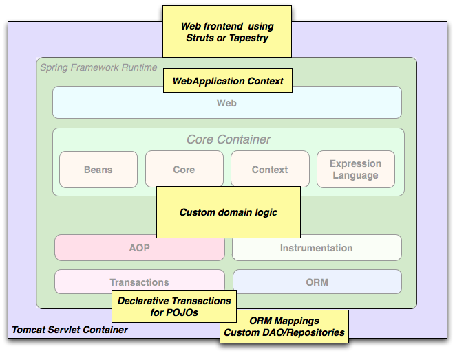
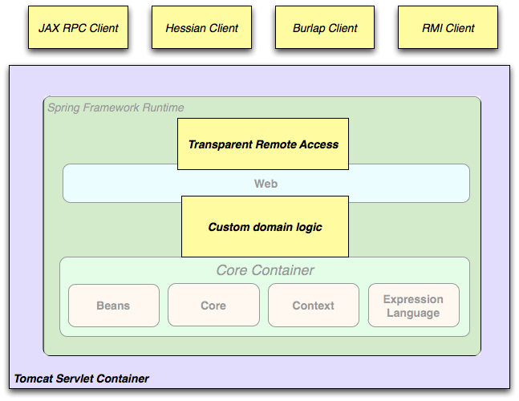

[[spring-introduction]]
= Spring框架概述

[partintro]
--
Spring框架是一种轻量级的解决方案，是构建你的企业级应用程序的潜在一站式解决方案。尽管如此，Spring是模块化的，允许你只使用你需要的那些部分，而不必引入其他的。你可以使用IoC容器，在顶层使用任何Web框架（只是底层用Spring框架，比如ssh，中间那层用了Spring），但你也可以只使用<<orm-hibernate,Hibernate集成代码>>或<<jdbc-introduction,JDBC抽象层>>。Spring框架支持声明式事务管理，通过RMI或Web服务远程访问你的逻辑，以及用于持久存储数据的各种选项。它提供了一个全功能的<<mvc-introduction,MVC框架>>，并使你能够将<<aop-introduction,AOP>>透明地集成到你的软件中。

Spring被设计为非侵入式的，这意味着你所写的业务逻辑代码通常没有对框架本身的依赖。在你的整合层（例如数据访问层）中，将存在对数据访问技术和Spring库的一些依赖。但是，应该很容易将这些依赖关系与其余的基准代码隔离开。

本文档是Spring框架特性的参考指南。如果你对本文档有任何要求，意见或问题，请将其张贴在 https://groups.google.com/forum/#!forum/spring-framework-contrib[用户邮件列表]中。框架本身的问题应该在StackOverflow上提出（请参阅 https://spring.io/questions[]）。
--

[[overview-getting-started-with-spring]]
== 开始学习Spring
这份参考指南提供了有关Spring框架的详细信息。它提供了所有功能的全面文档，以及Spring所拥有的基本概念（例如__“依赖注入”__）的一些背景知识。

如果你刚刚开始使用Spring，你可能想要通过创建一个基于 http://projects.spring.io/spring-boot/[Spring Boot]的应用程序来开始使用Spring框架。Spring Boot提供了一种快速（而且坚固的（固执的））的方式来创建可用于生产环境的基于Spring的应用程序。它基于Spring框架，支持惯例优先原则，并且旨在让你快速启动和运行。

你可以使用 http://start.spring.io[start.spring.io]来生成一个基础的项目，或者是跟随 https://spring.io/guides[入门指南]其中的一篇，例如 https://spring.io/guides/gs/rest-service/[开始构建一个RESTful Web Service]。这些指南不仅非常__聚焦于任务__，而且非常容易理解，而且它们大多数都是基于Spring Boot的。它们也覆盖了Spring集合（Spring全家桶）中的其他你可能在解决一个特定问题的时候想考虑的项目。

[[overview]]
== Spring框架的简介
Spring框架是一个为开发Java应用提供全面基础结构支持的Java平台。Spring管理基础结构以便于让你能够专注于你的应用。

Spring让你能够从“简单的Java对象”（POJO）构建应用并且将企业服务非侵入性的应用到POJO中。这种能力适用于Java SE编程模型以及全部或者部分的JaveEE。

作为一个应用开发者，你可以在Spring平台中得到好处的例子：

* 在不用处理事务API的情况下让一个Java方法在一个数据库事务中执行。
* 在不用处理远程API的情况下让一个本地Java方法变成一个远程过程。
* 在不用处理JMS API的情况下让一个本地Java方法变成一个管理操作。
* 在不用处理JMS API的情况下让一个本地Java方法变成一个消息处理程序。

[[overview-dependency-injection]]
=== 依赖注入和控制翻转

一个Java应用程序--一个宽松的术语，它的运行范围从受限的嵌入式应用到n层，服务器端的企业应用程序--通常由互相合作形成应用程序的对象组成。因此一个应用程序内的对象互相之间有__依赖关系__。

尽管Java平台提供了丰富的应用程序开发功能，但它缺乏将基本构建块组织成一个整体的手段，将该任务留给了架构师和开发人员。虽然可以使用设计模式,例如__工厂设计模式__,__抽象工厂设计模式__,__建造者模式__,__装饰器模式__,和__服务定位器模式__等设计模式来组成构成应用程序的各种类和对象实例，但是这些模式只是简单的做了这些事:最佳实践给出一个名字,带有一个这个模式做了什么的描述,在哪应用它,它解决的问题,等等。模式是形式化的最佳实践，__你必须在你的应用程序中自己实现它__。

Spring框架__控制翻转__（IoC）组件通过提供一种形式化的方法将不同的组件组成一个完全可用的应用程序来解决这个问题。Spring框架将形式化的设计模式编译为可以集成到自己的应用程序中的第一类对象。许多组织和机构以这种方式使用Spring框架来设计健壮的，__可维护的__应用程序。（就是将各种设计模式融合到框架中，而开发人员只需要关注自己的逻辑，在不知不觉中就已经用到了最佳的设计模式，自己的代码也得以健壮）

[[background-ioc]]
.背景
****
“__现在的问题是，（他们）反转的是什么方面的控制？__” Martin Fowler在2004年 http://martinfowler.com/articles/injection.html[在他的网站上]提出了这个关于控制反转（IoC）的问题。Fowler建议重命名这个原则以使其更一目了然，并提出依赖注入。
****

[[overview-modules]]
=== 模块
Spring框架由大约20个功能(特性)模块组成。 这些模块分为核心容器，数据访问/集成，Web，AOP（面向切面编程），仪器，消息，和测试，如下图所示。

.Spring框架概述
image::images/spring-overview.png[width=400]

以下部分列出了每个功能（特性）的可用模块及其构件名称及其涵盖的主题。 构件名称和 _构件id_ 相关用于<<dependency-management,依赖管理工具>>。

[[overview-core-container]]
==== 核心容器
<<beans-introduction,__核心容器__>>由 `spring-core`， `spring-beans`， `spring-context`， `spring-context-support` 和 `spring-expression`（Spring Expression Language）模块组成。

`spring-core` 和 `spring-beans` 模块<<beans-introduction,提供了框架的基本部分>>，包括IoC和依赖注入功能。 `BeanFactory` 是一个工厂模式的复杂实现。它消除了编程单例的需要(程序员不必对单例亲力亲为)，并允许你从实际的程序逻辑中解耦配置和依赖关系。

<<context-introduction,__Context__>>(`spring-context`)模块建立在<<beans-introduction,__核心和Beans__>>模块提供的坚实基础之上：它是在类似于JNDI注册表式的框架风格模式中访问对象的一种方法。Context模块从Beans模块继承其特性，并增加了对国际化（例如使用资源捆绑），事件传播，资源加载和上下文透明创建（例如通过Servlet容器）的支持。上下文模块也支持Java EE功能例如EJB，JMX和基本的远程处理。`ApplicationContext` 接口是上下文模块的焦点。`spring-context-support` 支持将常见的第三方库集成进Spring应用程序上下文中，特别是缓存（EhCache, JCache）和定时执行（CommonJ, Quartz）。

`spring-expression` 模块提供了强大的<<expressions,__表达式语言__>>用来在运行时查询和操作对象图。它是JSP 2.1规范中统一表达式语言(unified EL)的扩展。这个语言支持setting和getting属性值，属性分配，方法调用，访问数组、集合和索引器的内容，逻辑和算术操作，变量命名，从Spring Ioc容器中通过名字检索对象。它也支持它还支持列表投影、选择以及常见的列表聚合。

[[overview-aop-instrumentation]]
==== AOP和操作
`spring-aop` 模块提供了<<aop-introduction,__AOP__>>Alliance-compliant(AOP联盟)面向切面编程的实现，例如允许你自定义方法拦截器和切入点来清晰的解耦功能实现上应该分开的代码。使用源码级的元数据功能，你也可以将行为信息合并到你的代码中，这类似于.NET的属性值。

独立的 `spring-aspects` 模块提供了与AspectJ的集成。

`spring-instrument` 模块提供了类操作支持和类加载器的实现，它们可以在某些应用服务器中使用。`spring-instrument-tomcat` 模块包含了Tomcat的Spring工具代理。

[[overview-messaging]]
==== 消息
Spring 4框架中包含了 `spring-messaging` 模块，它对 _Spring集成_ 项目例如 `Message`,`MessageChannel`,`MessageHandler` 和其它作为基于消息的应用的基础的项目进行了关键的抽象。这个模块也包含了一系列将消息映射到方法上的注解，这个注解与基于编程模型Spring MVC注解类似。

[[overview-data-access]]
==== 数据访问/集成
__数据访问/集成__层由JDBC,ORM,OXM,JMS和事务模块组成。

`spring-jdbc` 模块提供了一个<<jdbc-introduction,JDBC>>抽象层，不需要再编写单调的JDBC代码，解析数据库提供商指定的错误编码。

`spring-tx` 模块为实现指定接口和__所有的POJO（简单Java对象）__的类提供<<transaction,编程式和声明式的事务>>管理。

`spring-orm` 模块为流行的<<orm-introduction,对象关系映射>>APIs提供集成层，包括<<orm-jpa,JPA>>和<<orm-hibernate,Hibernate>>。使用 `spring-orm` 模块你可以将Spring提供的其它功能与这些对象关系映射框架结合起来使用，例如前面提到的简单声明式事务管理的功能。

`spring-oxm` 模块提供了一个支持<<oxm,Object/XML映射>>的实现例如JAXB，Castor，JiBx和XStream的抽象层。

`spring-jms` 模块（<<jms,Java消息服务>>）包含产生和处理消息的功能。从Spring4.1框架开始，它提供了与 `spring-messaging` 模块的集成。

[[overview-web]]
==== Web
__网络__层由 `spring-web`，`spring-webmvc` 和 `spring-websocket` 模块组成。

`spring-web` 模块提供基本的面向网络集成功能，例如multipart文件上传功能，使用Servlet监听器来初始化Ioc容器和面向网络的应用程序上下文。它也包含了一个HTTP客户端和Spring远程支持中网络相关的部分。

`spring-webmvc` 模块（也被称为__Web-Servlet__模块）包含了Spring模型-视图-控制器（<<mvc-introduction,__MVC__>>）和REST Web Services的网络应用实现。Spring的MVC框架提供了对domain model代码和web表单和Spring框架其他功能的三者之间的互相完全分离。

[[overview-testing]]
==== 测试
`spring-test` 模块支持<<unit-testing,单元测试>>，Spring组件和JUnit或TestNG的<<integration-testing,集成测试>>。它提供了Spring的``ApplicationContexts``和这些上下文<<testcontext-ctx-management-caching,缓存>>的一致<<testcontext-ctx-management,加载>>。它也提供了你可以用来单独测试代码的<<mock-objects,模拟对象>>。

[[overview-usagescenarios]]
=== 应用场景
前面描述的搭积木方式使Spring在许多场景中都是（有）一个合理选择，从运行在资源受限的设备上的嵌入式应用到在使用Spring的事务管理功能和网络框架集成的全面成熟的企业级应用。

.典型的全面成熟的Spring网络应用
image::images/overview-full.png[width=400]

Spring的<<transaction-declarative,声明式事务管理功能>>使web应用全面的业务化，如果你用过EJB容器管理业务的话你会发现它们基本一样。你所有自定义的业务逻辑都可以用简单的POJOs实现并通过Spring的IoC容器管理。附加业务包括独立于web层之外的对邮件发送和验证的支持，你可以自由选择验证规则执行的位置。Spring对ORM的支持与JPA和Hibernate进行了集成；例如，当你使用Hibernate时，你可以继续使用你现有的映射文件和标准的Hibernate `SessionFactory` 配置。表单控制器无缝的将web层和domain model进行了集成，对于你的domain model来讲不再需要 `ActionForms` 或其它的将HTTP参数转换成值的类。

.使用第三方网络框架的Spring中间层

有时候环境不允许你完全转成一个不同的框架。Spring框架__不__强迫你采用它内部的所有东西；它不是一个__要么全有要么全无__的解决方案。现有的采用Struts，Tapestry，JSF或其它UI框架构建的前端可以与基于Spring的中间层进行集成，这可以让你使用Spring的事务功能。你只需要简单的使用一个 `ApplicationContext` 和一个 `WebApplicationContext` 绑定你的业务逻辑然后集成到web层即可。

.远程处理的应用场景

当你需要通过web服务访问现有代码时，你可以使用Spring的 `Hessian-`，`Rmi-` 或 `HttpInvokerProxyFactoryBean` 类。这能让远程访问现有应用变得很容易。

.EJBs - 包装现有的POJO
image::images/overview-ejb.png[width=400]

Spring框架也为企业JavaBeans提供了<<ejb,访问和抽象层>>，使你能重用你现有的POJOs，并且为了可扩展使用可以将它们包装成无状态的session beans，自动防故障的web应用可能需要声明安全。

[[dependency-management]]
==== 依赖管理和命名约定
依赖管理和依赖注入是完全不同的两件事。为了能你的应用中使用Spring的优秀特性（像依赖注入），你需要收集所有必要的库(jar文件)并在运行时将它们添加到classpath中，有可能在编译时就需要添加。这些依赖不是要被注入的虚拟组件，而是文件系统中的物理资源(通常情况下)。这些依赖管理的过程包括资源的定位、存储和添加到classpath中。依赖可以是直接的（例如：我的应用在运行时依赖Spring），或间接的（例如：我的应用依赖 `commons-dbcp`，而它依赖 `commons-pool`）。间接依赖也被称为”传递式”的，这些依赖也是最难识别和管理的。

如果你想使用Spring，你需要有包含你需要的Spirng功能的jar库副本。为了使这个更容易，Spring被打包成了一系列尽可能将依赖分离开的模块，例如你不想写web应用那你就不需要spring-web模块。为了在本指南中谈及Spring的库模块，我们使用了一个简写命名约定 `spring-{asterisk}` 或 `spring-{asterisk}.jar,` `{asterisk}` 表示模块的简写名字(例如 `spring-core`,`spring-webmvc`,`spring-jms` 等等)。实际中你使用的jar文件名字通常是模块名加上版本号（例如__spring-core-{spring-version}.jar__）。

Spring框架的每次发布都会在下面的地方公布artifacts：

* Maven Central，Maven查询的默认仓库，使用时不需要任何特殊的配置。Spring依赖的许多公用库也可以从Maven Central获得，Spring社区的很大一部分都在使用Maven进行依赖管理，因此这对他们来说是很方便的。这里的jar包的命名形式是 `spring-*-<version>.jar`，Maven GroupId是 `org.springframework`。
* 由Spring掌管的公开Maven库。除了最终的GA release（公开可获得的版本）之外，这个仓库也有开发版本的快照和milestone（里程碑）版本。jar包的命名形式和Maven Central一样，这是一个获取Spring的开发版本的很有用的地方，只有其它的库部署在Maven Central（开发版本的库只部署在这个Maven库中，所以如果要获取开发版本的库，这个Maven库是很有用的）。这个库也包含捆绑的发行版的zip文件，这个zip文件中包含捆绑到一起的所有的Spring jar包以使它很容易被下载。

所以你需要决定的第一件事是如何管理你的依赖：通常我们推荐自动化（构建）系统例如Maven，Gradle或Ivy，但是你也可以自己手动下载所有的jar包。

你将在下面找到Spring artifacts列表。想要每个模块更全面的描述，请看<<overview-modules>>。

.Spring框架Artifacts
|===
|GroupId |ArtifactId |描述

|org.springframework
|spring-aop
|基于代理的AOP支持

|org.springframework
|spring-aspects
|基于AspectJ的切面

|org.springframework
|spring-beans
|Beans 支持，包括Groovy

|org.springframework
|spring-context
|应用上下文运行时,包括调度和远程抽象

|org.springframework
|spring-context-support
|将常见的第三方库集成到Spring应用程序上下文中的支持类

|org.springframework
|spring-core
|核心应用程序，由许多其他Spring模块使用

|org.springframework
|spring-expression
|Spring表达式语言(SpEL)

|org.springframework
|spring-instrument
|JVM引导的工具代理

|org.springframework
|spring-instrument-tomcat
|Tomcat的工具代理

|org.springframework
|spring-jdbc
|JDBC支持包，包括DataSource工具（设置）和JDBC访问支持

|org.springframework
|spring-jms
|JMS支持包，包括用于发送和接收JMS消息的帮助类

|org.springframework
|spring-messaging
|消息架构和协议的支持

|org.springframework
|spring-orm
|对象/关系映射，包括JPA和Hibernate支持

|org.springframework
|spring-oxm
|对象/ XML映射

|org.springframework
|spring-test
|支持单元测试和集成测试的Spring组件

|org.springframework
|spring-tx
|事务基础设施，包括DAO支持和JCA集成

|org.springframework
|spring-web
|Web支持包，包括客户端和Web远程处理

|org.springframework
|spring-webmvc
|Web应用程序的REST Web服务和模型-视图-控制器实现

|org.springframework
|spring-websocket
|WebSocket和SockJS实现，包括STOMP支持
|===

[[overview-spring-dependencies]]
===== Spring的依赖和依赖于Spring
虽然Spring提供集成并支持大范围内的企业和其它外部工具，但它有意使它的强制性依赖到一个绝对最小化的程度：对于简单的用例你不应该为了使用Spring而定位和下载（即使是自动的）许多jar库。对于基本的依赖注入仅有一个强制性的外部依赖，那个依赖是关于日志的（在下面可以看到日志选项更详细的描述）。

接下来我们概述配置一个依赖于Spring的应用需要的基本步骤，首先是使用Maven的，其次是使用Gradle的，最后是使用Ivy的。在所有的案例中，如果有任何不清楚的地方，请查阅你的依赖管理系统的文档，或者看一些示例代码——Spring本身构建时使用Gradle来管理依赖，我们例子中大多数是使用Gradle和Maven的。

[[overview-maven-dependency-management]]
===== Maven依赖管理
如果你正在使用 http://maven.apache.org/[Maven]来进行依赖管理，那你甚至不必显式的提供日志依赖。例如，为了创建一个应用上下文并使用依赖注入来配置一个应用，你的Maven依赖看上去是这样的：

[source,xml,indent=0]
[subs="verbatim,quotes,attributes"]
----
	<dependencies>
		<dependency>
			<groupId>org.springframework</groupId>
			<artifactId>spring-context</artifactId>
			<version>{spring-version}</version>
			<scope>runtime</scope>
		</dependency>
	</dependencies>
----

就是它。注意如果你不需要针对Spring API进行编译，scope可以被声明成rumtime，这是典型的基本依赖注入的情况。

上面的例子是采用Maven中心仓库的。为了使用Spring Maven仓库(例如：使用milestone（里程碑）版本或开发者快照版本)，你需要在Maven配置中指定仓库的位置，完整的版本：

[source,xml,indent=0]
[subs="verbatim,quotes"]
----
	<repositories>
		<repository>
			<id>io.spring.repo.maven.release</id>
			<url>http://repo.spring.io/release/</url>
			<snapshots><enabled>false</enabled></snapshots>
		</repository>
	</repositories>
----

对于milestone（里程碑）版本：

[source,xml,indent=0]
[subs="verbatim,quotes"]
----
	<repositories>
		<repository>
			<id>io.spring.repo.maven.milestone</id>
			<url>http://repo.spring.io/milestone/</url>
			<snapshots><enabled>false</enabled></snapshots>
		</repository>
	</repositories>
----

对于快照版本：

[source,xml,indent=0]
[subs="verbatim,quotes"]
----
	<repositories>
		<repository>
			<id>io.spring.repo.maven.snapshot</id>
			<url>http://repo.spring.io/snapshot/</url>
			<snapshots><enabled>true</enabled></snapshots>
		</repository>
	</repositories>
----

[[overview-maven-bom]]
===== Maven“材料清单”依赖 =====

在使用Maven时，有可能会偶然的将不同版本的Spring JARs混合起来。例如，你可能找到一个第三方库，或另一个Spring项目，通过传递依赖进入了一个更旧的版本。如果你忘了自己显式的声明一个直接依赖，会产生各种意想不到的问题。

为了解决这种问题，Maven支持”材料清单”(BOM)依赖的概念。你可以在你的 `依赖管理` 部分导入 `spring-framework-bom` 来确保所有的Spring依赖（直接和传递的）都是同一个版本。

[source,xml,indent=0]
[subs="verbatim,quotes,attributes"]
----
	<dependencyManagement>
		<dependencies>
			<dependency>
				<groupId>org.springframework</groupId>
				<artifactId>spring-framework-bom</artifactId>
				<version>{spring-version}</version>
				<type>pom</type>
				<scope>import</scope>
			</dependency>
		</dependencies>
	</dependencyManagement>
----

使用BOM的额外好处是当依赖Spring框架的artifacts时你不再需要指定 `<version>` 属性：

[source,xml,indent=0]
[subs="verbatim,quotes,attributes"]
----
	<dependencies>
		<dependency>
			<groupId>org.springframework</groupId>
			<artifactId>spring-context</artifactId>
		</dependency>
		<dependency>
			<groupId>org.springframework</groupId>
			<artifactId>spring-web</artifactId>
		</dependency>
	<dependencies>
----

[[overview-gradle-dependency-management]]
===== Gradle依赖管理
为了在 http://www.gradle.org/[Gradle]构建系统中使用Spring仓库，在 `repositories` 部分需要包含合适的URL：

[source,groovy,indent=0]
[subs="verbatim,quotes"]
----
	repositories {
		mavenCentral()
		// and optionally...
		maven { url "http://repo.spring.io/release" }
	}
----

当合适的时候你可以把 `repositories` 的URL从 `/release` 修改到 `/milestone` 或 `/snapshot`。一旦一个仓库被配置了，你可以用通常的Gradle方式声明依赖：

[source,groovy,indent=0]
[subs="verbatim,quotes,attributes"]
----
	dependencies {
		compile("org.springframework:spring-context:{spring-version}")
		testCompile("org.springframework:spring-test:{spring-version}")
	}
----

[[overview-ivy-dependency-management]]
===== Ivy依赖管理
如果你更喜欢使用 http://ant.apache.org/ivy[Ivy]来管理依赖，这有类似的配置选择。

为了配置Ivy指定Spring仓库，添加下面的解析器到你的 `ivysettings.xml`：

[source,xml,indent=0]
[subs="verbatim,quotes"]
----
	<resolvers>
		<ibiblio name="io.spring.repo.maven.release"
				m2compatible="true"
				root="http://repo.spring.io/release/"/>
	</resolvers>
----

当合适的时候你可以把 `根` URL从 `/release` 更改到 `/milestone` 或 `/snapshot`。

一旦配置了，你可以通过一般的方式添加依赖。例如（在 `ivy.xml` 中）:

[source,xml,indent=0]
[subs="verbatim,quotes,attributes"]
----
	<dependency org="org.springframework"
		name="spring-core" rev="{spring-version}" conf="compile->runtime"/>
----

[[overview-distribution-zip]]
===== 发行版Zip文件
尽管使用一个支持依赖管理的构建系统是获得Spring框架的推荐方式，但仍然可以下载发行版的Zip文件。

发行版的zips是被发布到Spring Maven仓库（这只是为了我们的方便，为了下载它们你不需要Maven或任何其它的构建系统）。

为了下载发行版zip，打开浏览器输入 http://repo.spring.io/release/org/springframework/spring ，然后选择你想要的版本的合适子文件夹。发行版文件以 `-dist.zip` 结尾，例如 +spring-framework-{spring-version}-RELEASE-dist.zip+。发行版也发行了 http://repo.spring.io/milestone/org/springframework/spring[milestones（里程碑）]版本和 http://repo.spring.io/snapshot/org/springframework/spring[快照]版本。

[[overview-logging]]
==== 日志
日志对于Spring来说是一个非常重要的依赖，因为：__a)__它是唯一的强制性外部依赖，__b)__每个人都喜欢从他们使用的工具中看到一些输出，__c)__Spring集成了许多其它的工具，这些工具也选择了日志依赖。应用开发者的一个目标就是对于整个应用来讲，经常要有一个中心地方来进行日志的统一配置，包括所有的外部组件。有太多的日志框架可以去选择会让问题变得更加困难。

Spring中的强制日志依赖是Jakarta Commons Logging API (JCL)。我们编译JCL并使JCL `log` 对象对扩展了Spring框架的类是可见的。对用户来说所有版本的Spring都采用同一个日志库很重要：移植是容易的，因为即使对于扩展了Spring的应用，也保留了向后兼容性。我们实现这个的方式是让Spring的模块之一显式的依赖 `commons-logging`（JCL的标准实现），然后使所有的其它模块在编译时依赖这个模块。例如如果你在使用Maven，想知道你在哪获得了对 `commons-logging` 的依赖，那就是在Spring中，更确切的说是在Spring的中心模块 `spring-core` 中。

关于 `commons-logging` 的一件好事是要使你的应用工作你不需要任何其它的东西。它有一个运行时发现算法，这个算法能在众所周知的classpath中寻找其它的日志框架，并使用一个它认为是合适的（或者你告诉它你想用哪个如果你需要的话）。如果找不到任何别的你可以从JDK中找到一个非常美好漂亮的日志(java.util.logging或缩写为JUL)。在大多数环境中你可以发现你的Spring应用恰当地运行并输出日志到控制台输出框中，那是很重要的。

[[overview-not-using-commons-logging]]
===== 不使用Commons Logging
不幸的是， 虽然 `commons-logging` 的运行时发现算法对于终端用户是方便的，但它是有问题的。如果我们将时钟回拨，把Spring作为一个新项目重新开始，将会选择一个不同的日志依赖。第一个选择可能是Simple Logging Facade for Java(http://www.slf4j.org[SLF4J])，应用内部使用Spring的人使用的许多其它工具也用了SLF4J。

这儿有两种基础的方式关掉 `commons-logging`:

. 从 `spring-core` 模块排除这个依赖（因为它是唯一的显式依赖 `commons-logging` 的模块）
. 依赖于一个特定的 `commons-logging` 依赖，用一个空jar替换这个依赖（更多细节可以在 http://slf4j.org/faq.html#excludingJCL[SLF4J FAQ]中找到）。

为了排除commons-logging，把下面的内容加入到你的 `dependencyManagement` 部分：

[source,xml,indent=0]
[subs="verbatim,quotes,attributes"]
----
	<dependencies>
		<dependency>
			<groupId>org.springframework</groupId>
			<artifactId>spring-core</artifactId>
			<version>{spring-version}</version>
			<exclusions>
				<exclusion>
					<groupId>commons-logging</groupId>
					<artifactId>commons-logging</artifactId>
				</exclusion>
			</exclusions>
		</dependency>
	</dependencies>
----

现在这个应用可能是坏了的，因为在classpath中没有JCL API的实现，为了解决这个问题必须提供一个新的实现。在接下来的部分我们将以SLF4J作为一个例子向你展示怎样提供一个JCL替代实现。

[[overview-logging-slf4j]]
===== 使用SLF4J
SLF4J是一个更纯净的依赖并且在运行时比 `commons-logging` 更有效，因为它使用编译时绑定来代替运行时查找它集成的其它日志框架。这也意味着你必须更清楚你想要运行时发生什么，然后相应的声明它或配置它。SLF4J提供跟许多常用日志框架的绑定，因此你通常可以选择一个你正在使用的日志框架，然后把配置和管理绑定到它上。

SLF4J提供跟许多常用日志框架的绑定，包括JCL，它做的恰恰相反，建立其它日志框架和它自己的纽带。因此为了在Spring中使用SLF4J，你需要用SLF4J-JCL连接器替换 `commons-logging` 依赖。一旦你做完那个之后在Spring内部的日志调用会被变为对SLF4J API的日志调用，所以如果你应用中其它的库使用了那个API，你将有一个单独的地方配置和管理日志。

一个常用的选择可能是连接Spring和SLF4J，然后提供SLF4J到Log4J的显式绑定。你需要提供几个依赖（排除现有的 `commons-logging`）：桥接器、Log4j对SLF4J的实现、Log4j本身的实现。在Maven中你可能这么做：

[source,xml,indent=0]
[subs="verbatim,quotes,attributes"]
----
	<dependencies>
		<dependency>
			<groupId>org.springframework</groupId>
			<artifactId>spring-core</artifactId>
			<version>{spring-version}</version>
			<exclusions>
				<exclusion>
					<groupId>commons-logging</groupId>
					<artifactId>commons-logging</artifactId>
				</exclusion>
			</exclusions>
		</dependency>
		<dependency>
			<groupId>org.slf4j</groupId>
			<artifactId>jcl-over-slf4j</artifactId>
			<version>1.7.22</version>
		</dependency>
		<dependency>
			<groupId>org.apache.logging.log4j</groupId>
			<artifactId>log4j-slf4j-impl</artifactId>
			<version>2.7</version>
		</dependency>
		<dependency>
			<groupId>org.apache.logging.log4j</groupId>
			<artifactId>log4j-api</artifactId>
			<version>2.7</version>
		</dependency>
		<dependency>
			<groupId>org.apache.logging.log4j</groupId>
			<artifactId>log4j-core</artifactId>
			<version>2.7</version>
		</dependency>
	</dependencies>
----

看起来为了得到一些日志好像需要很多依赖。确实是这样的，但是它__是__可选的，比起缺乏特色的 `commons-logging` 的关于类加载器的问题，尤其是你在一个像OSGi平台那样严格的容器中的时候，它应该更好操作。据说这儿也有一个性能提升，因为绑定是在编译时而不是在运行时。

在SLF4J用户中，一个更通用的选择是直接绑定到 http://logback.qos.ch[Logback]，这样使用步骤更少且依赖也更少。这去除了额外的绑定步骤，因为Logback直接实现了SLF4J，因此你仅需要依赖两个库而不是四个（`jcl-over-slf4j` 和 `logback`）。如果你这样做的话你可能也需要从其它的外部依赖中（不是从Spring）排除slf4j-api依赖，因为你在classpath中仅需要一个版本的API。

[[overview-logging-log4j]]
===== 使用Log4j

NOTE: Log4j 1.x已经寿命终止，下面的步骤适用于Log4j 2

许多人使用 http://logging.apache.org/log4j[Log4j]作为配置和管理的日志框架。它有效且存在已久，当我们构建和测试Spring时，实际上这就是在运行时我们使用的东西。Spring也提供一些配置和初始化Log4j的工具，因此在某些模块有可选的Log4j的编译时依赖。

为了使Log4j能与JCL一起工作，所有你需要做的就是把Log4j放到classpath中，并提供一个配置文件（`log4j2.xml`，`log4j2.properties`，或者是其他 http://logging.apache.org/log4j/2.x/manual/configuration.html[支持的配置文件格式]）。对于Maven用户最小的依赖声明如下：

[source,xml,indent=0]
[subs="verbatim,quotes,attributes"]
----
	<dependencies>
		<dependency>
			<groupId>org.apache.logging.log4j</groupId>
			<artifactId>log4j-core</artifactId>
			<version>2.7</version>
		</dependency>
		<dependency>
			<groupId>org.apache.logging.log4j</groupId>
			<artifactId>log4j-jcl</artifactId>
			<version>2.7</version>
		</dependency>
	</dependencies>
----

如果你也想使用SLF4J，也需要下面的依赖：

[source,xml,indent=0]
[subs="verbatim,quotes,attributes"]
----
	<dependencies>
	  <dependency>
		<groupId>org.apache.logging.log4j</groupId>
		<artifactId>log4j-slf4j-impl</artifactId>
		<version>2.7</version>
	  </dependency>
	</dependencies>
----

下面是一个 `log4j2.xml` 输出日志到控制台的例子：

[source,xml,indent=0]
[subs="verbatim,quotes,attributes"]
----
	<?xml version="1.0" encoding="UTF-8"?>
	<Configuration status="WARN">
	  <Appenders>
		<Console name="Console" target="SYSTEM_OUT">
		  <PatternLayout pattern="%d{HH:mm:ss.SSS} [%t] %-5level %logger{36} - %msg%n"/>
		</Console>
	  </Appenders>
	  <Loggers>
		<Logger name="org.springframework.beans.factory" level="DEBUG"/>
		<Root level="error">
		  <AppenderRef ref="Console"/>
		</Root>
	  </Loggers>
	</Configuration>
----

[[overview-native-jcl]]
====== 带有本地JCL的运行时容器
许多人在本身提供了一个JCL实现的容器中运行他们的Spring应用。IBM Websphere Application Server(WAS)是原型。这经常会引起问题，不幸的是没有一劳永逸的解决方案；在大多数情况下在你的应用中简单的排除掉 `commons-logging` 是不够的。

明确这一点：报告的问题本质上一般不是关于JCL本身的，或关于 `commons-logging` 的：而是他们去绑定 `commons-logging` 到其它的框架上（通常是Log4j）。这可能会失败因为 `commons-logging` 在一些容器的旧版本（1.0）和大多数人使用的现代版本（1.1）之间改变了运行时发现方式。Spring不使用JCL API的任何不常用的部分，因此不会有问题出现，但是一旦Spring或你的应用试图去输出日志，你可以发现到Log4j的绑定是不起作用的。

在这种情况下使用WAS最容易做的事是逆转类加载层（IBM称为”parent last”），为的是应用能控制JCL依赖，而不是容器。虽然这种选择并非总是开放（可用）的，但在公共领域对于替代方法有许多其它的建议，你的解决这个问题花的时间可能是不同的，这取决于确定的版本和容器的特性集合。

